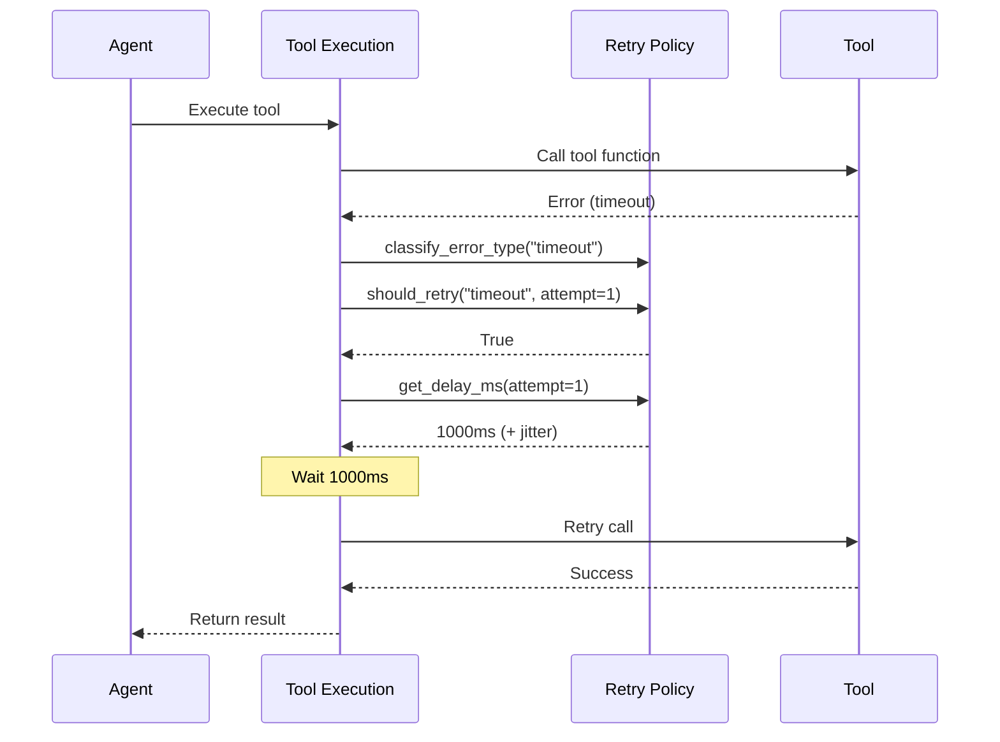
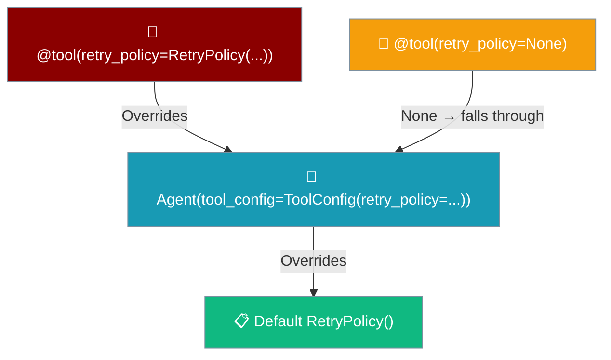
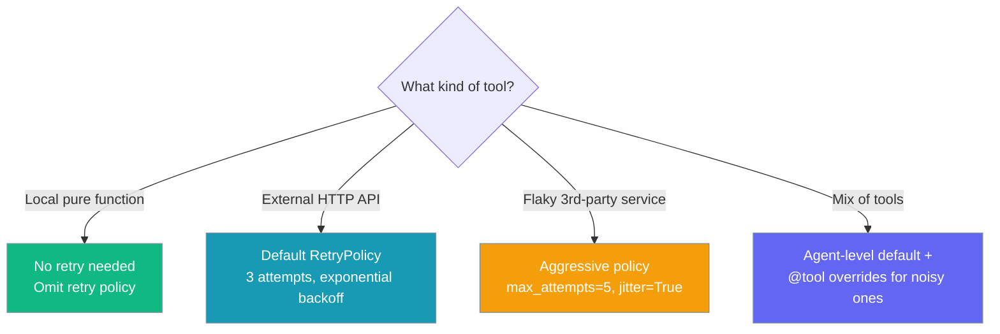

Tool retry automatically re-runs a failing tool with exponential backoff so transient errors don't break your agent.

```python
from praisonaiagents import Agent, tool
from praisonaiagents.config.feature_configs import ToolConfig
from praisonaiagents.tools import RetryPolicy

@tool
def web_search(query: str) -> str:
    """Search the web."""
    return f"Results for: {query}"

agent = Agent(
    name="researcher",
    instructions="Research topics on the web",
    tools=[web_search],
    tool_config=ToolConfig(retry_policy=RetryPolicy()),
)
agent.start("Find information about renewable energy")
```

The user asks for web research; RetryPolicy re-runs retryable tool errors with backoff before surfacing a failure.

```mermaid
graph LR
    Call[🔧 Tool Call] --> Try{🔄 Attempt}
    Try -->|Success| Done[✅ Return]
    Try -->|Retryable Error| Backoff[⏱️ Wait + Backoff]
    Backoff --> Try
    Try -->|Non-Retryable / Max Attempts| Fail[❌ Raise]
    
    classDef call fill:#6366F1,stroke:#7C90A0,color:#fff
    classDef process fill:#F59E0B,stroke:#7C90A0,color:#fff
    classDef success fill:#10B981,stroke:#7C90A0,color:#fff
    classDef fail fill:#8B0000,stroke:#7C90A0,color:#fff
    
    class Call call
    class Try,Backoff process
    class Done success
    class Fail fail
```

## Quick Start

<Steps>
<Step title="Enable with defaults">
Enable retry for all tools with safe defaults:

```python
from praisonaiagents import Agent
from praisonaiagents.config.feature_configs import ToolConfig
from praisonaiagents.tools import RetryPolicy

agent = Agent(
    name="researcher",
    instructions="Research topics on the web",
    tools=[web_search],
    tool_config=ToolConfig(retry_policy=RetryPolicy())  # 3 attempts, exponential backoff
)

agent.start("Find information about renewable energy")
```
</Step>

<Step title="Tune attempts and backoff">
Configure specific retry behavior:

```python
from praisonaiagents import Agent
from praisonaiagents.config.feature_configs import ToolConfig
from praisonaiagents.tools import RetryPolicy

agent = Agent(
    name="api_agent", 
    instructions="Call external APIs",
    tools=[api_tool],
    tool_config=ToolConfig(
        retry_policy=RetryPolicy(
            max_attempts=5,
            retry_on={"timeout", "rate_limit", "connection_error"},
            backoff_factor=2.0,
            initial_delay_ms=1000,
            jitter=True,
        ),
    )
)
```
</Step>

<Step title="Override per tool">
Different tools may need different retry strategies:

```python
from praisonaiagents import Agent, tool
from praisonaiagents.config.feature_configs import ToolConfig
from praisonaiagents.tools import RetryPolicy

@tool(retry_policy=RetryPolicy(max_attempts=5, backoff_factor=3.0))
def unreliable_api_call(query: str) -> str:
    """Call an unreliable external API."""
    # This tool gets aggressive retry policy
    return call_external_api(query)

agent = Agent(
    name="mixed_agent",
    tools=[local_tool, unreliable_api_call],
    tool_config=ToolConfig(retry_policy=RetryPolicy(max_attempts=2))  # Default for other tools
)
```
</Step>
</Steps>

---

## How It Works



| Step | What happens |
|---|---|
| 1 | Agent calls tool via `_execute_tool_with_circuit_breaker` (sync) or `execute_tool_async` (async) |
| 2 | On error, `_classify_error_type` tags it: `timeout`, `rate_limit`, `connection_error`, or `unknown` |
| 3 | `_get_tool_retry_policy` resolves the active policy (tool > agent > default) |
| 4 | If `policy.should_retry(error_type, attempt)` is true, wait `policy.get_delay_ms(attempt)` ms and retry |
| 5 | `HookEvent.ON_RETRY` fires before each retry with the new `OnRetryInput` fields |

An error is tagged `rate_limit` when its message contains either `"rate…limit"` or `"too many requests"` — the latter catches HTTP 429 responses whose bodies use the standard phrasing without the word "limit":

```python
# Both of these classify as rate_limit and are retried by default:
raise Exception("Rate limit exceeded")
raise Exception("HTTP 429: Too Many Requests")
```

---

## Precedence Ladder



`retry_policy=None` on `@tool(...)` means **use the fallback** — the tool-level slot is treated as empty, not as "no retries". To disable retries for a specific tool, pass an explicit `RetryPolicy(max_attempts=1)` instead.

**Tool-level (highest priority):**
```python
@tool(retry_policy=RetryPolicy(max_attempts=5))
def flaky_api():
    pass
```

<Warning>
**Do NOT pass `retry_policy=None` to disable retries.** `@tool(retry_policy=None)` is treated as *"no policy set here"* and falls through to the agent-level or default `RetryPolicy`. To actually disable retries for a specific tool, pass `RetryPolicy(max_attempts=1)`.

```python
# ✅ Disable retries for a specific tool
@tool(retry_policy=RetryPolicy(max_attempts=1))
def one_shot_only():
    ...

# ⚠️ retry_policy=None falls through to agent/default policy — NOT "no retries"
@tool(retry_policy=None)
def uses_agent_or_default():
    ...
```
</Warning>

**Agent-level (medium priority):**
```python
from praisonaiagents import Agent
from praisonaiagents.config.feature_configs import ToolConfig
from praisonaiagents.tools import RetryPolicy

agent = Agent(tool_config=ToolConfig(retry_policy=RetryPolicy(max_attempts=3)))
```

**Default (lowest priority):**
```python
# Uses RetryPolicy() defaults when no policy specified
agent = Agent(tools=[tool])
```

---

## Choosing a Retry Policy



---

## Configuration Options

| Option | Type | Default | Description |
|---|---|---|---|
| `max_attempts` | `int` | `3` | Total attempts including the first try |
| `initial_delay_ms` | `int` | `1000` | Delay before first retry, in milliseconds |
| `backoff_factor` | `float` | `2.0` | Multiplier applied to delay per attempt |
| `retry_on` | `set[str]` | `{"timeout","rate_limit","connection_error"}` | Error types that trigger a retry. `rate_limit` matches messages containing `"rate…limit"` **or** `"too many requests"` |
| `jitter` | `bool` | `False` | Add randomized jitter to delays |
| `jitter_factor` | `float` | `0.25` | Jitter range as fraction of delay (±25%) |
| `max_delay_ms` | `int` | `30000` | Maximum delay between retries |

**Non-retryable error types** (always short-circuit):
- `approval_denied`, `permission_denied`, `approval_error`, `circuit_open`
- Python exceptions: `ValueError`, `TypeError`, `AttributeError` from tool code

---

## Common Patterns

### Per-tool override for unreliable API

```python
from praisonaiagents import Agent
from praisonaiagents.config.feature_configs import ToolConfig
from praisonaiagents.tools import RetryPolicy

@tool(retry_policy=RetryPolicy(
    max_attempts=5,
    backoff_factor=3.0,
    jitter=True,
    retry_on={"timeout", "rate_limit", "connection_error"}
))
def external_weather_api(location: str) -> str:
    """Get weather from external API - known to be flaky."""
    return requests.get(f"https://api.weather.com/current?q={location}").text

agent = Agent(
    name="weather_bot",
    tools=[external_weather_api, local_calculation],
    tool_config=ToolConfig(retry_policy=RetryPolicy(max_attempts=2))  # Default for other tools
)
```

### YAML configuration

<Note>
In YAML the field name is still `tool_retry_policy:`; in Python pass retry settings through `tool_config=ToolConfig(retry_policy=…)`. The standalone `tool_retry_policy` kwarg on `Agent(...)` was removed and raises `TypeError`.
</Note>

```yaml
agents:
  api_researcher:
    role: API Researcher
    instructions: "Research using external APIs"
    tools: [web_search, api_tool]
    tool_retry_policy:
      max_attempts: 4
      retry_on: [timeout, rate_limit]
      backoff_factor: 2.0
      jitter: true
```

### CLI usage

```bash
praisonai \
  --tool-retry-attempts 5 \
  --tool-retry-delay 500 \
  --tool-retry-backoff 2.0 \
  --tool-retry-on "timeout,rate_limit" \
  "Research renewable energy trends"
```

<Note>
If the retry backend isn't available (the CLI accepted the flags but the runtime dependency is missing), you'll now see a `tool_retry_policy requested but retry backend unavailable: <ImportError>` warning in the logs instead of the settings being silently dropped. Install the retry backend or drop the `--tool-retry-*` flags to clear the warning.
</Note>

---

## Hook Integration

Monitor retry attempts with hooks:

```python
from praisonaiagents import Agent
from praisonaiagents.config.feature_configs import ToolConfig
from praisonaiagents.hooks import add_hook, HookEvent, HookResult, OnRetryInput
from praisonaiagents.tools import RetryPolicy

@add_hook(HookEvent.ON_RETRY)
def log_retry(event: OnRetryInput) -> HookResult:
    print(f"[retry] {event.tool_name} attempt {event.attempt}/{event.max_attempts} "
          f"after {event.delay_ms}ms — {event.error_type}: {event.error}")
    return HookResult.allow()

agent = Agent(
    name="monitored_agent",
    tools=[flaky_tool],
    tool_config=ToolConfig(retry_policy=RetryPolicy(max_attempts=3)),
)
```

**Available fields on `OnRetryInput`:**
- `tool_name`: Name of the failing tool
- `attempt`: Current attempt number (1-based)
- `max_attempts`: Maximum attempts configured
- `delay_ms`: Delay before this retry in milliseconds
- `error_type`: Classified error type (`timeout`, `rate_limit`, etc.)
- `error`: Original exception object

---

## Best Practices

<AccordionGroup>
<Accordion title="Keep max_attempts small (3-5)">
Large retry counts mask real failures. If a tool fails 10+ times, there's likely a deeper issue that retrying won't solve. Use monitoring instead.
</Accordion>

<Accordion title="Always set jitter=True for rate-limited APIs">
Without jitter, multiple agents retrying simultaneously create a "thundering herd" that can overwhelm rate-limited services. Jitter spreads out retry attempts.
</Accordion>

<Accordion title="Set narrower retry_on for expensive tools">
Don't retry LLM tools on `connection_error` if every attempt costs money. Use specific error types that indicate transient failures.
```python
expensive_llm_tool_policy = RetryPolicy(
    max_attempts=2,
    retry_on={"timeout"}  # Only timeout, not connection errors
)
```
</Accordion>

<Accordion title="Use tool-level override sparingly">
Agent-level retry policy keeps configuration DRY. Only override at the tool level for genuinely special cases like unreliable third-party APIs.
</Accordion>
</AccordionGroup>

---

## Related

<CardGroup cols={2}>
<Card title="Tool Configuration" icon="wrench" href="/docs/configuration/tool-config">
  Consolidated tool configuration with ToolConfig
</Card>
<Card title="Concurrency" icon="bolt" href="/docs/features/concurrency">
  Parallel tool execution and timeouts
</Card>
<Card title="Hooks" icon="webhook" href="/docs/features/hooks">
  Monitor and intercept agent behavior
</Card>
<Card title="Hook Events" icon="calendar" href="/docs/features/hook-events">
  Complete reference of hook events
</Card>
</CardGroup>