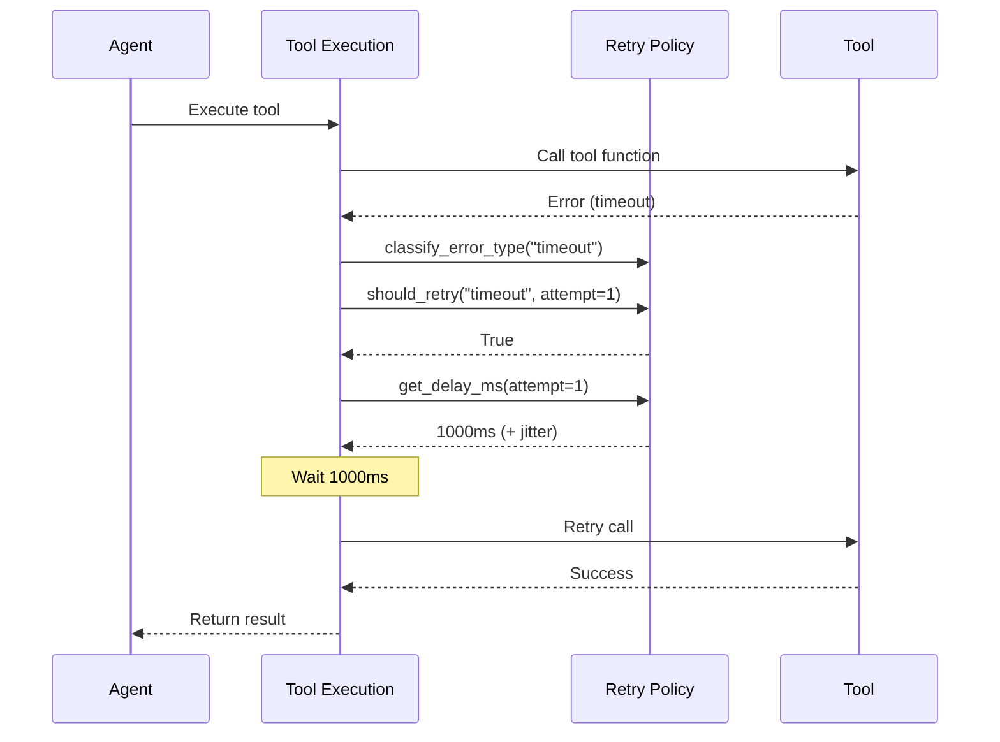
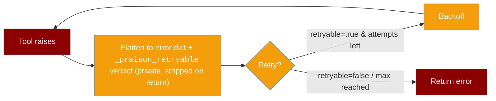
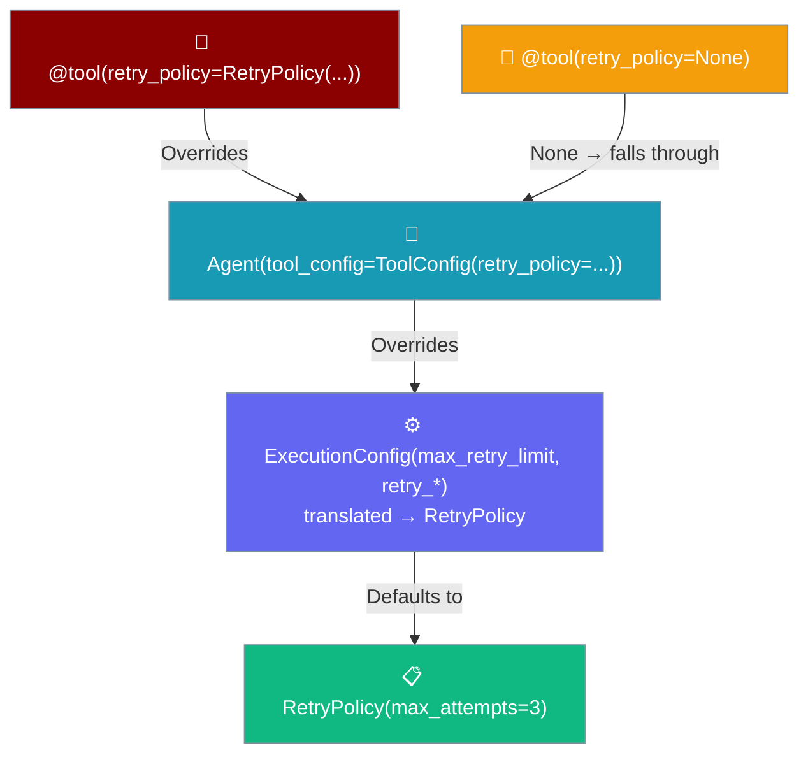
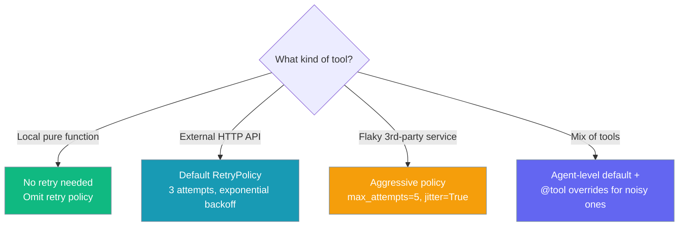

Tool retry automatically re-runs a failing tool with exponential backoff so transient errors don't break your agent.

```python
from praisonaiagents import Agent, tool
from praisonaiagents.config.feature_configs import ToolConfig
from praisonaiagents.tools import RetryPolicy

@tool
def web_search(query: str) -> str:
    """Search the web."""
    return f"Results for: {query}"

agent = Agent(
    name="researcher",
    instructions="Research topics on the web",
    tools=[web_search],
    tool_config=ToolConfig(retry_policy=RetryPolicy()),
)
agent.start("Find information about renewable energy")
```

The user asks for web research; RetryPolicy re-runs retryable tool errors with backoff before surfacing a failure.

```mermaid
graph LR
    Call[🔧 Tool Call] --> Try{🔄 Attempt}
    Try -->|Success| Done[✅ Return]
    Try -->|Retryable Error| Backoff[⏱️ Wait + Backoff]
    Backoff --> Try
    Try -->|Non-Retryable / Max Attempts| Fail[❌ Raise]
    
    classDef call fill:#6366F1,stroke:#7C90A0,color:#fff
    classDef process fill:#F59E0B,stroke:#7C90A0,color:#fff
    classDef success fill:#10B981,stroke:#7C90A0,color:#fff
    classDef fail fill:#8B0000,stroke:#7C90A0,color:#fff
    
    class Call call
    class Try,Backoff process
    class Done success
    class Fail fail
```

## Quick Start

<Steps>
<Step title="Enable with defaults">
Enable retry for all tools with safe defaults:

```python
from praisonaiagents import Agent
from praisonaiagents.config.feature_configs import ToolConfig
from praisonaiagents.tools import RetryPolicy

agent = Agent(
    name="researcher",
    instructions="Research topics on the web",
    tools=[web_search],
    tool_config=ToolConfig(retry_policy=RetryPolicy())  # 3 attempts, exponential backoff
)

agent.start("Find information about renewable energy")
```
</Step>

<Step title="Tune attempts and backoff">
Configure specific retry behavior:

```python
from praisonaiagents import Agent
from praisonaiagents.config.feature_configs import ToolConfig
from praisonaiagents.tools import RetryPolicy

agent = Agent(
    name="api_agent", 
    instructions="Call external APIs",
    tools=[api_tool],
    tool_config=ToolConfig(
        retry_policy=RetryPolicy(
            max_attempts=5,
            retry_on={"timeout", "rate_limit", "connection_error"},
            backoff_factor=2.0,
            initial_delay_ms=1000,
            jitter=True,
        ),
    )
)
```
</Step>

<Step title="Override per tool">
Different tools may need different retry strategies:

```python
from praisonaiagents import Agent, tool
from praisonaiagents.config.feature_configs import ToolConfig
from praisonaiagents.tools import RetryPolicy

@tool(retry_policy=RetryPolicy(max_attempts=5, backoff_factor=3.0))
def unreliable_api_call(query: str) -> str:
    """Call an unreliable external API."""
    # This tool gets aggressive retry policy
    return call_external_api(query)

agent = Agent(
    name="mixed_agent",
    tools=[local_tool, unreliable_api_call],
    tool_config=ToolConfig(retry_policy=RetryPolicy(max_attempts=2))  # Default for other tools
)
```
</Step>
</Steps>

---

## How It Works


```mermaid
sequenceDiagram
    participant Agent
    participant ToolExecution as Tool Execution
    participant RetryPolicy as Retry Policy
    participant Tool

    Agent->>ToolExecution: Execute tool
    ToolExecution->>Tool: Call tool function
    Tool-->>ToolExecution: Error (timeout)
    ToolExecution->>RetryPolicy: classify_error_type("timeout")
    ToolExecution->>RetryPolicy: should_retry("timeout", attempt=1)
    RetryPolicy-->>ToolExecution: True
    ToolExecution->>RetryPolicy: get_delay_ms(attempt=1)
    RetryPolicy-->>ToolExecution: 1000ms (+ jitter)
    Note over ToolExecution: Wait 1000ms
    ToolExecution->>Tool: Retry call
    Tool-->>ToolExecution: Success
    ToolExecution-->>Agent: Return result
```

| Step | What happens |
|---|---|
| 1 | Agent calls tool via `_execute_tool_with_circuit_breaker` (sync) or `execute_tool_async` (async) |
| 2 | On error — a returned error string **or a raised exception** — `_classify_error_type` tags it: `timeout`, `rate_limit`, `connection_error`, or `unknown`. On the async path the flattened error dict carries the framework's private `_praison_retryable` verdict, which the retry loop reads and then strips before returning — so it never reaches the model nor collides with a tool's own `retryable` field |
| 3 | `_effective_tool_retry_policy` resolves the one active policy (per-tool > agent `ToolConfig` > translated `ExecutionConfig`) — both retry loops share it |
| 4 | If `policy.should_retry(error_type, attempt)` is true, wait `policy.get_delay_ms(attempt)` ms and retry |
| 5 | `HookEvent.ON_RETRY` fires before each retry with the new `OnRetryInput` fields |

An error is tagged `rate_limit` when its message contains either `"rate…limit"` or `"too many requests"` — the latter catches HTTP 429 responses whose bodies use the standard phrasing without the word "limit":

```python
# Both of these classify as rate_limit and are retried by default:
raise Exception("Rate limit exceeded")
raise Exception("HTTP 429: Too Many Requests")
```

---

### Sync / async parity

`RetryPolicy` applies identically on the sync path (`agent.execute_tool(...)`, `agent.start(...)`) and the async path (`agent.execute_tool_async(...)`, `agent.achat(...)`) — including tools that raise exceptions.

<Note>
Fixed in PR #4141. Before that release, `agent.achat(...)` would silently **not** retry a raised exception, even when `ToolConfig(retry_policy=RetryPolicy(max_attempts=N))` was set. The sync path already retried; the async path returned on the first attempt.
</Note>

On the sync path a tool that exhausts its per-tool retries raises `ToolExecutionError`, which propagates directly out of `agent.chat()` / `agent.start()` (fix in PR #4252). It is **not** routed through the LLM error classifier — so a tool message that looks like a rate limit (e.g. `"429 too many requests"`) does **not** trigger an LLM backoff `time.sleep` or a redundant model call. The per-tool retry wrapper (`max_attempts`) is what governs tool-error retries; `retry` / `RetryBackoffConfig` are LLM-error-driven and never fire on a tool failure. See [Error Handling → Tool Failure Behavior](/features/error-handling#tool-failure-behavior).

```python
import asyncio
from praisonaiagents import Agent
from praisonaiagents.config.feature_configs import ToolConfig
from praisonaiagents.tools import RetryPolicy

calls = []

def flaky():
    """Simulate a transient failure."""
    calls.append(1)
    raise RuntimeError("temporary glitch")

agent = Agent(
    instructions="Use the flaky tool.",
    tools=[flaky],
    tool_config=ToolConfig(retry_policy=RetryPolicy(max_attempts=3, initial_delay_ms=0)),
)

# Sync path — retries 3 times
try: agent.execute_tool("flaky", {})
except Exception: pass

# Async path — also retries 3 times (parity restored in PR #4141)
try: asyncio.run(agent.execute_tool_async("flaky", {}))
except Exception: pass
```

Both paths share the same terminal rule for raised exceptions:

| Exception raised by tool | Retried? |
|---|---|
| `ValueError`, `TypeError`, `AttributeError` | terminal — programming errors |
| `ToolExecutionError(is_retryable=False)` (e.g. Loop Guard HALT) | terminal — explicit verdict honoured |
| `ToolExecutionError(is_retryable=True)` | retried up to `max_attempts` |
| Any other exception (e.g. `RuntimeError`, network error) | retried up to `max_attempts` |

On the async path a raised exception is flattened into an error dict carrying the private `_praison_retryable` verdict, then the retry loop honours it and strips it before returning:


```mermaid
graph LR
    Raise[Tool raises] --> Flatten["Flatten to error dict + <code>_praison_retryable</code> verdict (private, stripped on return)"]
    Flatten --> Decide{Retry?}
    Decide -->|retryable=true & attempts left| Backoff[Backoff]
    Backoff --> Raise
    Decide -->|retryable=false / max reached| Return[Return error]

    classDef err fill:#8B0000,stroke:#7C90A0,color:#fff
    classDef proc fill:#F59E0B,stroke:#7C90A0,color:#fff
    classDef done fill:#10B981,stroke:#7C90A0,color:#fff

    class Raise,Return err
    class Flatten,Decide,Backoff proc
```

---

## Your tool's own `retryable` field is safe

Many HTTP-API wrappers return payloads shaped like `{"error": "...", "retryable": true}`. That field is the **tool's** payload and is preserved untouched on the surfaced result. The framework's own verdict lives on the private `_praison_retryable` key, which is stripped before the result reaches the model or the caller — the two never collide.

To make a *returned* error retry, tag its error type via `RetryPolicy(retry_on=...)`. A word in the tool's payload is **not** how retry is controlled.

```python
from praisonaiagents import Agent, tool

@tool
def call_upstream(endpoint: str) -> dict:
    """Return a payload that includes its own retryable field."""
    return {"error": "upstream 503", "retryable": True}

agent = Agent(name="api", tools=[call_upstream])

result = agent.execute_tool("call_upstream", {"endpoint": "/status"})

assert result.get("retryable") is True        # tool payload survives
assert "_praison_retryable" not in result      # framework control key stripped
```

The same holds on the async path — the body still runs **exactly once**:

```python
import asyncio
from praisonaiagents import Agent, tool

@tool
def call_upstream(endpoint: str) -> dict:
    """Return a payload that includes its own retryable field."""
    return {"error": "upstream 503", "retryable": True}

agent = Agent(name="api", tools=[call_upstream])

result = asyncio.run(agent.execute_tool_async("call_upstream", {"endpoint": "/status"}))

assert result.get("retryable") is True
assert "_praison_retryable" not in result
```

---

## Returned error dicts run once

A tool that **returns** an error dict has already reached its own decision — the body ran to completion. Re-running it would duplicate side effects (charge money, send a message, write a row) for a decision the tool already made. The sync outer loop therefore surfaces such a dict **exactly once**, regardless of what fields it contains.

To make a returned error retry-eligible, register its error type via `RetryPolicy(retry_on={...})` — the inner loop honours that classification, and the outer loop will not double-drive it.

---

## Outer wall-clock timeouts retry only for idempotent tools

The outer loop's own wall-clock timeout (`_outer_timeout`) is now gated on the tool's idempotency: a timed-out tool is re-driven **only if** it is classified as idempotent. The timed-out body is still running in an orphaned worker thread (`Future.cancel()` is a no-op once started), so auto-retrying a mutating tool would duplicate its side effects. Idempotency comes from an explicit `idempotent` attribute on the tool, the global registry (with `ToolConfig(allow_global_tools=True)`), or the shared `IDEMPOTENT_TOOLS` / `MUTATING_TOOLS` name registry.

<Note>
`MUTATING_TOOLS` gates timeout-retry decisions here; it does **not** veto ordinary tool-error retries. See [Tool Retry & Backoff → Retrying Non-Idempotent Tools](/features/tool-retry-backoff#retrying-non-idempotent-tools) for how the veto works on the ordinary retry path.
</Note>

<Note>
**Unknown tools default to non-idempotent (safe):** a wall-clock timeout on an unrecognised tool surfaces once instead of retrying. See [Tool Timeouts → Retry-on-timeout is opt-in](/features/tool-timeout#retry-on-timeout-is-opt-in-for-mutating-tools) for the `.idempotent = True` opt-in.
</Note>

---

## RetryPolicy is the single budget

The effective `RetryPolicy` is the **one budget** for tool-body runs. `RetryPolicy.max_attempts` genuinely caps how many times a tool runs, and the `ExecutionConfig` spelling (`max_retry_limit` / `retry_*`) is translated into that same policy in one place.

```python
from praisonaiagents import Agent, tool
from praisonaiagents.config.feature_configs import ToolConfig
from praisonaiagents.tools import RetryPolicy

@tool
def charge_card(amount: int) -> str:
    """Charge a payment — must run at most once."""
    return f"Charged {amount}"

# Run a non-idempotent tool exactly once — no duplicate charges
agent = Agent(
    name="billing",
    tools=[charge_card],
    tool_config=ToolConfig(retry_policy=RetryPolicy(max_attempts=1)),
)
agent.start("Charge the customer $50")
```

<Warning>
Set `RetryPolicy(max_attempts=1)` for **non-idempotent** tools — a payment, an email, a `POST`. This now runs the tool **exactly once**, preventing duplicate side effects.
</Warning>

<Note>
`ExecutionConfig.retry_*` and `ToolConfig(retry_policy=...)` are **two spellings of one budget**, not two separate loops. See [Tool Retry & Backoff](/features/tool-retry-backoff) and [ExecutionConfig](/configuration/execution-config) for the `ExecutionConfig` spelling.
</Note>

How many times a failing tool body actually runs:

| Configuration | Tool-body runs |
|---|---|
| `ExecutionConfig(max_retry_limit=0)` | 1× |
| `ExecutionConfig(max_retry_limit=2)` | 3× |
| `ToolConfig(retry_policy=RetryPolicy(max_attempts=1))` | 1× |
| `ToolConfig(retry_policy=RetryPolicy(max_attempts=2))` | 2× |

---

## Precedence Ladder


```mermaid
graph TB
    A["🔧 @tool(retry_policy=RetryPolicy(...))"] -->|Overrides| B["🤖 Agent(tool_config=ToolConfig(retry_policy=...))"]
    AN["🔧 @tool(retry_policy=None)"] -->|"None → falls through"| B
    B -->|Overrides| C["⚙️ ExecutionConfig(max_retry_limit, retry_*)<br/>translated → RetryPolicy"]
    C -->|Defaults to| D["📋 RetryPolicy(max_attempts=3)"]
    
    classDef highest fill:#8B0000,stroke:#7C90A0,color:#fff
    classDef none fill:#F59E0B,stroke:#7C90A0,color:#fff
    classDef agent fill:#189AB4,stroke:#7C90A0,color:#fff
    classDef exec fill:#6366F1,stroke:#7C90A0,color:#fff
    classDef default fill:#10B981,stroke:#7C90A0,color:#fff
    
    class A highest
    class AN none
    class B agent
    class C exec
    class D default
```

When no `retry_policy` is set, the fallback is the policy **translated from `ExecutionConfig`** (`max_retry_limit` / `retry_*`), which defaults to `RetryPolicy(max_attempts=3)` when `ExecutionConfig` is untouched. Users who never set `retry_policy=` see **no behaviour change** — the translated policy reproduces `max_retry_limit + 1` attempts and the same backoff.

`retry_policy=None` on `@tool(...)` means **use the fallback** — the tool-level slot is treated as empty, not as "no retries". To disable retries for a specific tool, pass an explicit `RetryPolicy(max_attempts=1)` instead.

**Tool-level (highest priority):**
```python
@tool(retry_policy=RetryPolicy(max_attempts=5))
def flaky_api():
    pass
```

<Warning>
**Do NOT pass `retry_policy=None` to disable retries.** `@tool(retry_policy=None)` is treated as *"no policy set here"* and falls through to the agent-level or default `RetryPolicy`. To actually disable retries for a specific tool, pass `RetryPolicy(max_attempts=1)`.

```python
# ✅ Disable retries for a specific tool
@tool(retry_policy=RetryPolicy(max_attempts=1))
def one_shot_only():
    ...

# ⚠️ retry_policy=None falls through to agent/default policy — NOT "no retries"
@tool(retry_policy=None)
def uses_agent_or_default():
    ...
```
</Warning>

**Agent-level (medium priority):**
```python
from praisonaiagents import Agent
from praisonaiagents.config.feature_configs import ToolConfig
from praisonaiagents.tools import RetryPolicy

agent = Agent(tool_config=ToolConfig(retry_policy=RetryPolicy(max_attempts=3)))
```

**Translated `ExecutionConfig` fallback (lowest priority):**
```python
from praisonaiagents import Agent, ExecutionConfig

# max_retry_limit / retry_* are translated into the effective RetryPolicy.
# Untouched ExecutionConfig → RetryPolicy(max_attempts=3).
agent = Agent(tools=[tool], execution=ExecutionConfig(max_retry_limit=4))
```

---

## Choosing a Retry Policy


```mermaid
graph TB
    Q{What kind of tool?} -->|Local pure function| A[No retry needed<br/>Omit retry policy]
    Q -->|External HTTP API| B[Default RetryPolicy<br/>3 attempts, exponential backoff]
    Q -->|Flaky 3rd-party service| C[Aggressive policy<br/>max_attempts=5, jitter=True]
    Q -->|Mix of tools| D[Agent-level default +<br/>@tool overrides for noisy ones]
    
    classDef local fill:#10B981,stroke:#7C90A0,color:#fff
    classDef api fill:#189AB4,stroke:#7C90A0,color:#fff
    classDef flaky fill:#F59E0B,stroke:#7C90A0,color:#fff
    classDef mixed fill:#6366F1,stroke:#7C90A0,color:#fff
    
    class A local
    class B api
    class C flaky
    class D mixed
```

---

## Configuration Options

| Option | Type | Default | Description |
|---|---|---|---|
| `max_attempts` | `int` | `3` | Total attempts including the first try |
| `initial_delay_ms` | `int` | `1000` | Delay before first retry, in milliseconds |
| `backoff_factor` | `float` | `2.0` | Multiplier applied to delay per attempt |
| `retry_on` | `set[str]` | `{"timeout","rate_limit","connection_error"}` | Error types that trigger a retry. `rate_limit` matches messages containing `"rate…limit"` **or** `"too many requests"` |
| `jitter` | `bool` | `False` | Add randomized jitter to delays |
| `jitter_factor` | `float` | `0.25` | Jitter range as fraction of delay (±25%) |
| `max_delay_ms` | `int` | `30000` | Maximum delay between retries |

**Non-retryable error types** (always short-circuit):
- `approval_denied`, `permission_denied`, `approval_error`, `circuit_open`, **`loop_blocked`**
- Python exceptions: `ValueError`, `TypeError`, `AttributeError` from tool code
- Raised `ValueError` / `TypeError` / `AttributeError` from tool code are terminal on both sync and async paths.
- Argument-binding errors (missing/extra parameters resolved from the schema) are terminal — they never retry regardless of policy.

<Tip>
A `loop_blocked` result comes from [Loop Guard](/features/loop-guard). Bumping `max_attempts` cannot bypass it — configure the loop-guard thresholds instead.
</Tip>

---

## Common Patterns

### Per-tool override for unreliable API

```python
from praisonaiagents import Agent
from praisonaiagents.config.feature_configs import ToolConfig
from praisonaiagents.tools import RetryPolicy

@tool(retry_policy=RetryPolicy(
    max_attempts=5,
    backoff_factor=3.0,
    jitter=True,
    retry_on={"timeout", "rate_limit", "connection_error"}
))
def external_weather_api(location: str) -> str:
    """Get weather from external API - known to be flaky."""
    return requests.get(f"https://api.weather.com/current?q={location}").text

agent = Agent(
    name="weather_bot",
    tools=[external_weather_api, local_calculation],
    tool_config=ToolConfig(retry_policy=RetryPolicy(max_attempts=2))  # Default for other tools
)
```

### YAML configuration

<Note>
In YAML the field name is still `tool_retry_policy:`; in Python pass retry settings through `tool_config=ToolConfig(retry_policy=…)`. The standalone `tool_retry_policy` kwarg on `Agent(...)` was removed and raises `TypeError`.
</Note>

```yaml
agents:
  api_researcher:
    role: API Researcher
    instructions: "Research using external APIs"
    tools: [web_search, api_tool]
    tool_retry_policy:
      max_attempts: 4
      retry_on: [timeout, rate_limit]
      backoff_factor: 2.0
      jitter: true
```

### CLI usage

```bash
praisonai \
  --tool-retry-attempts 5 \
  --tool-retry-delay 500 \
  --tool-retry-backoff 2.0 \
  --tool-retry-on "timeout,rate_limit" \
  "Research renewable energy trends"
```

<Note>
If the retry backend isn't available (the CLI accepted the flags but the runtime dependency is missing), you'll now see a `tool_retry_policy requested but retry backend unavailable: <ImportError>` warning in the logs instead of the settings being silently dropped. Install the retry backend or drop the `--tool-retry-*` flags to clear the warning.
</Note>

---

## Hook Integration

Monitor retry attempts with hooks:

```python
from praisonaiagents import Agent
from praisonaiagents.config.feature_configs import ToolConfig
from praisonaiagents.hooks import add_hook, HookEvent, HookResult, OnRetryInput
from praisonaiagents.tools import RetryPolicy

@add_hook(HookEvent.ON_RETRY)
def log_retry(event: OnRetryInput) -> HookResult:
    print(f"[retry] {event.tool_name} attempt {event.attempt}/{event.max_attempts} "
          f"after {event.delay_ms}ms — {event.error_type}: {event.error}")
    return HookResult.allow()

agent = Agent(
    name="monitored_agent",
    tools=[flaky_tool],
    tool_config=ToolConfig(retry_policy=RetryPolicy(max_attempts=3)),
)
```

**Available fields on `OnRetryInput`:**
- `tool_name`: Name of the failing tool
- `attempt`: Current attempt number (1-based)
- `max_attempts`: Maximum attempts configured
- `delay_ms`: Delay before this retry in milliseconds
- `error_type`: Classified error type (`timeout`, `rate_limit`, etc.)
- `error`: Original exception object

---

## Best Practices

<AccordionGroup>
<Accordion title="Keep max_attempts small (3-5)">
Large retry counts mask real failures. If a tool fails 10+ times, there's likely a deeper issue that retrying won't solve. Use monitoring instead.
</Accordion>

<Accordion title="Always set jitter=True for rate-limited APIs">
Without jitter, multiple agents retrying simultaneously create a "thundering herd" that can overwhelm rate-limited services. Jitter spreads out retry attempts.
</Accordion>

<Accordion title="Set narrower retry_on for expensive tools">
Don't retry LLM tools on `connection_error` if every attempt costs money. Use specific error types that indicate transient failures.
```python
expensive_llm_tool_policy = RetryPolicy(
    max_attempts=2,
    retry_on={"timeout"}  # Only timeout, not connection errors
)
```
</Accordion>

<Accordion title="Use tool-level override sparingly">
Agent-level retry policy keeps configuration DRY. Only override at the tool level for genuinely special cases like unreliable third-party APIs.
</Accordion>
</AccordionGroup>

---

## Related

<CardGroup cols={2}>
<Card title="Tool Configuration" icon="wrench" href="/configuration/tool-config">
  Consolidated tool configuration with ToolConfig
</Card>
<Card title="Concurrency" icon="bolt" href="/features/concurrency">
  Parallel tool execution and timeouts
</Card>
<Card title="Hooks" icon="webhook" href="/features/hooks">
  Monitor and intercept agent behavior
</Card>
<Card title="Hook Events" icon="calendar" href="/features/hook-events">
  Complete reference of hook events
</Card>
</CardGroup>