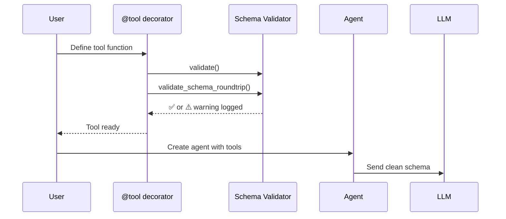

Schema validation catches broken custom tools at import time, before they confuse the LLM at runtime.

```mermaid
graph LR
    subgraph "Tool Schema Validation Flow"
        A[📝 Tool Definition] --> B[🔍 validate()]
        B --> C[🔄 validate_schema_roundtrip()]
        C --> D[✅ Ready for LLM]
        B -->|❌ Error| E[🚨 ToolValidationError]
        C -->|❌ Error| E
    end
    
    classDef input fill:#8B0000,stroke:#7C90A0,color:#fff
    classDef validator fill:#189AB4,stroke:#7C90A0,color:#fff
    classDef success fill:#10B981,stroke:#7C90A0,color:#fff
    classDef error fill:#F59E0B,stroke:#7C90A0,color:#fff
    
    class A input
    class B,C validator
    class D success
    class E error
```

## Quick Start

<Steps>
<Step title="Automatic validation with @tool">
```python
from praisonaiagents import Agent, tool

@tool
def search(query: str) -> str:
    """Search the web."""
    return f"Results for: {query}"

# @tool already validated the schema for you.
agent = Agent(instructions="You search the web", tools=[search])
agent.start("Find AI news")
```
</Step>

<Step title="Explicit validation of a custom BaseTool">
```python
from praisonaiagents import BaseTool

class WeatherTool(BaseTool):
    name = "weather"
    description = "Get current weather"

    def run(self, location: str) -> str:
        return f"Weather in {location}: 72°F"

tool = WeatherTool()
tool.validate()                    # raises ToolValidationError on bad schema
tool.validate_schema_roundtrip()   # confirms JSON serializability
```
</Step>

<Step title="Validate a list of tools at once">
```python
from praisonaiagents.tools.base import validate_tool_schema_consistency

validate_tool_schema_consistency([search, WeatherTool(), my_other_tool])
# Raises if any tool is invalid OR if any two tools share a name.
```
</Step>
</Steps>

---

## How It Works



| Phase | What Happens |
|-------|-------------|
| **@tool decoration** | Validates schema structure and JSON compatibility |
| **Agent creation** | Checks for duplicate names across tool list |
| **LLM interaction** | Clean, validated schemas prevent runtime errors |

---

## What Gets Checked

| Check | What it catches |
|-------|----------------|
| `parameters.type` present | Missing schema scaffold |
| `parameters.properties` present | Most common OpenAI-incompatible bug |
| `get_schema()` returns `{type: "function", function: {...}}` | Wrong top-level shape |
| `function.parameters` is a dict with `properties` | Inner shape broken |
| JSON round-trip preserves structure | Non-serializable values (functions, sets, etc.) |
| `required` is a list when present | Common typo (string instead of list) |
| Unique names across a list | Duplicate registration |
| Complex type annotations | Optional, Union, Literal, Enum, parameterized List/Dict translated to proper JSON Schema |

---

## Common Errors & Fixes

<AccordionGroup>
<Accordion title="Missing 'properties' field">
**Error:** `'parameters' must have a 'properties' field for OpenAI compatibility`

**Broken Code:**
```python
class BadTool(BaseTool):
    name = "bad"
    description = "..."
    parameters = {"type": "object"}  # missing 'properties'
    
    def run(self, q: str) -> str: 
        return q
```

**Fix:**
```python
class GoodTool(BaseTool):
    name = "good"
    description = "..."
    parameters = {
        "type": "object",
        "properties": {
            "q": {"type": "string"}
        },
        "required": ["q"]
    }
    
    def run(self, q: str) -> str: 
        return q
```
</Accordion>

<Accordion title="Bad get_schema() return shape">
**Error:** `get_schema() must return schema with type='function'`

**Broken Code:**
```python
class BadTool(BaseTool):
    name = "bad"
    description = "..."
    
    def get_schema(self):
        return {"name": self.name}  # Wrong shape
    
    def run(self, q: str) -> str: 
        return q
```

**Fix:**
```python
class GoodTool(BaseTool):
    name = "good"
    description = "..."
    
    def get_schema(self):
        return {
            "type": "function",
            "function": {
                "name": self.name,
                "description": self.description,
                "parameters": self.parameters
            }
        }
    
    def run(self, q: str) -> str: 
        return q
```
</Accordion>

<Accordion title="Non-JSON-serializable default values">
**Error:** `Schema round-trip validation failed`

**Broken Code:**
```python
from datetime import datetime

@tool
def process_data(data: str, timestamp=datetime.now()) -> str:
    """Process data with timestamp."""
    return f"{data} at {timestamp}"
```

**Fix:**
```python
from datetime import datetime

@tool
def process_data(data: str, timestamp: str = None) -> str:
    """Process data with timestamp."""
    if timestamp is None:
        timestamp = datetime.now().isoformat()
    return f"{data} at {timestamp}"
```
</Accordion>

<Accordion title="Duplicate tool names">
**Error:** `Duplicate tool name 'search' found in tool list`

**Broken Code:**
```python
@tool(name="search")
def web_search(query: str) -> str:
    return "web results"

@tool(name="search")  # Same name!
def file_search(query: str) -> str:
    return "file results"

agent = Agent(tools=[web_search, file_search])  # Error
```

**Fix:**
```python
@tool(name="web_search")
def web_search(query: str) -> str:
    return "web results"

@tool(name="file_search")  # Unique name
def file_search(query: str) -> str:
    return "file results"

agent = Agent(tools=[web_search, file_search])  # Works
```
</Accordion>
</AccordionGroup>

---

## Behavior of @tool Validation Failures

<Warning>
When the `@tool` decorator encounters validation errors, they are **logged as warnings, not raised**. The tool is still constructed, but may not work properly with the LLM.

Check your logs for messages like:
```
Tool validation warning for my_tool: 'parameters' must have a 'properties' field for OpenAI compatibility
```

This early detection helps you fix schema issues during development instead of discovering them when the LLM calls the tool.
</Warning>

---

## Related

<CardGroup cols={2}>
<Card title="Tool Parameter Types" icon="shapes" href="/docs/features/tool-parameter-types">
  Use Optional, Union, Literal, Enum in tool parameters
</Card>
<Card title="Custom Tools" icon="wrench" href="/docs/tools/custom">
  Learn to create custom BaseTool and @tool implementations
</Card>
<Card title="Tool Reliability" icon="shield" href="/docs/tools/reliability">
  Runtime error handling and tool safety patterns
</Card>
<Card title="Dynamic Tool Schemas" icon="refresh" href="/docs/features/dynamic-tool-schemas">
  Generate schemas dynamically at runtime
</Card>
</CardGroup>