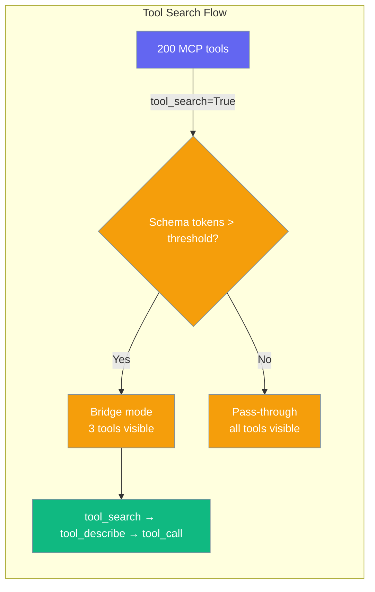
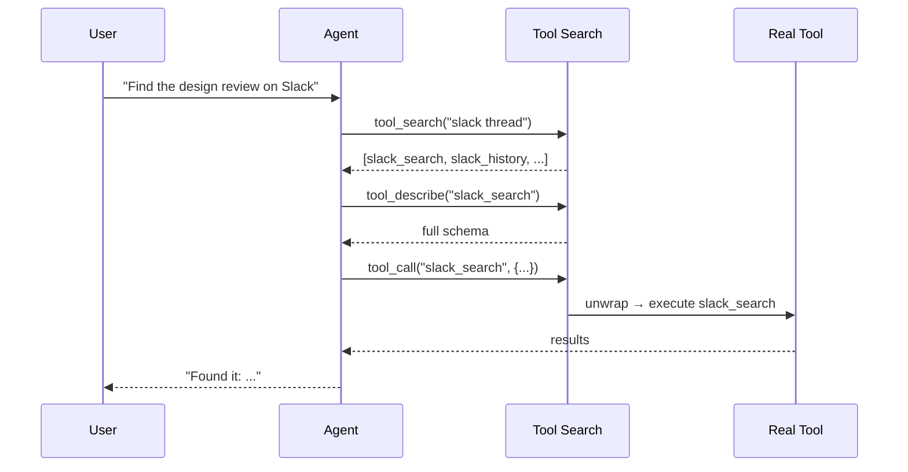
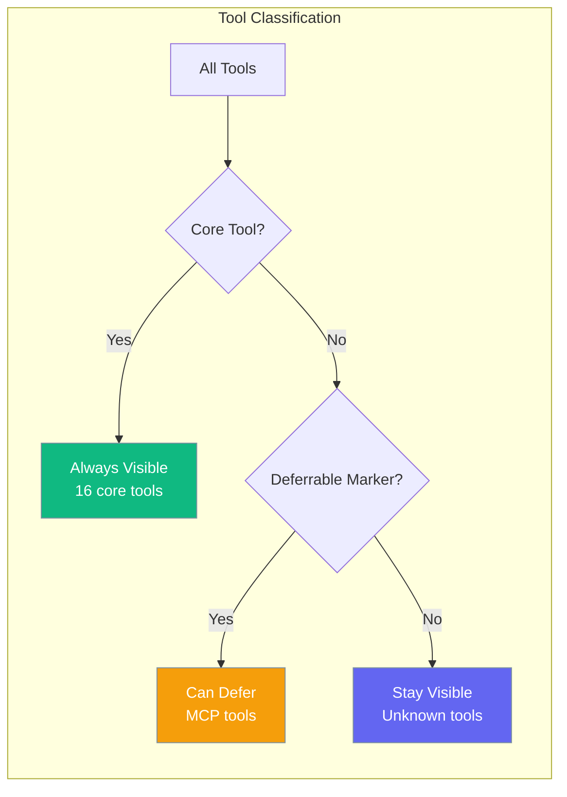

Tool Search enables progressive disclosure of tools when agents have many MCP or plugin tools, reducing context overhead and improving performance.

```python
from praisonaiagents import Agent

agent = Agent(
    name="MCP Agent",
    instructions="You can search Slack, Google Drive, and GitHub",
    tool_search=True,
)
agent.start("Find the design review thread on Slack")
```



## Quick Start

<Steps>
<Step title="Simple Usage">
Enable Tool Search with auto mode to activate progressive disclosure when needed:

```python
from praisonaiagents import Agent

agent = Agent(
    name="MCP Agent",
    instructions="You can search Slack, Google Drive, and GitHub",
    tool_search=True  # Auto mode - activates when tool schemas exceed threshold
)

agent.start("Find the design review thread on Slack")
```
</Step>

<Step title="With Configuration">
Use `ToolSearchConfig` for fine-grained control:

```python
from praisonaiagents import Agent, ToolSearchConfig

agent = Agent(
    name="Heavy MCP Agent", 
    instructions="You have access to many enterprise tools",
    tool_search=ToolSearchConfig(
        enabled="auto",
        threshold_pct=15.0,  # Activate when tools use >15% of context
        search_default_limit=8,
        max_search_limit=25
    )
)

agent.start("Search for quarterly reports in our systems")
```
</Step>
</Steps>

---

## How It Works



When bridge mode activates, the model sees three lightweight tools instead of potentially hundreds of MCP tool schemas:

| Bridge Tool | Purpose |
|-------------|---------|
| `tool_search(query, limit)` | BM25 search over deferred tool names and descriptions |
| `tool_describe(tool_name)` | Returns full OpenAI function schema for the named tool |
| `tool_call(tool_name, tool_args)` | Executes the real tool with unwrapping for traces/hooks |

---

## When to Use It

```mermaid
graph TB
    Q{How many tools?}
    Q -->|< 10 tools| Off[tool_search=False<br/>default]
    Q -->|10–50, mixed| Auto[tool_search=True<br/>auto mode]
    Q -->|50+ MCP-heavy| On[tool_search="on"<br/>always bridge]
    
    classDef opt fill:#189AB4,stroke:#7C90A0,color:#fff
    class Off,Auto,On opt
```

**Use Tool Search when:**
- Your agent connects to 10+ MCP servers
- You have 50+ tools from plugins/integrations
- Context window usage is a concern
- LLM responses are slow due to large tool schemas

**Skip Tool Search when:**
- You have fewer than 10 tools total
- All tools are frequently used core operations
- Tool discovery latency is critical

---

## Configuration Options

| Option | Type | Default | Description |
|--------|------|---------|-------------|
| `enabled` | `Union[bool, str]` | `"auto"` | Mode: `"auto"`, `"on"`, `"off"`, `True`, `False`. Auto only activates when deferrable schema tokens cross threshold. |
| `threshold_pct` | `float` | `10.0` | Percentage of model context window that deferrable schemas must occupy before auto mode kicks in. |
| `search_default_limit` | `int` | `5` | Default number of results returned by `tool_search`. |
| `max_search_limit` | `int` | `20` | Upper cap on results per `tool_search` call. |
| `core_tools` | `Optional[FrozenSet[str]]` | `None` | Override the default set of tools that never defer. |

### Precedence Ladder

Tool Search supports multiple configuration levels:

```python
# Level 1: Bool (simplest)
Agent(tool_search=True)              # auto mode
Agent(tool_search=False)             # disabled (default)

# Level 2: String shorthand
Agent(tool_search="auto")            # explicit auto
Agent(tool_search="on")              # always bridge
Agent(tool_search="off")             # disabled

# Level 3: Dict
Agent(tool_search={"enabled": "auto", "threshold_pct": 15})

# Level 4: Config class (full control)
from praisonaiagents import Agent, ToolSearchConfig
Agent(tool_search=ToolSearchConfig(
    enabled="auto",
    threshold_pct=10,
    search_default_limit=5,
    max_search_limit=20,
))
```

---

## Core vs Deferrable Tools



### Core Tools (Never Defer)

These 16 essential tools always remain visible:

| Category | Tools |
|----------|-------|
| **File operations** | `read_file`, `write_file`, `list_files`, `get_file_info`, `copy_file`, `move_file`, `delete_file` |
| **Shell operations** | `execute_command`, `list_processes`, `kill_process`, `get_system_info` |
| **Web operations** | `search_web`, `web_search`, `internet_search`, `web_crawl`, `crawl_web` |
| **Scheduling** | `schedule_add`, `schedule_list`, `schedule_remove` |
| **Memory** | `store_memory`, `search_memory` |
| **Clarify** | `clarify` |

### Deferrable Tools

- **MCP tools**: Automatically marked with `__praisonai_deferrable__ = True`
- **Custom tools**: Add `deferrable: True` to function metadata
- **MCP-prefixed**: Tools starting with `mcp_`

---

## Common Patterns

### MCP-Heavy Agent

For agents with many MCP servers:

```python
from praisonaiagents import Agent

agent = Agent(
    name="Enterprise Agent",
    instructions="Access Slack, Jira, GitHub, Google Drive, and Salesforce",
    tool_search=True,  # Auto mode handles the complexity
    tools=[slack_mcp, jira_mcp, github_mcp, gdrive_mcp, salesforce_mcp]
)
```

### Force-On for Testing

Always use bridge mode for testing or high-tool-count scenarios:

```python
agent = Agent(
    name="Test Agent",
    instructions="Testing tool search with all MCP tools",
    tool_search="on"  # Always bridge, regardless of count
)
```

### Custom Threshold

Adjust when bridge mode activates:

```python
from praisonaiagents import Agent, ToolSearchConfig

agent = Agent(
    name="Conservative Agent", 
    instructions="More aggressive tool deferral",
    tool_search=ToolSearchConfig(
        enabled="auto",
        threshold_pct=5.0,  # Activate with less tool overhead
        search_default_limit=3  # Fewer search results
    )
)
```

---

## Best Practices

<AccordionGroup>
<Accordion title="When to Enable Tool Search">
Enable Tool Search when your agent has 10+ tools, especially from MCP servers. The auto mode intelligently activates only when tool schemas would consume significant context window space. For agents with 3–10 tools, the overhead isn't worth the complexity.
</Accordion>

<Accordion title="Choosing the Right Threshold">
The default 10% threshold works well for most scenarios. Lower it to 5-7% for aggressive context saving, or raise it to 15-20% if you prefer fewer bridge interactions. Monitor your context usage and adjust based on your model's window size.
</Accordion>

<Accordion title="Writing Better Search Queries">
More capable models (GPT-4, Claude-3.5-Sonnet) write better tool search queries. They understand semantic relationships and can find tools by functionality rather than just name matching. Smaller models may need more explicit tool naming or descriptions.
</Accordion>

<Accordion title="What NOT to Enable For">
Don't use Tool Search for agents with fewer than 10 tools, or when all tools are frequently used core operations. The 1-2 extra round trips for cold tool access aren't worth it for small, stable toolsets.
</Accordion>
</AccordionGroup>

---

## Trade-offs

**Benefits:**
- Reduces context window usage by 60-80% for tool-heavy agents
- Improves LLM response speed with fewer schemas to process
- Scales to hundreds of MCP tools without context bloat
- Auto mode provides zero overhead when not needed

**Costs:**
- Cold tool access requires 1-2 extra round trips (search → describe → call)
- `tool_describe` results enter conversation history, growing context
- Bridge mode invalidates existing tool schemas between sessions
- Smaller models may write less effective search queries

---

## Related

<CardGroup cols={2}>
<Card title="Load MCP Tools" icon="plug" href="/docs/features/load-mcp-tools">
  Connect MCP servers and load their tools
</Card>
<Card title="Allowed Tools" icon="filter" href="/docs/features/allowed-tools">
  Filter and control tool availability
</Card>
</CardGroup>