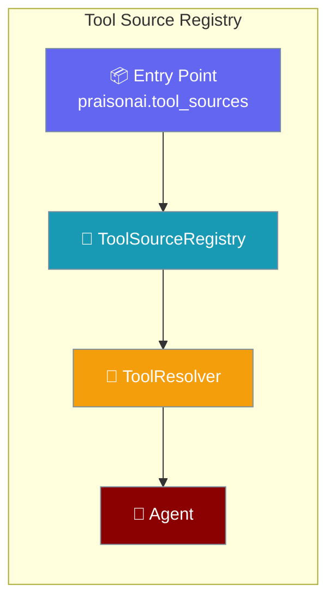
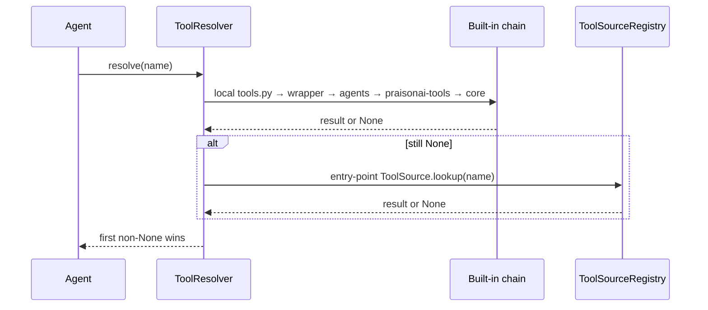

`ToolSourceRegistry` lets a Python package expose new tool-resolution sources through the `praisonai.tool_sources` entry-point group — no subclassing, no monkey-patching.

```python
from praisonaiagents import Agent

# Once `pip install praisonai-corp-tools` is done, corp-tools registers
# itself via the praisonai.tool_sources entry point. Nothing else to wire up.
agent = Agent(
    name="Finance Bot",
    instructions="Use corporate tools to answer",
    tools=["corp.pay_invoice"],   # resolved through the plugin source
)
agent.start("Pay invoice INV-42 for $1200")
```

The user asks to pay an invoice; the plugin entry point resolves corporate tools without extra wiring.



## Quick Start

<Steps>
<Step title="Simple usage">

Install a plugin package, then use tool names from that source on any agent:

```bash
pip install praisonai-corp-tools
```

```python
from praisonaiagents import Agent

agent = Agent(
    name="Finance Bot",
    instructions="Use corporate tools to answer",
    tools=["corp.pay_invoice"],
)
agent.start("Pay invoice INV-42 for $1200")
```

</Step>

<Step title="Direct Python (DI)">

Construct a `ToolResolver` with `source_registry=` to isolate a tenant or a test:

```python
from praisonai.tool_resolver import ToolResolver, ToolSourceRegistry

registry = ToolSourceRegistry()          # discovers praisonai.tool_sources plugins
resolver = ToolResolver(source_registry=registry)
tool = resolver.resolve("corp.pay_invoice")
```

</Step>
</Steps>

---

## How It Works



Resolution walks the built-in chain first (local `tools.py`, wrapper registry, `praisonaiagents.tools`, `praisonai-tools`, core SDK registry), then each `ToolSource` from `ToolSourceRegistry`. Entry-point sources are **appended** to the built-in chain — they extend rather than replace it. When you pass `sources=` explicitly, entry-point sources are **not** appended; you fully own the chain.

---

## Building a Tool Source Plugin

### Implement the `ToolSource` protocol

```python
# praisonai_corp_tools/source.py
from typing import Callable, Optional

_CORP_TOOL_MAP: dict[str, Callable] = {}

class CorpToolsSource:
    name = "corp-tools"

    def lookup(self, name: str) -> Optional[Callable]:
        if not name.startswith("corp."):
            return None
        short = name.removeprefix("corp.")
        return _CORP_TOOL_MAP.get(short)
```

### Register the entry point in `pyproject.toml`

```toml
[project.entry-points."praisonai.tool_sources"]
corp-tools = "praisonai_corp_tools.source:CorpToolsSource"
```

The entry-point value may be:

- a `ToolSource` **class** (instantiated once — `CorpToolsSource`),
- a **factory function** returning a `ToolSource` instance, or
- an **already-constructed** `ToolSource` instance.

Factory example:

```toml
[project.entry-points."praisonai.tool_sources"]
corp-tools = "praisonai_corp_tools.source:build_source"
```

```python
import os

def build_source():
    return CorpToolsSource(base_url=os.environ["CORP_URL"])
```

### Ship it

After `pip install`, the source is live in every `ToolResolver` that uses the process-default registry (or any resolver you construct with a registry that discovers entry points).

---

## Configuration Options

| Option | Where | Type | Default | Description |
|--------|-------|------|---------|-------------|
| `source_registry` | `ToolResolver(...)` constructor | `Optional[ToolSourceRegistry]` | Process-default registry (lazy) | Registry supplying third-party entry-point tool sources. Pass an empty registry to opt out. |
| `discover_entry_points` | `ToolSourceRegistry(...)` constructor | `bool` | `True` | When `False`, the registry does **not** scan the `praisonai.tool_sources` entry-point group on construction. Use for tests or a hard opt-out. |

---

## Common Patterns

<Tabs>
<Tab title="Opt out of third-party sources">

```python
from praisonai.tool_resolver import ToolResolver, ToolSourceRegistry

empty = ToolSourceRegistry(discover_entry_points=False)
resolver = ToolResolver(source_registry=empty)
# Only the built-in chain is used; installed plugins are ignored.
```

</Tab>

<Tab title="Isolate a plugin for a specific tenant">

```python
from praisonai.tool_resolver import ToolResolver, ToolSourceRegistry

class TenantToolsSource:
    name = "tenant-tools"

    def lookup(self, name: str):
        return None

registry = ToolSourceRegistry(discover_entry_points=False)
registry.register("tenant-tools", TenantToolsSource)

resolver = ToolResolver(source_registry=registry)
```

</Tab>

<Tab title="Deterministic tests">

Use `discover_entry_points=False` so tests stay reproducible regardless of what is installed in the environment — the same pattern as `test_tool_source_registry.py` in the PraisonAI SDK:

```python
from praisonai.tool_resolver import ToolResolver, ToolSourceRegistry

registry = ToolSourceRegistry(discover_entry_points=False)
registry.register("fake", MyTestSource)

resolver = ToolResolver(source_registry=registry)
assert resolver.resolve("fake_tool") is not None
```

</Tab>
</Tabs>

---

## Safety

- A plugin that raises during loading is **logged and skipped** — resolution never breaks for other callers.
- A plugin that resolves to an object **not** matching the `ToolSource` protocol (missing `name: str` or callable `lookup`) is rejected with a `TypeError` inside `_coerce_source` and skipped — it never gets appended to the chain.
- Behaviour is covered by `test_misbehaving_plugin_is_skipped` and `test_invalid_shape_plugin_is_skipped` in the SDK test suite.

---

## Best Practices

<AccordionGroup>
<Accordion title="Namespace your tool names">
Use a prefix like `corp.` so plugin tools do not collide with built-in names.
</Accordion>
<Accordion title="Return None fast for names you do not own">
`lookup()` runs in chain order; bail out quickly when a name is not yours.
</Accordion>
<Accordion title="Never raise from lookup() for expected misses">
Raise only for genuine errors — the registry logs and skips your source on failure, so a raise looks like a broken plugin.
</Accordion>
<Accordion title="Register a class, not an instance, when the source is cheap to build">
Avoids stale process-wide state in long-running services.
</Accordion>
</AccordionGroup>

---

## Related

<CardGroup cols={2}>
<Card title="Tool Resolver" icon="wrench" href="/docs/features/tool-resolver">
  Single source of truth for loading tools
</Card>
<Card title="Persistence Backend Plugins" icon="puzzle-piece" href="/docs/features/persistence-backend-plugins">
  Same PluginRegistry pattern for stores
</Card>
<Card title="Framework Adapter Plugins" icon="puzzle-piece" href="/docs/features/framework-adapter-plugins">
  Entry-point plugins for execution frameworks
</Card>
<Card title="Registry Dependency Injection" icon="code-branch" href="/docs/features/registry-dependency-injection">
  Registry DI pattern across the wrapper
</Card>
</CardGroup>
