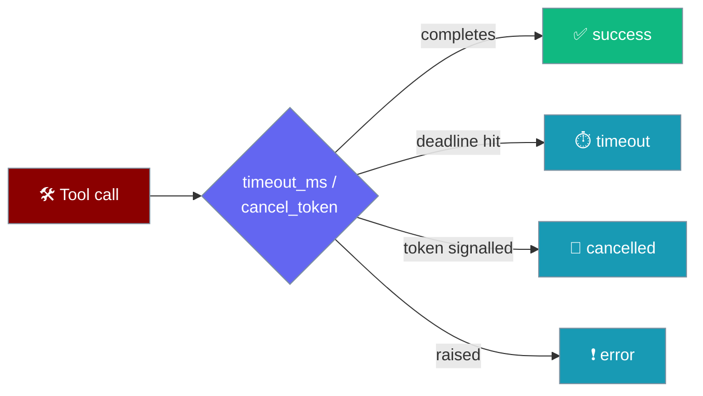
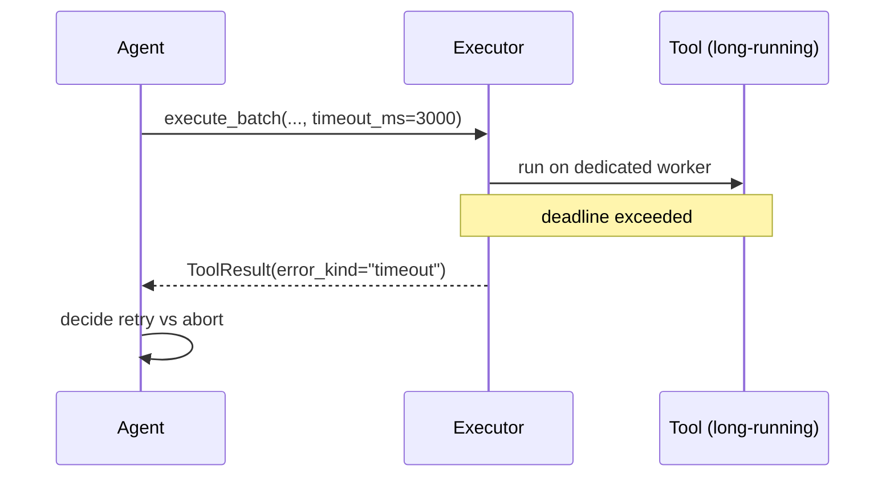
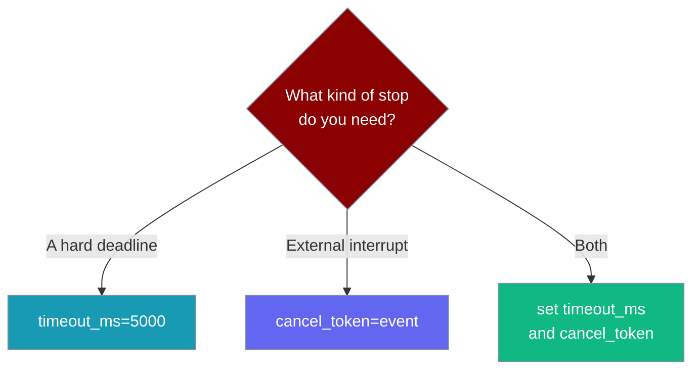

Give any single tool call a hard deadline, cancel a batch mid-flight with a token, and read a discriminated `error_kind` instead of an opaque error string — so your agent can decide to retry, switch tools, or abort.

```python
from praisonaiagents.tools.call_executor import (
    ToolCall,
    SequentialToolCallExecutor,
)

def execute_tool_fn(name, arguments, tool_call_id):
    # Your real dispatch logic; this stub just echoes.
    return f"ran {name}"

executor = SequentialToolCallExecutor()
results = executor.execute_batch(
    [ToolCall("search", {"q": "recent papers on X"}, "call-1")],
    execute_tool_fn,
    timeout_ms=5000,   # abandon any single tool after 5s
)

for r in results:
    print(r.result, r.error_kind)
```



<Note>
**Backward compatible.** All new parameters are optional. With no `timeout_ms` and no `cancel_token`, execution delegates straight to the tool body — behaviour is unchanged.
</Note>

## Quick Start

<Steps>
<Step title="Add a hard deadline">

Pass `timeout_ms` (milliseconds) to `execute_batch`. A tool that runs longer is abandoned on a dedicated worker and returns a typed `timeout` result — the turn never hangs.

```python
from praisonaiagents.tools.call_executor import ToolCall, SequentialToolCallExecutor

def execute_tool_fn(name, arguments, tool_call_id):
    return slow_lookup(**arguments)  # your tool

executor = SequentialToolCallExecutor()
results = executor.execute_batch(
    [ToolCall("slow_lookup", {"id": 42}, "call-1")],
    execute_tool_fn,
    timeout_ms=3000,
)
```

</Step>

<Step title="Add a cancel token">

Pass any `threading.Event`-like token. Signal it from another thread to short-circuit pending calls with a typed `cancelled` result.

```python
import threading
from praisonaiagents.tools.call_executor import ToolCall, SequentialToolCallExecutor

cancel = threading.Event()

executor = SequentialToolCallExecutor()
# From elsewhere: cancel.set()
results = executor.execute_batch(
    [ToolCall("search", {"q": "X"}, "call-1")],
    execute_tool_fn,
    cancel_token=cancel,
)
```

The token is duck-typed: `threading.Event` (`.is_set()`) and `InterruptController`-like tokens (`.is_cancelled` / `.cancelled`) both work — no concrete import required.

</Step>

<Step title="Handle structured errors">

Pattern-match on `error_kind` and read `structured_error` for a discriminated payload:

```python
for r in results:
    if r.error is None:
        print("ok:", r.result)
    elif r.error_kind == "timeout":
        print("retry later:", r.structured_error)
    elif r.error_kind == "cancelled":
        print("user cancelled")
    else:  # "error"
        print("tool failed:", r.structured_error)
```

</Step>
</Steps>

---

## How It Works



Because Python threads can't be force-killed, a timed-out tool's worker is **abandoned** (not joined) and a typed result is returned immediately — the turn keeps moving.

Both executors forward `timeout_ms` and `cancel_token`:

```python
from praisonaiagents.tools.call_executor import (
    ParallelToolCallExecutor,
    SequentialToolCallExecutor,
)

# Same signature on both:
SequentialToolCallExecutor().execute_batch(calls, fn, timeout_ms=5000, cancel_token=tok)
ParallelToolCallExecutor(max_workers=5).execute_batch(calls, fn, timeout_ms=5000, cancel_token=tok)
```

---

## `error_kind` Reference

`ToolResult.error_kind` is a discriminated tag; `ToolResult.structured_error` is `None` on success and a discriminated dict on failure.

| `error_kind` | Exception | `result` payload | Example `structured_error` |
|---|---|---|---|
| `timeout` | `ToolTimeoutError` | `{"error": "timeout", "timeout_ms": ..., "tool": ...}` | `{"error": true, "kind": "timeout", "type": "ToolTimeoutError", "message": "...", "tool": "search"}` |
| `cancelled` | `ToolCancelledError` | `{"error": "cancelled", "tool": ...}` | `{"error": true, "kind": "cancelled", "type": "ToolCancelledError", "message": "...", "tool": "search"}` |
| `error` | the raised exception | `"Error executing tool: ..."` | `{"error": true, "kind": "error", "type": "ValueError", "message": "...", "tool": "search"}` |

```python
from praisonaiagents.tools import ToolTimeoutError, ToolCancelledError
```

---

## Timeout, Cancel, or Both?



<AccordionGroup>
<Accordion title="Config default via ToolExecutionConfig">
`ToolExecutionConfig.timeout_ms` is now consumed by the executor, so a configured default flows through to `execute_batch` without per-call wiring.
</Accordion>

<Accordion title="Parallel batches">
`ParallelToolCallExecutor` enforces the same per-tool timeout inside each worker, so one hung tool resolves to a typed timeout result instead of blocking collection of the others.
</Accordion>
</AccordionGroup>

---

## Related

<CardGroup cols={2}>
  <Card title="Parallel Tool Calls" icon="bolt" href="/docs/features/parallel-tool-calls">
    Run batched tool calls concurrently
  </Card>
  <Card title="Tool Progress" icon="wave-pulse" href="/docs/features/tool-progress">
    Stream incremental progress from slow tools
  </Card>
  <Card title="Deferred Tools" icon="hourglass-half" href="/docs/features/deferred-tools">
    Hand back long-running work without blocking
  </Card>
  <Card title="Tools Overview" icon="screwdriver-wrench" href="/docs/tools">
    Build and register agent tools
  </Card>
</CardGroup>
