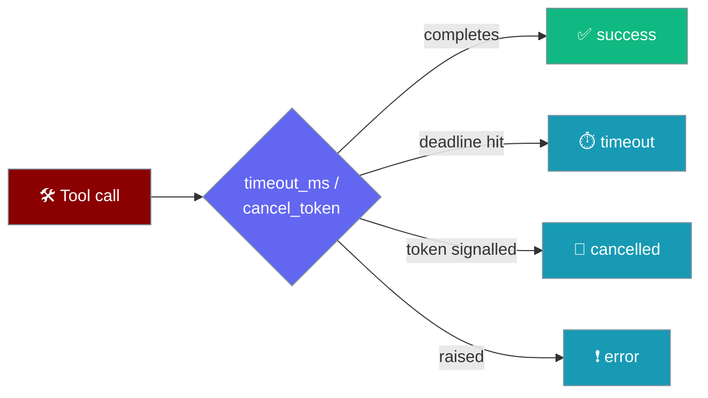
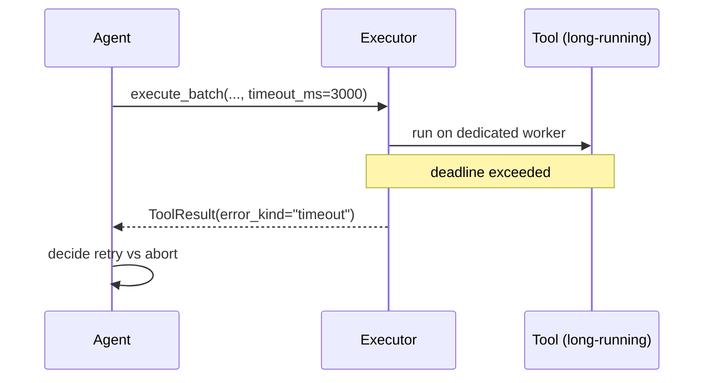
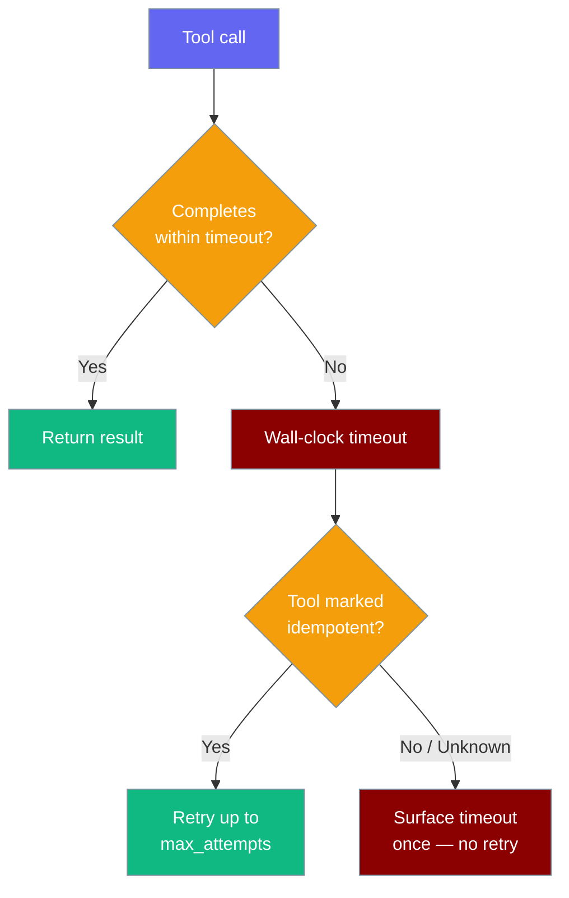
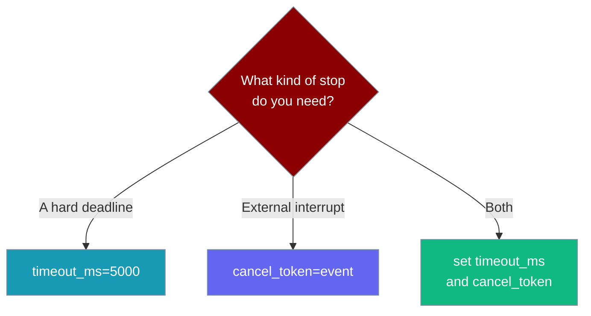

Give any single tool call a hard deadline, cancel a batch mid-flight with a token, and read a discriminated `error_kind` instead of an opaque error string — so your agent can decide to retry, switch tools, or abort.

```python
from praisonaiagents.tools.call_executor import (
    ToolCall,
    SequentialToolCallExecutor,
)

def execute_tool_fn(name, arguments, tool_call_id):
    # Your real dispatch logic; this stub just echoes.
    return f"ran {name}"

executor = SequentialToolCallExecutor()
results = executor.execute_batch(
    [ToolCall("search", {"q": "recent papers on X"}, "call-1")],
    execute_tool_fn,
    timeout_ms=5000,   # abandon any single tool after 5s
)

for r in results:
    print(r.result, r.error_kind)
```


```mermaid
graph LR
    T[🛠️ Tool call]:::agent --> X{timeout_ms /<br/>cancel_token}:::config
    X -->|completes| S[✅ success]:::result
    X -->|deadline hit| TO[⏱️ timeout]:::process
    X -->|token signalled| CA[🚫 cancelled]:::process
    X -->|raised| ER[❗ error]:::process

    classDef agent fill:#8B0000,stroke:#7C90A0,color:#fff
    classDef process fill:#189AB4,stroke:#7C90A0,color:#fff
    classDef config fill:#6366F1,stroke:#7C90A0,color:#fff
    classDef result fill:#10B981,stroke:#7C90A0,color:#fff
```

<Note>
**Backward compatible.** All new parameters are optional. With no `timeout_ms` and no `cancel_token`, execution delegates straight to the tool body — behaviour is unchanged.
</Note>

## Quick Start

<Steps>
<Step title="Add a hard deadline">

Pass `timeout_ms` (milliseconds) to `execute_batch`. A tool that runs longer is abandoned on a dedicated worker and returns a typed `timeout` result — the turn never hangs.

```python
from praisonaiagents.tools.call_executor import ToolCall, SequentialToolCallExecutor

def execute_tool_fn(name, arguments, tool_call_id):
    return slow_lookup(**arguments)  # your tool

executor = SequentialToolCallExecutor()
results = executor.execute_batch(
    [ToolCall("slow_lookup", {"id": 42}, "call-1")],
    execute_tool_fn,
    timeout_ms=3000,
)
```

</Step>

<Step title="Add a cancel token">

Pass any `threading.Event`-like token. Signal it from another thread to short-circuit pending calls with a typed `cancelled` result.

```python
import threading
from praisonaiagents.tools.call_executor import ToolCall, SequentialToolCallExecutor

cancel = threading.Event()

executor = SequentialToolCallExecutor()
# From elsewhere: cancel.set()
results = executor.execute_batch(
    [ToolCall("search", {"q": "X"}, "call-1")],
    execute_tool_fn,
    cancel_token=cancel,
)
```

The token is duck-typed: `threading.Event` (`.is_set()`) and `InterruptController`-like tokens (`.is_cancelled` / `.cancelled`) both work — no concrete import required.

</Step>

<Step title="Handle structured errors">

Pattern-match on `error_kind` and read `structured_error` for a discriminated payload:

```python
for r in results:
    if r.error is None:
        print("ok:", r.result)
    elif r.error_kind == "timeout":
        print("retry later:", r.structured_error)
    elif r.error_kind == "cancelled":
        print("user cancelled")
    else:  # "error"
        print("tool failed:", r.structured_error)
```

</Step>
</Steps>

---

## How It Works


```mermaid
sequenceDiagram
    participant A as Agent
    participant E as Executor
    participant T as Tool (long-running)

    A->>E: execute_batch(..., timeout_ms=3000)
    E->>T: run on dedicated worker
    Note over E,T: deadline exceeded
    E-->>A: ToolResult(error_kind="timeout")
    A->>A: decide retry vs abort
```

Because Python threads can't be force-killed, a timed-out tool's worker is **abandoned** (not joined) and a typed result is returned immediately — the turn keeps moving.

Both executors forward `timeout_ms` and `cancel_token`:

```python
from praisonaiagents.tools.call_executor import (
    ParallelToolCallExecutor,
    SequentialToolCallExecutor,
)

# Same signature on both:
SequentialToolCallExecutor().execute_batch(calls, fn, timeout_ms=5000, cancel_token=tok)
ParallelToolCallExecutor(max_workers=5).execute_batch(calls, fn, timeout_ms=5000, cancel_token=tok)
```

---

## Retry-on-timeout is opt-in for mutating tools

A wall-clock timeout is **no longer auto-retried** unless the tool is idempotent — because the timed-out body keeps running in an orphaned worker thread (`Future.cancel()` is a no-op once the task has started), so re-driving a mutating tool would duplicate its side effects (a second invoice email, a double charge).


```mermaid
graph TB
    A[Tool call] --> B{Completes<br/>within timeout?}
    B -->|Yes| C[Return result]
    B -->|No| D[Wall-clock timeout]
    D --> E{Tool marked<br/>idempotent?}
    E -->|Yes| F[Retry up to<br/>max_attempts]
    E -->|No / Unknown| G[Surface timeout<br/>once — no retry]

    classDef req fill:#6366F1,stroke:#7C90A0,color:#fff
    classDef check fill:#F59E0B,stroke:#7C90A0,color:#fff
    classDef ok fill:#10B981,stroke:#7C90A0,color:#fff
    classDef warn fill:#8B0000,stroke:#7C90A0,color:#fff

    class A req
    class B,E check
    class C,F ok
    class D,G warn
```

Opt in for a specific tool by setting `idempotent = True` on the callable:

```python
from praisonaiagents import Agent

def read_current_price(symbol: str) -> float:
    ...
read_current_price.idempotent = True   # safe to retry on timeout

agent = Agent(
    name="Trader",
    instructions="Look up prices.",
    tools=[read_current_price],
)
```

The same attribute works on a registered `FunctionTool` — set it on the object the agent holds:

```python
from praisonaiagents.tools import tool

@tool
def read_current_price(symbol: str) -> float:
    ...
read_current_price.idempotent = True   # opt in to retry-on-timeout
```

Idempotency is decided in this order: an explicit `idempotent` attribute on the tool wins; then, with `ToolConfig(allow_global_tools=True)`, the global registry's flag; then the shared `IDEMPOTENT_TOOLS` / `MUTATING_TOOLS` name registry in `praisonaiagents.escalation.loop_guard`. **Unknown tools default to non-idempotent** — the safe choice, so a timeout surfaces once instead of duplicating side effects.

<Note>
Read-only names such as `read_file`, `web_search`, and `search_memory` already ship in `IDEMPOTENT_TOOLS`; mutating names such as `write_file`, `git_commit`, and `execute_code` are in `MUTATING_TOOLS`. Check that module for the current lists before relying on a name.
</Note>

---

## `error_kind` Reference

`ToolResult.error_kind` is a discriminated tag; `ToolResult.structured_error` is `None` on success and a discriminated dict on failure.

| `error_kind` | Exception | `result` payload | Example `structured_error` |
|---|---|---|---|
| `timeout` | `ToolTimeoutError` | `{"error": "timeout", "timeout_ms": ..., "tool": ...}` | `{"error": true, "kind": "timeout", "type": "ToolTimeoutError", "message": "...", "tool": "search"}` |
| `cancelled` | `ToolCancelledError` | `{"error": "cancelled", "tool": ...}` | `{"error": true, "kind": "cancelled", "type": "ToolCancelledError", "message": "...", "tool": "search"}` |
| `error` | the raised exception | `"Error executing tool: ..."` | `{"error": true, "kind": "error", "type": "ValueError", "message": "...", "tool": "search"}` |

```python
from praisonaiagents.tools import ToolTimeoutError, ToolCancelledError
```

---

## Timeout, Cancel, or Both?


```mermaid
graph TB
    Q{What kind of stop<br/>do you need?}:::agent
    Q -->|A hard deadline| A["timeout_ms=5000"]:::process
    Q -->|External interrupt| B["cancel_token=event"]:::config
    Q -->|Both| C["set timeout_ms<br/>and cancel_token"]:::result

    classDef agent fill:#8B0000,stroke:#7C90A0,color:#fff
    classDef process fill:#189AB4,stroke:#7C90A0,color:#fff
    classDef config fill:#6366F1,stroke:#7C90A0,color:#fff
    classDef result fill:#10B981,stroke:#7C90A0,color:#fff
```

<AccordionGroup>
<Accordion title="Config default via ToolExecutionConfig">
`ToolExecutionConfig.timeout_ms` is now consumed by the executor, so a configured default flows through to `execute_batch` without per-call wiring.
</Accordion>

<Accordion title="Parallel batches">
`ParallelToolCallExecutor` enforces the same per-tool timeout inside each worker, so one hung tool resolves to a typed timeout result instead of blocking collection of the others.
</Accordion>

<Accordion title="BaseTool compatibility">
When PraisonAI wraps a framework tool with `tool_timeout`, the resulting proxy is an instance of a dynamic subclass of the original tool's class — so `isinstance(proxy, BaseTool)` (and any framework-specific base check used by CrewAI / LangChain / `praisonaiagents.tool_execution` for dispatch) still returns `True`. A `BaseTool` subclass with `tool_timeout` set on its owning agent executes normally through the same `isinstance`-routed `.run` path as an unwrapped tool; the wrapper adds a deadline but does not change dispatch. See [PraisonAI Package Integration → Cross-generator tool isolation](/docs/developers/wrapper#cross-generator-tool-isolation) for the multi-generator behaviour.
</Accordion>
</AccordionGroup>

---

## YAML `tool_timeout` precedence (multi-agent configs)

When you declare `tool_timeout` on agents or roles in YAML, PraisonAI resolves one effective per-tool timeout for the shared tool dict.

```yaml
agents:
  - name: fast_agent
    instructions: "Answer quickly"
    tool_timeout: 5
  - name: slow_agent
    instructions: "Deep analysis"
    tool_timeout: 60
```

Precedence:

1. **CLI `tool_timeout` wins.** An explicit value passed on the command line overrides everything.
2. **Otherwise the tightest (`min`) declared value applies** across all `roles:` and `agents:` — here `5.0s`, not `60`.
3. **Any agent whose declared value isn't the tightest gets a warning** naming it.
4. **Booleans are ignored** — only `int`/`float` values count. If nothing declares a timeout, no timeout is applied.

Copy this into your CI log filters:

```
Agent 'slow_agent' declared tool_timeout=60 but a shared tool dict forces the tightest value 5.0s for the whole run.
```

<Warning>
**What changed (PR #3176):** the effective timeout used to be the **largest** (`max`) declared value — a fast agent could inherit a slow agent's budget and never time out. It is now the **tightest** (`min`). If a CI config passed only because a slow agent's `max()` masked a fast agent's timeout, the fast agent may now fail sooner. Single-agent configs and configs where only one agent declares `tool_timeout` are unaffected — the change only matters when *multiple* agents declare *different* values.
</Warning>

<Note>
This precedence applies to the YAML per-agent `tool_timeout` field resolved for the shared tool dict. It is independent of the per-call `timeout_ms` argument to `execute_batch` documented above.
</Note>

---

## Related

<CardGroup cols={2}>
  <Card title="YAML Validation" icon="shield-check" href="/features/yaml-validation">
    Catch duplicate names and unknown task→agent references
  </Card>
  <Card title="Parallel Tool Calls" icon="bolt" href="/features/allowed-tools">
    Run batched tool calls concurrently
  </Card>
  <Card title="Tool Progress" icon="wave-pulse" href="/features/tool-progress-streaming">
    Stream incremental progress from slow tools
  </Card>
  <Card title="Deferred Tools" icon="hourglass-half" href="/features/deferred-and-progress-tools">
    Hand back long-running work without blocking
  </Card>
  <Card title="Tools Overview" icon="screwdriver-wrench" href="/tools">
    Build and register agent tools
  </Card>
</CardGroup>
