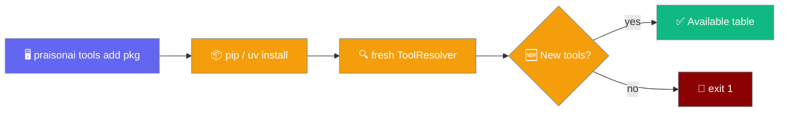
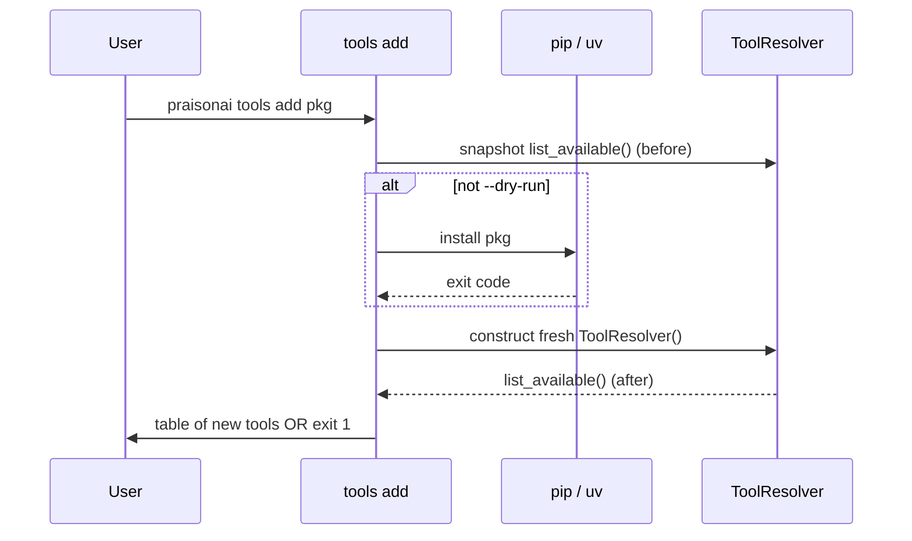

One command installs a tool package and tells you exactly which tools became available — or exits non-zero if none did.



Previously a package could `pip install` cleanly yet expose no resolvable tools — a silent failure. `tools add` turns that into a surfaced non-zero exit.

## Quick Start

<Steps>
<Step title="Install a tool package">

```bash
praisonai tools add praisonai-my-tools
```

<Note>`praisonai-my-tools` is a placeholder — replace it with a real pip requirement spec.</Note>

</Step>

<Step title="Upgrade an installed package">

```bash
praisonai tools add praisonai-my-tools --upgrade
```

</Step>

<Step title="Verify without installing">

```bash
praisonai tools add praisonai-my-tools --dry-run
```

`--dry-run` skips installation and reports whether any **new** tool would resolve from what's already installed.

</Step>
</Steps>

<Warning>
**Enable local/remote tool installs first.** `praisonai tools add` refuses to install a tool package whose path is a local file **or** a `github:` reference unless `PRAISONAI_ALLOW_LOCAL_TOOLS=true` is set. The gate is the same one that governs `tools.py` autoload (see [Security Environment Variables](/features/security-environment-variables#praisonai_allow_local_tools)). Publishing a package to PyPI is not gated — `pip install`-style specs still work without the env var.
</Warning>

---

## How It Works

The command snapshots resolvable tools, installs, builds a **fresh** resolver, then reports the diff.



| Step | What happens |
|------|--------------|
| **Snapshot** | Records `set(ToolResolver().list_available().keys())` |
| **Install** | Skipped on `--dry-run`; otherwise runs the resolved installer command |
| **Refresh** | Constructs a **fresh** `ToolResolver()` — see the note below |
| **Diff** | `sorted(after − before)` — new names become table rows |

<Warning>
Discovery constructs a **fresh** `ToolResolver()`. Calling `resolver.invalidate()` alone is **not** enough — it only clears the per-name resolution cache, not instance-level availability caches (like whether `praisonai_tools` is importable). A new instance re-evaluates those against the now-updated environment.
</Warning>

---

## Security

- **No code execution at add time.** `tools add` inspects a candidate package with `ast.parse` — it does **not** import or execute the module. A malicious `tools.py` cannot run during install.
- **`github:` downloads are locked down**: HTTPS raw URLs only (`raw.githubusercontent.com` / `raw.github.com`), no redirect follow, a **1 MiB** size cap, and the on-disk filename is derived from the URL's last path segment as a safe single basename (no directory traversal).
- **No `--sha256` flag** — the PR that hardened this path deliberately left it out to avoid a new CLI knob. Rely on PyPI signing or your own out-of-band verification if you need a pinned artefact.

---

## Options

| Argument / flag | Type | Default | Description |
|-----------------|------|---------|-------------|
| `package` | positional `str` | *(required)* | pip requirement spec — anything `pip install` / `uv pip install` accepts (name, `name==1.2.3`, VCS URL, path, extras). A local-file path or `github:user/repo[/path]` reference requires `PRAISONAI_ALLOW_LOCAL_TOOLS=true`. `github:` downloads are HTTPS raw URLs only, capped at 1 MiB. |
| `--dry-run` | flag | `False` | Skip installation; run discovery only. Exits non-zero if nothing new is discovered |
| `--upgrade`, `-U` | flag | `False` | Append `--upgrade` so an already-installed package is upgraded |
| `--global` | flag | `False` | Install into the ambient/system environment instead of the CLI interpreter |

---

## How the Installer Is Chosen

Installation is pinned to the interpreter running the CLI so the package lands where discovery will look. See [plugins add → How the Installer Is Chosen](/features/plugins-add#how-the-installer-is-chosen) for the shared decision diagram — both commands use the same `_resolve_installer()` logic.

---

## Exit Codes

| Situation | Exit code |
|-----------|-----------|
| At least one new tool became available | `0` |
| Installer command returned non-zero | `1` |
| Install succeeded but nothing new discovered | `1` |
| `--dry-run` and nothing new discovered | `1` |

---

## Output Shape

A successful run prints a Rich table titled `Registered N tool(s) from <package>`, with the tool's resolution source:

```text
        Registered 2 tools from praisonai-my-tools
┏━━━━━━━━━━━━━━━━┳━━━━━━━━━━━━┓
┃ Tool Name      ┃ Source     ┃
┡━━━━━━━━━━━━━━━━╇━━━━━━━━━━━━┩
│ fetch_report   │ external   │
│ send_invoice   │ registered │
└────────────────┴────────────┘
```

Source values come from `ToolResolver.list_available_sources()` and are one of:

| Source | Origin |
|--------|--------|
| `local` | Project `tools.py` |
| `builtin` | `praisonaiagents.tools` |
| `external` | `praisonai-tools` package |
| `registered` | Wrapper registry / entry-point plugins |

On `--dry-run` the title verb is `Discovered` instead of `Registered`.

---

## Common Patterns

<Tabs>
<Tab title="Default (pin to CLI interpreter)">

```bash
praisonai tools add praisonai-my-tools
```

When `uv` is present, the package is pinned to the CLI interpreter so a fresh resolver sees it.

</Tab>

<Tab title="Global install">

```bash
praisonai tools add praisonai-my-tools --global
```

Installs into the ambient/system environment (`uv pip install --system`, or plain `pip install`).

</Tab>

<Tab title="CI verification">

```bash
praisonai tools add praisonai-my-tools --dry-run
```

Fails the job (exit 1) if the package no longer exposes resolvable tools after another change.

</Tab>
</Tabs>

---

## Best Practices

<AccordionGroup>
<Accordion title="Construct a fresh resolver in wrapper scripts">
If you script installs yourself, build a new `ToolResolver()` after installing — `invalidate()` clears only the per-name cache, not instance-level availability caches.
</Accordion>
<Accordion title="Use --dry-run in CI to catch silent breakage">
A package can install cleanly yet expose no tools. `--dry-run` exits non-zero when discovery finds nothing new.
</Accordion>
<Accordion title="Prefer the default over --global">
The default pins to the CLI interpreter so the tools are resolvable by the same process. Reach for `--global` only when you want the system environment.
</Accordion>
<Accordion title="Inspect after installing">
Run `praisonai tools list` to see every resolvable tool and its source, not just what this command added.
</Accordion>
</AccordionGroup>

---

## Related

<CardGroup cols={2}>
<Card title="plugins add" icon="download" href="/features/plugins-add">
  Install a plugin package and verify it registered
</Card>
<Card title="Tool Source Registry" icon="puzzle-piece" href="/features/tool-source-registry">
  Plug third-party tool sources via entry points
</Card>
<Card title="Tool Resolver" icon="wrench" href="/features/tool-resolver">
  Single source of truth for loading tools
</Card>
<Card title="Tool Discovery Order" icon="list-tree" href="/features/tool-discovery-order">
  How Agent resolves tool names at runtime
</Card>
</CardGroup>
