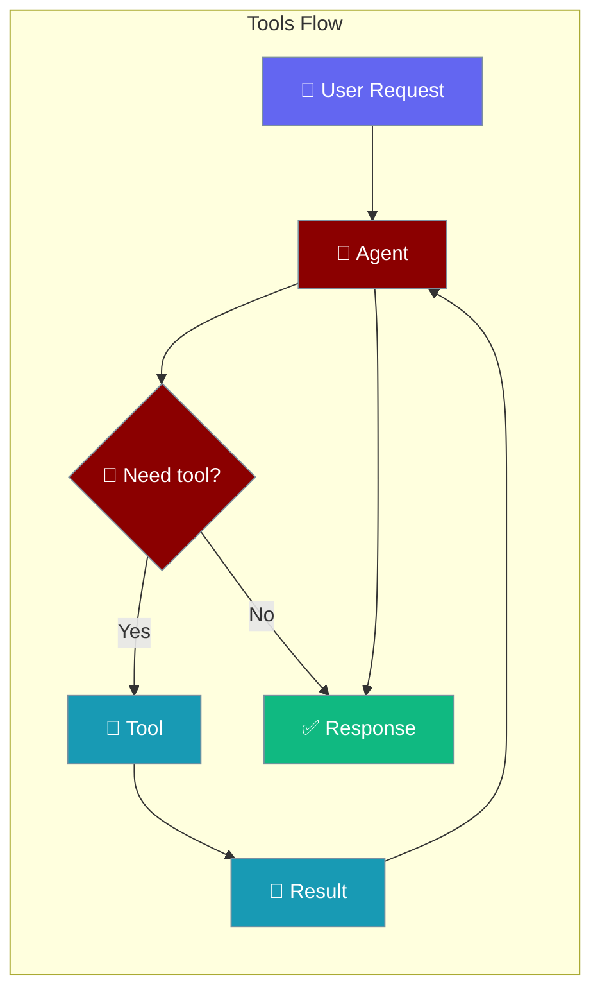
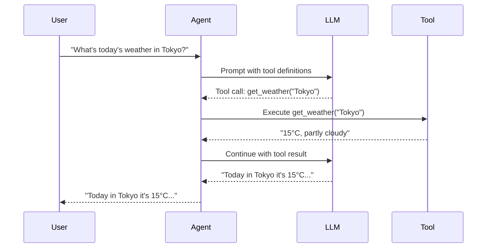

Tools give agents the ability to take actions — search the web, run code, read files, and call APIs — beyond what an LLM knows from training.

```python
from praisonaiagents import Agent
from praisonaiagents.tools import duckduckgo

agent = Agent(
    name="Researcher",
    instructions="You are a research assistant. Use web search for current information.",
    tools=[duckduckgo],
)

agent.start("What are the latest developments in fusion energy?")
```



## Quick Start

<Steps>
<Step title="Built-in Tools">
```python
from praisonaiagents import Agent
from praisonaiagents.tools import duckduckgo

agent = Agent(
    instructions="Search the web to answer questions.",
    tools=[duckduckgo],
)
agent.start("What is today's top AI news?")
```
</Step>

<Step title="Custom Tool Function">
```python
from praisonaiagents import Agent

def get_stock_price(ticker: str) -> str:
    """Get the current stock price for a ticker symbol."""
    return f"${ticker}: $150.25 (mock data)"

agent = Agent(
    instructions="You are a finance assistant.",
    tools=[get_stock_price],
)
agent.start("What is the current price of AAPL?")
```
</Step>

<Step title="Multiple Tools">
```python
from praisonaiagents import Agent
from praisonaiagents.tools import duckduckgo, wikipedia

agent = Agent(
    instructions="You are a comprehensive research assistant.",
    tools=[duckduckgo, wikipedia],
)
agent.start("Research the history and current state of quantum computing.")
```
</Step>
</Steps>

---

## Which Tools to Use?

```mermaid
graph TB
    Q{What does the agent need to do?}
    Q -->|Search current info| Web[duckduckgo / tavily\nweb search tools]
    Q -->|Read/write files| File[file tools\nread_file, write_file]
    Q -->|Run code| Code[code execution\nExecutionConfig(code_execution=True)]
    Q -->|Call external APIs| Custom[custom function\ndef my_tool(param) -> str]
    Q -->|MCP server tools| MCP[MCP integration\ndocs/features/mcp]

    classDef decision fill:#F59E0B,stroke:#7C90A0,color:#fff
    classDef tool fill:#6366F1,stroke:#7C90A0,color:#fff

    class Q decision
    class Web,File,Code,Custom,MCP tool
```

---

## How It Works



| Phase | What happens |
|---|---|
| 1. Discover | Agent receives tool definitions alongside the user request |
| 2. Decide | LLM chooses whether to call a tool |
| 3. Execute | Agent runs the tool and captures the result |
| 4. Synthesize | LLM uses the tool result to form the final answer |

---

## Common Patterns

### Pattern 1 — Web research agent
```python
from praisonaiagents import Agent
from praisonaiagents.tools import duckduckgo, wikipedia

agent = Agent(
    name="Researcher",
    instructions="You research topics using web search and Wikipedia.",
    tools=[duckduckgo, wikipedia],
)
response = agent.start("Explain the history of the Internet Protocol (TCP/IP).")
print(response)
```

### Pattern 2 — Custom API tool
```python
from praisonaiagents import Agent

def get_weather(city: str) -> str:
    """Fetch the current weather for a given city."""
    return f"{city}: 22°C, sunny (mock)"

def get_forecast(city: str, days: int = 3) -> str:
    """Get weather forecast for a city for the next N days."""
    return f"{city}: sunny for {days} days (mock)"

agent = Agent(
    instructions="You are a weather assistant.",
    tools=[get_weather, get_forecast],
)
agent.start("What's the weather in Paris and will it rain this week?")
```

### Pattern 3 — Tool search for large toolsets
```python
from praisonaiagents import Agent

agent = Agent(
    instructions="You have access to many tools. Use them as needed.",
    tools=[...],
    tool_search=True,
)
agent.start("Find the best tool for calculating compound interest.")
```

---

## Best Practices

<AccordionGroup>
<Accordion title="Write clear docstrings for custom tools">
The LLM reads your tool's docstring to decide when and how to use it. Write clear, specific descriptions: "Fetch the current stock price for a given ticker symbol (e.g., 'AAPL', 'GOOGL'). Returns price in USD."
</Accordion>

<Accordion title="Return strings from tools">
Tools should return strings (or JSON-serializable data that gets converted to strings). Complex objects confuse the LLM — format results as readable text.
</Accordion>

<Accordion title="Use tool_search for large toolsets">
When you have more than 10–15 tools, enable `tool_search=True` to let the agent dynamically find the right tools instead of sending all tool definitions with every request.
</Accordion>

<Accordion title="Set timeouts for external tools">
Wrap external API calls with timeouts using `ToolConfig(timeout=30)`. Without timeouts, a slow API can block the entire agent run.
</Accordion>
</AccordionGroup>

---

## Related

<CardGroup cols={2}>
<Card icon="wrench" href="/docs/features/tool-config">
  Tool Config — timeouts, retries, and artifact storage
</Card>
<Card icon="magnifying-glass" href="/docs/features/tool-search">
  Tool Search — dynamic tool discovery for large toolsets
</Card>
</CardGroup>
