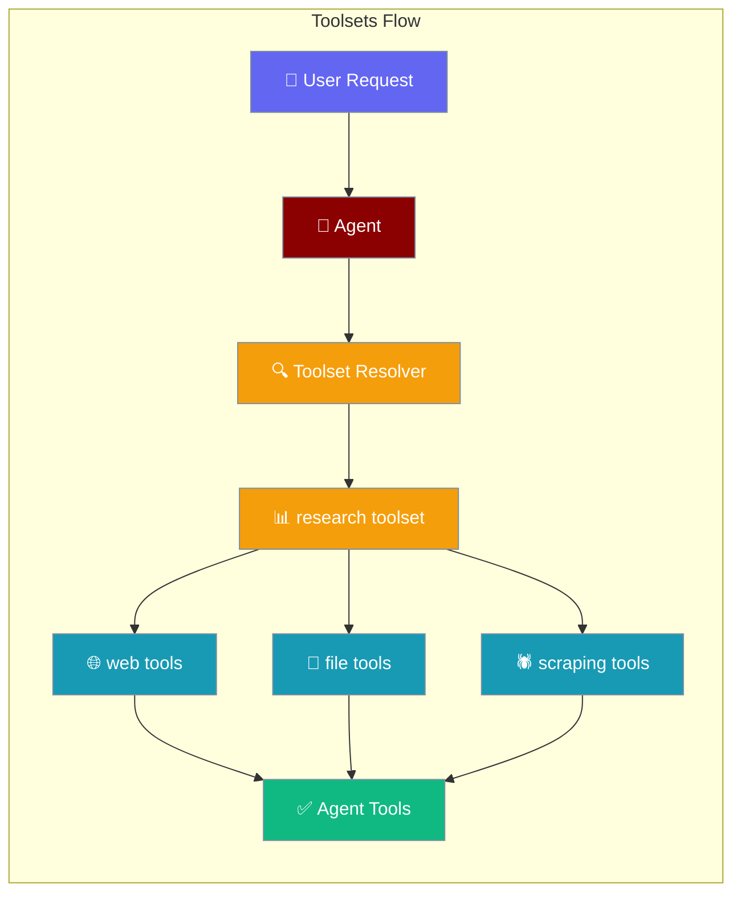
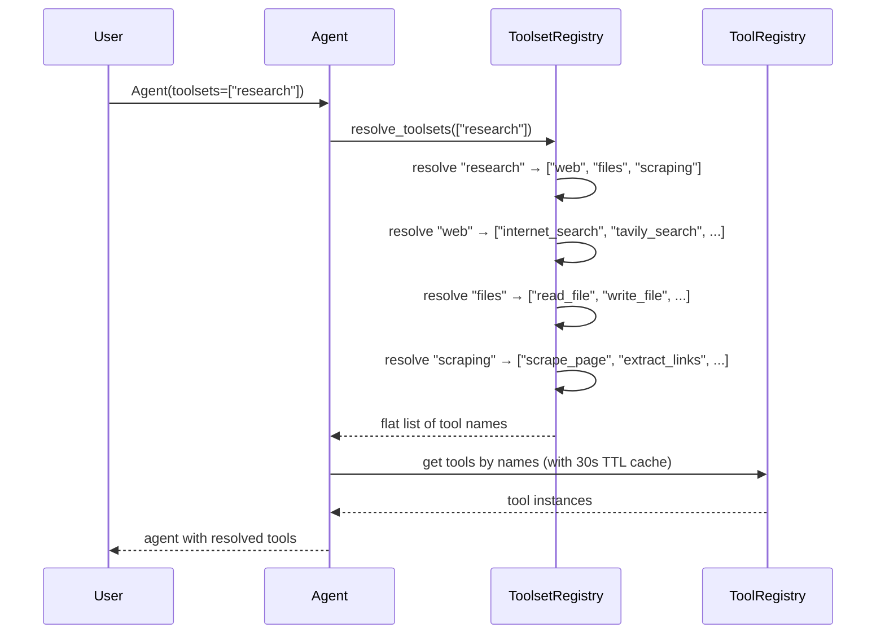

Toolsets group tools under a single name so you can give an agent a curated capability set without listing every tool.

```python
from praisonaiagents import Agent

agent = Agent(name="researcher", toolsets=["research"])
agent.start("Summarise the latest in AI agent frameworks")
```

The user sends a research task; the research toolset supplies curated web and file tools automatically.



```mermaid
graph TB
    Start[Which toolset should I use?]
    Start --> Restricted{Restricted environment?}
    Restricted -->|Yes| Safe[🔒 safe]
    Restricted -->|No| Purpose{What's your purpose?}
    
    Purpose --> Single{Single capability?}
    Single -->|Yes| SingleChoice[🌐 web / 📁 files / 💻 code / ⚙️ system / 🕷️ scraping]
    Single -->|No| Workflow{Complete workflow?}
    
    Workflow -->|Research| Research[📊 research]
    Workflow -->|Development| Development[🛠️ development]
    Workflow -->|Coding| Coding[💻 coding]
    Workflow -->|Custom| Custom[📝 register_toolset(...)]
    
    classDef decision fill:#F59E0B,stroke:#7C90A0,color:#fff
    classDef toolset fill:#189AB4,stroke:#7C90A0,color:#fff
    classDef custom fill:#6366F1,stroke:#7C90A0,color:#fff
    
    class Start,Restricted,Purpose,Single,Workflow decision
    class Safe,SingleChoice,Research,Development,Coding toolset
    class Custom custom
```

## Quick Start

<Steps>
<Step title="Pick a prebuilt toolset">
Use one of the prebuilt toolsets for common scenarios:

```python
from praisonaiagents import Agent

# Research workflow with web search and file tools
agent = Agent(name="researcher", toolsets=["research"])

# Safe environment with minimal tools
agent = Agent(name="assistant", toolsets=["safe"])

# Development with code execution and system access
agent = Agent(name="developer", toolsets=["development"])

# Coding workflow — diff-based file edits + code search + shell + todos
agent = Agent(name="coder", toolsets=["coding"])
agent.start("Refactor UserService to AccountService across src/")
```
</Step>

<Step title="Register a custom toolset">
Create your own toolset by combining tools and other toolsets:

```python
from praisonaiagents import Agent, register_toolset

register_toolset(
    "data_analysis",
    tools=["read_file", "write_file"],
    includes=["safe"],
    description="Tools for data analysis workflows"
)

agent = Agent(name="analyst", toolsets=["data_analysis"])
```
</Step>

<Step title="YAML configuration">
Use toolsets in YAML workflows:

```yaml
agents:
  researcher:
    role: Senior Research Analyst
    goal: Research topics thoroughly
    toolsets: [research]
  
  analyst:
    role: Data Analyst
    goal: Analyse data files
    tools: [write_file]
    toolsets: [safe]

  coder:
    role: Coding Assistant
    goal: Safe, diff-based code edits
    toolsets: [coding]
```
</Step>

<Step title="CLI usage">
Use toolsets directly from command line:

```bash
praisonai run "Research this topic" --toolset research
praisonai chat --toolset web,files
praisonai run "Fix the auth bug in src/user.py" --toolset coding
```
</Step>
</Steps>

---

## How It Works



| Component | Purpose |
|-----------|---------|
| **ToolsetRegistry** | Maps toolset names to tool lists with recursive resolution |
| **Tool Resolution** | Expands toolset names to flat lists, handles cycles and includes |
| **TTL Cache** | 30-second cache for tool availability checks to improve performance |
| **Deduplication** | Ensures no duplicate tools when mixing explicit tools and toolsets |

---

## Configuration Reference

<Card title="Toolsets API Reference" icon="code" href="/docs/sdk/reference/typescript/classes/ToolDefinition">
  TypeScript configuration options
</Card>
<Card title="Toolsets Rust Reference" icon="code" href="/docs/sdk/reference/rust/classes/Tool">
  Rust configuration options
</Card>

### Prebuilt Toolsets

| Name | Direct tools | Includes | Description |
|------|-------------|----------|-------------|
| `web` | `internet_search`, `duckduckgo`, `searxng_search`, `tavily_search`, `exa_search` | — | Web search and crawling tools |
| `files` | `read_file`, `write_file`, `list_files`, `get_file_info`, `copy_file`, `move_file`, `delete_file` | — | File system operations |
| `code` | `execute_code`, `analyze_code`, `format_code`, `lint_code` | — | Python code execution and analysis |
| `system` | `execute_command`, `list_processes`, `kill_process`, `get_system_info` | — | System administration and shell operations |
| `scraping` | `scrape_page`, `extract_links`, `crawl`, `extract_text` | — | Web page scraping and content extraction |
| `research` | *(none)* | `web`, `files`, `scraping` | Complete research workflow |
| `safe` | `internet_search`, `read_file`, `tavily_search` | — | Minimal safe toolset for restricted environments |
| `development` | *(none)* | `code`, `files`, `system` | Complete development workflow |
| `coding` | `read_file`, `edit_file`, `apply_patch`, `search_files`, `list_files`, `execute_command`, `todo_add`, `todo_list`, `todo_update` | — | Coding workflow with diff-based edits (edit_file for existing files, apply_patch to create new files), code search, and shell execution |

### ToolsetSpec Fields

| Field | Type | Default | Description |
|-------|------|---------|-------------|
| `name` | `str` | (required) | Unique name for the toolset |
| `tools` | `List[str]` | `[]` | Tool names included directly in this toolset |
| `includes` | `List[str]` | `[]` | Other toolset names to include (recursive composition) |
| `description` | `str` | `""` | Optional description of the toolset's purpose |

---

## Common Patterns

### Mixing Explicit Tools and Toolsets

```python
from praisonaiagents import Agent

agent = Agent(
    name="hybrid",
    tools=["write_file"],  # Explicit tool
    toolsets=["safe"],     # Toolset
)
# Agent gets tools from both sources with automatic deduplication
```

### Composition with Includes

```python
from praisonaiagents import register_toolset

# Build up capabilities progressively
register_toolset("basic", tools=["read_file", "write_file"])
register_toolset("enhanced", includes=["basic"], tools=["internet_search"])
register_toolset("complete", includes=["enhanced"], tools=["execute_code"])
```

### Environment-Specific Toolsets

```python
import os
from praisonaiagents import Agent

# Choose toolset based on environment
if os.getenv("PRODUCTION"):
    toolsets = ["safe"]
else:
    toolsets = ["development"]

agent = Agent(name="assistant", toolsets=toolsets)
```

---

## CLI Usage

Use toolsets with `praisonai run` and `praisonai chat` commands:

```bash
# Single toolset
praisonai run "Research renewable energy" --toolset research

# Multiple toolsets (comma-separated)
praisonai chat --toolset web,files

# Safe environment
praisonai run "Help me write a report" --toolset safe

# Coding workflow
praisonai run "Fix the auth bug in src/user.py" --toolset coding
```

---

## YAML Usage

Add `toolsets:` key under each agent definition:

```yaml
agents:
  researcher:
    role: Senior Research Analyst
    goal: Research topics thoroughly
    toolsets: [research]  # research = web + files + scraping
    
  writer:
    role: Content Writer
    goal: Write based on research
    tools: [write_file]   # explicit tool
    toolsets: [safe]      # safe toolset
    
  developer:
    role: Software Developer
    goal: Build applications
    toolsets: [development]  # development = code + files + system

  coder:
    role: Coding Assistant
    goal: Safe, diff-based code edits
    toolsets: [coding]  # coding = diff-based edits + code search + shell + todos

tasks:
  research_task:
    description: Research AI frameworks
    agent: researcher
```

---

## When to use `coding` vs `development`

Both toolsets are useful for code-related tasks but target different workflows.

| Toolset | Best for | File writes | Includes |
|---|---|---|---|
| `coding` | Precise edits to existing code, refactors, LLM coding agents | **Diff-based** (`edit_file`, `apply_patch`) | Standalone |
| `development` | Full workflow with unconstrained file ops, scripts | **Overwrite** (`write_file`) | `code` + `files` + `system` |

Choose `coding` when the agent makes targeted edits to source files; choose `development` for broader scripting and dev-tooling tasks.

### Model-family-aware edit order

When an agent has a string `llm=` model id, the `coding` toolset advertises the family's preferred edit primitive first (Claude → `apply_patch`; GPT → `edit_file`). Both primitives stay available — only their order changes, matching the guidance the [Model Harness](/docs/features/model-harness) prepends to the system prompt.

<Note>
Unknown or non-string model ids keep the current edit order byte-for-byte — the harness applies no change unless the model id matches a known family.
</Note>

---

## Custom Toolsets

### Register Function

```python
from praisonaiagents import register_toolset

register_toolset(
    name: str,
    tools: Optional[List[str]] = None,
    includes: Optional[List[str]] = None,
    description: str = "",
    overwrite: bool = False
)
```

### Overwrite Behavior

By default, `register_toolset` is a silent no-op if the name already exists. Set `overwrite=True` to replace:

```python
register_toolset("my_toolset", tools=["tool1"], overwrite=True)
```

### Recursive Includes

Toolsets can include other toolsets with automatic cycle detection:

```python
register_toolset("base", tools=["read_file"])
register_toolset("extended", includes=["base"], tools=["write_file"])
register_toolset("complete", includes=["extended"], tools=["internet_search"])
# complete resolves to: ["read_file", "write_file", "internet_search"]
```

Circular dependencies raise `ValueError`:
```python
register_toolset("a", includes=["b"])
register_toolset("b", includes=["a"])  # Raises ValueError on resolution
```

---

## Performance Note

Tool availability is cached for 30 seconds by default. The `list_available_tools()` function uses TTL caching to avoid expensive availability checks on every agent initialization, improving performance when creating many agents.

---

## Best Practices

<AccordionGroup>
<Accordion title="Pick 'safe' for production sandboxes">
Use the `safe` toolset in production environments where you need to restrict tool capabilities. It includes only read-only operations like `internet_search` and `read_file`.

```python
# Production agent with minimal attack surface
agent = Agent(name="prod_assistant", toolsets=["safe"])
```
</Accordion>

<Accordion title="Compose with 'includes=' rather than copying tool lists">
Use the `includes` parameter to build on existing toolsets instead of duplicating tool lists:

```python
# Good: Compose with includes
register_toolset("analysis", includes=["safe"], tools=["analyze_data"])

# Avoid: Copying tool lists
register_toolset("analysis", tools=["read_file", "internet_search", "analyze_data"])
```
</Accordion>

<Accordion title="Register custom toolsets at app boot, not per-request">
Register toolsets once during application initialization, not in request handlers:

```python
# Good: Register once at startup
def setup_toolsets():
    register_toolset("custom", tools=["my_tool"])

# Avoid: Registering per request
def handle_request():
    register_toolset("custom", tools=["my_tool"])  # Inefficient
```
</Accordion>

<Accordion title="Mix explicit 'tools=' with 'toolsets=' when you need one extra tool">
Use both parameters when you need a toolset plus one additional tool:

```python
agent = Agent(
    name="researcher",
    tools=["special_analysis_tool"],  # One extra tool
    toolsets=["research"]             # Base capability set
)
```
</Accordion>
</AccordionGroup>

---

## Related

<CardGroup cols={2}>
<Card title="Allowed Tools" icon="shield-check" href="/docs/features/allowed-tools">
  Environment variable whitelist for tool restriction
</Card>
<Card title="Bot Default Tools" icon="robot" href="/docs/features/bot-default-tools">
  Default tools for bot agents
</Card>
<Card title="Load MCP Tools" icon="plug" href="/docs/features/load-mcp-tools">
  Model Context Protocol tool loading
</Card>
<Card title="Tool Resolver" icon="folder-open" href="/docs/features/tool-resolver">
  Resolve tools from local tools.py
</Card>
<Card title="Model Harness" icon="sliders" href="/docs/features/model-harness">
  Per-model-family prompt and edit-order tuning
</Card>
</CardGroup>