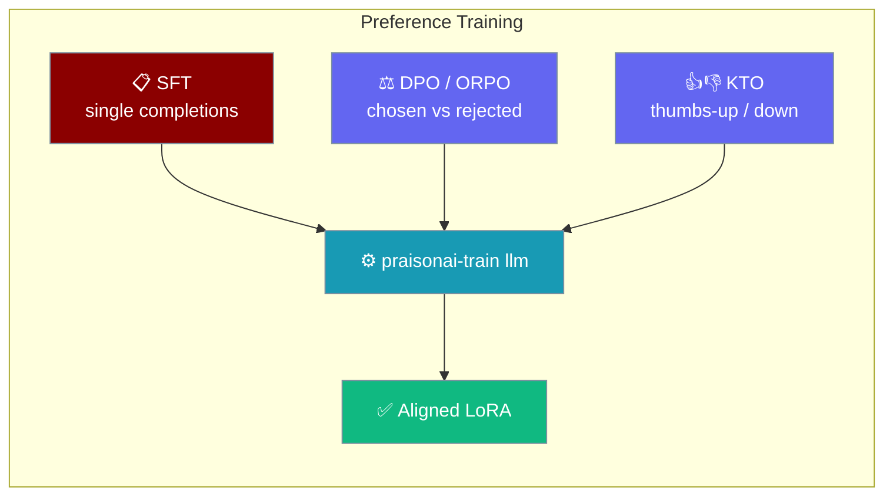
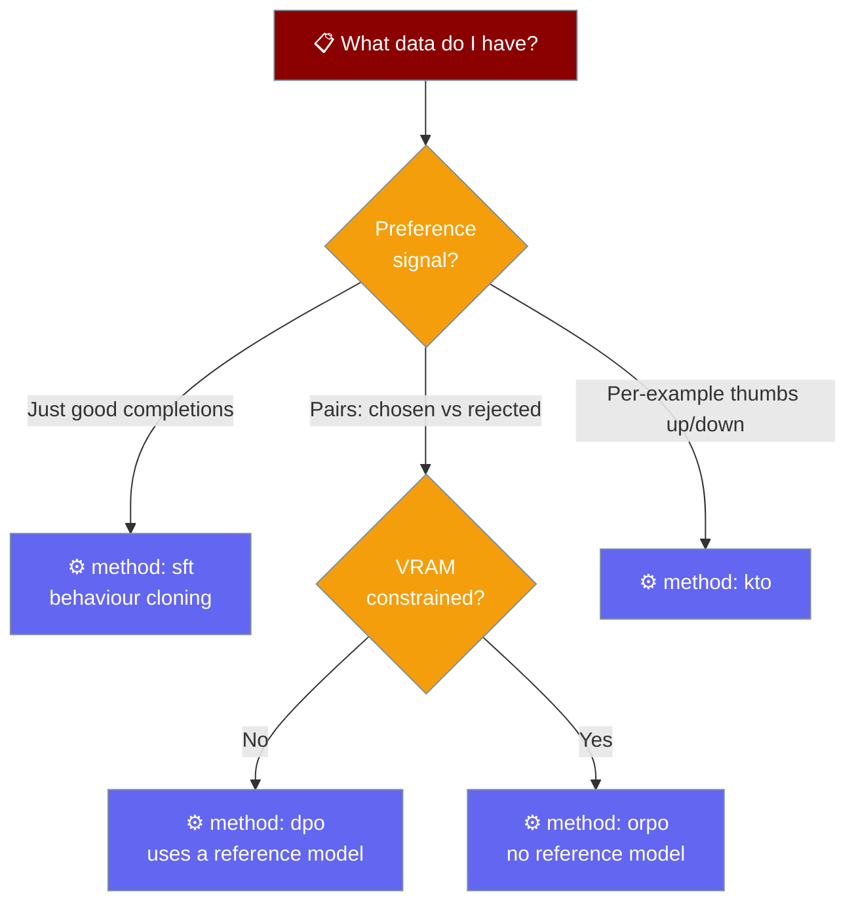

Teach a model *which answer is better*, not just *what to say* — switch from supervised fine-tuning to preference tuning by setting one `method` key.



`praisonai-train llm` supports four objectives selected by the `method` config key: `sft` (default), `dpo`, `orpo`, and `kto`. SFT clones behaviour from single completions; DPO and ORPO learn from `chosen` vs `rejected` pairs; KTO learns from per-example thumbs-up / thumbs-down labels.

## Quick Start

<Steps>
<Step title="Install the training stack">

```bash
pip install "praisonai-train[llm]"
```

</Step>
<Step title="Pick a method in config.yaml">

Switch from SFT to preference tuning by setting `method` and pointing `dataset` at a preference dataset. Everything else stays the same.

<Tabs>
<Tab title="DPO">

Needs `prompt`, `chosen`, `rejected` columns. Uses the frozen base model as an implicit reference (`ref_model=None`).

```yaml
method: dpo
model_name: "unsloth/gemma-2-2b-it-bnb-4bit"
max_seq_length: 2048
max_prompt_length: 1024
beta: 0.1
dataset:
  - name: "your-org/your-preference-dataset"
    split: "train"
```

</Tab>
<Tab title="ORPO">

Same columns as DPO, but **no reference model** — ORPO folds the reference into its loss, so it uses less VRAM.

```yaml
method: orpo
model_name: "unsloth/gemma-2-2b-it-bnb-4bit"
max_seq_length: 2048
max_prompt_length: 1024
beta: 0.1
dataset:
  - name: "your-org/your-preference-dataset"
    split: "train"
```

</Tab>
<Tab title="KTO">

Needs `prompt`, `completion`, `label` columns — one label per example, no pairs required.

```yaml
method: kto
model_name: "unsloth/gemma-2-2b-it-bnb-4bit"
max_seq_length: 2048
max_prompt_length: 1024
beta: 0.1
desirable_weight: 1.0
undesirable_weight: 1.0
dataset:
  - name: "your-org/your-kto-dataset"
    split: "train"
```

</Tab>
</Tabs>

</Step>
<Step title="Train">

```bash
praisonai-train llm config.yaml
```

The trainer validates the dataset columns **before** the run starts and saves the aligned LoRA to `lora_model/` — publishing stays opt-in.

</Step>
</Steps>

---

## Which method should I use?



| Method | Use when | Reference model |
|--------|----------|-----------------|
| `sft` | You have good completions and just want to clone them | — |
| `dpo` | You have `chosen` / `rejected` pairs | Yes — frozen base weights |
| `orpo` | You have pairs but are VRAM-constrained | No — folded into the loss |
| `kto` | You only have per-example labels (thumbs-up / down) | Yes — frozen base weights |

---

## Dataset shapes

Each method fails fast **before training** if the required columns are missing — the error names both the missing columns and the columns your dataset actually has.

<Tabs>
<Tab title="DPO / ORPO">

Columns: `prompt`, `chosen`, `rejected`.

| prompt | chosen | rejected |
|--------|--------|----------|
| `"Explain gravity to a 5-year-old."` | `"Gravity is what pulls things down…"` | `"Gravity is a fundamental force described by general relativity…"` |

</Tab>
<Tab title="KTO">

Columns: `prompt`, `completion`, `label` (boolean thumbs-up / down).

| prompt | completion | label |
|--------|-----------|-------|
| `"Explain gravity to a 5-year-old."` | `"Gravity is what pulls things down…"` | `true` |
| `"Explain gravity to a 5-year-old."` | `"Consult the Einstein field equations."` | `false` |

</Tab>
</Tabs>

<Note>
Preference datasets are kept **as-is** — the trainer does not flatten them to a `text` column the way SFT does. `shuffle: true` on a dataset entry still applies.
</Note>

---

## Config keys

All preference keys are optional and, apart from `method`, apply only to preference methods.

| Key | Type | Default | Applies to | Description |
|-----|------|---------|------------|-------------|
| `method` | `str` | `"sft"` | all | Training method — `sft`, `dpo`, `orpo`, `kto`. Case-insensitive. |
| `beta` | `float` | trainer default | dpo, orpo, kto | Preference-loss temperature, passed straight to the trainer's `beta`. |
| `max_prompt_length` | `int` | `max_seq_length // 2` | dpo, orpo, kto | Prompt truncation length. |
| `desirable_weight` | `float` | trainer default | kto | Weight on thumbs-up (`label: true`) examples. |
| `undesirable_weight` | `float` | trainer default | kto | Weight on thumbs-down (`label: false`) examples. |

---

## What happens under the hood

<AccordionGroup>
<Accordion title="No loss masking">
Response-only masking is an SFT concept — preference losses compare whole sequences, so `assistant_only_loss` is skipped for `dpo` / `orpo` / `kto`.
</Accordion>
<Accordion title="Dataset kept as-is">
`process_dataset()` short-circuits for preference methods: your `prompt` / `chosen` / `rejected` (or `prompt` / `completion` / `label`) columns are passed straight through, un-flattened. SFT keeps its flatten-to-`text` behaviour.
</Accordion>
<Accordion title="SFT-only fields dropped">
For preference methods the trainer drops `dataset_text_field`, `packing`, and `dataset_num_proc`, sets `max_length = max_seq_length`, and defaults `max_prompt_length` to `max_seq_length // 2`.
</Accordion>
<Accordion title="Reference model uses frozen base weights">
DPO and KTO run with `ref_model=None` — the trainer uses the frozen base weights as the reference. This works cleanly with a PEFT adapter and avoids doubling VRAM. ORPO needs no reference model at all.
</Accordion>
<Accordion title="Preference imports are lazily guarded">
Each trainer / config pair is imported individually. An older TRL missing one method (e.g. `KTOTrainer`) still lets the others run.
</Accordion>
</AccordionGroup>

---

## Errors you might see

<AccordionGroup>
<Accordion title="Missing preference columns">
```
method 'dpo' requires columns ['prompt', 'chosen', 'rejected'], but the
dataset has ['instruction', 'output'].
```
Rename your columns or point at a dataset with the required shape. The check runs before the model loads — you find out in seconds, not minutes.
</Accordion>
<Accordion title="TRL version too old for the method">
```
method 'kto' needs KTOTrainer and KTOConfig from TRL, which this TRL
version does not provide. Upgrade trl, or use method: sft.
```
Upgrade with `pip install -U "praisonai-train[llm]"`.
</Accordion>
<Accordion title="Unknown method name">
An unrecognised `method` raises a `ValueError` listing every supported method (`sft`, `dpo`, `orpo`, `kto`) with a one-line summary. `method` is case-insensitive, so `DPO` and `dpo` both work.
</Accordion>
</AccordionGroup>

---

## Related

<CardGroup cols={2}>
<Card title="Train" icon="graduation-cap" href="/train">
  Full fine-tuning setup, config reference, and the response-masking section.
</Card>
<Card title="Assistant-only Loss" icon="mask" href="/train#assistant-only-loss">
  How SFT masks prompts out of the loss (skipped for preference methods).
</Card>
<Card title="praisonai-train Package" icon="cube" href="/features/praisonai-train-package">
  The standalone training package and its CLI subcommands.
</Card>
<Card title="Train CLI" icon="terminal" href="/cli/train">
  Full flag and config-key reference for `praisonai train llm`.
</Card>
</CardGroup>
