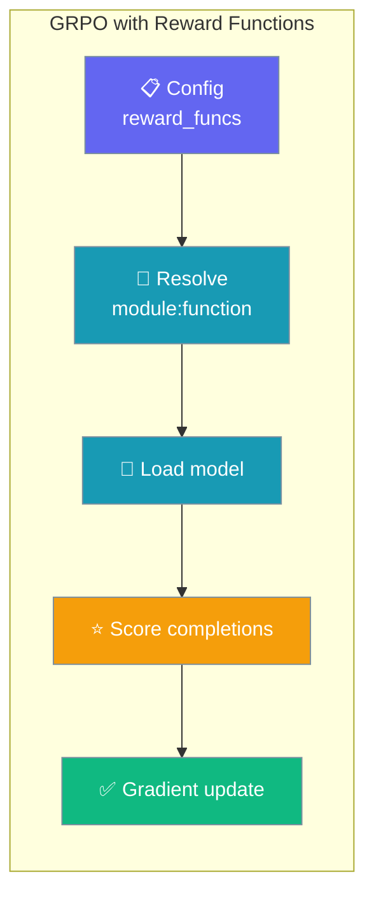
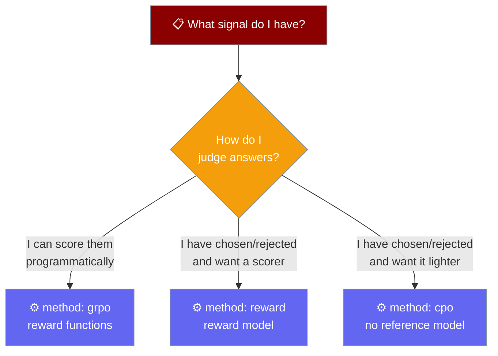
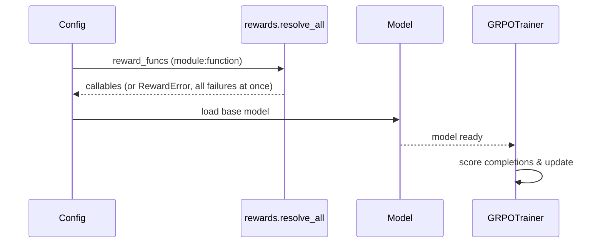

Grade an agent's answers with a plain Python function, then let GRPO train the model to score higher — no preference pairs required.



`praisonai-train llm` adds three RL / preference objectives on top of SFT: **`grpo`** (group-relative policy optimisation, scored by your reward functions), **`reward`** (train a reward model from preference pairs), and **`cpo`** (contrastive preference optimisation, no reference model). Only GRPO needs reward functions — the other two learn from `chosen` / `rejected` pairs.

## Quick Start

Start with an Agent whose behaviour you want to score, write one function that grades its outputs, then run GRPO on it.

<Steps>
<Step title="Start from an Agent">

Pick the behaviour you want to reward — here, concise answers.

```python
from praisonaiagents import Agent

agent = Agent(instructions="Answer briefly and correctly.")
agent.start("What is the capital of France?")
```

</Step>
<Step title="Write a reward function">

TRL calls each reward function as `(prompts, completions, **kwargs)` and expects one float per completion. Put it in an importable module — e.g. `myproject/rewards.py`.

```python
# myproject/rewards.py
def length_penalty(prompts, completions, **kwargs) -> list[float]:
    """Reward short answers: 1.0 for <= 20 words, decreasing after."""
    return [max(0.0, 1.0 - len(c.split()) / 20) for c in completions]
```

</Step>
<Step title="Point reward_funcs at it and run GRPO">

`reward_funcs` names each callable by its `module:function` import path. GRPO needs only a `prompt` column — it generates its own completions.

```yaml
# config.yaml
method: grpo
model_name: "unsloth/gemma-2-2b-it-bnb-4bit"
max_seq_length: 2048
reward_funcs:
  - myproject.rewards:length_penalty
num_generations: 8
dataset:
  - name: "your-org/your-prompts"
    split: "train"
```

```bash
pip install "praisonai-train[llm]"
praisonai-train llm config.yaml
```

</Step>
</Steps>

---

## Which method should I use?



| Method | Use when | Reward functions | Reference model |
|--------|----------|------------------|-----------------|
| `grpo` | You have prompts and can *score* completions (correctness, length, format) | **Required** | No |
| `reward` | You want a reward-model artifact from `(chosen, rejected)` pairs (e.g. to feed GRPO later) | No | No |
| `cpo` | You have `(prompt, chosen, rejected)` and want a lighter-weight DPO alternative | No | No |

---

## Dataset shapes

Each method fails fast **before training** if the required columns are missing — the error names both the missing columns and the columns your dataset actually has.

<Tabs>
<Tab title="GRPO">

Column: `prompt` only. GRPO generates its own completions, so no `chosen` / `rejected` / `completion` is needed.

| prompt |
|--------|
| `"What is the capital of France?"` |

</Tab>
<Tab title="Reward">

Columns: `chosen`, `rejected`. No `prompt`, no reference model.

| chosen | rejected |
|--------|----------|
| `"Paris."` | `"The capital is somewhere in Europe."` |

</Tab>
<Tab title="CPO">

Columns: `prompt`, `chosen`, `rejected` — the same shape as DPO / ORPO.

| prompt | chosen | rejected |
|--------|--------|----------|
| `"Capital of France?"` | `"Paris."` | `"I'm not sure."` |

</Tab>
</Tabs>

---

## Reward functions

A reward function is a Python callable that scores generated completions. GRPO calls it once per generation batch and uses the returned floats to push the model toward higher-scoring answers.

### The `module:function` convention

A YAML config can only carry a string, so `reward_funcs` names each callable by a dotted import path — the same `module:function` form `console_scripts` and gunicorn use.

```yaml
method: grpo
reward_funcs:
  - myproject.rewards:length_penalty
  - myproject.rewards:contains_answer
num_generations: 8
```

A single spec doesn't have to be a list — `reward_funcs: myproject.rewards:length_penalty` works too. You can also pass callables directly from the Python API.

### The signature TRL expects

```python
def my_reward(prompts, completions, **kwargs) -> list[float]:
    ...
```

One float per completion. Extra columns from your dataset arrive in `**kwargs`, keyed by column name.

### Resolved before the model loads

Every reward path is imported and validated **before** the multi-gigabyte model loads — a typo costs five seconds, not a lost session.



### Why an import path, not a registry?

Two alternatives were considered and deliberately not offered:

<AccordionGroup>
<Accordion title="A decorator registry">
A registry populated by `@reward` means the config can only name functions from a module something else already imported — a worse failure to debug than "no module named X".
</Accordion>
<Accordion title="Inline Python in YAML">
Inline code is an execution surface in a file people paste from the internet. An import path is the only option that can be resolved before anything runs.
</Accordion>
</AccordionGroup>

### Signature check is a warning, not a failure

If a reward function's signature doesn't accept `completions`, the trainer prints a warning and continues — TRL may still call it correctly, and refusing would block working code:

```
WARNING: my_reward does not take 'completions'; TRL calls reward functions as (prompts, completions, **kwargs)
```

Callables whose signature can't be read (builtins, C callables) are left to TRL rather than guessed at.

---

## Python API — `praisonai_train.rewards`

Resolve import paths yourself, or pass callables straight into a config.

```python
from praisonai_train.rewards import resolve, resolve_all, require, RewardError

fn = resolve("myproject.rewards:length_penalty")   # -> callable
fns = resolve_all([                                  # collects all failures at once
    "myproject.rewards:length_penalty",
    "myproject.rewards:contains_answer",
])
require("grpo", fns)                                 # raises RewardError if empty
```

| Symbol | Kind | Purpose |
|--------|------|---------|
| `resolve(spec)` | function | Import `module:function` and return the callable. Passes a callable through unchanged. |
| `resolve_all(specs)` | function | Resolve a list or a single spec; collects **all** failures before raising. |
| `check_signature(fn, spec="")` | function | Warn-level check that `fn` looks like `(prompts, completions, **kwargs)`. |
| `require(method, resolved)` | function | Raise `RewardError` when a method (GRPO) has no reward functions. |
| `RewardError` | exception | Subclass of `ValueError`; raised for any resolution or shape failure. |

---

## GRPO config keys

Three keys apply to GRPO, alongside the shared training keys.

| Key | Type | Default | Applies to | Description |
|-----|------|---------|------------|-------------|
| `reward_funcs` | `str \| list[str] \| callable \| list[callable]` | `None` | grpo (required) | Reward function(s) scoring generated completions. Strings must be `module:function` import paths. A single spec needn't be a list. |
| `num_generations` | `int` | trainer default | grpo | Completions sampled per prompt for scoring. Passed straight to `GRPOConfig`. |
| `max_completion_length` | `int` | trainer default | grpo | Maximum length of each generated completion. Passed straight to `GRPOConfig`. |

---

## Errors you might see

Each error runs **before** the model loads and tells the failing part apart, so you know exactly what to fix.

<AccordionGroup>
<Accordion title="Missing reward functions for GRPO">
```
method 'grpo' needs reward_funcs: a list of 'module:function' import paths
that score completions. Example:
  reward_funcs:
    - myproject.rewards:length_penalty
```
Add at least one `module:function` path under `reward_funcs`.
</Accordion>
<Accordion title="Module can't be imported">
```
cannot import 'nomodule' for reward function 'nomodule:f': No module named
'nomodule'. Is it on PYTHONPATH?
```
The module isn't importable — check the name and that its directory is on `PYTHONPATH`.
</Accordion>
<Accordion title="Attribute not found (with 'did you mean')">
```
'mymod' has no 'no_such'. Callables there: contains_answer, length_penalty
```
The module imported but has no such function; the message lists the callables it *does* have (up to 8).
</Accordion>
<Accordion title="Malformed spec (dot instead of colon)">
```
reward function 'mymod.func' is not a 'module:function' path.
Example: myproject.rewards:length_penalty
```
Use a colon between module and function: `mymod:func`, not `mymod.func`.
</Accordion>
<Accordion title="Not a callable">
```
'mymod:some_int' is a int, not a function
```
The named attribute exists but isn't callable — point at a function.
</Accordion>
</AccordionGroup>

<Note>
`resolve_all` collects every broken path and raises **once** with all failures separated by newlines — three fixes in one pass, not three runs.
</Note>

---

## Best Practices

<AccordionGroup>
<Accordion title="Keep reward functions importable and pure">
Put them in a module on `PYTHONPATH` (e.g. `myproject/rewards.py`) and keep them side-effect-free. They run once per generation batch, so avoid slow I/O.
</Accordion>
<Accordion title="Combine several small rewards">
List multiple `module:function` paths — correctness, length, and format compliance as separate functions is easier to tune than one monolithic scorer.
</Accordion>
<Accordion title="Dry-run to catch typos early">
Because paths resolve before the model loads, a bad `reward_funcs` entry fails in seconds. Fix all reported paths at once — `resolve_all` lists every failure.
</Accordion>
<Accordion title="Use reward modelling to bootstrap GRPO">
Train a `reward` model from `(chosen, rejected)` pairs, then wrap it in a reward function to score GRPO completions later.
</Accordion>
</AccordionGroup>

---

## Related

<CardGroup cols={2}>
<Card title="praisonai-train Package" icon="graduation-cap" href="/features/praisonai-train-package">
  The standalone training package and its CLI subcommands.
</Card>
<Card title="Train" icon="graduation-cap" href="/train">
  Full fine-tuning setup and config reference.
</Card>
<Card title="Train CLI" icon="terminal" href="/cli/train">
  Full flag and config-key reference for `praisonai train llm`.
</Card>
<Card title="Multi-GPU Training" icon="microchip" href="/features/praisonai-train-multigpu">
  Fine-tune across multiple GPUs with torchrun.
</Card>
</CardGroup>
