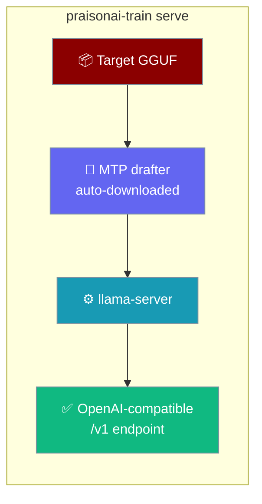
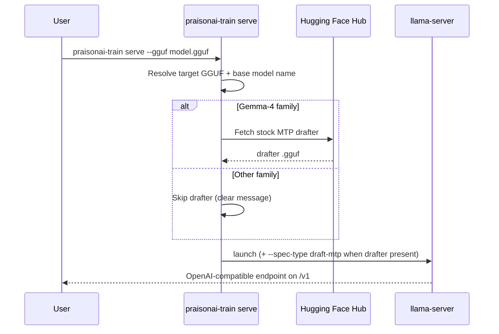

Serve a trained GGUF model on an OpenAI-compatible endpoint — with MTP fast inference auto-enabled for Gemma-4.



<Info>
`serve` needs a **llama.cpp** binary (`llama-server` / `llama-cli`) on your `PATH`. Build it from [llama.cpp](https://github.com/ggml-org/llama.cpp) (`cmake -B build && cmake --build build`) or download a release, then add it to `PATH` or set `LLAMA_CPP_BIN` to the binary (or its directory).
</Info>

## Quick Start

<Steps>
<Step title="Serve a GGUF">

Serve a trained Gemma-4 model on `http://localhost:8080/v1` — MTP fast inference turns on automatically.

```bash
praisonai-train serve --gguf model.gguf
```

</Step>

<Step title="Point at a model directory">

Skip naming the file — `serve` auto-detects the target GGUF inside a trained model directory (and ignores drafter files).

```bash
praisonai-train serve -d lora_model
```

</Step>

<Step title="Benchmark the speed-up">

Run a one-shot speed test that reports tokens/sec and the MTP drafter acceptance rate instead of serving.

```bash
praisonai-train serve --gguf model.gguf --benchmark
```

</Step>
</Steps>

<Tip>
Non Gemma-4 models serve fine — they just fall back to plain serving with a clear message. Nothing to configure.
</Tip>

---

## Call the endpoint

Once `serve` prints `llama-server ready — OpenAI-compatible endpoint: http://127.0.0.1:8080/v1`, point any OpenAI client at it.

```python
from openai import OpenAI

client = OpenAI(base_url="http://127.0.0.1:8080/v1", api_key="not-needed")

response = client.chat.completions.create(
    model="gemma-4",
    messages=[{"role": "user", "content": "Explain multi-token prediction in one line."}],
)
print(response.choices[0].message.content)
```

---

## How It Works

`serve` resolves the target GGUF, recovers the base model name to pick a drafter, fetches the stock MTP drafter when the family supports it, then launches `llama-server` (or a one-shot `llama-cli` benchmark).



The base model name (needed to choose a drafter) is recovered in this order:


---

## Flags

Every flag from the `serve` command, with its default.

| Flag | Type | Default | Description |
|------|------|---------|-------------|
| `--gguf` | `str` | *unset* | Path to the target GGUF to serve. |
| `--model-dir` / `-d` | `str` | *unset* | Directory of the trained model (GGUF auto-detected, drafter files skipped). |
| `--config` / `-c` | `str` | *unset* | Optional `config.yaml` for the base-model / MTP knobs. |
| `--base-model` | `str` | *unset* | Base model id used to select the MTP drafter. |
| `--mtp-draft` / `--no-mtp-draft` | `bool` | `True` | Use the stock MTP drafter — on automatically when the family supports it. |
| `--spec-draft-n-max` | `int` | `2` | Max tokens the MTP drafter proposes per step. |
| `--port` | `int` | `8080` | Port for `llama-server`. |
| `--ngl` | `int` | `99` | Number of layers to offload to the GPU. |
| `--benchmark` | `bool` | `False` | Run a one-shot speed benchmark instead of serving. |

<Note>
Provide either `--gguf` or `--model-dir`. With neither, `serve` exits with `ERROR: Nothing to serve: provide --gguf or --model-dir.`
</Note>

### Custom port, no MTP

Serve on a different port with the drafter turned off.

```bash
praisonai-train serve --gguf model.gguf --no-mtp-draft --port 9000
```

---

## Fast inference with MTP (Gemma-4 only)

MTP (Multi-Token Prediction) pairs the target model with a small jointly-trained drafter that proposes tokens the full model verifies in one pass — lossless when served with `--spec-type draft-mtp`.


You never retrain the drafter — `serve` downloads the matching stock drafter from the Hub on demand, even for a fine-tuned target like `mervinpraison/praisonai-gemma-4-E4B-tamil`.

### Supported sizes

The drafter is pulled from each size's Unsloth GGUF repo at `MTP/mtp-gemma-4-<SIZE>-it-<PRECISION>.gguf`.

| Size | Drafter repo |
|------|--------------|
| `E2B` | `unsloth/gemma-4-E2B-it-GGUF` |
| `E4B` | `unsloth/gemma-4-E4B-it-GGUF` |
| `12b` | `unsloth/gemma-4-12b-it-GGUF` |

Drafter precisions: `q8_0` (default), `bf16`, `f16`.

<Note>
Real-world caveat from the source PR: mainline llama.cpp can stall E4B generation on build `b10107`; the HF-Transformers assistant-model path measured **+1.40×**. MTP works on Gemma-4 — other families fall back gracefully.
</Note>

---

## Best Practices

<AccordionGroup>
<Accordion title="Install a llama.cpp binary first">
`serve` calls `llama-server` / `llama-cli` from your `PATH`. Build llama.cpp or download a release, then add it to `PATH` or set `LLAMA_CPP_BIN` to the binary or its directory. Missing binaries produce a single clean install hint, not a traceback.
</Accordion>

<Accordion title="Let MTP auto-enable">
Leave `--mtp-draft` on (the default). Gemma-4 downloads the stock drafter automatically; every other family serves without it and tells you why. Pass `--no-mtp-draft` only to force plain serving.
</Accordion>

<Accordion title="Benchmark before and after">
Run `--benchmark` with and without MTP to see the tokens/sec gain and the drafter acceptance rate on your hardware before committing to a serving config.
</Accordion>

<Accordion title="Pass --base-model when the name can't be recovered">
If the model directory has no `config.json` `_name_or_path` and you pass no `--config`, `serve` can't pick a drafter. Add `--base-model unsloth/gemma-4-E4B-it` so MTP resolution works.
</Accordion>
</AccordionGroup>

---

## Related

<CardGroup cols={2}>
  <Card title="Train" icon="graduation-cap" href="/docs/train">
    Fine-tune a base model, then export a GGUF to serve.
  </Card>
  <Card title="Train CLI" icon="terminal" href="/docs/cli/train">
    Full flag reference for every training subcommand.
  </Card>
  <Card title="Speed Benchmark" icon="gauge" href="/docs/features/praisonai-train-benchmark">
    Compare deployments by throughput, latency, and success rate.
  </Card>
  <Card title="Models" icon="brain" href="/docs/models">
    Point an Agent at your served endpoint.
  </Card>
</CardGroup>
