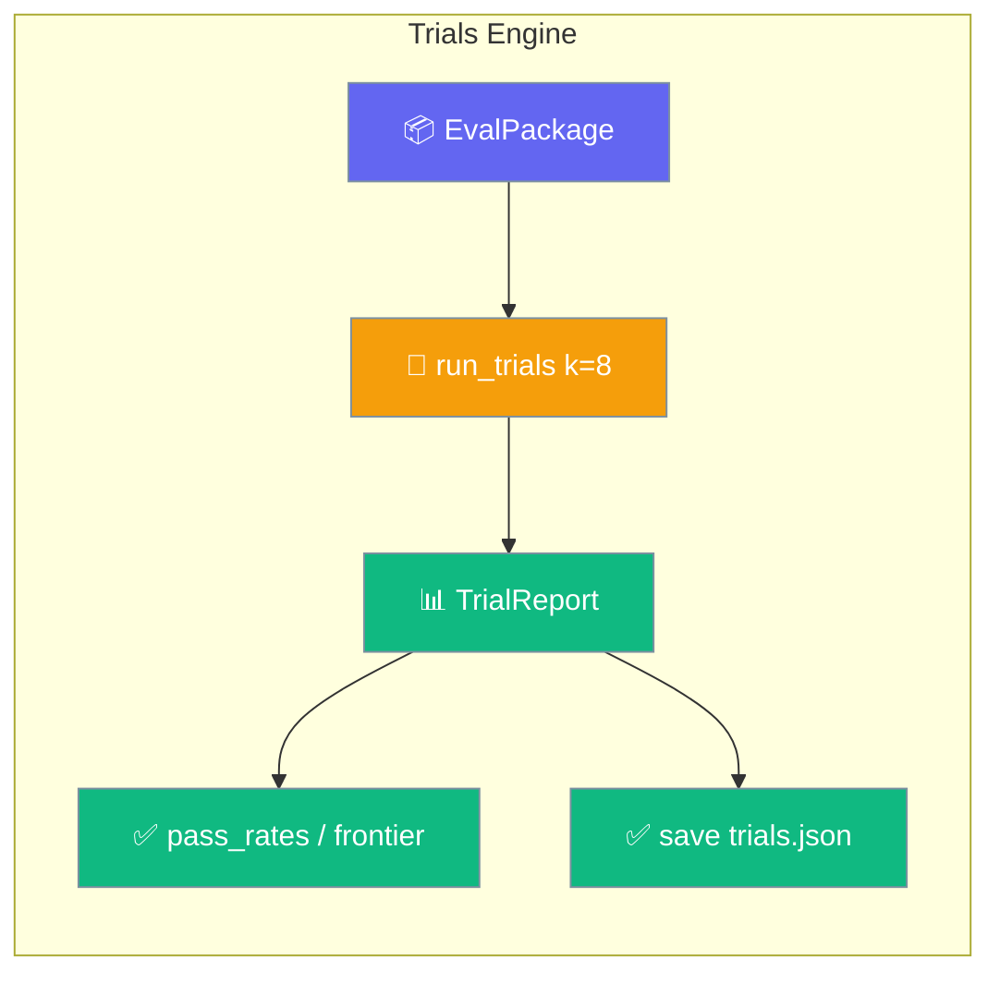
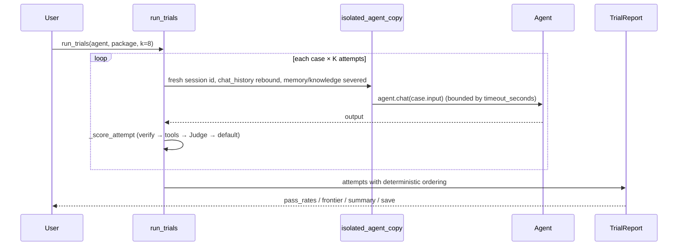
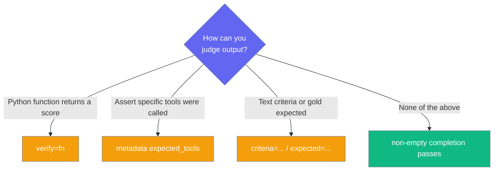

The trials engine runs each eval case K independent times so you get a pass rate and a frontier of shaky cases, not one lucky (or unlucky) sample.



## Quick Start

<Steps>
<Step title="Run K attempts per case">
Build an agent, wrap your cases in an `EvalPackage`, and call `run_trials`.

```python
from praisonaiagents import Agent
from praisonaiagents.eval import EvalPackage, EvalCase, run_trials

agent = Agent(name="summariser", instructions="Summarise the input in one sentence.")

package = EvalPackage(name="summariser-suite", cases=[
    EvalCase(
        name="short",
        input="PraisonAI is an agent framework.",
        verify=lambda output, expected: "agent" in output.lower(),
    ),
    EvalCase(
        name="long",
        input="LLMs are large language models.",
        criteria=["mentions language models"],
    ),
])

report = run_trials(agent, package, k=8, concurrency=4)
print(report.pass_rates())   # {"short": 0.875, "long": 1.0}
print(report.frontier())     # ["short"]
```
</Step>

<Step title="Async variant">
Use `arun_trials` inside an existing event loop.

```python
from praisonaiagents.eval import arun_trials

report = await arun_trials(agent, package, k=8, concurrency=4)
print(report.pass_rates())
```
</Step>

<Step title="Save and reload">
Persist the full report — including per-attempt trajectories — and load it back.

```python
from praisonaiagents.eval import TrialReport

report.save("trials.json")               # creates parent dirs
report = TrialReport.load("trials.json")  # full round-trip
```
</Step>

<Step title="Gate CI on the pass rate">
Read `summary()` for a stable, machine-parseable dict and fail loudly below your bar.

```python
summary = report.summary()
assert summary["overall_pass_rate"] >= 0.9, summary["frontier"]
```
</Step>
</Steps>

---

## How It Works

Each case runs K times on a fresh, isolated copy of the agent; every completed attempt is scored, then results are assembled into a `TrialReport`.



| Stage | What happens |
|-------|--------------|
| Isolate | Each attempt runs on `copy.copy(agent)` with fresh identity and severed stores. |
| Run | The agent is called with `case.input`, bounded by `case.timeout_seconds`. |
| Score | Completed attempts flow through the scorer resolution order below. |
| Assemble | Attempts are ordered deterministically into a `TrialReport`. |

---

## Scoring — one contract, four fallbacks

Scoring runs only on `stop_reason="completed"` attempts and resolves in this exact order.

1. **`EvalCase.verify` callable** — if present, it wins. A raising `verify` is caught and recorded as a *failed* `TrialScore` with `reason="verify error: ..."` — one bad metric never aborts the report.
2. **Tool assertions** — if `case.metadata["expected_tools"]` is set, the engine reuses `ReliabilityEvaluator._extract_tool_calls`. Score is `1 − (missing / expected)`; passes only when every expected tool was called.
3. **Criteria / expected via Judge** — falls through to the existing `Judge`. The judge's 0–10 score is normalised to `[0, 1]`.
4. **No scorer configured** — a non-empty completion counts as a pass (`reason="no scorer configured"`); an empty completion is a fail.

<Warning>
**Unscored ≠ zero.** Timeouts and errors produce a `TrialAttempt` with `score=None`. Unscored attempts are **excluded** from pass-rate arithmetic — they are not counted as failures. Do not conflate "unscored" with "scored 0".
</Warning>

---

## Configuration Options

`run_trials()` and `arun_trials()` share the same signature.

| Option | Type | Default | Description |
|--------|------|---------|-------------|
| `agent` | `Agent` | — | Agent under test (must expose `chat()` or `start()`). |
| `package` | `EvalPackage` | — | Cases to run. |
| `k` | `int` | `1` | Independent attempts per case. Must be `>= 1` (raises `ValueError` otherwise). |
| `concurrency` | `int` | `1` | Max attempts running concurrently (semaphore-bounded). |
| `capture_record` | `bool` | `True` | Store per-attempt trajectory (`input` / `output` / `tool_calls`) on each `TrialAttempt.record`. Set `False` to save memory on large runs. |

### `TrialScore`

| Field | Type | Default | Description |
|-------|------|---------|-------------|
| `value` | `float` | — | Numeric score in `[0.0, 1.0]`. |
| `passed` | `bool` | — | Whether the attempt is a pass. |
| `reason` | `str` | `None` | Optional human-readable explanation. |

`TrialScore.to_dict()` returns `{"value", "passed", "reason"}`.

### `TrialAttempt`

| Field | Type | Default | Description |
|-------|------|---------|-------------|
| `case_name` | `str` | — | Name of the case this attempt belongs to. |
| `attempt` | `int` | — | 0-indexed, deterministic attempt number. |
| `stop_reason` | `str` | — | `"completed"` \| `"error"` \| `"timeout"`. |
| `output` | `str` | `None` | The agent's completion. |
| `score` | `TrialScore` | `None` | `None` ⇒ unscored (timeout/error), excluded from stats. |
| `duration_ms` | `float` | `0.0` | Attempt runtime in milliseconds. |
| `record` | `Dict` | `None` | `{"input", "output", "tool_calls"}` when `capture_record=True`. |

`TrialAttempt` also has `to_dict()`, `from_dict()`, and `to_eval_result()` (adapts to the existing `EvalResult` shape).

### `TrialReport` methods

| Method | Returns | Description |
|--------|---------|-------------|
| `pass_rates()` | `Dict[str, float]` | Per-case pass rate over *scored* attempts. Unscored excluded. Zero scored attempts → `0.0`. |
| `frontier()` | `List[str]` | Case names where `0 < pass_rate < 1` — the capable-but-inconsistent band. |
| `summary()` | `Dict[str, Any]` | Stable dict for CI gating: `package_name`, `k`, `n_cases`, `total_scored`, `total_passed`, `overall_pass_rate`, `frontier`, `cases`. |
| `to_dict()` | `Dict[str, Any]` | Full serialisable form (attempts + summary). |
| `save(path)` | `None` | Persist as JSON. Creates parent directories. |
| `TrialReport.load(path)` | `TrialReport` | Reload from JSON — full round-trip including per-attempt `record`. |

### New `EvalCase` / `EvalResult` fields

| Field | On | Type | Default | Description |
|-------|-----|------|---------|-------------|
| `verify` | `EvalCase` | `Callable[[output, expected], Any]` | `None` | Live-only scorer. Return `bool`, `int`/`float`, or `TrialScore`. Omitted from `to_dict()` (callables aren't JSON-safe). |
| `record` | `EvalResult` | `Dict[str, Any]` | `None` | Trajectory (messages, tool calls). Round-trips through `to_dict()` / `from_dict()`. |

`verify` return values are coerced: `bool` → `TrialScore(1.0/0.0)`, `int`/`float` → `TrialScore(value=x, passed=x >= 0.5)`, `TrialScore` → returned as-is, anything else → truthiness fallback.

---

## Isolation guarantees

Every attempt runs on an independent copy of the agent so K attempts are K real samples and your live agent is never mutated.

- Fresh `agent_id` and `_session_id` per attempt.
- `chat_history` rebound to a new list (not shared with the caller).
- Independent system-prompt cache.
- `memory` and `knowledge` writes severed (set to `None` for the attempt).

---

## Timeouts & wedged agents

<Warning>
`case.timeout_seconds` bounds when the *report* returns, not when every side effect stops. The attempt runs in a worker thread via `asyncio.to_thread`; on timeout the coroutine returns immediately with `stop_reason="timeout"`, but Python cannot force-kill the underlying thread — a wedged agent call may keep running in the background until it finishes on its own.
</Warning>

---

## Common Patterns

### Frontier-first iteration

Run `k=8`, look at `report.frontier()`, and focus improvement work there — mastered and zero-pass cases are lower-value to iterate on.

```python
report = run_trials(agent, package, k=8, concurrency=4)
for case in report.frontier():
    print(case, report.pass_rates()[case])
```

### CI gating with `summary()`

Assert a threshold on the machine-parseable dict inside a pytest job.

```python
def test_agent_pass_rate():
    report = run_trials(agent, package, k=8, concurrency=4)
    summary = report.summary()
    assert summary["overall_pass_rate"] >= 0.9, summary["frontier"]
```

### Save trajectories → SFT dataset

Persist the report, then export it to a trainer-ready dataset.

```python
report.save("trials.json")
# praisonai-train data from-trials trials.json  →  train.jsonl
```

Add `--qc` to quality-check the export. `from-trials --qc` keeps English agent trajectories by default — the Tamil script-purity check is auto-disabled for exports, so nothing is dropped as `low_script_purity`. See [Export trials with QC](/features/praisonai-train-dataset-tooling#export-trials-with-qc-from-trials-qc) for the `qc_cfg` opt-in and the `ExportSummary.skipped_qc` / `qc_drops` fields.

---

## Which scorer should I use?

Pick the strongest signal your case can provide.



---

## Best Practices

<AccordionGroup>
  <Accordion title="Start with a small k (2–4)">
    Gauge cost with a small `k` first, then scale up once the pipeline is trustworthy.
  </Accordion>
  <Accordion title="Size concurrency to your rate limit">
    `concurrency` sizes the thread pool — set it to your API rate limit divided by 2, not higher.
  </Accordion>
  <Accordion title="Prefer verify=fn for deterministic metrics">
    A `verify` callable has no LLM cost and no judge bias. Use it whenever you have a deterministic metric.
  </Accordion>
  <Accordion title="Treat frontier() as your backlog">
    Iterate on `frontier()` cases, not every case where `pass_rates() < 1.0` — mastered and zero-pass cases are lower-value.
  </Accordion>
  <Accordion title="Drop records on very large runs">
    Set `capture_record=False` on very large runs (>100 cases × k>16) to keep the report JSON compact.
  </Accordion>
</AccordionGroup>

---

## Related

<CardGroup cols={2}>
  <Card title="Evaluation Loop" icon="rotate" href="/eval/evaluation-loop">
    Iteratively run, judge, and keep the best output
  </Card>
  <Card title="Judge" icon="gavel" href="/eval/judge">
    LLM-as-judge — the fallback scorer for criteria and expected
  </Card>
  <Card title="Prompt Optimizer" icon="wand-magic-sparkles" href="/features/prompt-optimizer">
    The other consumer of eval packages
  </Card>
  <Card title="Extensibility" icon="puzzle-piece" href="/sdk/extensibility">
    `run_trials` is the concrete `EvalRunnerProtocol`
  </Card>
</CardGroup>
