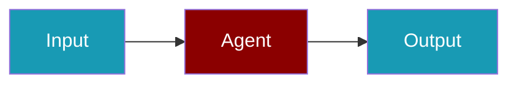

# TUI CLI Commands

Complete reference for all TUI-related CLI commands.

## Quick Start

<Steps>
<Step title="Launch the TUI">

```bash
praisonai tui launch --model gpt-4
```

</Step>

<Step title="Run a headless simulation">

```bash
praisonai tui simulate test_script.yaml --assert
```

</Step>
</Steps>

## praisonai tui

Main TUI command group for interactive terminal interface.

### launch

Launch the interactive TUI.

```bash
praisonai tui launch [OPTIONS]
```

**Options:**

| Option | Short | Description |
|--------|-------|-------------|
| `--workspace` | `-w` | Workspace directory |
| `--session` | `-s` | Resume session ID |
| `--model` | `-m` | Default model |
| `--debug` | `-d` | Enable debug overlays |
| `--log-jsonl` | | Write events to JSONL file |
| `--profile` | | Enable performance profiling |

**Examples:**

```bash
# Basic launch
praisonai tui launch

# Launch with specific model
praisonai tui launch --model gpt-4

# Resume a session
praisonai tui launch --session abc123

# Launch with debug logging
praisonai tui launch --debug --log-jsonl ./events.jsonl
```

### simulate

Run a headless TUI simulation script for testing.

```bash
praisonai tui simulate SCRIPT [OPTIONS]
```

**Arguments:**

| Argument | Description |
|----------|-------------|
| `SCRIPT` | Path to simulation script (YAML/JSON) |

**Options:**

| Option | Description |
|--------|-------------|
| `--mock/--real-llm` | Use mock provider (default) or real LLM |
| `--pretty/--jsonl` | Output format |
| `--assert` | Validate expected outcomes |
| `--timeout` | Max execution time (default: 60s) |

**Examples:**

```bash
# Run simulation with mock provider
praisonai tui simulate test_script.yaml

# Run with real LLM (requires PRAISONAI_REAL_LLM=1)
PRAISONAI_REAL_LLM=1 praisonai tui simulate test_script.yaml --real-llm

# Run with assertions
praisonai tui simulate test_script.yaml --assert
```

### snapshot

Print a TUI-like snapshot of current state.

```bash
praisonai tui snapshot [OPTIONS]
```

**Options:**

| Option | Short | Description |
|--------|-------|-------------|
| `--session` | `-s` | Filter by session ID |
| `--run` | `-r` | Filter by run ID |
| `--json` | `-j` | Output as JSON |

**Examples:**

```bash
# Get current snapshot
praisonai tui snapshot

# Get snapshot for specific session
praisonai tui snapshot --session abc123

# Get JSON output
praisonai tui snapshot --json
```

### trace

Replay events from persistence like a timeline.

```bash
praisonai tui trace ID [OPTIONS]
```

**Arguments:**

| Argument | Description |
|----------|-------------|
| `ID` | Session or run ID to trace |

**Options:**

| Option | Short | Description |
|--------|-------|-------------|
| `--follow` | `-f` | Follow new events |
| `--limit` | `-n` | Max events to show (default: 50) |

**Examples:**

```bash
# Trace a session
praisonai tui trace abc123

# Follow events in real-time
praisonai tui trace abc123 --follow

# Limit to last 10 events
praisonai tui trace abc123 --limit 10
```

## praisonai queue

Queue management commands.

### ls

List queued runs.

```bash
praisonai queue ls [OPTIONS]
```

**Options:**

| Option | Short | Description |
|--------|-------|-------------|
| `--state` | `-s` | Filter by state (queued, running, succeeded, failed, cancelled) |
| `--session` | | Filter by session ID |
| `--limit` | `-n` | Maximum results (default: 20) |
| `--json` | `-j` | Output as JSON |

**Examples:**

```bash
# List all runs
praisonai queue ls

# List only running
praisonai queue ls --state running

# List with JSON output
praisonai queue ls --json
```

### cancel

Cancel a queued or running run.

```bash
praisonai queue cancel RUN_ID
```

**Arguments:**

| Argument | Description |
|----------|-------------|
| `RUN_ID` | Run ID to cancel (partial match supported) |

**Examples:**

```bash
# Cancel by full ID
praisonai queue cancel abc12345

# Cancel by partial ID
praisonai queue cancel abc1
```

### retry

Retry a failed run.

```bash
praisonai queue retry RUN_ID
```

**Arguments:**

| Argument | Description |
|----------|-------------|
| `RUN_ID` | Run ID to retry |

**Examples:**

```bash
praisonai queue retry abc12345
```

### clear

Clear all queued runs.

```bash
praisonai queue clear [OPTIONS]
```

**Options:**

| Option | Short | Description |
|--------|-------|-------------|
| `--force` | `-f` | Skip confirmation |

**Examples:**

```bash
# Clear with confirmation
praisonai queue clear

# Force clear
praisonai queue clear --force
```

### stats

Show queue statistics.

```bash
praisonai queue stats [OPTIONS]
```

**Options:**

| Option | Description |
|--------|-------------|
| `--session` | Filter by session ID |

**Examples:**

```bash
# Show all stats
praisonai queue stats

# Show stats for session
praisonai queue stats --session abc123
```

## Environment Variables

| Variable | Description |
|----------|-------------|
| `PRAISONAI_REAL_LLM` | Set to `1` to enable real LLM in simulations |
| `PRAISONAI_TUI_DEBUG` | Set to `1` to enable debug mode |
| `PRAISONAI_TUI_JSONL` | Path for JSONL event logging |

## Best Practices

<AccordionGroup>
  <Accordion title="Use simulation flags in CI">
    Run `praisonai simulate` with mock providers to avoid live API spend in pipelines.
  </Accordion>
  <Accordion title="Enable JSONL logging for audits">
    Set `PRAISONAI_TUI_JSONL` when you need structured event replay after failures.
  </Accordion>
  <Accordion title="Keep debug mode off in production">
    `PRAISONAI_TUI_DEBUG=1` is for local troubleshooting only — it adds verbose noise.
  </Accordion>
  <Accordion title="Document slash commands for your team">
    Share a cheatsheet of `/context`, queue, and simulate commands so operators behave consistently.
  </Accordion>
</AccordionGroup>

## Related

<CardGroup cols={2}>
<Card title="TUI Overview" icon="terminal" href="/docs/features/tui/overview">
  Interactive terminal interface
</Card>
<Card title="TUI Simulation" icon="flask-vial" href="/docs/features/tui/simulation">
  Headless testing and CI
</Card>
</CardGroup>
