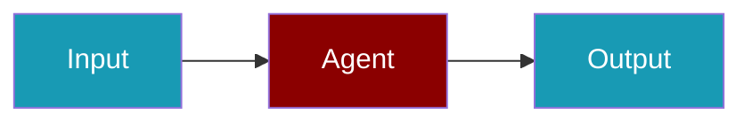

# PraisonAI TUI

The PraisonAI TUI (Terminal User Interface) provides an app-like interactive experience for running AI agents directly in your terminal. Built with [Textual](https://textual.textualize.io/), it offers a modern, responsive interface with streaming output, queue management, and session persistence.

## Features

- **Event-loop driven UI** - Always-active input, non-blocking operations
- **Multi-pane layout** - Chat history, status bar, queue panel, tool execution
- **Streaming output** - Token-by-token display with backpressure handling
- **Queue management** - Submit multiple tasks, cancel, retry, priority ordering
- **Session persistence** - Resume sessions after crashes
- **Slash commands** - Quick actions like `/help`, `/model`, `/cost`
- **Keyboard shortcuts** - Efficient navigation and control

## Quick Start

<Steps>
<Step title="Launch the TUI">

```bash
praisonai tui launch
```

</Step>

<Step title="Launch with options">

```bash
praisonai tui launch --model gpt-4 --workspace ./my-project
```

</Step>
</Steps>

## Installation

TUI is included by default with PraisonAI:

```bash
pip install praisonai
```

For a minimal installation without TUI:

```bash
pip install praisonai[lite]
```

## Architecture

The TUI is built on a clean separation of concerns:

```
┌─────────────────────────────────────────────────────────┐
│                    TUI Application                       │
│  ┌─────────┐ ┌─────────┐ ┌─────────┐ ┌─────────┐       │
│  │  App    │ │ Widgets │ │ Screens │ │ Events  │       │
│  └────┬────┘ └────┬────┘ └────┬────┘ └────┬────┘       │
│       └───────────┴───────────┴───────────┘             │
│                         │                               │
│  ┌─────────────────────┴─────────────────────┐         │
│  │         Event Bus / Message Queue          │         │
│  └─────────────────────┬─────────────────────┘         │
│                         │                               │
│  ┌─────────┐ ┌─────────┴─────────┐ ┌─────────┐         │
│  │ Queue   │ │ Worker Pool       │ │ Persist │         │
│  │ Manager │ │ (Agent Runners)   │ │ Layer   │         │
│  └─────────┘ └───────────────────┘ └─────────┘         │
└─────────────────────────────────────────────────────────┘
```

## Key Components

### Widgets

| Widget | Description |
|--------|-------------|
| `ChatWidget` | Displays chat history with streaming support |
| `ComposerWidget` | Input area with slash command detection |
| `StatusWidget` | Status bar showing session, model, tokens, cost |
| `QueuePanelWidget` | Queue display with cancel/retry actions |
| `ToolPanelWidget` | Tool execution status and approvals |

### Screens

| Screen | Description |
|--------|-------------|
| `MainScreen` | Primary chat interface |
| `QueueScreen` | Queue management |
| `SettingsScreen` | Configuration |
| `SessionScreen` | Session browser |

## Keyboard Shortcuts

| Key | Action |
|-----|--------|
| `Ctrl+Enter` | Send message |
| `Ctrl+C` | Cancel current run |
| `Ctrl+Q` | Quit TUI |
| `Ctrl+L` | Clear screen |
| `F1` | Show help |
| `F2` | Toggle queue panel |
| `F3` | Open settings |
| `/` | Start slash command |

## Best Practices

<AccordionGroup>
  <Accordion title="Learn keyboard shortcuts early">
    `Ctrl+Enter` to send and `F2` for the queue panel speed up daily terminal workflows.
  </Accordion>
  <Accordion title="Use the queue for long runs">
    Enqueue heavy tasks instead of blocking the interactive session.
  </Accordion>
  <Accordion title="Clear the screen between scenarios">
    `Ctrl+L` resets the view when switching test cases or agents.
  </Accordion>
  <Accordion title="Pair TUI with simulation in CI">
    Script headless runs for regression tests; use the interactive TUI for exploration.
  </Accordion>
</AccordionGroup>

## Related

<CardGroup cols={2}>
<Card title="TUI Commands" icon="command" href="/docs/features/tui/commands">
  CLI commands reference
</Card>
<Card title="Queue System" icon="list-check" href="/docs/features/tui/queue">
  Queue management details
</Card>
</CardGroup>
