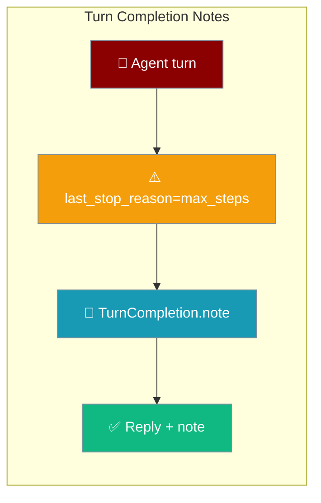
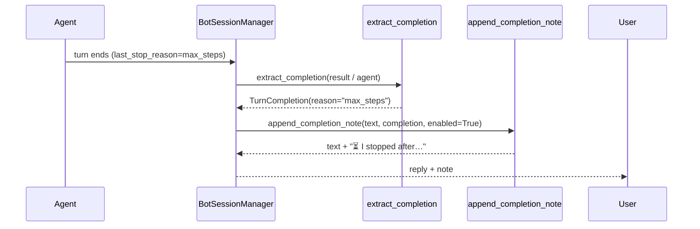

Turn a coarse `last_stop_reason` into a concise, user-safe note so a chat user learns *why* a turn stopped early — instead of getting a silently truncated or empty reply.



A deep-research agent hits its step limit; instead of a truncated answer, the reply ends with `⏳ I stopped after reaching the step limit — reply "continue" to carry on.`

```python
from praisonaiagents import Agent
from praisonai.bots import BotSessionManager

agent = Agent(
    name="Deep Researcher",
    instructions="Do multi-step web research and summarise findings.",
    max_steps=20,  # long budget — truncation is possible
)

# Opt in on the session manager: tell the user *why* if a turn stops early.
session = BotSessionManager(
    platform="telegram",
    surface_completion_reason=True,
)
# When the agent hits its step budget, the reply ends with the completion note.
reply = await session.chat(agent, user_id="123", prompt="Research X in depth")
```

<Note>
`surface_completion_reason` is a **`BotSessionManager`** constructor parameter — not a `BotConfig` field. Enable it where the session manager is built.
</Note>

## Quick Start

<Steps>
<Step title="Enable the notes on the gateway">
Construct the session manager with `surface_completion_reason=True`. Clean `completed` turns still surface nothing.

```python
from praisonai.bots import BotSessionManager

session = BotSessionManager(
    platform="telegram",
    surface_completion_reason=True,  # append the note when a turn stops early
)
```
</Step>

<Step title="Customise a note per turn">
Override the default note for a turn by returning an `AgentReply` with a `TurnCompletion` that carries `detail`.

```python
from praisonaiagents.bots import AgentReply, TurnCompletion

reply = AgentReply(
    text="Here's what I found so far.",
    completion=TurnCompletion(
        reason="max_steps",
        detail="Long research task — reply 'continue' to keep going.",
    ),
)
```
</Step>
</Steps>

---

## How It Works

After each turn the session manager reads the agent's `last_stop_reason`, wraps it in a `TurnCompletion`, and — when enabled — appends the note to the reply.



`extract_completion` recognises an `AgentReply` with a `completion`, a serialised dict, or any object exposing `completion` / `last_stop_reason` (including a bare `Agent`). `append_completion_note` returns the text unchanged when disabled, when there is no completion, or when the turn completed cleanly.

---

## Reasons and Default Notes

`TurnCompletion.note()` maps each stop reason to a user-safe message. A clean completion is intentionally silent.

| `reason` | Note surfaced to the user |
|----------|---------------------------|
| `completed` | *(nothing — clean completion is silent)* |
| `max_steps` | `⏳ I stopped after reaching the step limit — reply "continue" to carry on.` |
| `cancelled` | `🛑 This turn was interrupted before it finished — send it again to retry.` |
| `error` | `⚠️ This turn ended early due to an error — please try again.` |
| *(unknown/new)* | `⏳ This turn ended early — please try again.` |

---

## Configuration Options

| Setting | Type | Default | Description |
|---------|------|---------|-------------|
| `surface_completion_reason` | `bool` | `False` | On `BotSessionManager`. Opt in to append the completion note to gateway replies. Clean `completed` turns still surface nothing. |

`TurnCompletion` and `append_completion_note` take these fields:

| Field / Argument | Type | Default | Description |
|------------------|------|---------|-------------|
| `TurnCompletion.reason` | `str` | `"completed"` | Stop reason (`completed \| max_steps \| cancelled \| error`; unknown tolerated). |
| `TurnCompletion.detail` | `str` | `""` | Optional user-safe override for the default note. |
| `append_completion_note(..., enabled=)` | `bool` | `False` | Off by default — returns the text untouched unless enabled. |

<Note>
Off by default: existing deployments and clean completions are byte-for-byte unchanged.
</Note>

---

## Common Patterns

Long research agents with a high `max_steps` — enable the note so `"continue"` becomes a discoverable UX:

```python
agent = Agent(name="Researcher", instructions="Deep multi-step research.", max_steps=20)
session = BotSessionManager(platform="telegram", surface_completion_reason=True)
# Hits the budget → reply ends with the "reply continue" note.
```

Cancellation UX — the user hits `/stop` and sees the cancelled note instead of no reply:

```python
# reason="cancelled" → "🛑 This turn was interrupted before it finished — send it again to retry."
```

Error transparency — the user sees the error note and can retry without opening a ticket:

```python
# reason="error" → "⚠️ This turn ended early due to an error — please try again."
```

---

## Best Practices

<AccordionGroup>
<Accordion title="Leave off for internal bots">
Enable it for public-facing gateways. Internal bots often prefer silence, so keep the default `False` there.
</Accordion>

<Accordion title="Use detail to stay on-brand">
`TurnCompletion.detail` overrides the default note per turn — use it to keep messages localised and on-brand.
</Accordion>

<Accordion title="Happy paths stay quiet">
Notes never surface on a clean completion, so enabling this adds no noise to successful turns.
</Accordion>

<Accordion title="Pair with max_steps">
Combine with the step-limit docs so users understand the "reply continue" flow when a turn hits its budget.
</Accordion>
</AccordionGroup>

---

## Related

<CardGroup cols={2}>
<Card title="Max Steps" icon="list-check" href="/features/max-steps">
  Cap tool-use steps and detect graceful truncation with `last_stop_reason`.
</Card>
<Card title="Error Handling" icon="triangle-exclamation" href="/features/error-handling">
  Detect and recover from turns that end early with `last_stop_reason`.
</Card>
</CardGroup>
