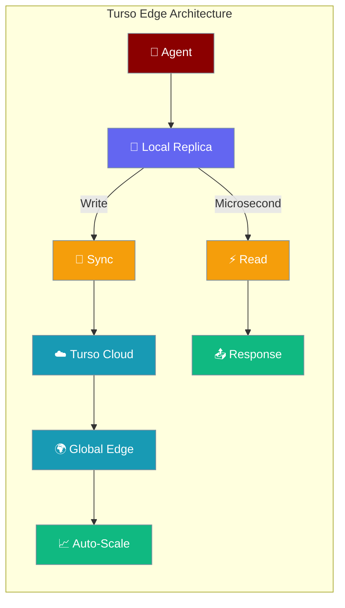

Turso provides SQLite-compatible databases at the edge with embedded replicas, delivering microsecond reads and global distribution for your AI agents.



## Quick Start

<Steps>
<Step title="Get Turso Credentials">
1. Install Turso CLI: `curl -sSfL https://get.tur.so/install.sh | bash`
2. Create database: `turso db create mydb`
3. Get credentials:
```bash
turso db show mydb --url
turso db tokens create mydb
```

Set environment variables:
```bash
export TURSO_DATABASE_URL="libsql://mydb-user.turso.io"  
export TURSO_AUTH_TOKEN="eyJhbGci..."
```
</Step>

<Step title="Create Edge Agent">
```python
from praisonaiagents import Agent

agent = Agent(
    name="Edge Agent",
    instructions="You are a fast AI assistant with edge persistence.",
    db={
        "database_url": "libsql://mydb-user.turso.io",
        "auth_token": "eyJhbGci..."
    }
)

# Microsecond reads from local replica
result = agent.start("I need responses with minimal latency")
print(result)
```
</Step>

<Step title="Test Edge Performance">
```python
import time

# Time a conversation round-trip
start = time.perf_counter()
result = agent.start("What's the quickest database option?")
end = time.perf_counter()

print(f"Response time: {(end - start) * 1000:.1f}ms")
print(f"Agent: {result}")
# Typically 1-5ms for local reads
```
</Step>
</Steps>

---

## Installation

<Tabs>
<Tab title="pip">
```bash
# Install with Turso/libSQL support
pip install "praisonai[turso]"
```
</Tab>

<Tab title="Environment Variables">
```bash
# Required for remote sync
export TURSO_DATABASE_URL="libsql://mydb-user.turso.io"
export TURSO_AUTH_TOKEN="eyJhbGci..."

# Optional
export OPENAI_API_KEY="sk-..."
```
</Tab>
</Tabs>

---

## Connection Modes

### Embedded Replica (Recommended)

Local SQLite file syncs with remote Turso server:

```python
from praisonai.persistence.conversation.turso import TursoConversationStore

store = TursoConversationStore(
    url="libsql://mydb-user.turso.io",
    auth_token="eyJhbGci...",
    local_path="agent_replica.db",  # Local SQLite file
    sync_on_write=True  # Sync to remote after writes
)

# Reads are microsecond-fast from local file
# Writes sync to global edge network
```

### Remote Only

Direct connection to Turso edge:

```python
store = TursoConversationStore(
    url="libsql://mydb-user.turso.io", 
    auth_token="eyJhbGci...",
    local_path=None  # No local replica
)

# All operations go to remote - higher latency but always consistent
```

### Local Only

Pure local SQLite for development:

```python
store = TursoConversationStore(
    url=None,  # No remote sync
    local_path="dev_agent.db"
)

# Fastest possible - no network calls
# Perfect for development and testing
```

---

## Configuration Options

| Option | Type | Default | Description |
|--------|------|---------|-------------|
| `url` | `str` | `None` | Turso database URL (`libsql://...`) |
| `auth_token` | `str` | `None` | Turso authentication token |
| `local_path` | `str` | `"praisonai_turso.db"` | Local SQLite replica file |
| `sync_on_write` | `bool` | `True` | Sync to remote after writes |
| `auto_create_tables` | `bool` | `True` | Create conversation tables |

---

## Usage Patterns

### Using Convenience Class

```python
from praisonai.db.adapter import TursoDB
from praisonaiagents import Agent

# Auto-reads TURSO_DATABASE_URL and TURSO_AUTH_TOKEN
db = TursoDB()
agent = Agent(name="Edge Agent", db=db)
```

### Multi-Region Setup

```python
# Primary region
primary_db = TursoDB(
    database_url="libsql://primary-us-east.turso.io",
    auth_token="eyJ...",
    local_path="primary_replica.db"
)

# Secondary region  
secondary_db = TursoDB(
    database_url="libsql://secondary-eu-west.turso.io", 
    auth_token="eyJ...",
    local_path="secondary_replica.db"
)

# Use closest database for lowest latency
agent = Agent(name="Global Agent", db=primary_db)
```

### Full Lifecycle with Edge Performance

```python
import os
import time
from praisonai import ManagedAgent, LocalManagedConfig
from praisonai.db.adapter import TursoDB
from praisonaiagents import Agent

# Phase 1: Create edge agent
db = TursoDB(
    database_url=os.environ["TURSO_DATABASE_URL"],
    auth_token=os.environ["TURSO_AUTH_TOKEN"],
    local_path="edge_agent_replica.db"
)

managed = ManagedAgent(
    provider="local",
    db=db, 
    config=LocalManagedConfig(
        model="gpt-4o-mini",
        name="Turso Edge Agent",
        system="You are a high-performance AI assistant with edge database."
    )
)

agent = Agent(name="User", backend=managed)

# Store facts with performance timing
start = time.perf_counter()
result1 = agent.run("Remember: I'm building a real-time multiplayer game")
sync_time = time.perf_counter() - start
print(f"Write + sync time: {sync_time * 1000:.1f}ms")
print(f"Agent: {result1}")

# Fast read from local replica
start = time.perf_counter() 
result2 = agent.run("What am I building?")
read_time = time.perf_counter() - start
print(f"Read time: {read_time * 1000:.1f}ms")  # Typically < 5ms
print(f"Agent: {result2}")

# Phase 2: Save session
session_data = managed.save_ids()
del agent, managed, db

# Phase 3: Resume from replica (instant)
db2 = TursoDB()  # Uses environment variables
managed2 = ManagedAgent(provider="local", db=db2)
managed2.resume_session(session_data["session_id"]) 

agent2 = Agent(name="User", backend=managed2)
start = time.perf_counter()
result3 = agent2.run("What type of game requires real-time performance?")
resume_time = time.perf_counter() - start
print(f"Resume read time: {resume_time * 1000:.1f}ms")
print(f"Resumed Agent: {result3}")
```

---

## Turso-Specific Features

### Manual Sync Control

Control when local replica syncs to remote:

```python
from praisonai.persistence.conversation.turso import TursoConversationStore

store = TursoConversationStore(
    url="libsql://mydb.turso.io",
    auth_token="eyJ...",
    sync_on_write=False  # Manual sync control
)

# Batch multiple operations
store.create_session(session1)
store.add_message(session_id, message1)
store.add_message(session_id, message2)

# Sync all changes at once
store._sync()
```

### Database Scaling

Turso automatically scales to handle traffic:

```bash
# Monitor database metrics
turso db show mydb --metrics

# View recent usage
turso db show mydb --usage
```

### Global Replication

Create replicas in multiple regions:

```bash
# Add replica in Europe
turso db replicate mydb --region fra

# Add replica in Asia  
turso db replicate mydb --region nrt

# List all replicas
turso db show mydb --replicas
```

```python
# Connect to closest replica automatically
agent = Agent(
    name="Global Agent",
    db={
        "database_url": "libsql://mydb-user.turso.io",  # Closest replica chosen automatically
        "auth_token": "eyJ..."
    }
)
```

---

## Best Practices

<AccordionGroup>
<Accordion title="Optimize for Edge Performance">
Use embedded replicas for fastest reads:

```python
from praisonai.db.adapter import TursoDB

# Embedded replica: microsecond reads, durable writes
db = TursoDB(
    local_path="fast_agent_replica.db",  # Local SSD storage
    sync_on_write=True  # Immediate durability
)

# For highest performance, batch writes
store = TursoConversationStore(sync_on_write=False)
# ... multiple operations ...
store._sync()  # Single sync operation
```
</Accordion>

<Accordion title="Handle Network Partitions">
Embedded replicas continue working during network outages:

```python
# Agent keeps working even if network fails
agent = Agent(
    name="Resilient Agent",
    instructions="You work offline with local replica.",
    db=TursoDB(local_path="offline_replica.db")
)

# Reads always work from local file
# Writes queue for next sync when network returns
```
</Accordion>

<Accordion title="Monitor Replica Size">
Local replicas grow with conversation history:

```python
import os

replica_path = "agent_replica.db"
if os.path.exists(replica_path):
    size_mb = os.path.getsize(replica_path) / 1024 / 1024
    print(f"Replica size: {size_mb:.1f}MB")
    
    # Archive old conversations if replica gets large
    if size_mb > 100:  # 100MB threshold
        # Implement archiving logic
        pass
```
</Accordion>

<Accordion title="Use Multiple Databases">
Separate different data types for optimal performance:

```python
# Separate DBs for different purposes
conversation_db = TursoDB(
    database_url="libsql://conversations.turso.io",
    local_path="conversations.db"
)

analytics_db = TursoDB(
    database_url="libsql://analytics.turso.io", 
    local_path="analytics.db"
)

# Agent uses conversation DB, analytics service uses analytics DB
agent = Agent(name="Chat Agent", db=conversation_db)
```
</Accordion>
</AccordionGroup>

---

## Environment Variables

| Variable | Required | Format | Example |
|----------|----------|--------|---------|
| `TURSO_DATABASE_URL` | ✅ | `libsql://db-user.turso.io` | `libsql://mydb-user.turso.io` |
| `TURSO_AUTH_TOKEN` | ✅ | JWT token | `eyJhbGciOiJFZERTQS...` |
| `OPENAI_API_KEY` | ✅ | `sk-...` | `sk-1234567890abcdef...` |

---

## Performance Comparison

| Operation | Turso Replica | Remote Only | Local Only |
|-----------|---------------|-------------|------------|
| **Read** | < 5ms | 20-100ms | < 1ms |
| **Write** | 5-50ms | 20-150ms | < 1ms |
| **Consistency** | Eventually | Strong | None |
| **Offline** | ✅ | ❌ | ✅ |

---

## Troubleshooting

### Sync Failures

If replica sync fails:

```python
# Check connection and retry sync manually
try:
    store._sync()
    print("Sync successful")
except Exception as e:
    print(f"Sync failed: {e}")
    # Continue with local operations
```

### Token Expiration  

Turso tokens can expire. Regenerate them:

```bash
# Create new token
turso db tokens create mydb

# Update environment variable
export TURSO_AUTH_TOKEN="new-token-here"
```

### Replica File Permissions

Ensure local replica file is writable:

```python
import os
replica_path = "agent_replica.db"

# Check if directory is writable
if not os.access(os.path.dirname(replica_path) or ".", os.W_OK):
    print("Directory not writable!")
```

---

## Related

<CardGroup cols={2}>
<Card title="Cloud Databases Overview" icon="cloud" href="/docs/features/cloud-databases">
  Compare all cloud database providers
</Card>
<Card title="Local SQLite" icon="database" href="/docs/features/local-databases">
  Pure local SQLite for development
</Card>
</CardGroup>