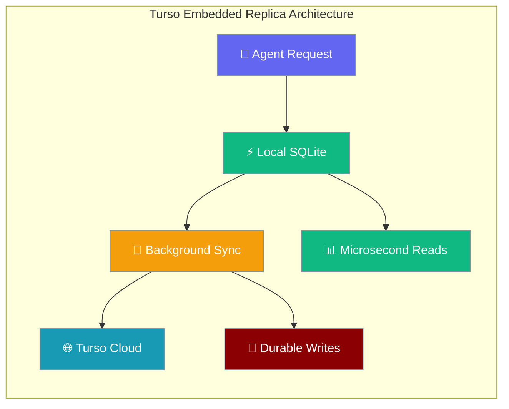
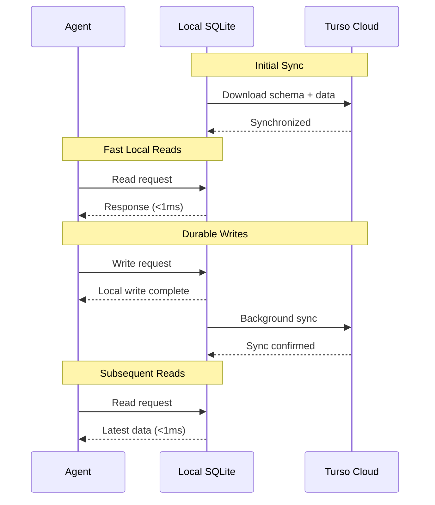
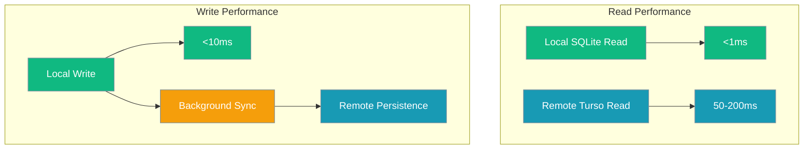

Turso provides SQLite-at-the-edge with **embedded replicas** — a local SQLite file syncs to a remote Turso server, giving microsecond reads locally and durable writes to the cloud.



## Quick Start

<Steps>
<Step title="Create Turso Database">
```bash
# Install Turso CLI
curl -sSfL https://get.tur.so/install.sh | bash

# Create database
turso db create praisonai-db

# Get connection details
turso db show praisonai-db --url
turso db tokens create praisonai-db
```
</Step>

<Step title="Set Environment Variables">
```bash
export TURSO_DATABASE_URL="libsql://mydb-user.turso.io"
export TURSO_AUTH_TOKEN="eyJhbGciOiJFZERTQS..."
```
</Step>

<Step title="Install Dependencies">
```bash
pip install "praisonai[turso]"
```
</Step>

<Step title="Create Agent with Turso">
```python
from praisonaiagents import Agent
from praisonai.db.adapter import TursoDB

# Auto-reads TURSO_DATABASE_URL + TURSO_AUTH_TOKEN
db = TursoDB()
agent = Agent(
    name="Turso Edge Agent",
    instructions="You are a helpful assistant with edge-optimized persistence.",
    memory=True,
    db=db
)

result = agent.start("Remember: I'm using Turso with embedded replicas for edge performance.")
print(result)
```
</Step>
</Steps>

---

## How It Works



| Feature | Local SQLite | Turso Cloud | Combined |
|---------|-------------|-------------|----------|
| **Read Speed** | Microseconds | Network latency | Microsecond local reads |
| **Write Durability** | Local only | Globally durable | Local + cloud backup |
| **Availability** | Offline capable | High availability | Best of both |

---

## Connection Modes

<Tabs>
<Tab title="Embedded Replica (Recommended)">
```python
from praisonai.db.adapter import TursoDB

# Local SQLite + remote sync (fastest reads)
db = TursoDB(
    database_url="libsql://mydb-user.turso.io",
    turso_auth_token="your-token"
    # Creates local_replica.db automatically
)
```
</Tab>

<Tab title="Remote Only">
```python
from praisonai.persistence.conversation.turso import TursoConversationStore

# Direct connection to Turso (no local file)
store = TursoConversationStore(
    url="libsql://mydb-user.turso.io",
    auth_token="your-token",
    local_path=":memory:",  # No local persistence
    sync_on_write=False
)
```
</Tab>

<Tab title="Local Only (Testing)">
```python
# Pure local SQLite for development/testing
store = TursoConversationStore(
    local_path="test.db",
    # No URL or auth_token = local only
)
```
</Tab>
</Tabs>

---

## Full Lifecycle Example

```python
#!/usr/bin/env python3
"""
Turso/libSQL — Full Lifecycle with Embedded Replica.

Uses local SQLite file that syncs to Turso cloud.
Microsecond reads locally, durable writes to the edge.
"""
import os
import sys

if not os.getenv("TURSO_DATABASE_URL") or not os.getenv("TURSO_AUTH_TOKEN"):
    sys.exit("ERROR: TURSO_DATABASE_URL and TURSO_AUTH_TOKEN not set.")

from praisonai import ManagedAgent, LocalManagedConfig, DB
from praisonai.db.adapter import TursoDB
from praisonaiagents import Agent

# ── Phase 1: Create agent with Turso ──
print("=== Phase 1: Turso Embedded Replica ===")
db = TursoDB()  # Reads TURSO_DATABASE_URL + TURSO_AUTH_TOKEN
managed = ManagedAgent(
    provider="local", db=db,
    config=LocalManagedConfig(
        model="gpt-4o-mini",
        name="Turso Edge Agent",
        system="You are a helpful assistant. Remember all facts.",
    ),
)
agent = Agent(name="User", backend=managed)

result1 = agent.run("Remember: I'm using Turso with embedded replicas for edge performance. Confirm.")
print(f"Agent: {result1[:200]}")

result2 = agent.run("Also: Turso syncs local SQLite to the cloud automatically. Confirm.")
print(f"Agent: {result2[:200]}")

# ── Phase 2: Simulate idle ──
print("\n=== Phase 2: Simulate Idle ===")
saved_ids = managed.save_ids()
del agent, managed, db

# ── Phase 3: Resume ──
print("\n=== Phase 3: Resume from Turso ===")
db2 = TursoDB()
managed2 = ManagedAgent(provider="local", db=db2)
managed2.resume_session(saved_ids["session_id"])
agent2 = Agent(name="User", backend=managed2)

result3 = agent2.run("What database technology am I using and how does it work?")
print(f"Agent: {result3[:300]}")

# ── Phase 4: Validate ──
print("\n=== Validation ===")
r = result3.lower()
checks = {
    "Remembers Turso": "turso" in r,
    "Remembers embedded replicas": "replica" in r or "sqlite" in r or "sync" in r,
    "Session continuity": managed2.session_id == saved_ids["session_id"],
}
for check, ok in checks.items():
    print(f"  [{'PASS' if ok else 'FAIL'}] {check}")
```

---

## YAML Configuration

```yaml
# turso-workflow.yaml
name: Turso Edge Agent Workflow
description: Agent workflow with Turso/libSQL edge persistence

workflow:
  verbose: true

persistence:
  backend: turso
  database_url: ${TURSO_DATABASE_URL}
  auth_token: ${TURSO_AUTH_TOKEN}

agents:
  analyst:
    name: Edge Analyst
    instructions: "You analyze data with edge-fast persistence."

steps:
  - agent: analyst
    action: "Analyze: {{input}}"
```

---

## Configuration Options

| Variable | Required | Description |
|----------|----------|-------------|
| `TURSO_DATABASE_URL` | Yes | libSQL URL from `turso db show` |
| `TURSO_AUTH_TOKEN` | Yes | Auth token from `turso db tokens create` |
| `OPENAI_API_KEY` | Yes | For the LLM agent |

<Tabs>
<Tab title="Environment Variables">
```bash
export TURSO_DATABASE_URL="libsql://mydb-user.turso.io"
export TURSO_AUTH_TOKEN="eyJhbGciOiJFZERTQS..."
export OPENAI_API_KEY="your-openai-key"
```
</Tab>

<Tab title="Advanced Configuration">
```python
from praisonai.persistence.conversation.turso import TursoConversationStore

store = TursoConversationStore(
    url="libsql://mydb-user.turso.io",
    auth_token="your-token",
    local_path="custom_replica.db",  # Custom local file
    sync_on_write=True,              # Sync after writes
    auto_create_tables=True          # Create schema automatically
)
```
</Tab>

<Tab title="Performance Tuning">
```python
# Optimize for different usage patterns
store = TursoConversationStore(
    # Read-heavy workload (sync less frequently)
    sync_on_write=False,  # Sync manually or periodically
    
    # Write-heavy workload (sync immediately)
    sync_on_write=True,   # Ensures durability
    
    # Development (local only)
    url=None,             # No remote sync
    local_path="dev.db"
)
```
</Tab>
</Tabs>

---

## Performance Characteristics



| Operation | Embedded Replica | Remote Only | Local Only |
|-----------|------------------|-------------|------------|
| **Read Latency** | <1ms | 50-200ms | <1ms |
| **Write Durability** | Cloud + Local | Cloud only | Local only |
| **Offline Capability** | ✅ Reads only | ❌ None | ✅ Full |
| **Global Distribution** | ✅ via Turso | ✅ via Turso | ❌ None |

---

## Best Practices

<AccordionGroup>
<Accordion title="Choose the Right Mode">
Use embedded replicas for read-heavy workloads and offline capability. Use remote-only for serverless functions.
```python
# Read-heavy applications → Embedded replica
db = TursoDB(sync_on_write=True)

# Serverless functions → Remote only
db = TursoDB(local_path=":memory:", sync_on_write=False)
```
</Accordion>

<Accordion title="Sync Strategy">
Configure sync frequency based on durability vs performance requirements.
```python
# High durability (sync every write)
store = TursoConversationStore(sync_on_write=True)

# High performance (sync manually/periodically)
store = TursoConversationStore(sync_on_write=False)
# Later: store._sync()  # Manual sync
```
</Accordion>

<Accordion title="Error Handling">
Handle sync failures gracefully in your application.
```python
# Sync failures are logged but don't block operations
# Local data remains available even if sync fails
db = TursoDB()  # Built-in error handling
```
</Accordion>

<Accordion title="Multi-Region Deployment">
Turso automatically replicates to the nearest edge locations for global performance.
```python
# Data is automatically replicated to edge locations
# No additional configuration needed
db = TursoDB()  # Global edge replication included
```
</Accordion>
</AccordionGroup>

---

## SQLite Compatibility

Turso is SQLite-compatible, supporting:

- Standard SQL syntax and functions
- Indexes, triggers, and views
- Foreign keys and constraints
- JSON functions (SQLite JSON1 extension)
- Full-text search (FTS5)

**Limitations:**
- No custom extensions
- No WAL mode (handled by Turso)
- File size limits (contact Turso for large databases)

---

## Related

<CardGroup cols={2}>
<Card title="Cloud Databases Overview" icon="cloud" href="cloud-databases">
  Compare all cloud database providers
</Card>

<Card title="SQLite Local Storage" icon="database" href="sqlite">
  Local SQLite configuration
</Card>
</CardGroup>