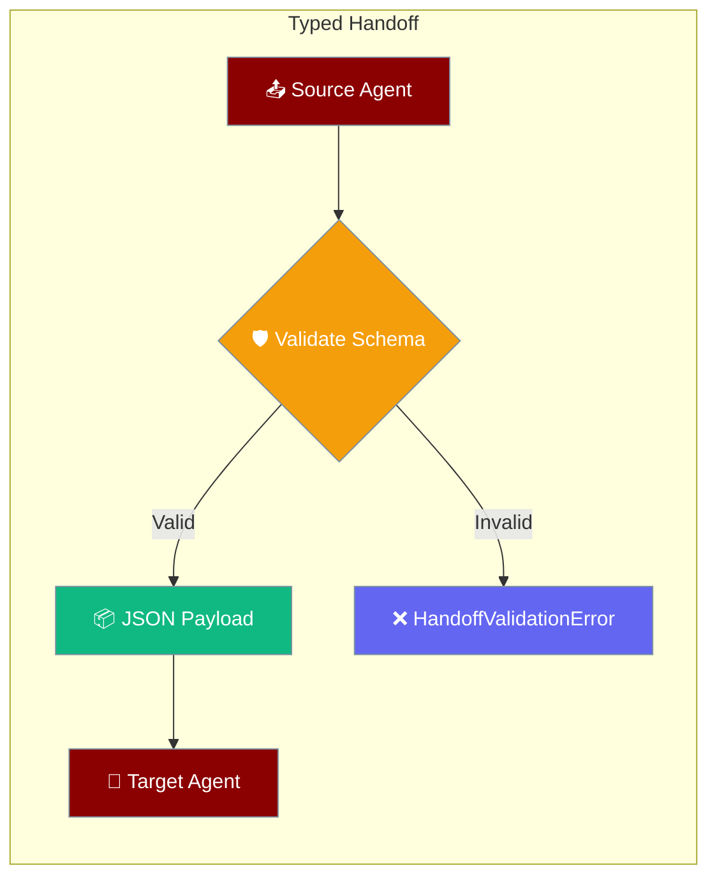
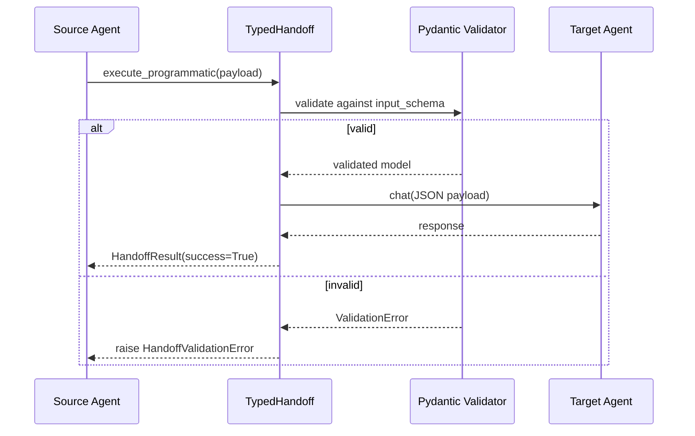

Schema-validated handoffs ensure data integrity between agents using Pydantic models, raising validation errors immediately instead of producing incorrect LLM output.



## Quick Start

<Steps>
<Step title="Define Schema + Create TypedHandoff">
```python
from pydantic import BaseModel
from praisonaiagents import Agent, TypedHandoff

class ResearchResult(BaseModel):
    summary: str
    citations: list[str]
    confidence: float

writer = Agent(name="Writer", instructions="Write articles from research.")
researcher = Agent(name="Researcher", instructions="Research topics.")

handoff = TypedHandoff(agent=writer, input_schema=ResearchResult)
```
</Step>

<Step title="Execute with Validated Payload">
```python
payload = ResearchResult(
    summary="AI safety research findings",
    citations=["paper-1", "paper-2"],
    confidence=0.92,
)
result = handoff.execute_programmatic(researcher, payload)
print(result.response)
```
</Step>

<Step title="Invalid Payload Raises Immediately">
```python
from praisonaiagents import HandoffValidationError

try:
    handoff.execute_programmatic(researcher, {"summary": "x", "citations": "not-a-list"})
except HandoffValidationError as e:
    print(e.validation_errors)
```
</Step>
</Steps>

---

## How It Works



| Step | Description |
|------|-------------|
| **Validation** | Payload validated against Pydantic schema |
| **Serialization** | Valid payload converted to structured JSON |
| **Handoff** | Target agent receives formatted JSON context |
| **Error Handling** | Schema mismatches raise `HandoffValidationError` |

---

## Configuration

| Parameter | Type | Default | Description |
|-----------|------|---------|-------------|
| `agent` | `Agent` | Required | Target agent to hand off to |
| `input_schema` | `Type[BaseModel]` | Required | Pydantic model class for validation |
| `tool_name_override` | `str` | `None` | Custom tool name |
| `tool_description_override` | `str` | `None` | Custom tool description |
| `on_handoff` | `Callable` | `None` | Callback when handoff starts |
| `input_filter` | `Callable` | `None` | Function to filter input data |
| `config` | `HandoffConfig` | `None` | Advanced handoff configuration |

---

## Accepted Payload Types

| Payload type | Behaviour |
|---|---|
| Instance of `input_schema` | Re-validated via `model_dump()` |
| `dict` | Validated directly |
| Any Pydantic model with `model_dump()` | Converted to dict, validated |
| Object with `__dict__` | Vars extracted, validated |
| `str` | **Bypasses validation** — falls back to plain `Handoff` (backward compatibility) |

---

## Common Patterns

### Research → Writer Pipeline
```python
from pydantic import BaseModel
from praisonaiagents import Agent, TypedHandoff

class ResearchData(BaseModel):
    topic: str
    findings: list[str]
    sources: list[str]
    confidence_score: float

research_agent = Agent(name="Researcher", instructions="Research topics thoroughly")
writer_agent = Agent(name="Writer", instructions="Write based on research data")

typed_handoff = TypedHandoff(agent=writer_agent, input_schema=ResearchData)

# Execute with validated data
research_result = ResearchData(
    topic="AI Ethics",
    findings=["Finding 1", "Finding 2"],
    sources=["source1.com", "source2.org"],
    confidence_score=0.85
)
result = typed_handoff.execute_programmatic(research_agent, research_result)
```

### Customer Info Pipeline
```python
class CustomerRequest(BaseModel):
    customer_id: str
    issue_type: str
    priority: int
    description: str

support_agent = Agent(name="Support", instructions="Handle customer requests")
specialist_agent = Agent(name="Specialist", instructions="Resolve complex issues")

customer_handoff = TypedHandoff(agent=specialist_agent, input_schema=CustomerRequest)
```

### Async Typed Handoffs
```python
async def process_requests():
    result = await typed_handoff.execute_async(source_agent, validated_payload)
    return result
```

### Combining with HandoffConfig
```python
from praisonaiagents import HandoffConfig

config = HandoffConfig(timeout_seconds=30, detect_cycles=True)
typed_handoff = TypedHandoff(
    agent=target_agent,
    input_schema=MySchema,
    config=config
)
```

### Receiving agent: `input_payload_schema`

Use `input_payload_schema` on the **receiving** agent to declare the Pydantic model it expects as incoming payload. This ensures that any agent sending data to this agent produces a payload that matches the declared schema — mismatches raise `HandoffValidationError` at the boundary.

```python
from pydantic import BaseModel
from praisonaiagents import Agent

class DeployPayload(BaseModel):
    service: str
    version: str

receiver = Agent(
    name="Deployer",
    instructions="Deploy the given service and version.",
    input_payload_schema=DeployPayload,
)
```

When the sending agent calls `TypedHandoff(agent=receiver, input_schema=DeployPayload).execute_programmatic(...)` with an invalid payload, `HandoffValidationError` is raised:

```python
from praisonaiagents import HandoffValidationError

try:
    handoff.execute_programmatic(source_agent, {"service": "api"})  # missing 'version'
except HandoffValidationError as e:
    print(e.validation_errors)
```

---

## Best Practices

<AccordionGroup>

<Accordion title="Keep schemas small">
Only include fields the receiving agent actually needs. Large schemas increase validation overhead and complexity.
</Accordion>

<Accordion title="Wrap execute_programmatic in try/except">
Always catch `HandoffValidationError` at orchestration boundaries to handle schema mismatches gracefully:
```python
try:
    result = typed_handoff.execute_programmatic(source, payload)
except HandoffValidationError as e:
    logger.error(f"Schema validation failed: {e.validation_errors}")
```
</Accordion>

<Accordion title="Inspect validation_errors for remediation">
Use `e.validation_errors` to surface field-level issues to users:
```python
except HandoffValidationError as e:
    for error in e.validation_errors:
        print(f"Field error: {error}")
```
</Accordion>

<Accordion title="Prefer typed handoffs for multi-field contracts">
Use typed handoffs when passing more than 2 fields between agents. The validation cost is much lower than debugging wrong LLM output.
</Accordion>

<Accordion title="Handle Pydantic dependency">
TypedHandoff requires Pydantic. Document the requirement:
```bash
pip install pydantic
```
Instantiating without Pydantic raises `ImportError`.
</Accordion>

</AccordionGroup>

---

## Related

<CardGroup cols={2}>
<Card title="Handoffs" icon="hand-holding-hand" href="/docs/features/handoffs">
  Plain handoffs (string payloads, no validation)
</Card>
<Card title="Handoff Filters" icon="filter" href="/docs/features/handoff-filters">
  Filtering conversation history during handoffs
</Card>
<Card title="Handoff Config" icon="gear" href="/docs/configuration/handoff-config">
  Timeouts, retries, concurrency settings
</Card>
<Card title="Multi-Agent Patterns" icon="users" href="/docs/features/multi-agent-patterns">
  Design patterns for agent collaboration
</Card>
</CardGroup>