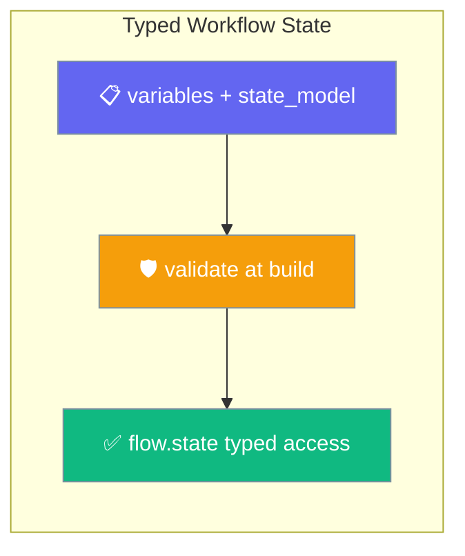
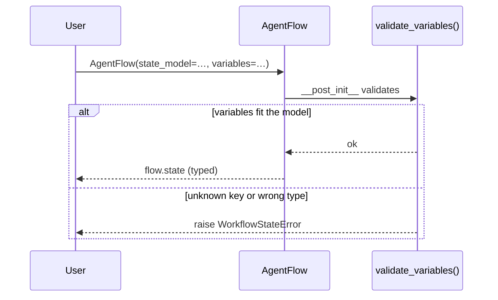
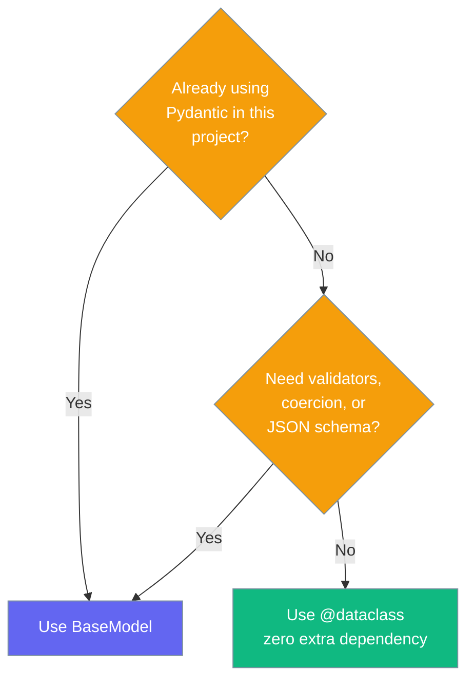

Typed workflow state gives `AgentFlow.variables` a schema, so a misspelled variable is refused when the flow is built instead of dying halfway through a run.



## Quick Start

<Steps>
<Step title="Untyped baseline">
Without a model, `variables` stays the plain dict it has always been and `flow.state` is `None`.

```python
from praisonaiagents import AgentFlow

flow = AgentFlow(steps=[], variables={"anything": 1})

print(flow.state)      # None — no schema declared
print(flow.variables)  # {'anything': 1}
```
</Step>

<Step title="Add a Pydantic model">
Declare a `state_model` and read fields with typed, dotted access.

```python
from pydantic import BaseModel
from praisonaiagents import AgentFlow

class ReviewState(BaseModel):
    draft: str = ""
    score: int = 0

flow = AgentFlow(steps=[], state_model=ReviewState,
                 variables={"draft": "hi", "score": 7})

print(flow.state.draft)  # "hi"
print(flow.state.score)  # 7
```
</Step>

<Step title="Use a plain dataclass">
The same shape works as a `@dataclass`, so Pydantic is never required.

```python
import dataclasses
from praisonaiagents import AgentFlow

@dataclasses.dataclass
class PlainState:
    draft: str = ""
    score: int = 0

flow = AgentFlow(steps=[], state_model=PlainState, variables={"draft": "hi"})

print(flow.state.draft)  # "hi"
```
</Step>
</Steps>

---

## How It Works

Validation runs at construction, so a typo costs nothing to find because the flow never starts.



| When | Situation | Result |
|------|-----------|--------|
| Build time | Unknown key | Raises `WorkflowStateError` |
| Build time | Wrong type | Raises `WorkflowStateError` |
| Build time | Variables fit | Typed `flow.state` |
| Run time | A step mutates `flow.variables` | Call `flow.validate_variables()` to re-apply the same rules |

---

## Catching mistakes at build time

An unknown key is an error, not something to ignore, and the message names the declared fields so the fix is visible.

```python
from pydantic import BaseModel
from praisonaiagents import AgentFlow
from praisonaiagents.workflows.state import WorkflowStateError

class ReviewState(BaseModel):
    draft: str = ""
    score: int = 0

# A misspelled variable is refused
AgentFlow(steps=[], state_model=ReviewState, variables={"reserach_results": 1})
```

```
Unknown workflow variable(s) ['reserach_results'] for state model 'ReviewState'. Declared fields: ['draft', 'score']. A misspelled variable would otherwise be written, never read, and never reported.
```

```python
# A wrongly typed variable is refused
AgentFlow(steps=[], state_model=ReviewState, variables={"score": "not an int"})
```

```
Workflow variables do not fit state model 'ReviewState': ValidationError: ...
```

```python
from praisonaiagents.workflows.state import validate_variables

# A model with no fields cannot describe the state
class Empty:
    pass

validate_variables(Empty, {"a": 1})
```

```
'Empty' declares no fields, so it cannot describe this flow's state. Use a Pydantic model or a dataclass.
```

---

## Re-validating after a step writes

A step that writes into `variables` can re-check before the next step reads them.

```python
from pydantic import BaseModel
from praisonaiagents import AgentFlow

class ReviewState(BaseModel):
    draft: str = ""
    score: int = 0

flow = AgentFlow(steps=[], state_model=ReviewState, variables={"score": 1})

flow.variables["draft"] = "later"
flow.validate_variables()   # raises if a step wrote an unknown or ill-typed key
```

---

## When to use which model type

A dataclass works as well as a Pydantic model, so reach for the heavier dependency only when you need it.



---

## API Reference

The public surface is one field, one property, one method, and one error type.

| Member | Type | Default | Description |
|--------|------|---------|-------------|
| `state_model` | `Optional[type]` | `None` | A Pydantic model or a plain `@dataclass` describing the shape of `variables`. |
| `flow.state` | property | — | `variables` wrapped in the declared model, or `None` when no model was declared. |
| `flow.validate_variables()` | method | — | Raises `WorkflowStateError` unless the current `variables` fit `state_model`. Runs at construction; call it again after a step writes. |
| `WorkflowStateError` | `class(ValueError)` | — | Raised when `variables` do not match the declared state model. |

<Info>
**Advanced.** For building your own tooling, `praisonaiagents.workflows.state` also exposes `build_state(model, variables)` to construct the typed instance and `state_field_names(model)` to read a model's declared field names.
</Info>

---

## Best Practices

<AccordionGroup>
<Accordion title="Declare state_model on every non-trivial flow">
The cost is one class; the win is that a typo becomes a build-time error instead of a variable that is written, never read, and never reported.
</Accordion>

<Accordion title="Prefer @dataclass for simple shapes">
Use a plain dataclass when you only need field names and types. Reach for a Pydantic `BaseModel` when you want validators, coercion, or a JSON schema.
</Accordion>

<Accordion title="Re-validate after any step that mutates variables">
Call `flow.validate_variables()` after a writing step so the next step reads a shape you have already proven valid.
</Accordion>

<Accordion title="Treat flow.state is None as 'no schema declared'">
`None` means no model was declared — never "empty state". An empty typed state is a real instance, not `None`.
</Accordion>
</AccordionGroup>

---

## Related

<CardGroup cols={2}>
<Card title="AgentFlow" icon="diagram-project" href="/docs/concepts/agentflow">
  The deterministic multi-step workflow that `state_model` describes.
</Card>
<Card title="Injected State" icon="syringe" href="/docs/features/injected-state">
  Hides tool parameters from the LLM — about tools, not flow variables.
</Card>
</CardGroup>
