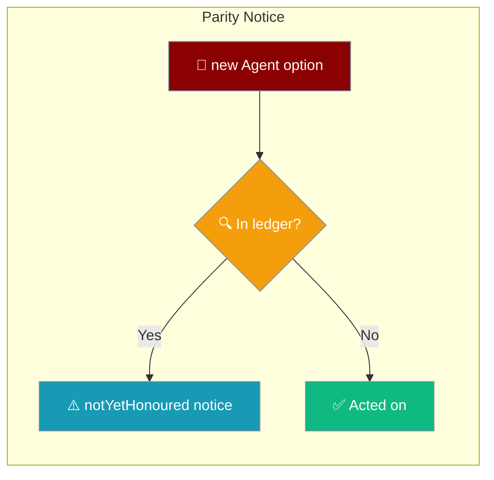
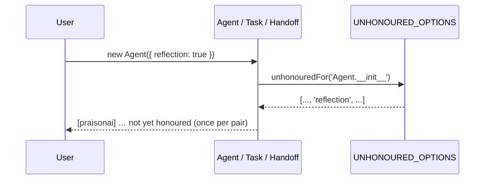

Some TypeScript SDK options are accepted for Python-SDK parity but are not yet acted on; when you pass one, the SDK tells you so it's never silently dropped.



## Quick Start

<Steps>

<Step title="See the notice fire">
```typescript
import { Task } from 'praisonai';

const task = new Task({
  name: 'Research',
  description: 'Research a topic',
  memory: true,   // accepted for parity, not yet honoured on Task
});
// console: [praisonai] Task: option "memory" is accepted for parity
// with the Python SDK but is not yet honoured in TypeScript.
```

As of PR #4841 every `Agent` constructor and `Agent.chat` option is honoured — see the [Agent](/docs/js/agent) page. The notice above now fires only for the surfaces still in the queue below.
</Step>

<Step title="Silence the notices">
Set `PRAISONAI_PARITY_SILENT=1` for the process (useful in tests) to mute every parity notice.

```bash
PRAISONAI_PARITY_SILENT=1 node app.js
```
</Step>

</Steps>

---

## How It Works

Each surface consults the `UNHONOURED_OPTIONS` ledger when it is constructed, and warns once per `(surface, option)` pair if you pass a listed option with a non-default value.



| Concept | Meaning |
|---------|---------|
| Accepted | The option is typed and takes a value, so Python examples copy-paste. |
| Not yet honoured | The TypeScript behaviour behind the option isn't ported yet. |
| Notice | A one-time `console.warn` per `(surface, option)` so nothing is dropped silently. |

---

## The Remaining Surfaces

These options are accepted for Python-SDK parity but not yet acted on. Pass any with a non-default value and the SDK emits a notice.

| Surface | Count | Options |
|---|---|---|
| `AgentTeam.__init__` | 8 | `autonomy`, `knowledge`, `guardrails`, `web`, `reflection`, `caching`, `learn`, `toolsRunOn` |
| `Handoff` | 8 | `contextPolicy`, `maxContextTokens`, `maxContextMessages`, `preserveSystem`, `timeoutSeconds`, `maxConcurrent`, `detectCycles`, `maxDepth` |
| `Task.__init__` | 32 | `asyncExecution`, `config`, `outputPydantic`, `images`, `nextTasks`, `condition`, `isStart`, `loopState`, `memory`, `inputFile`, `rerun`, `retainFullContext`, `agentConfig`, `skipOnFailure`, `retryDelay`, `handler`, `loopOver`, `loopVar`, `execution`, `routing`, `outputConfig`, `when`, `thenTask`, `elseTask`, `autonomy`, `knowledge`, `web`, `reflection`, `planning`, `hooks`, `caching`, `failOnMemoryError` |
| **Total** | **48** | |

Plus **partial** options that work for some inputs and announce themselves for the rest:

| Surface | Option | Honoured when |
|---|---|---|
| `Agent` | `context` | some inputs |
| `Agent` | `guardrails` | some inputs |
| `Agent` | `knowledge` | some inputs |
| `Agent` | `memory` | some inputs |
| `Agent` | `reasoningEffort` | some inputs |
| `Agent` | `web` | some inputs |
| `Agent` | `toolConfig.parallel` | forwarded as `parallel_tool_calls` on the OpenAI-compatible backend; the AI SDK backend still emits a notice |
| `Agent.chat` | `attachments` | honoured on the OpenAI-compatible backend; the AI SDK backend emits a "not yet honoured" notice for multimodal |
| `Agent.chat` | `outputPydantic` | some inputs |
| `Agent.chat` | `seed` | some inputs |
| `AgentTeam` | `context` | some inputs |
| `AgentTeam` | `execution` | some inputs |
| `AgentTeam` | `hooks` | some inputs |
| `AgentTeam` | `memory` | some inputs |
| `AgentTeam` | `planning` | some inputs |
| `ChromaMemory` | `ragDbPath` | some inputs |
| `Task` | `guardrails` | some inputs |

<Note>
Counts current as of PR #4841 (2026-09-05), which honoured all **21** `Agent` options (`Agent.__init__` 15 → 0, `Agent.chat` 6 → 0, total 69 → 48). Those options now do what they promise — and some of them **throw** on a typo. See [Agent](/docs/js/agent) for examples and the exact error strings. PR [#4837](https://github.com/MervinPraison/PraisonAI/pull/4837) honoured seven `AgentTeam` options (`AgentTeam.__init__` 15 → 8, total 76 → 69). PR [#4838](https://github.com/MervinPraison/PraisonAI/pull/4838) landed the Task engine implementing 28 of the 32 `Task.__init__` options, but the ledger above is unchanged: the engine has no call sites yet, so the options still emit notices until a future PR wires the team runner in. The four that stay open on merit — `autonomy`, `web`, `reflection`, `planning` — have no reference behaviour in Python to port. The list is a downward ratchet, so it will shrink over time. The live list is [`BEHAVIOUR_PARITY.md`](https://github.com/MervinPraison/PraisonAI/blob/main/src/praisonai-ts/BEHAVIOUR_PARITY.md); the ledger is [`parity-notice.ts`](https://github.com/MervinPraison/PraisonAI/blob/main/src/praisonai-ts/src/utils/parity-notice.ts).
</Note>

<Warning>
`runOn` on `AgentTeam` is not just unhonoured — it **throws a `TypeError` at construction**. This differs from the silent-notice pattern above: `runOn` hands one agent's whole loop to a managed runtime, and a team orchestrates several agents locally, so there is no single loop to hand over. Put `runOn` on an individual `Agent` instead.
</Warning>

---

## Best Practices

<AccordionGroup>

<Accordion title="An option in this list didn't do anything — why?">
It's accepted for API compatibility with the Python SDK, but the TypeScript behaviour behind it hasn't been implemented yet. Watch the console for a `[praisonai] … not yet honoured` notice at startup.
</Accordion>

<Accordion title="How do I silence the notices?">
Set the environment variable `PRAISONAI_PARITY_SILENT=1` (or `PRAISONAI_PARITY_SILENT=true`) for the process. This is what test suites use to keep output clean.
</Accordion>

<Accordion title="How do I know if a specific option works?">
Pass it. If you see no notice at startup, it's honoured. Otherwise check [`BEHAVIOUR_PARITY.md`](https://github.com/MervinPraison/PraisonAI/blob/main/src/praisonai-ts/BEHAVIOUR_PARITY.md) on `main` for the current list.
</Accordion>

<Accordion title="How can I help close a row?">
Implement the behaviour, delete the option's entry from the ledger, add a test that proves the option changes what the code does, and regenerate. See [`_dev/parity/README.md`](https://github.com/MervinPraison/PraisonAI/blob/main/src/praisonai/praisonai/_dev/parity/README.md) in the SDK repo.
</Accordion>

</AccordionGroup>

---

## Related

<CardGroup cols={2}>
<Card title="Agent" icon="robot" href="/docs/js/agent">
  TypeScript Agent class — `Agent.__init__` and `Agent.chat` options.
</Card>
<Card title="Agent Team" icon="users" href="/docs/js/agent-team">
  Multi-agent teams — `AgentTeam.__init__` options.
</Card>
<Card title="Handoffs" icon="right-left" href="/docs/js/handoffs">
  Agent handoffs — `Handoff` options.
</Card>
<Card title="Tasks" icon="list-check" href="/docs/js/tasks">
  Task definitions — `Task.__init__` options.
</Card>
</CardGroup>
