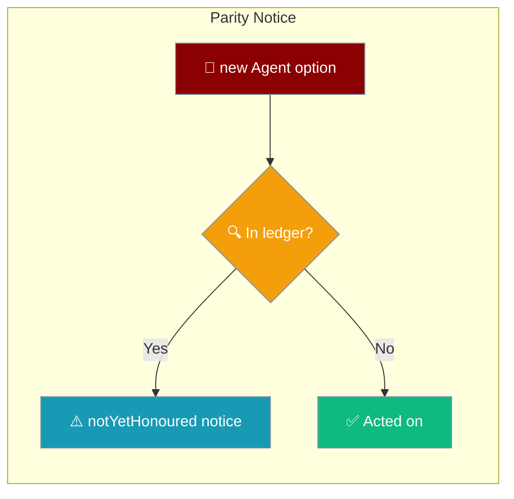
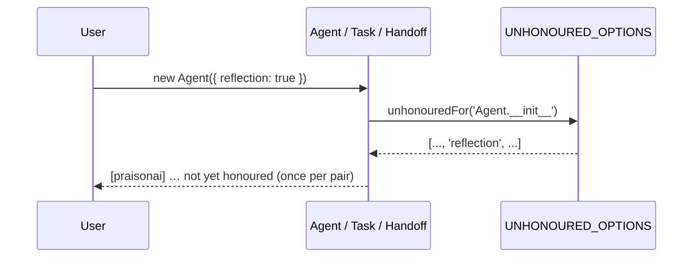

Some TypeScript SDK options are accepted for Python-SDK parity but are not yet acted on; when you pass one, the SDK tells you so it's never silently dropped.



## Quick Start

<Steps>

<Step title="See the notice fire">
```typescript
import { Agent } from 'praisonai';

const agent = new Agent({
  name: 'Assistant',
  instructions: 'Help the user',
  reflection: true,   // accepted for parity, not yet honoured
});
// console: [praisonai] Agent: option "reflection" is accepted for parity
// with the Python SDK but is not yet honoured in TypeScript.
```
</Step>

<Step title="Silence the notices">
Set `PRAISONAI_PARITY_SILENT=1` for the process (useful in tests) to mute every parity notice.

```bash
PRAISONAI_PARITY_SILENT=1 node app.js
```
</Step>

</Steps>

---

## How It Works

Each surface consults the `UNHONOURED_OPTIONS` ledger when it is constructed, and warns once per `(surface, option)` pair if you pass a listed option with a non-default value.



| Concept | Meaning |
|---------|---------|
| Accepted | The option is typed and takes a value, so Python examples copy-paste. |
| Not yet honoured | The TypeScript behaviour behind the option isn't ported yet. |
| Notice | A one-time `console.warn` per `(surface, option)` so nothing is dropped silently. |

---

## The Five Surfaces

These options are accepted for Python-SDK parity but not yet acted on. Pass any with a non-default value and the SDK emits a notice.

| Surface | Count | Options |
|---|---|---|
| `Agent.__init__` | 15 | `auth`, `toolsets`, `reflection`, `autonomy`, `templates`, `selfImprove`, `toolConfig`, `learn`, `backend`, `runOn`, `toolsRunOn`, `runtime`, `toolSearch`, `messageSteering`, `sandbox` |
| `Agent.chat` | 6 | `reasoningSteps`, `taskName`, `taskDescription`, `taskId`, `config`, `attachments` |
| `AgentTeam.__init__` | 15 | `managerLlm`, `memory`, `planning`, `context`, `execution`, `hooks`, `autonomy`, `knowledge`, `guardrails`, `web`, `reflection`, `caching`, `learn`, `toolsRunOn`, `runOn` |
| `Handoff` | 8 | `contextPolicy`, `maxContextTokens`, `maxContextMessages`, `preserveSystem`, `timeoutSeconds`, `maxConcurrent`, `detectCycles`, `maxDepth` |
| `Task.__init__` | 32 | `asyncExecution`, `config`, `outputPydantic`, `images`, `nextTasks`, `condition`, `isStart`, `loopState`, `memory`, `inputFile`, `rerun`, `retainFullContext`, `agentConfig`, `skipOnFailure`, `retryDelay`, `handler`, `loopOver`, `loopVar`, `execution`, `routing`, `outputConfig`, `when`, `thenTask`, `elseTask`, `autonomy`, `knowledge`, `web`, `reflection`, `planning`, `hooks`, `caching`, `failOnMemoryError` |
| **Total** | **76** | |

Plus 10 **partial** options that work for some inputs and announce themselves for the rest:

| Surface | Option |
|---|---|
| `Agent` | `context` |
| `Agent` | `guardrails` |
| `Agent` | `knowledge` |
| `Agent` | `memory` |
| `Agent` | `reasoningEffort` |
| `Agent` | `web` |
| `Agent.chat` | `outputPydantic` |
| `Agent.chat` | `seed` |
| `ChromaMemory` | `ragDbPath` |
| `Task` | `guardrails` |

<Note>
Counts current as of PR #4789 (2026-09-03). The list is a downward ratchet, so it will shrink over time. The live list is [`BEHAVIOUR_PARITY.md`](https://github.com/MervinPraison/PraisonAI/blob/main/src/praisonai-ts/BEHAVIOUR_PARITY.md); the ledger is [`parity-notice.ts`](https://github.com/MervinPraison/PraisonAI/blob/main/src/praisonai-ts/src/utils/parity-notice.ts).
</Note>

---

## Best Practices

<AccordionGroup>

<Accordion title="An option in this list didn't do anything — why?">
It's accepted for API compatibility with the Python SDK, but the TypeScript behaviour behind it hasn't been implemented yet. Watch the console for a `[praisonai] … not yet honoured` notice at startup.
</Accordion>

<Accordion title="How do I silence the notices?">
Set the environment variable `PRAISONAI_PARITY_SILENT=1` (or `PRAISONAI_PARITY_SILENT=true`) for the process. This is what test suites use to keep output clean.
</Accordion>

<Accordion title="How do I know if a specific option works?">
Pass it. If you see no notice at startup, it's honoured. Otherwise check [`BEHAVIOUR_PARITY.md`](https://github.com/MervinPraison/PraisonAI/blob/main/src/praisonai-ts/BEHAVIOUR_PARITY.md) on `main` for the current list.
</Accordion>

<Accordion title="How can I help close a row?">
Implement the behaviour, delete the option's entry from the ledger, add a test that proves the option changes what the code does, and regenerate. See [`_dev/parity/README.md`](https://github.com/MervinPraison/PraisonAI/blob/main/src/praisonai/praisonai/_dev/parity/README.md) in the SDK repo.
</Accordion>

</AccordionGroup>

---

## Related

<CardGroup cols={2}>
<Card title="Agent" icon="robot" href="/docs/js/agent">
  TypeScript Agent class — `Agent.__init__` and `Agent.chat` options.
</Card>
<Card title="Agent Team" icon="users" href="/docs/js/agent-team">
  Multi-agent teams — `AgentTeam.__init__` options.
</Card>
<Card title="Handoffs" icon="right-left" href="/docs/js/handoffs">
  Agent handoffs — `Handoff` options.
</Card>
<Card title="Tasks" icon="list-check" href="/docs/js/tasks">
  Task definitions — `Task.__init__` options.
</Card>
</CardGroup>
