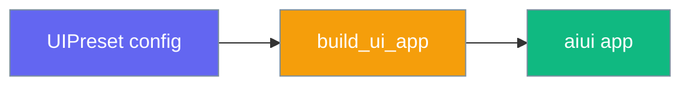
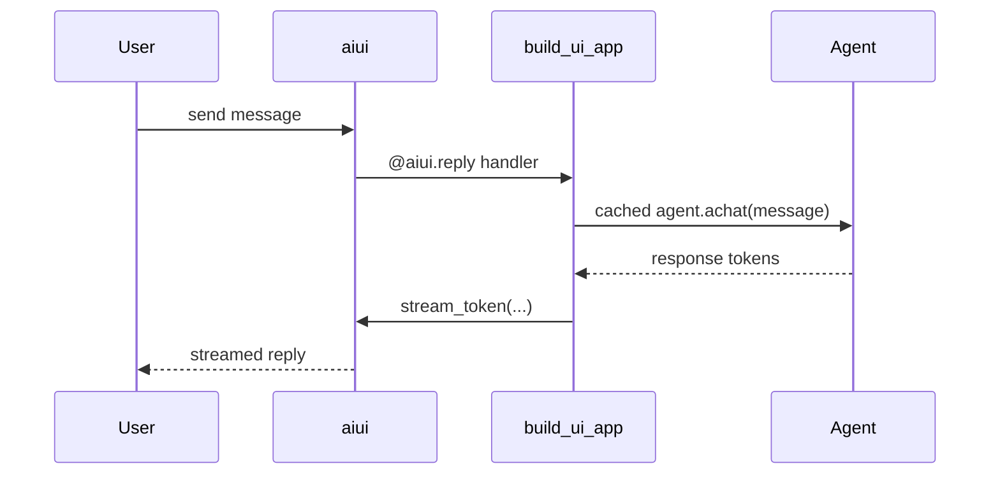

`UIPreset` packages every UI knob into one object so `build_ui_app(preset)` returns a ready-to-serve app.

```python
from praisonaiagents import Agent
from praisonai.integration.host_app import UIPreset, build_ui_app

preset = UIPreset(
    title="My Bot",
    agent_kwargs={"name": "Helper", "instructions": "Be concise."},
)
app = build_ui_app(preset)
```



## Quick Start

<Steps>
<Step title="Chat UI in three lines">
Start with an agent, wire it through `agent_kwargs`, and serve:

```python
from praisonaiagents import Agent
from praisonai.integration.host_app import UIPreset, build_ui_app

preset = UIPreset(
    title="My Bot",
    agent_kwargs={
        "name": "Helper",
        "instructions": "Be concise.",
    },
)
app = build_ui_app(preset)
# uvicorn main:app --host 0.0.0.0 --port 8000
```
</Step>

<Step title="Custom agent factory">
Use `agent_factory` when each session needs a fresh agent:

```python
from praisonaiagents import Agent
from praisonai.integration.host_app import UIPreset, build_ui_app

def make_agent(settings):
    return Agent(
        name="Helper",
        instructions="Be concise.",
        llm=settings.get("model", "gpt-4o-mini"),
    )

preset = UIPreset(title="Dynamic Bot", agent_factory=make_agent)
app = build_ui_app(preset)
```
</Step>
</Steps>

---

## UIPreset Fields

| Field | Type | Default | Description |
|-------|------|---------|-------------|
| `title` | `str` | `"PraisonAI"` | Browser tab and header title |
| `logo` | `str` | `"🤖"` | Logo emoji or text in the sidebar |
| `pages` | `List[str]` | `["chat"]` | Enabled UI pages (chat, agents, sessions, …) |
| `theme` | `Dict` | blue preset, dark mode | Theme dict passed to `configure_host` |
| `agent_kwargs` | `Dict` | `{}` | Keyword args for default `Agent(...)` |
| `starters` | `List[Dict]` | `[]` | Conversation starter chips |
| `welcome` | `str` | greeting message | Shown on first load via `@aiui.welcome` |
| `sidebar` | `bool` | `True` | Show sidebar navigation |
| `page_header` | `bool` | `True` | Show page header bar |
| `openai_fallback` | `bool` | `False` | Fall back to OpenAI when agent errors (legacy mode) |
| `settings_handler` | `Callable \| None` | `None` | Async `(new_settings) -> None` on settings change |
| `agent_factory` | `Callable \| None` | `None` | `(settings) -> Agent` for per-session agents |
| `realtime_manager` | `Any \| None` | `None` | OpenAI realtime manager instance |
| `agent_loader` | `Callable \| None` | `None` | Load agents from YAML at startup |

---

## Default App Patterns

All five bundled UI apps now use `build_ui_app(UIPreset(...))`:

| App | Module | Typical `pages` |
|-----|--------|-----------------|
| Agents UI | `ui_agents/default_app.py` | chat, agents, sessions |
| Bot UI | `ui_bot/default_app.py` | chat |
| Chat UI | `ui_chat/default_app.py` | chat |
| Dashboard UI | `ui_dashboard/default_app.py` | chat, usage, sessions |
| Realtime UI | `ui_realtime/default_app.py` | chat (with realtime manager) |

---

## Legacy Host Mode

Set `PRAISONAI_HOST_LEGACY=1` to enable callback-only handlers inside `build_ui_app` (`@aiui.reply`, `@aiui.settings`, `@aiui.cancel`).

When `openai_fallback=True` (legacy mode only):

- Requires `OPENAI_API_KEY` in the environment
- Model from `PRAISONAI_MODEL` or defaults to `gpt-4o-mini`
- Activates only after the primary agent raises an error

```python
import os
os.environ["PRAISONAI_HOST_LEGACY"] = "1"

preset = UIPreset(
    title="Fallback Bot",
    openai_fallback=True,
    agent_kwargs={"instructions": "You are helpful."},
)
app = build_ui_app(preset)
```

### Callable Signatures

```python
# settings_handler — called when user changes UI settings
async def on_settings(new_settings: dict) -> None: ...

# agent_factory — returns a fresh Agent per session/settings combo
def make_agent(settings: dict | None) -> Agent: ...
```

---

## Request Flow



---

## Best Practices

<AccordionGroup>
<Accordion title="Prefer agent_kwargs for static agents">
When every session shares the same agent config, `agent_kwargs` is simpler than `agent_factory`.
</Accordion>

<Accordion title="Use agent_factory for per-user settings">
When the UI settings panel changes model or instructions, `agent_factory(settings)` builds the right agent per session.
</Accordion>

<Accordion title="Keep openai_fallback off in production">
Rely on your configured agent and LLM keys; enable fallback only for demos or legacy migrations.
</Accordion>
</AccordionGroup>

---

## Related

<CardGroup cols={2}>
<Card title="Host Integration" icon="plug" href="/docs/features/host-integration">
  Full `configure_host` / `build_host_app` API
</Card>
<Card title="AIUI Backends" icon="display" href="/docs/features/aiui-backends">
  Backend options for PraisonAI UI
</Card>
</CardGroup>
