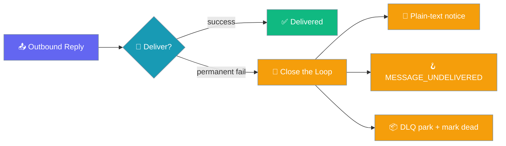
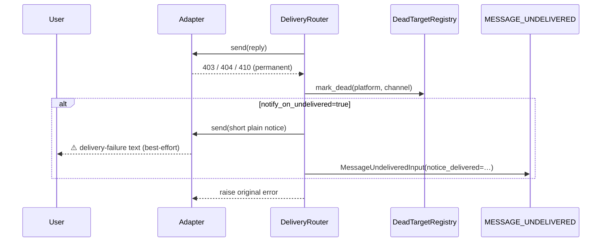

Tell your user (and your operators) when a reply *can't* be delivered instead of losing it silently.



## Quick Start

<Steps>
<Step title="Turn it on">
One boolean flips the feature on. A permanent delivery failure now sends a built-in plain-text notice on the same channel.

```yaml
gateway:
  notify_on_undelivered: true
```
</Step>

<Step title="Customise the notice">
Replace the built-in message with your own wording. `${VAR}` substitution applies.

```yaml
gateway:
  notify_on_undelivered: true
  undelivered_template: "⚠️ We couldn't deliver that reply. Please try again."
```
</Step>

<Step title="Route the failure from an Agent">
Subscribe to `MESSAGE_UNDELIVERED` to mirror, alert, or re-queue — no adapter patching.

```python
from praisonaiagents import Agent
from praisonaiagents.hooks import HookRegistry, HookEvent, HookResult

registry = HookRegistry()

@registry.on(HookEvent.MESSAGE_UNDELIVERED)
def route_to_ops(event_data):
    # event_data is a MessageUndeliveredInput
    print(
        f"[UNDELIVERED] {event_data.platform}:{event_data.channel_id} "
        f"error={event_data.error} notice_delivered={event_data.notice_delivered}"
    )
    return HookResult.allow()

agent = Agent(name="broadcaster", instructions="Send updates.", hooks=registry)
```
</Step>
</Steps>

---

## How It Works

A reply that fails *permanently* — the target is confirmed dead, or delivery exhausted its retries — parks in the DLQ and marks the target dead. With `notify_on_undelivered` on, the router also sends a short notice on the same channel and fires the hook.



| Step | Behaviour |
|------|-----------|
| Classify | A permanent failure is detected via `403 / 404 / 410` or platform text patterns. |
| Mark dead | The target is flagged in the dead-target registry (if attached). |
| Notice | Best-effort plain-text note on the same channel — a one-liner may land where a large reply did not. |
| Hook | `MESSAGE_UNDELIVERED` fires with the outcome, whether or not the notice landed. |
| Re-raise | The original send failure still propagates so retry/DLQ machinery keeps its contract. |

---

## Configuration Options

### `gateway.yaml`

| Key | Type | Default | Description |
|-----|------|---------|-------------|
| `notify_on_undelivered` | `bool` | `false` | Opt-in. When true, the router surfaces permanent failures. |
| `undelivered_template` | `str \| null` | `null` | Plain-text notice sent on the same channel. `null` uses the built-in default. `${VAR}` substitution applies. |

Built-in default notice: `⚠️ Your request was processed but the reply couldn't be delivered.`

### `DeliveryRouter` kwargs (Python)

| Kwarg | Type | Default | Description |
|-------|------|---------|-------------|
| `notify_on_undelivered` | `bool` | `False` | Same semantics as the YAML key. |
| `undelivered_template` | `Optional[str]` | `None` | Overrides the notice text. `None` uses `DeliveryRouter.DEFAULT_UNDELIVERED_TEMPLATE`. |

```python
from praisonai_bot.bots.delivery import DeliveryRouter

router = DeliveryRouter(
    botos,
    notify_on_undelivered=True,
    undelivered_template="⚠️ We couldn't deliver that reply.",
)
```

### `MessageUndeliveredInput` fields

| Field | Type | Description |
|-------|------|-------------|
| `platform` | `str` | Platform id (`"telegram"`, `"slack"`, …). |
| `content` | `str` | The original outbound content that failed to deliver. |
| `channel_id` | `str` | Channel the reply was targeted at. |
| `error` | `str` | Formatted as `"<ExceptionType>: <message>"`. |
| `notice_delivered` | `bool` | Whether the plain-text notice succeeded on the same channel. |
| `session_id`, `cwd`, `event_name`, `timestamp`, `agent_name` | — | Inherited `HookInput` fields. |

---

## Common Patterns

Mirror every undelivered reply to a home channel.

```python
from praisonaiagents import Agent
from praisonaiagents.hooks import HookRegistry, HookEvent, HookResult

registry = HookRegistry()

@registry.on(HookEvent.MESSAGE_UNDELIVERED)
def mirror_home(event_data):
    print(f"[home] {event_data.platform}:{event_data.channel_id} -> {event_data.content}")
    return HookResult.allow()

agent = Agent(name="mirror", instructions="Forward failures.", hooks=registry)
```

Alert only when even the fallback notice failed to land.

```python
from praisonaiagents import Agent
from praisonaiagents.hooks import HookRegistry, HookEvent, HookResult

registry = HookRegistry()

@registry.on(HookEvent.MESSAGE_UNDELIVERED)
def page_on_total_loss(event_data):
    if not event_data.notice_delivered:
        print(f"[PAGE] total delivery loss on {event_data.platform}:{event_data.channel_id}")
    return HookResult.allow()

agent = Agent(name="pager", instructions="Escalate hard failures.", hooks=registry)
```

---

## Best Practices

<AccordionGroup>
<Accordion title="A one-liner slips through where a rich reply could not">
The original reply may have failed for length or rich-media reasons. A short plain-text notice often lands on the same channel, so the user still knows something happened.
</Accordion>

<Accordion title="Handler errors never break delivery">
Any exception in your `MESSAGE_UNDELIVERED` handler is swallowed. The router still re-raises the original send failure, so retry and DLQ machinery keep their contract.
</Accordion>

<Accordion title="It composes with the dead-target registry">
The notice and hook fire on the same permanent-failure branch that marks a target dead. Subsequent sends short-circuit at the registry, so the notice does not repeat. See [Dead-Target Registry](/docs/features/dead-target-registry).
</Accordion>

<Accordion title="The notice shares the platform rate-limit bucket">
The fallback notice goes through the same adapter and shares the platform rate-limit bucket. See [Bot Rate Limiting](/docs/features/bot-rate-limiting).
</Accordion>
</AccordionGroup>

---

## Related

<CardGroup cols={2}>
<Card title="Dead-Target Registry" icon="skull" href="/docs/features/dead-target-registry">
Suppress known-bad channels and self-heal on recovery.
</Card>
<Card title="Hook Events" icon="webhook" href="/docs/features/hook-events">
All lifecycle hook events, including message events.
</Card>
</CardGroup>
