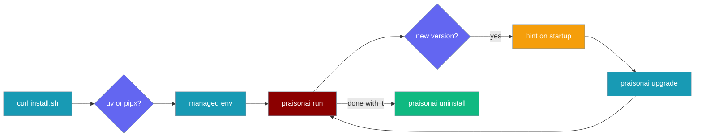
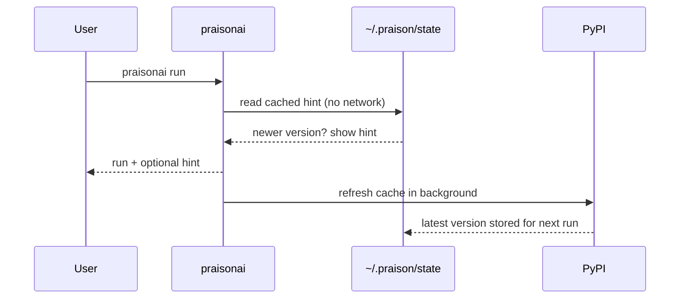
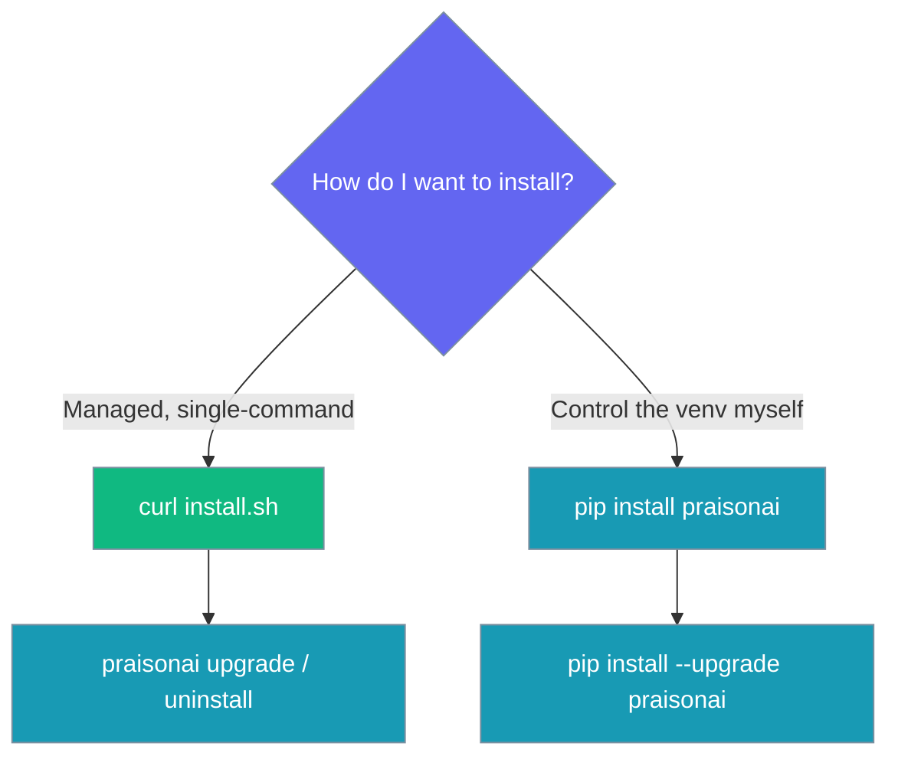

Install PraisonAI with one command, keep it current with `praisonai upgrade`, and remove it cleanly with `praisonai uninstall`.

```bash
curl -fsSL https://raw.githubusercontent.com/MervinPraison/PraisonAI/main/install.sh | sh
```



<Note>
This is the managed CLI experience. It does **not** replace `pip install praisonai` — that still works exactly as before for library and embedded use. `praisonaiagents` is untouched.
</Note>

## Quick Start

<Steps>
<Step title="Install with one line">
No Python knowledge needed. The installer provisions an isolated environment and puts `praisonai` on your PATH.

```bash
curl -fsSL https://raw.githubusercontent.com/MervinPraison/PraisonAI/main/install.sh | sh
```

Then start:

```bash
praisonai setup
```
</Step>

<Step title="Keep it current">
Update the managed install in place:

```bash
praisonai upgrade
```
</Step>

<Step title="Remove it cleanly">
Remove the managed environment and shim:

```bash
praisonai uninstall
```
</Step>
</Steps>

---

## The One-Liner

One command detects your platform and installs PraisonAI into an isolated, managed environment.

```bash
curl -fsSL https://raw.githubusercontent.com/MervinPraison/PraisonAI/main/install.sh | sh
```

The installer:

- Detects your platform, architecture, and shell
- Provisions an isolated environment via `uv tool install` (bootstrapping `uv` when absent) or `pipx`
- Is idempotent and safe to re-run
- Wires PATH for bash, zsh, and fish
- Prints a first-run hint (`praisonai setup`)

### Environment Overrides

| Env var | Purpose |
|---------|---------|
| `PRAISONAI_VERSION=x.y.z` | Pin to a specific version |
| `PRAISONAI_INSTALLER=uv\|pipx` | Force a specific tool manager |
| `PRAISONAI_NONINTERACTIVE=1` | CI/headless installs — no prompts |

<CodeGroup>
```bash Pin a version
PRAISONAI_VERSION=4.6.0 curl -fsSL https://raw.githubusercontent.com/MervinPraison/PraisonAI/main/install.sh | sh
```

```bash Force pipx
PRAISONAI_INSTALLER=pipx curl -fsSL https://raw.githubusercontent.com/MervinPraison/PraisonAI/main/install.sh | sh
```

```bash CI / headless
PRAISONAI_NONINTERACTIVE=1 curl -fsSL https://raw.githubusercontent.com/MervinPraison/PraisonAI/main/install.sh | sh
```
</CodeGroup>

---

## `praisonai upgrade`

Update the managed install in place using the detected tool manager (uv / pipx).

```bash
praisonai upgrade
```

Check for a newer release without changing anything — useful for dry-runs and scripting:

```bash
praisonai upgrade --check
```

| Flag | Description |
|------|-------------|
| `--check` | Report whether a newer version exists without upgrading |

JSON output is supported for scripting:

<CodeGroup>
```bash Check as JSON
praisonai --json upgrade --check
```

```json Result
{"current": "4.6.0", "latest": "4.6.1", "update_available": true}
```
</CodeGroup>

<Note>
When installed via `pip` instead of the managed one-liner, `praisonai upgrade` points you to `pip install --upgrade praisonai`.
</Note>

---

## `praisonai uninstall`

Remove the managed environment and global `praisonai` shim.

```bash
praisonai uninstall
```

Skip the confirmation prompt for non-interactive / CI use:

```bash
praisonai uninstall --yes
```

| Flag | Description |
|------|-------------|
| `--yes`, `-y` | Skip the confirmation prompt (non-interactive/CI) |

JSON output is supported:

<CodeGroup>
```bash Uninstall as JSON
praisonai --json uninstall --yes
```

```json Result
{"manager": "uv", "removed": "4.6.0"}
```
</CodeGroup>

---

## Update-Available Hint

PraisonAI hints when a newer version is out — without ever slowing down start-up.



The hint:

- Is **non-blocking** on start (text mode only)
- Is backed by a time-boxed cache at `~/.praison/state/update_check.json` (24-hour freshness)
- Never performs network I/O at start-up, never blocks, and never raises
- Refreshes the cache in a detached background process for the *next* run

### Opt Out

Set one environment variable to disable the hint entirely:

```bash
export PRAISONAI_NO_UPDATE_CHECK=1
```

| Env var | Effect |
|---------|--------|
| `PRAISONAI_NO_UPDATE_CHECK=1` | Disables the background update check and hint |

---

## Which Install Do I Choose?



This feature lives entirely in the CLI (`praisonai-code/cli`) plus `install.sh` at the repo root. Choose the one-liner for a managed, single-command experience; choose pip when you want to control the virtual environment yourself.

---

## Best Practices

<AccordionGroup>
<Accordion title="Use the one-liner for a managed experience">
The `curl … | sh` installer keeps PraisonAI in an isolated environment, so your global Python is untouched and `praisonai upgrade` / `praisonai uninstall` work cleanly.
</Accordion>

<Accordion title="Pin versions in CI">
Set `PRAISONAI_VERSION=x.y.z` and `PRAISONAI_NONINTERACTIVE=1` for reproducible, prompt-free installs in pipelines.
</Accordion>

<Accordion title="Script upgrade checks with --check">
Run `praisonai --json upgrade --check` in automation to detect newer releases without mutating the install.
</Accordion>

<Accordion title="Silence the hint in shared environments">
Set `PRAISONAI_NO_UPDATE_CHECK=1` to disable the update hint on machines where outbound network checks are unwanted.
</Accordion>
</AccordionGroup>

---

## Related

<CardGroup cols={2}>
<Card title="Installation" icon="download" href="/docs/installation">
    All install options, including pip and npm.
  </Card>
  <Card title="Installer Internals" icon="gear" href="/docs/install/installer">
    How install.sh detects backends and wires PATH.
  </Card>
</CardGroup>
