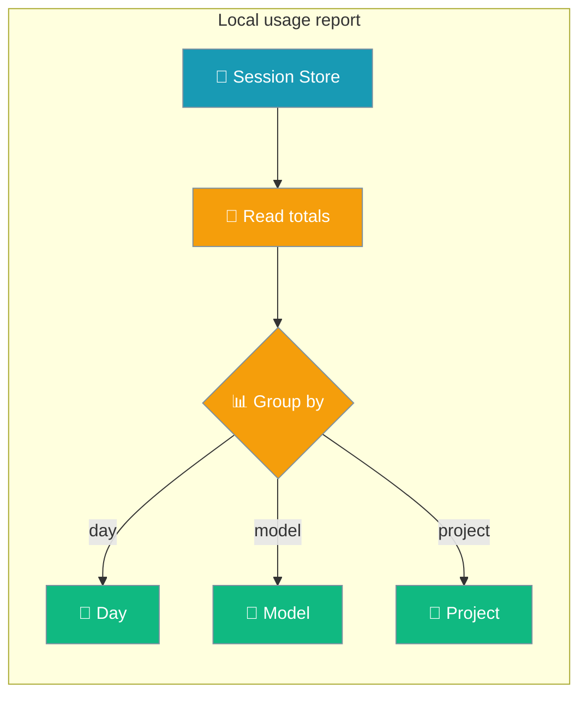
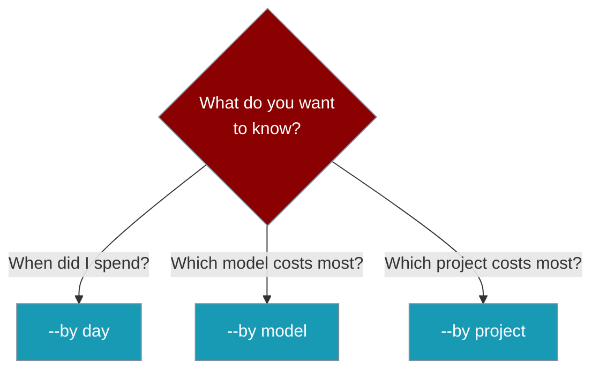

See exactly where your tokens (and dollars) are going — no dashboard, no API key, no config.

`praisonai usage` reads the same local session store that `praisonai session list` uses and rolls it up per day, per model, or per project.



## Quick Start

<Steps>
<Step title="Run the default report">
Show the last 30 days grouped by day:

```bash
praisonai usage
```

```
Usage
┏━━━━━━━━━━━━┳━━━━━━━━━┳━━━━━━━━━┓
┃ Day        ┃  Tokens ┃    Cost ┃
┡━━━━━━━━━━━━╇━━━━━━━━━╇━━━━━━━━━┩
│ 2026-07-15 │   4,320 │ $0.0180 │
│ 2026-07-18 │  12,500 │ $0.0512 │
│ Total      │  16,820 │ $0.0692 │
└────────────┴─────────┴─────────┘
```
</Step>

<Step title="Group by cost driver">
Find your most expensive model:

```bash
praisonai usage --by model
```
</Step>
</Steps>

---

## Choose Your View

Three groupings answer three different questions.



<CardGroup cols={3}>
  <Card title="By day" icon="calendar">
    Spot spend spikes over time. Rows sort chronologically.
  </Card>
  <Card title="By model" icon="robot">
    Find your most expensive model. Rows sort by highest spend first.
  </Card>
  <Card title="By project" icon="folder">
    Compare projects sharing one machine. Rows sort by highest spend first.
  </Card>
</CardGroup>

---

## Options

```
praisonai usage [--days N] [--by day|model|project] [--project ID] [--json]
```

| Option | Short | Type | Default | Description |
|--------|-------|------|---------|-------------|
| `--days` | `-d` | `int` | `30` | Only include sessions updated in the last N days (`0` = all time) |
| `--by` | `-b` | `str` | `"day"` | Group by `day`, `model`, or `project` |
| `--project` | `-p` | `str` | *(none)* | Restrict to a specific project ID |
| `--json` | — | `bool` | `False` | Emit machine-readable JSON instead of a table |

---

## Common Patterns

Check last week only:

```bash
praisonai usage --days 7
```

Break a single project down by model:

```bash
praisonai usage --project my-app --by model
```

Pipe into `jq` to flag expensive rows:

```bash
praisonai usage --json | jq '.rows[] | select(.cost > 1)'
```

The JSON output shape:

```json
{
  "by": "model",
  "days": 30,
  "project": null,
  "rows": [
    { "key": "gpt-4o",      "total_tokens": 12500, "cost": 0.0512 },
    { "key": "gpt-4o-mini", "total_tokens":  4320, "cost": 0.0180 }
  ],
  "total_tokens": 16820,
  "cost": 0.0692,
  "errors": []
}
```

---

## How It Works

`praisonai usage` reads the on-disk session store — the same store surfaced by `praisonai session list`. No network calls, no configuration, no external observability platform.

```mermaid
sequenceDiagram
    participant User
    participant CLI as praisonai CLI
    participant Store as Session store

    User->>CLI: praisonai run "task" (session active)
    CLI->>Store: accumulate token + cost totals
    Note over User: later...
    User->>CLI: praisonai usage --by model
    CLI->>Store: read totals (last N days)
    Store-->>CLI: per-session tokens + cost
    CLI-->>User: grouped table (or --json)

    classDef user fill:#6366F1,stroke:#7C90A0,color:#fff
    classDef cli fill:#8B0000,stroke:#7C90A0,color:#fff
    classDef store fill:#189AB4,stroke:#7C90A0,color:#fff
```

With no `--project`, both the current-project store and the global default store are read. Rows keep their originating identity (`current` or `global`), and a session that appears in both stores is counted once.

| Behaviour | What happens |
|---|---|
| `--days 0` | No time filter — includes every session |
| Empty store | Prints `No usage recorded yet` (no table) |
| Store read failure | Reports `Usage may be incomplete: ...` (or an `errors` array in `--json`) instead of returning zero |
| Invalid `--by` value | Exits with code `1` and a clear error |

Costs come from the existing per-run `ModelPricing` tracker — `usage` aggregates what was already recorded, it does not re-price.

---

## Best Practices

<AccordionGroup>
<Accordion title="Run a quick weekly check-in">
Use `--days 7` for a fast look at the current week before it grows into a surprise bill.

```bash
praisonai usage --days 7
```
</Accordion>

<Accordion title="Compare models before switching providers">
Group by `model` to see which model drives your spend, then decide whether a cheaper one fits.

```bash
praisonai usage --by model
```
</Accordion>

<Accordion title="Alert on runaway spend in CI">
Use `--json` in cron or CI and act on the numbers with `jq`.

```bash
praisonai usage --json | jq '.cost'
```
</Accordion>

<Accordion title="Remember it counts local spend only">
Numbers reflect only what was recorded to the local session store. For team-wide totals across machines, use an observability integration such as [Langfuse](/docs/observability/langfuse).
</Accordion>
</AccordionGroup>

---

## Related

<CardGroup cols={2}>
  <Card title="Session" icon="clock-rotate-left" href="/docs/cli/session">
    The session store this command reads from.
  </Card>
  <Card title="Traces" icon="magnifying-glass" href="/docs/cli/traces">
    Richer per-trace inspection.
  </Card>
  <Card title="Cost Tracking" icon="dollar-sign" href="/docs/cli/cost-tracking">
    The in-run cost display this aggregates.
  </Card>
  <Card title="Metrics" icon="chart-bar" href="/docs/cli/metrics">
    Real-time token counters during a run.
  </Card>
</CardGroup>
