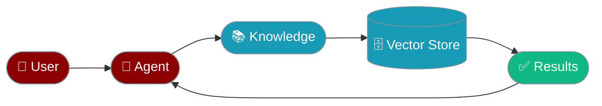
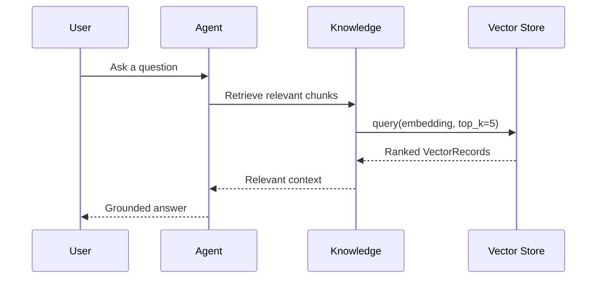
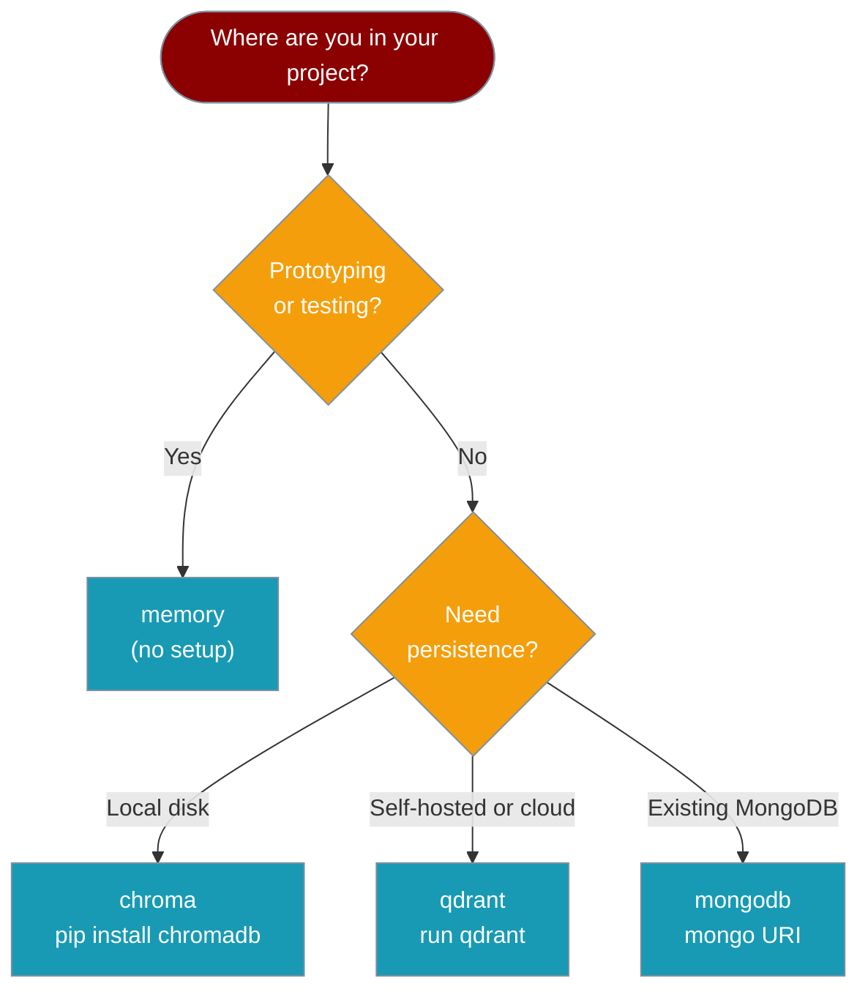

Vector stores hold the embeddings your agent searches over. Every agent that uses Knowledge, Memory, or RAG writes to and reads from one.



## Quick Start

<Steps>
<Step title="Default (In-Memory)">
Zero configuration — PraisonAI uses an in-memory vector store automatically when you pass `knowledge`.

```python
from praisonaiagents import Agent

agent = Agent(
    name="Research Assistant",
    instructions="Answer from the documents I share with you.",
    knowledge=["docs/handbook.pdf"],
)
agent.start("What's our refund policy?")
```
</Step>

<Step title="Persistent (Chroma)">
Keep embeddings on disk so they survive restarts. Pass `knowledge_config` with a `vector_store` key.

```python
from praisonaiagents import Agent

agent = Agent(
    name="Research Assistant",
    instructions="Answer from the documents I share with you.",
    knowledge=["docs/handbook.pdf"],
    knowledge_config={
        "vector_store": {
            "provider": "chroma",
            "config": {"collection_name": "handbook", "path": "./vector_db"},
        }
    },
)
agent.start("What's our refund policy?")
```
</Step>

<Step title="Cloud-Scale (Qdrant)">
Point to a running Qdrant server for high-volume or multi-agent deployments.

```python
from praisonaiagents import Agent

agent = Agent(
    name="Research Assistant",
    instructions="Answer from the documents I share with you.",
    knowledge=["docs/handbook.pdf"],
    knowledge_config={
        "vector_store": {
            "provider": "qdrant",
            "config": {"host": "localhost", "port": 6333},
        }
    },
)
agent.start("What's our refund policy?")
```
</Step>
</Steps>

---

## How It Works



At index time, source documents are chunked, embedded, and stored as `VectorRecord` objects. At query time, the question is embedded and the store returns the closest matches by cosine similarity.

---

## Choosing a Provider



| Provider | Use when | Persistence | Setup |
|----------|----------|-------------|-------|
| `memory` | Prototyping, tests | None (resets on restart) | None |
| `chroma` | Local persistence | Disk | `pip install chromadb` |
| `qdrant` | Self-hosted or cloud at scale | Server | Run qdrant |
| `mongodb` | Already using MongoDB | Server | Mongo URI |

---

## Configuration Options

<Card title="Vector Store API Reference" icon="code" href="/docs/sdk/praisonaiagents/knowledge/vector-store-module">
  All symbols, protocols, and registry methods — `VectorRecord`, `VectorStoreProtocol`, `VectorStoreRegistry`, `InMemoryVectorStore`
</Card>

### VectorRecord Fields

| Field | Type | Default | Description |
|-------|------|---------|-------------|
| `id` | `str` | — | Unique identifier |
| `text` | `str` | — | Text content |
| `embedding` | `List[float]` | — | Vector embedding |
| `metadata` | `Dict[str, Any]` | `{}` | Optional metadata |
| `score` | `Optional[float]` | `None` | Similarity score (set on query results) |

### VectorStoreProtocol Methods

| Method | Description |
|--------|-------------|
| `add(texts, embeddings, metadatas, ids, namespace)` | Add vectors; returns list of IDs |
| `query(embedding, top_k, namespace, filter)` | Find similar vectors; returns `List[VectorRecord]` |
| `delete(ids, namespace, filter, delete_all)` | Remove vectors; returns count deleted |
| `count(namespace)` | Number of stored vectors |
| `get(ids, namespace)` | Retrieve vectors by ID |

---

## Common Patterns

### Share One Store Across Multiple Agents

Pass the same `knowledge_config` to all agents in a team so they search the same index.

```python
from praisonaiagents import Agent, Agents

shared_config = {
    "vector_store": {
        "provider": "chroma",
        "config": {"collection_name": "company_docs", "path": "./vector_db"},
    }
}

researcher = Agent(
    name="Researcher",
    instructions="Find relevant information.",
    knowledge=["docs/"],
    knowledge_config=shared_config,
)

writer = Agent(
    name="Writer",
    instructions="Write a report based on research.",
    knowledge_config=shared_config,
)

team = Agents(agents=[researcher, writer])
team.start("Summarise our security policy.")
```

### Register a Custom Store

Any class that satisfies `VectorStoreProtocol` can be swapped in.

```python
from praisonaiagents.knowledge import get_vector_store_registry, VectorStoreProtocol

class MyStore:
    name = "my_store"

    def add(self, texts, embeddings, metadatas=None, ids=None, namespace=None):
        ...

    def query(self, embedding, top_k=10, namespace=None, filter=None):
        ...

    def delete(self, ids=None, namespace=None, filter=None, delete_all=False):
        ...

    def count(self, namespace=None):
        ...

    def get(self, ids, namespace=None):
        ...

get_vector_store_registry().register("my_store", lambda config=None, namespace=None: MyStore())
```

### Direct API Usage

Access the in-memory store directly for unit tests or offline indexing.

```python
from praisonaiagents.knowledge import get_vector_store_registry

store = get_vector_store_registry().get("memory")

store.add(
    texts=["PraisonAI builds agentic systems"],
    embeddings=[[0.1, 0.2, 0.3]],
    metadatas=[{"source": "readme"}],
)

results = store.query(embedding=[0.1, 0.2, 0.3], top_k=5)
for r in results:
    print(r.text, r.score)
```

---

## Best Practices

<AccordionGroup>
<Accordion title="Use memory for tests, not production">
`InMemoryVectorStore` (registered as `"memory"`) resets on every process restart. Use it in development and automated tests. Switch to `chroma`, `qdrant`, or `mongodb` before deploying to production.
</Accordion>

<Accordion title="Namespace per tenant for isolation">
Use namespaces to isolate data by user, project, or run — `"user:alice"`, `"project:docs-v2"`. This lets you share one store instance while keeping data strictly separated, and makes bulk deletion straightforward.
</Accordion>

<Accordion title="Match embedding dimensions to the model">
Every vector in a collection must have the same number of dimensions as the embedding model produces. Mixing models (e.g., OpenAI 1536-dim and a local 768-dim model) in the same collection will cause cosine similarity to produce incorrect scores or errors.
</Accordion>

<Accordion title="Register custom stores via VectorStoreRegistry, not subclassing">
Implement `VectorStoreProtocol` (five methods + a `name` attribute) and register a factory. The registry caches instances per `name:namespace` key, so your factory is called only once per combination — no singleton management needed.
</Accordion>
</AccordionGroup>

---

## Related

<CardGroup cols={2}>
<Card title="Knowledge" icon="book" href="/docs/concepts/knowledge">
  How agents load and search knowledge sources
</Card>
<Card title="Memory" icon="brain" href="/docs/concepts/memory">
  Persistent agent memory across sessions
</Card>
</CardGroup>
