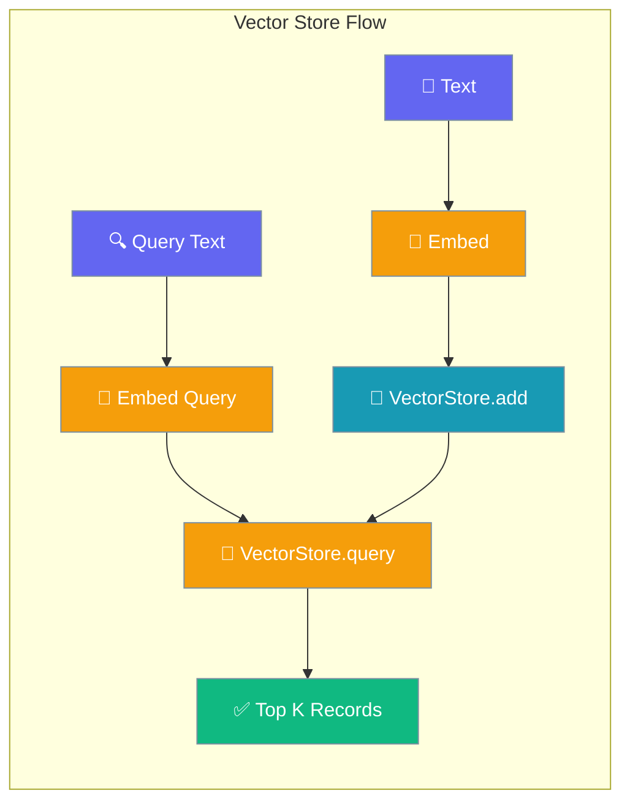
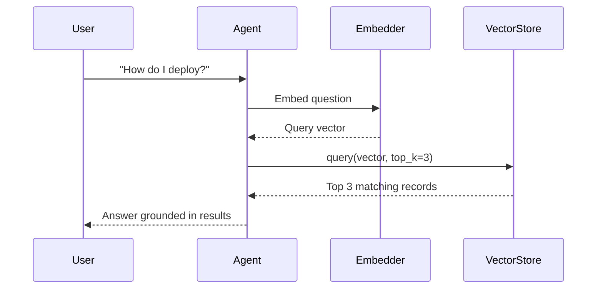
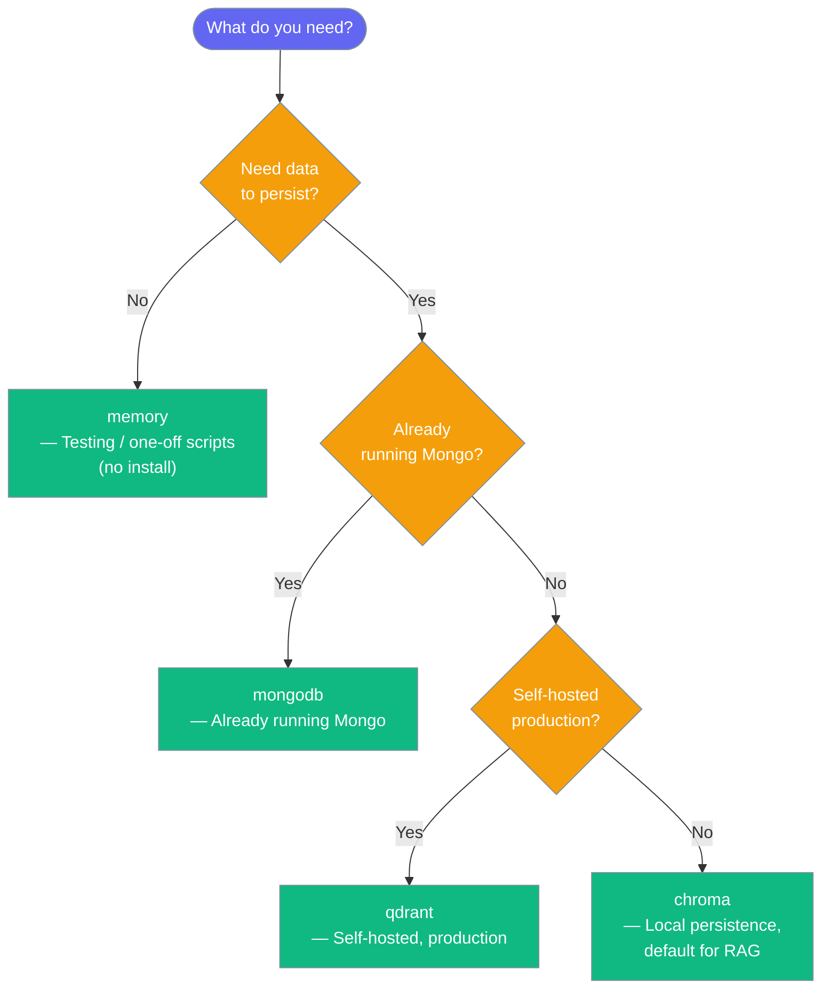
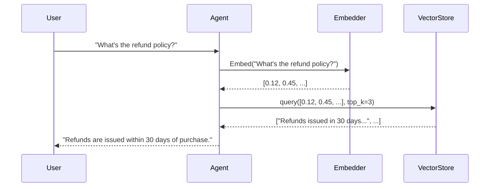

Vector Store keeps embeddings on disk or in memory so agents can recall the right context with one similarity query.



## Quick Start

<Steps>
<Step title="Simple Usage">
Pass `vector_store="memory"` to any agent — the built-in in-memory store starts immediately with no install.

```python
from praisonaiagents import Agent

agent = Agent(
    name="Researcher",
    instructions="Answer questions using indexed documents.",
    knowledge=["docs/manual.pdf"],
    vector_store="memory"
)

agent.start("How do I configure authentication?")
```
</Step>

<Step title="With Configuration">
Switch to a persistent backend by passing a dict with `provider` and `config`.

```python
from praisonaiagents import Agent

agent = Agent(
    name="Researcher",
    instructions="Answer questions using indexed documents.",
    knowledge=["docs/manual.pdf"],
    vector_store={
        "provider": "chroma",
        "config": {
            "path": "knowledge_db",
            "collection_name": "my_docs"
        }
    }
)

agent.start("How do I configure authentication?")
```
</Step>

<Step title="Direct Use (Advanced)">
Access the registry directly for fine-grained control over add, query, and delete operations.

```python
from praisonaiagents import Agent
from praisonaiagents.knowledge.vector_store import get_vector_store_registry

store = get_vector_store_registry().get("memory")

ids = store.add(
    texts=["PraisonAI builds agentic systems"],
    embeddings=[[0.1, 0.2, 0.3]],
    metadatas=[{"source": "readme"}],
)

results = store.query(embedding=[0.1, 0.2, 0.3], top_k=3)
for r in results:
    print(r.text, r.score)
```
</Step>
</Steps>

---

## How It Works

A user question flows through the agent into the vector store, which returns the closest matching content using cosine similarity.



| Method | What an agent uses it for |
|--------|--------------------------|
| `add` | Index new text chunks at ingest time |
| `query` | Find the most relevant chunks for a user question |
| `delete` | Remove outdated or user-deleted content |
| `count` | Check how many vectors are stored |
| `get` | Retrieve specific records by ID |

---

## Choosing a Backend

Pick the backend that fits your situation.



| Provider | Install needed | Persists data | Best for |
|----------|---------------|---------------|----------|
| `memory` | None | No | Testing, scripts |
| `chroma` | `pip install chromadb` | Yes | Local RAG |
| `qdrant` | `pip install qdrant-client` | Yes | Self-hosted production |
| `mongodb` | `pip install pymongo` | Yes | Existing Mongo stack |

---

## Configuration Options

<Card title="Vector Store API Reference" icon="code" href="/docs/sdk/praisonaiagents/knowledge/vector-store-module">
  Full reference for `VectorRecord`, `VectorStoreProtocol`, `VectorStoreRegistry`, and `InMemoryVectorStore`
</Card>

Common configuration knobs:

| Option | Type | Default | Description |
|--------|------|---------|-------------|
| `provider` | `str` | `"memory"` | Backend name: `"memory"`, `"chroma"`, `"qdrant"`, `"mongodb"` |
| `config.path` | `str` | `None` | Local storage path (Chroma) |
| `config.collection_name` | `str` | `None` | Collection or index name |
| `config.host` | `str` | `None` | Remote host (Qdrant, MongoDB) |
| `config.port` | `int` | `None` | Remote port |
| `namespace` | `str` | `"default"` | Data isolation key within one store |

---

## Common Patterns

### Per-Tenant Isolation with `namespace`

One store, separate data per customer — no separate database needed.

```python
from praisonaiagents.knowledge.vector_store import get_vector_store_registry

store = get_vector_store_registry().get("memory")

store.add(
    texts=["Alice's contract terms"],
    embeddings=[[0.1, 0.2, 0.3]],
    namespace="tenant:alice",
)

store.add(
    texts=["Bob's contract terms"],
    embeddings=[[0.4, 0.5, 0.6]],
    namespace="tenant:bob",
)

alice_results = store.query(
    embedding=[0.1, 0.2, 0.3],
    namespace="tenant:alice",
)
```

### Metadata Filtering at Query Time

Filter results to a specific source before similarity ranking.

```python
from praisonaiagents.knowledge.vector_store import get_vector_store_registry

store = get_vector_store_registry().get("memory")

store.add(
    texts=["Public FAQ entry", "Internal policy doc"],
    embeddings=[[0.1, 0.2], [0.3, 0.4]],
    metadatas=[{"source": "docs"}, {"source": "internal"}],
)

public_results = store.query(
    embedding=[0.1, 0.2],
    top_k=5,
    filter={"source": "docs"},
)
```

### Swapping `memory` → `chroma` for Persistence

Change one line to make an agent's knowledge survive restarts.

```python
from praisonaiagents import Agent

# Development — resets on restart
agent = Agent(
    name="Support",
    instructions="Answer support questions.",
    knowledge=["help_center/"],
    vector_store="memory",          # ← change this
)

# Production — persists to disk
agent = Agent(
    name="Support",
    instructions="Answer support questions.",
    knowledge=["help_center/"],
    vector_store={"provider": "chroma", "config": {"path": "kb"}},  # ← to this
)
```

---

## User Interaction Flow

A user asks a question → the agent embeds it → queries the vector store → uses the top matches as context → answers.



```python
from praisonaiagents import Agent

agent = Agent(
    name="Support",
    instructions="Answer questions using the knowledge base.",
    knowledge=["policies/refund.pdf"],
    vector_store={"provider": "chroma", "config": {"path": "kb"}}
)

response = agent.start("What is the refund policy?")
print(response)
```

---

## Best Practices

<AccordionGroup>
<Accordion title="Start with memory, switch to chroma for persistence">
`InMemoryVectorStore` (the `"memory"` backend) requires no install and is perfect for development and testing. When you need data to survive process restarts, change `vector_store="memory"` to `vector_store={"provider": "chroma", "config": {"path": "kb"}}` — the rest of the agent code stays identical.
</Accordion>

<Accordion title="Use namespace for multi-tenant isolation, not separate stores">
Running one store per tenant creates unnecessary operational overhead. Instead, pass `namespace="tenant:<id>"` on every `add` and `query` call. Data in different namespaces never mixes, and bulk deletion by namespace is a single `delete(namespace=..., delete_all=True)` call.
</Accordion>

<Accordion title="Pre-compute embeddings once and reuse via ids">
Embedding is the slowest step. If you re-index the same document, pass the original IDs via `add(..., ids=["doc-1", "doc-2"])`. The registry's instance cache means the same factory is called only once per `name:namespace` combination, so subsequent calls reuse the existing store without re-embedding.
</Accordion>

<Accordion title="Filter with metadata before re-ranking">
Applying `filter={"source": "docs"}` at query time skips irrelevant vectors before cosine similarity runs — much cheaper than scanning every vector and then discarding results. Add meaningful metadata (`source`, `category`, `user_id`) when calling `add` so filters stay fast regardless of collection size.
</Accordion>
</AccordionGroup>

---

## Related

<CardGroup cols={2}>
<Card title="Knowledge Storage" icon="database" href="/docs/knowledge/storage">
  How to configure different vector store backends for knowledge
</Card>
<Card title="Memory" icon="brain" href="/docs/concepts/memory">
  Memory subsystem that also uses vector stores for context recall
</Card>
</CardGroup>
