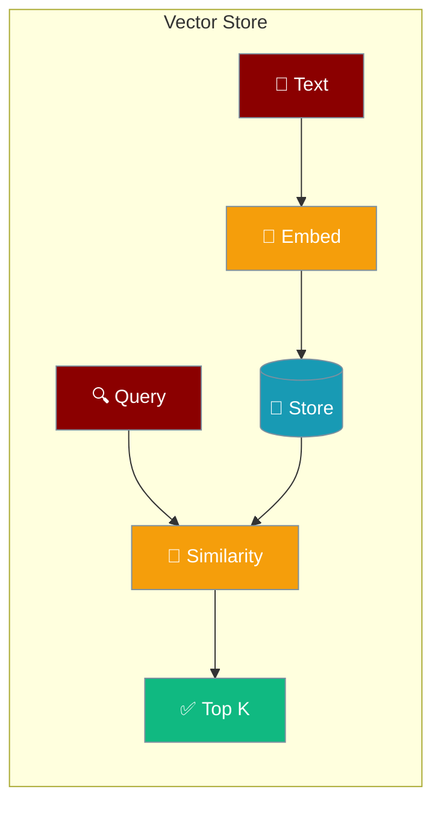
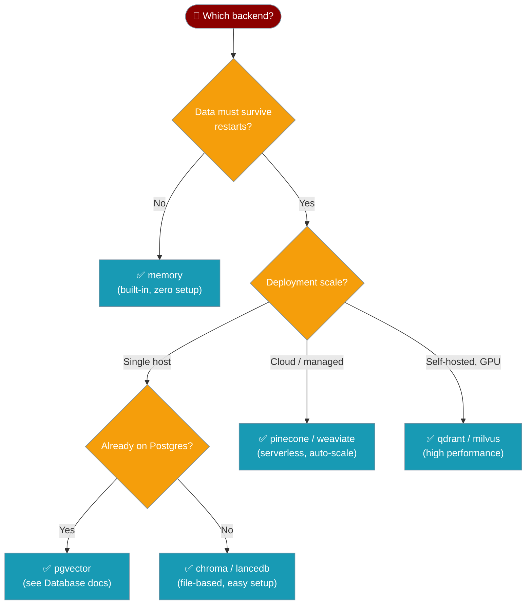
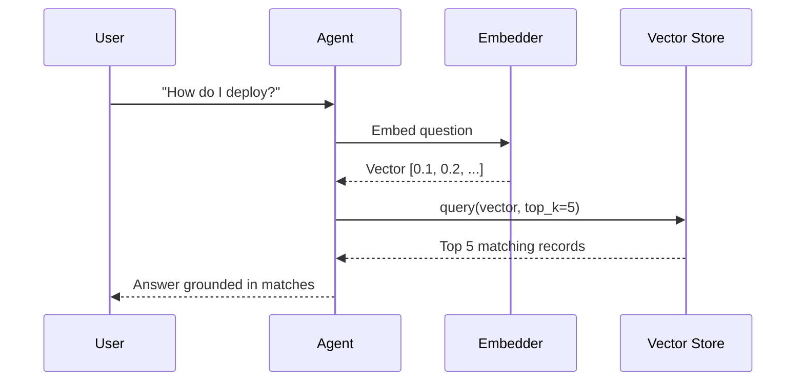

Store and retrieve text embeddings so your agent can recall relevant content instantly.

```python
from praisonaiagents import Agent

agent = Agent(
    name="Researcher",
    instructions="Answer using the indexed documents",
    knowledge=["docs/manual.pdf"],
)
agent.start("How do I configure authentication?")
```



## Quick Start

<Steps>
<Step title="Agent with Knowledge">
Give your agent a knowledge base — it automatically indexes and searches it for every question.

```python
from praisonaiagents import Agent

agent = Agent(
    name="Researcher",
    instructions="Answer using the indexed documents",
    knowledge=["docs/manual.pdf"]
)

agent.start("How do I configure authentication?")
```
</Step>

<Step title="Choose a Persistent Backend">
Switch to a database backend so knowledge survives restarts.

```python
from praisonaiagents import Agent, KnowledgeConfig

agent = Agent(
    name="Researcher",
    instructions="Answer using the indexed documents",
    knowledge=KnowledgeConfig(
        sources=["docs/manual.pdf"],
        vector_store={"provider": "chroma"},
    )
)

agent.start("How do I configure authentication?")
```
</Step>

<Step title="Direct Registry Usage">
Access the in-memory store directly to add and query vectors.

<Note>`get_vector_store_registry` is not re-exported from the top-level package — use the full module path below.</Note>

```python
from praisonaiagents.knowledge.vector_store import get_vector_store_registry

store = get_vector_store_registry().get("memory")

store.add(
    texts=["PraisonAI builds agentic systems"],
    embeddings=[[0.1, 0.2, 0.3]],
    metadatas=[{"source": "readme"}],
)

results = store.query(embedding=[0.1, 0.2, 0.3], top_k=5)
for r in results:
    print(r.text, r.score)
```
</Step>
</Steps>

---

## Which Backend Should I Use?



---

## How It Works

A user question flows through the agent to the vector store, which finds the closest matching content using cosine similarity.



---

## Configuration Options

<Card title="Vector Store API Reference" icon="code" href="/docs/sdk/praisonaiagents/knowledge/vector-store-module">
  Full API reference for `VectorRecord`, `VectorStoreProtocol`, `VectorStoreRegistry`, and `InMemoryVectorStore`
</Card>

### VectorRecord Fields

| Field | Type | Default | Description |
|-------|------|---------|-------------|
| `id` | `str` | — | Unique identifier |
| `text` | `str` | — | Text content |
| `embedding` | `List[float]` | — | Vector embedding |
| `metadata` | `Dict[str, Any]` | `{}` | Optional metadata |
| `score` | `Optional[float]` | `None` | Similarity score (set on query results) |

### VectorStoreProtocol Methods

| Method | Description |
|--------|-------------|
| `add(texts, embeddings, metadatas, ids, namespace)` | Add vectors; returns list of IDs |
| `query(embedding, top_k, namespace, filter)` | Find similar vectors; returns `List[VectorRecord]` |
| `delete(ids, namespace, filter, delete_all)` | Remove vectors; returns count deleted |
| `count(namespace)` | Number of stored vectors |
| `get(ids, namespace)` | Retrieve vectors by ID |

---

## Common Patterns

### Plug into an Agent's Knowledge

Wire a registered custom store into an agent via `KnowledgeConfig`.

```python
from praisonaiagents import Agent, KnowledgeConfig
from praisonaiagents.knowledge.vector_store import get_vector_store_registry

class MyStore:
    name = "my_store"

    def __init__(self, config=None, namespace=None):
        self._data = {}

    def add(self, texts, embeddings, metadatas=None, ids=None, namespace=None):
        import uuid
        ids = ids or [str(uuid.uuid4()) for _ in texts]
        for i, (text, emb) in enumerate(zip(texts, embeddings)):
            self._data[ids[i]] = {"text": text, "embedding": emb}
        return ids

    def query(self, embedding, top_k=10, namespace=None, filter=None):
        from praisonaiagents.knowledge.vector_store import VectorRecord
        return [VectorRecord(id=k, text=v["text"], embedding=v["embedding"]) for k, v in list(self._data.items())[:top_k]]

    def delete(self, ids=None, namespace=None, filter=None, delete_all=False):
        return 0

    def count(self, namespace=None):
        return len(self._data)

    def get(self, ids, namespace=None):
        from praisonaiagents.knowledge.vector_store import VectorRecord
        return [VectorRecord(id=k, text=self._data[k]["text"], embedding=self._data[k]["embedding"]) for k in ids if k in self._data]

get_vector_store_registry().register("my_store", MyStore)

agent = Agent(
    name="Assistant",
    instructions="Answer questions using the knowledge base",
    knowledge=KnowledgeConfig(
        sources=["docs/manual.pdf"],
        vector_store={"provider": "my_store"},
    )
)
```

### Custom Backend: Minimum Viable Adapter

Any class with these five methods and a `name` attribute works as a drop-in backend.

```python
from praisonaiagents.knowledge.vector_store import (
    get_vector_store_registry,
    VectorRecord,
    VectorStoreProtocol,
)
from typing import Any, Dict, List, Optional
import uuid

class DictVectorStore:
    name = "dict_store"

    def __init__(self, config=None, namespace=None):
        self._records: Dict[str, VectorRecord] = {}

    def add(self, texts, embeddings, metadatas=None, ids=None, namespace=None) -> List[str]:
        metadatas = metadatas or [{} for _ in texts]
        ids = ids or [str(uuid.uuid4()) for _ in texts]
        for text, emb, meta, id_ in zip(texts, embeddings, metadatas, ids):
            self._records[id_] = VectorRecord(id=id_, text=text, embedding=emb, metadata=meta)
        return ids

    def query(self, embedding, top_k=10, namespace=None, filter=None) -> List[VectorRecord]:
        return list(self._records.values())[:top_k]

    def delete(self, ids=None, namespace=None, filter=None, delete_all=False) -> int:
        if delete_all:
            n = len(self._records); self._records.clear(); return n
        removed = [self._records.pop(i) for i in (ids or []) if i in self._records]
        return len(removed)

    def count(self, namespace=None) -> int:
        return len(self._records)

    def get(self, ids, namespace=None) -> List[VectorRecord]:
        return [self._records[i] for i in ids if i in self._records]

assert isinstance(DictVectorStore(), VectorStoreProtocol)
get_vector_store_registry().register("dict_store", DictVectorStore)
store = get_vector_store_registry().get("dict_store")
```

### Filter by Metadata

Narrow query results to records that match specific metadata fields.

```python
from praisonaiagents.knowledge.vector_store import get_vector_store_registry

store = get_vector_store_registry().get("memory")

store.add(
    texts=["Chapter 1: Introduction", "Chapter 2: Advanced"],
    embeddings=[[0.1, 0.2], [0.3, 0.4]],
    metadatas=[{"chapter": 1}, {"chapter": 2}],
)

results = store.query(
    embedding=[0.1, 0.2],
    top_k=5,
    filter={"chapter": 1},
)
```

### Multi-Tenant Namespaces

Isolate data for different users or projects within the same store.

```python
from praisonaiagents.knowledge.vector_store import get_vector_store_registry

store = get_vector_store_registry().get("memory")

store.add(texts=["Alice's note"], embeddings=[[0.1, 0.2]], namespace="user:alice")
store.add(texts=["Bob's note"], embeddings=[[0.3, 0.4]], namespace="user:bob")

alice_results = store.query(embedding=[0.1, 0.2], namespace="user:alice")
```

### Delete Vectors

Remove specific records, filter-matched records, or all records in a namespace.

```python
from praisonaiagents.knowledge.vector_store import get_vector_store_registry

store = get_vector_store_registry().get("memory")

store.delete(ids=["record-123"])
store.delete(filter={"chapter": 1})
store.delete(namespace="user:alice", delete_all=True)
```

---

## Best Practices

<AccordionGroup>
<Accordion title="When to use the in-memory store">
`InMemoryVectorStore` (registered as `"memory"`) is ideal for development, testing, and short-lived agents. It requires no external dependencies and resets on process restart. Switch to a persistent backend when you need data to survive restarts or to scale beyond a single process.
</Accordion>

<Accordion title="When to upgrade from memory to a persistent backend">
Upgrade when any of these apply: data must survive a process restart, multiple processes need the same store, you have more than ~100k vectors, you need filtered queries at scale, or you are running in a multi-user environment. Chroma and LanceDB are good first steps — they write to disk with no server required.
</Accordion>

<Accordion title="Namespace strategy">
Use namespaces to isolate data by user, project, or run — `"user:alice"`, `"project:docs-v2"`, `"run:abc123"`. A well-chosen namespace strategy lets you share a single store instance while keeping data strictly separated, and makes bulk deletion straightforward with `delete_all=True`.
</Accordion>

<Accordion title="Cosine similarity and vector normalisation">
`InMemoryVectorStore` ranks results by cosine similarity. Cosine similarity measures angle, not magnitude, so two vectors pointing in the same direction score `1.0` regardless of length. If your embedding model already normalises output vectors (most do), results will be reliable. If not, normalise manually before calling `add` and `query` to avoid misleading scores. Mismatched embedding lengths return score `0.0`.
</Accordion>

<Accordion title="Registering custom backends">
Any object that satisfies `VectorStoreProtocol` can be registered. Implement the five methods (`add`, `query`, `delete`, `count`, `get`) and a `name` attribute, then call `registry.register("my_backend", factory)`. The registry caches instances per `name:namespace` key, so the factory is called only once per combination. Failures during initialization are logged and return `None` rather than raising.
</Accordion>
</AccordionGroup>

---

## Related

<CardGroup cols={2}>
<Card title="Knowledge Base" icon="book" href="/docs/features/knowledge">
  How agents load and search knowledge sources
</Card>
<Card title="Knowledge Backends" icon="database" href="/docs/features/knowledge-backends">
  Choose Chroma, LanceDB, Pinecone, and other backends
</Card>
</CardGroup>
