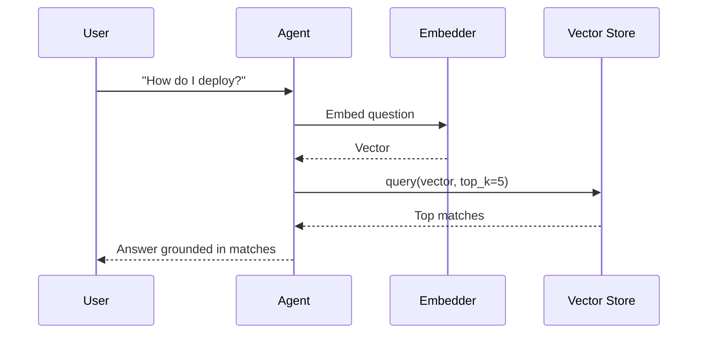
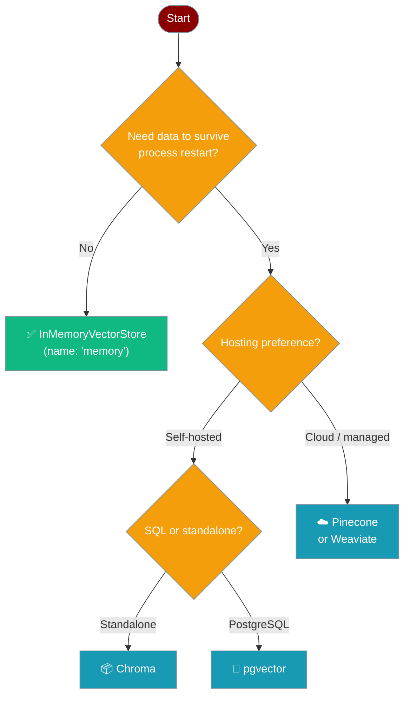

Store and retrieve text embeddings using a simple, pluggable backend — no external infrastructure needed to get started.


## Quick Start

<Steps>
<Step title="Agent with Knowledge">
The recommended way to use a vector store is through an agent's `knowledge` parameter — PraisonAI handles indexing and retrieval automatically. See the [Knowledge](/docs/concepts/knowledge) page for all supported source types.

```python
from praisonaiagents import Agent

agent = Agent(
    name="Researcher",
    instructions="Answer using the indexed documents",
    knowledge=["docs/manual.pdf"]
)

agent.start("How do I configure authentication?")
```
</Step>

<Step title="Direct API Usage">
Access the in-memory store directly to add and query vectors.

```python
from praisonaiagents.knowledge.vector_store import get_vector_store_registry

store = get_vector_store_registry().get("memory")

store.add(
    texts=["PraisonAI builds agentic systems"],
    embeddings=[[0.1, 0.2, 0.3]],
    metadatas=[{"source": "readme"}],
)

results = store.query(embedding=[0.1, 0.2, 0.3], top_k=5)
for r in results:
    print(r.text, r.score)
```
</Step>

<Step title="Register a Custom Store">
Swap in any vector database by registering a factory function, then use it directly in an agent.

```python
from praisonaiagents import Agent
from praisonaiagents.knowledge.vector_store import get_vector_store_registry

def make_my_store(config=None, namespace=None):
    return MyStore(config=config, namespace=namespace)

get_vector_store_registry().register("my_store", make_my_store)

agent = Agent(
    name="Researcher",
    instructions="Answer using stored knowledge",
    knowledge=["docs/manual.pdf"]
)

agent.start("Summarise the manual")
```
</Step>
</Steps>

---

## How It Works

A user question flows through the agent to the vector store, which finds the closest matching content using cosine similarity.



---

## Choosing a Backend

Pick the backend that matches your persistence and scale requirements.



<Note>
`InMemoryVectorStore` is the default — it requires zero dependencies and is always available. Register a persistent backend with `get_vector_store_registry().register(...)` to replace it.
</Note>

---

## Configuration Options

<Card title="Vector Store API Reference" icon="code" href="/docs/sdk/praisonaiagents/knowledge/vector-store-module">
  Full API reference for `VectorRecord`, `VectorStoreProtocol`, `VectorStoreRegistry`, and `InMemoryVectorStore`
</Card>

### VectorRecord Fields

| Field | Type | Default | Description |
|-------|------|---------|-------------|
| `id` | `str` | — | Unique identifier |
| `text` | `str` | — | Text content |
| `embedding` | `List[float]` | — | Vector embedding |
| `metadata` | `Dict[str, Any]` | `{}` | Optional metadata |
| `score` | `Optional[float]` | `None` | Similarity score (set on query results) |

### VectorStoreProtocol Methods

| Method | Description |
|--------|-------------|
| `add(texts, embeddings, metadatas, ids, namespace)` | Add vectors; returns list of IDs |
| `query(embedding, top_k, namespace, filter)` | Find similar vectors; returns `List[VectorRecord]` |
| `delete(ids, namespace, filter, delete_all)` | Remove vectors; returns count deleted |
| `count(namespace)` | Number of stored vectors |
| `get(ids, namespace)` | Retrieve vectors by ID |

---

## Common Patterns

### Filter by Metadata

Narrow query results to records that match specific metadata fields.

```python
from praisonaiagents.knowledge.vector_store import get_vector_store_registry

store = get_vector_store_registry().get("memory")

store.add(
    texts=["Chapter 1: Introduction", "Chapter 2: Advanced"],
    embeddings=[[0.1, 0.2], [0.3, 0.4]],
    metadatas=[{"chapter": 1}, {"chapter": 2}],
)

results = store.query(
    embedding=[0.1, 0.2],
    top_k=5,
    filter={"chapter": 1},
)
```

### Multi-Tenant Namespaces

Isolate data for different users or projects within the same store.

```python
from praisonaiagents.knowledge.vector_store import get_vector_store_registry

store = get_vector_store_registry().get("memory")

store.add(
    texts=["Alice's note"],
    embeddings=[[0.1, 0.2]],
    namespace="user:alice",
)

store.add(
    texts=["Bob's note"],
    embeddings=[[0.3, 0.4]],
    namespace="user:bob",
)

alice_results = store.query(embedding=[0.1, 0.2], namespace="user:alice")
```

### Delete Vectors

Remove specific records, filter-matched records, or all records in a namespace.

```python
from praisonaiagents.knowledge.vector_store import get_vector_store_registry

store = get_vector_store_registry().get("memory")

# Delete by ID
store.delete(ids=["record-123"])

# Delete by metadata filter
store.delete(filter={"chapter": 1})

# Clear an entire namespace
store.delete(namespace="user:alice", delete_all=True)
```

### Register a Custom Backend

Implement `VectorStoreProtocol` (five methods + `name`) and register a factory. The agent then uses the backend automatically through its `knowledge` parameter.

```python
from praisonaiagents import Agent
from praisonaiagents.knowledge.vector_store import (
    VectorRecord,
    get_vector_store_registry,
)
from typing import Any, Dict, List, Optional


class MyVectorStore:
    name = "my_store"

    def __init__(self, config=None, namespace=None):
        self._records: Dict[str, VectorRecord] = {}

    def add(self, texts, embeddings, metadatas=None, ids=None, namespace=None):
        import uuid
        metadatas = metadatas or [{} for _ in texts]
        ids = ids or [str(uuid.uuid4()) for _ in texts]
        for text, emb, meta, id_ in zip(texts, embeddings, metadatas, ids):
            self._records[id_] = VectorRecord(id=id_, text=text, embedding=emb, metadata=meta)
        return ids

    def query(self, embedding, top_k=10, namespace=None, filter=None):
        return list(self._records.values())[:top_k]

    def delete(self, ids=None, namespace=None, filter=None, delete_all=False):
        if delete_all:
            count = len(self._records)
            self._records.clear()
            return count
        removed = 0
        for id_ in (ids or []):
            if id_ in self._records:
                del self._records[id_]
                removed += 1
        return removed

    def count(self, namespace=None):
        return len(self._records)

    def get(self, ids, namespace=None):
        return [self._records[i] for i in ids if i in self._records]


get_vector_store_registry().register("my_store", MyVectorStore)

agent = Agent(
    name="Researcher",
    instructions="Answer using stored knowledge",
    knowledge=["docs/manual.pdf"]
)

agent.start("What is in the manual?")
```

---

## Best Practices

<AccordionGroup>
<Accordion title="When to use the in-memory store">
`InMemoryVectorStore` (registered as `"memory"`) is ideal for development, testing, and short-lived agents. It requires no external dependencies and resets on process restart. Switch to a persistent backend (Chroma, Pinecone, pgvector) when you need data to survive restarts or to scale beyond a single process.
</Accordion>

<Accordion title="Namespace strategy">
Use namespaces to isolate data by user, project, or run — `"user:alice"`, `"project:docs-v2"`, `"run:abc123"`. A well-chosen namespace strategy lets you share a single store instance while keeping data strictly separated, and makes bulk deletion straightforward.
</Accordion>

<Accordion title="Cosine similarity and vector normalisation">
`InMemoryVectorStore` ranks results by cosine similarity. Cosine similarity measures angle, not magnitude, so two vectors pointing in the same direction score `1.0` regardless of length. If your embedding model already normalises output vectors (most do), results will be reliable. Normalise manually before calling `add` and `query` if your model does not.
</Accordion>

<Accordion title="Registering custom backends">
Any object that satisfies `VectorStoreProtocol` can be registered. Implement the five methods (`add`, `query`, `delete`, `count`, `get`) and a `name` attribute, then call `registry.register("my_backend", factory)`. The registry caches instances per `name:namespace` key, so the factory is called only once per combination.
</Accordion>
</AccordionGroup>

---

## Related

<CardGroup cols={2}>
<Card title="Knowledge" icon="book" href="/docs/concepts/knowledge">
  How agents load and search knowledge sources
</Card>
<Card title="Store Types" icon="database" href="/docs/concepts/store-types">
  Compare vector, graph, and relational storage backends
</Card>
</CardGroup>
