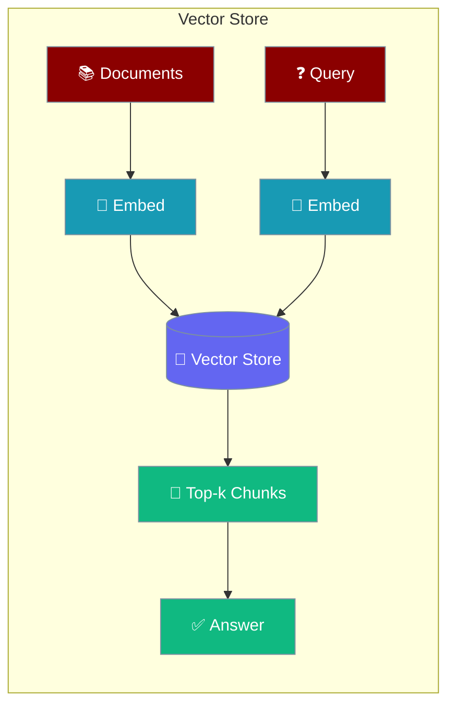
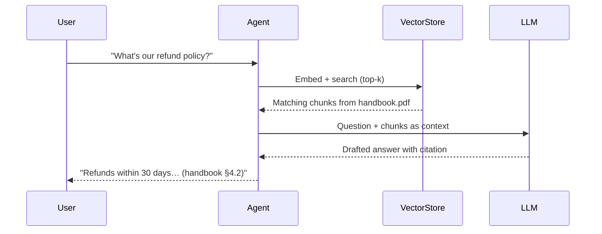
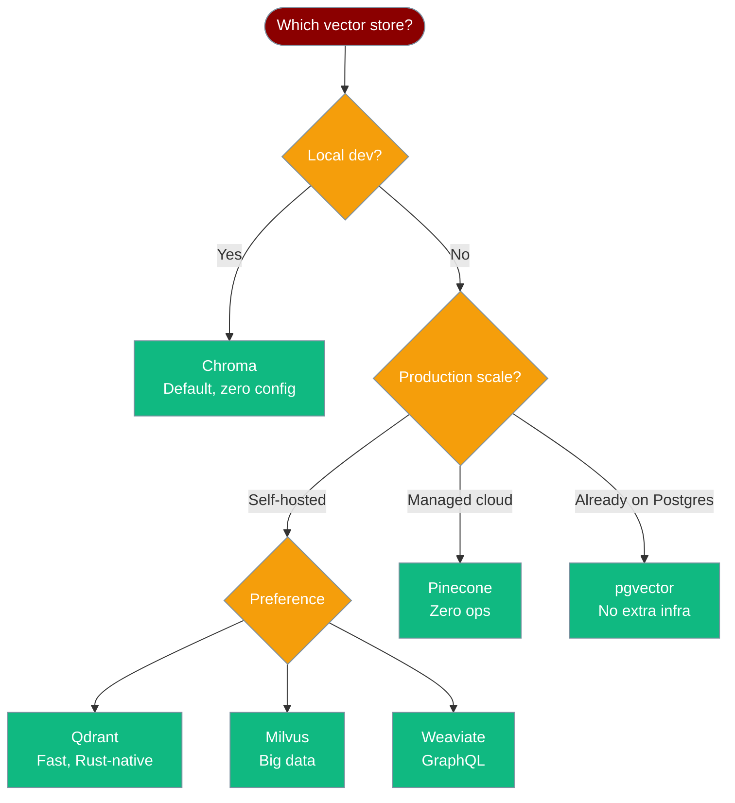

Vector stores let an agent remember and retrieve information by meaning, not by exact match.



## Quick Start

<Steps>
<Step title="Agent with Knowledge (auto vector store)">
Three lines — PraisonAI creates the vector store automatically:

```python
from praisonaiagents import Agent

agent = Agent(
    name="Research Assistant",
    instructions="Answer questions using stored knowledge",
    knowledge=["docs/handbook.pdf"]
)

agent.start("What's our refund policy?")
```
</Step>

<Step title="Choose a vector store provider">
Pass `knowledge_config` to pick a specific backend:

```python
from praisonaiagents import Agent

agent = Agent(
    name="Research Assistant",
    instructions="Answer questions using stored knowledge",
    knowledge=["docs/handbook.pdf"],
    knowledge_config={
        "vector_store": {
            "provider": "chroma",
            "config": {
                "collection_name": "handbook",
                "path": ".praison/vectors"
            }
        }
    }
)

agent.start("What's our refund policy?")
```
</Step>

<Step title="Use KnowledgeConfig for full control">
```python
from praisonaiagents import Agent, KnowledgeConfig

agent = Agent(
    name="Research Assistant",
    instructions="Answer questions using stored knowledge",
    knowledge=KnowledgeConfig(
        sources=["docs/handbook.pdf"],
        retrieval_k=5,
        rerank=True,
        vector_store={
            "provider": "chroma",
            "config": {
                "collection_name": "handbook",
                "path": ".praison/vectors"
            }
        }
    )
)

agent.start("What's our refund policy?")
```
</Step>
</Steps>

---

## How It Works



| Step | What happens |
|------|--------------|
| 1. Ingest | Documents are split into chunks, embedded, and stored |
| 2. Query | The user's question is embedded into a vector |
| 3. Search | Top-k most similar chunks are retrieved |
| 4. Answer | The LLM answers using those chunks as context |

---

## Choosing a Vector Store



| Provider | Best for | Docs |
|----------|----------|------|
| `chroma` | Local dev, zero setup | [ChromaDB](/docs/databases/chroma) |
| `qdrant` | Self-hosted, fast similarity search | [Qdrant](/docs/databases/qdrant) |
| `milvus` | High-volume, distributed | [Milvus](/docs/databases/milvus) |
| `weaviate` | GraphQL + vector search | [Weaviate](/docs/databases/weaviate) |
| `pinecone` | Managed cloud, zero ops | [Pinecone](/docs/databases/pinecone) |
| `pgvector` | Already on PostgreSQL | [pgvector](/docs/databases/pgvector) |
| `lancedb` | Embedded, columnar storage | [LanceDB](/docs/databases/lancedb) |

---

## Configuration Options

`KnowledgeConfig` controls the full vector store pipeline:

| Option | Type | Default | Description |
|--------|------|---------|-------------|
| `sources` | `List[str]` | `[]` | Files, directories, or URLs to ingest |
| `embedder` | `str` | `"openai"` | Embedding model provider |
| `embedder_config` | `dict` | `None` | Provider-specific embedder settings |
| `chunking_strategy` | `str` | `"semantic"` | How to split documents (`fixed`, `semantic`, `sentence`, `paragraph`) |
| `chunk_size` | `int` | `1000` | Target chunk size in tokens |
| `chunk_overlap` | `int` | `200` | Overlap between consecutive chunks |
| `retrieval_k` | `int` | `5` | Number of chunks to retrieve per query |
| `retrieval_threshold` | `float` | `0.0` | Minimum similarity score to include |
| `rerank` | `bool` | `False` | Enable reranking of retrieved chunks |
| `rerank_model` | `str` | `None` | Reranker model (uses default if None) |
| `auto_retrieve` | `bool` | `True` | Automatically inject retrieved context |
| `vector_store` | `dict` | `None` | Vector database config (provider + settings) |

The `vector_store` dict uses this structure:

```python
vector_store={
    "provider": "chroma",   # chroma | qdrant | pinecone | weaviate | milvus | pgvector
    "config": {
        "collection_name": "my_collection",
        "path": ".praison/vectors"   # local path (chroma only)
    }
}
```

---

## Common Patterns

### Persist across runs

Give the vector store a fixed path so documents are not re-embedded on every restart:

```python
from praisonaiagents import Agent

agent = Agent(
    name="Support Bot",
    instructions="Answer questions about our product",
    knowledge=["docs/"],
    knowledge_config={
        "vector_store": {
            "provider": "chroma",
            "config": {
                "collection_name": "support_docs",
                "path": ".praison/vectors"
            }
        }
    }
)
```

### Swap providers without changing agent code

Use a config dict so only the `provider` key changes between environments:

```python
import os
from praisonaiagents import Agent

vs_config = {
    "provider": os.getenv("VECTOR_STORE", "chroma"),
    "config": {
        "collection_name": "my_docs"
    }
}

agent = Agent(
    name="Assistant",
    instructions="Answer from the knowledge base",
    knowledge=["docs/"],
    knowledge_config={"vector_store": vs_config}
)
```

### Combine with memory for short-term + long-term recall

```python
from praisonaiagents import Agent

agent = Agent(
    name="Research Assistant",
    instructions="Answer questions using both stored documents and conversation history",
    knowledge=["docs/handbook.pdf"],
    memory=True
)

agent.start("Summarise the return policy and remember I asked about it")
```

---

## Best Practices

<AccordionGroup>
  <Accordion title="Choose the right chunk size">
    Smaller chunks (`chunk_size=256`) give precise retrieval; larger chunks (`chunk_size=1024`) give more context per result. Start at `500–1000` and tune based on your documents.
  </Accordion>
  <Accordion title="Enable reranking for higher accuracy">
    Set `rerank=True` when precision matters more than speed. Reranking re-scores the initial top-k results with a cross-encoder model, filtering out false positives.
  </Accordion>
  <Accordion title="Use namespaces for multi-tenant isolation">
    Each user or tenant should have their own namespace so searches don't bleed across users. Pass `namespace` in the vector store config when using Qdrant or Pinecone.
  </Accordion>
  <Accordion title="Set a similarity threshold">
    Use `retrieval_threshold=0.7` to skip low-confidence chunks. Without a threshold, even unrelated chunks can be injected into the context and confuse the LLM.
  </Accordion>
</AccordionGroup>

---

## Related

<CardGroup cols={2}>
  <Card icon="book" href="/docs/concepts/knowledge">
    Feed documents into an agent
  </Card>
  <Card icon="brain" href="/docs/concepts/memory">
    Long-term recall across sessions
  </Card>
  <Card icon="search" href="/docs/concepts/rag">
    RAG retrieval pipeline
  </Card>
  <Card icon="database" href="/docs/databases/overview">
    Per-database setup guides
  </Card>
</CardGroup>
