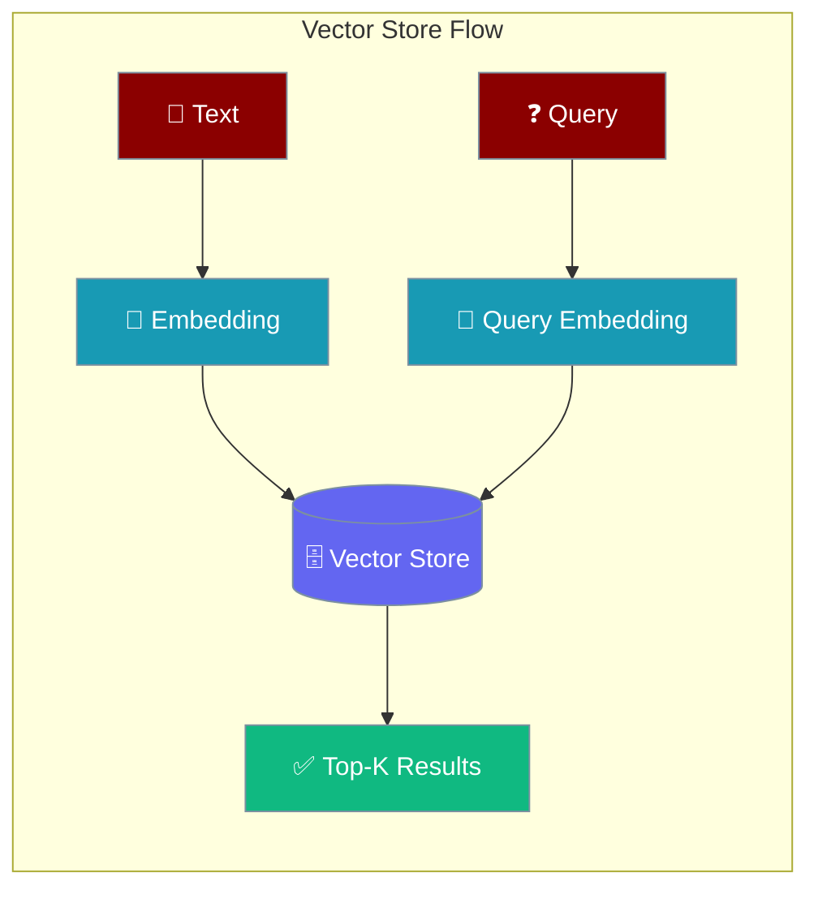
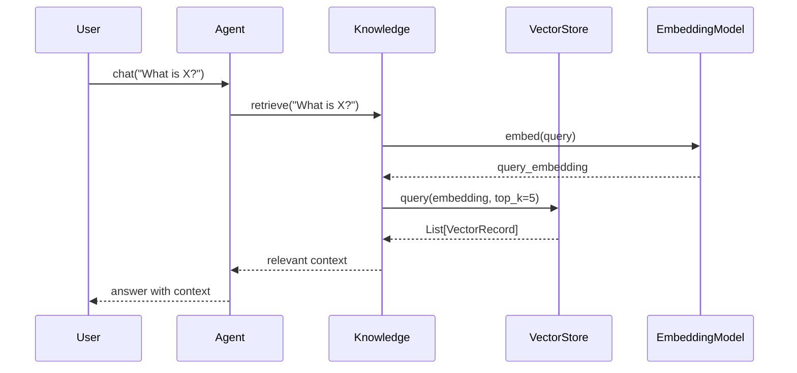
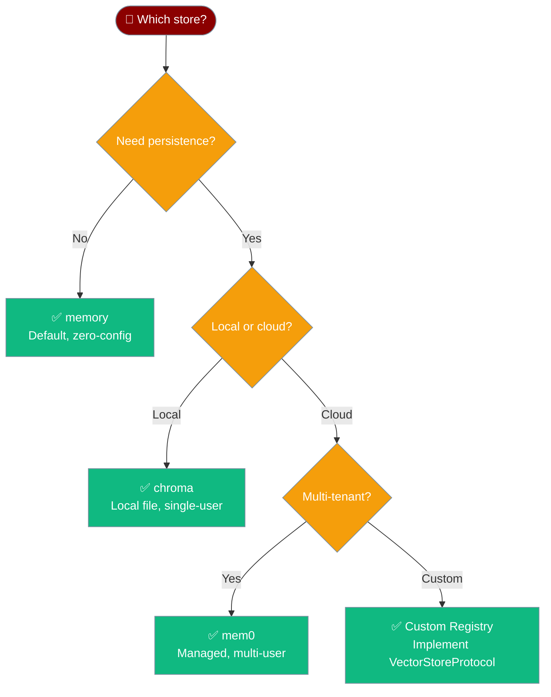

Vector Store gives agents a fast, pluggable layer for storing and searching text embeddings — backed by in-memory cosine similarity by default and swappable for Chroma, mem0, Pinecone, or any custom store.



## Quick Start

<Steps>
<Step title="Agent-centric — the simplest way">

Point an agent at a knowledge source. The default in-memory vector store handles everything automatically.

```python
from praisonaiagents import Agent

agent = Agent(
    name="ResearchAssistant",
    instructions="Answer questions using the provided documents.",
    knowledge=["./docs/"],
)

response = agent.chat("What are the main topics covered?")
print(response)
```

The in-memory vector store (`"memory"`) is auto-registered at import time — no extra setup needed.

</Step>

<Step title="Choose a vector store">

Pass a `vector_store` block inside `knowledge=` to switch providers.

```python
from praisonaiagents import Agent

# Default: in-memory (great for development)
agent = Agent(
    name="ResearchAssistant",
    instructions="Answer questions using the provided documents.",
    knowledge={
        "sources": ["./docs/"],
        "vector_store": {
            "provider": "memory",
        },
    },
)

# Production: ChromaDB (persistent, local)
agent = Agent(
    name="ResearchAssistant",
    instructions="Answer questions using the provided documents.",
    knowledge={
        "sources": ["./docs/"],
        "vector_store": {
            "provider": "chroma",
            "config": {
                "collection_name": "my_docs",
                "path": "./.praison/knowledge/my_docs",
            },
        },
    },
)
```

</Step>
</Steps>

---

## How It Works



| Phase | What Happens |
|-------|-------------|
| **Add** | Text is chunked and each chunk is embedded, then stored as a `VectorRecord` |
| **Embed** | The embedding model converts text to a float vector |
| **Query** | A query vector is compared against stored vectors using cosine similarity |
| **Return** | The top-K most similar `VectorRecord` objects are returned, sorted by score |

---

## Direct API (Advanced)

Use the registry directly when you need full control over embedding and retrieval.

```python
from praisonaiagents.knowledge import get_vector_store_registry

registry = get_vector_store_registry()
store = registry.get("memory")

# Add vectors (you supply the embeddings)
ids = store.add(
    texts=["PraisonAI supports multi-agent workflows."],
    embeddings=[[0.1, 0.2, 0.3]],  # your embedding model output
    metadatas=[{"source": "docs"}],
)

# Query by embedding
results = store.query(
    embedding=[0.1, 0.2, 0.3],
    top_k=5,
)

for r in results:
    print(r.text, r.score)
```

---

## Configuration Options

<CardGroup cols={2}>
  <Card title="Python SDK Reference" icon="code" href="/sdk/praisonaiagents/knowledge/vector-store-module">
    Full API reference for VectorRecord, VectorStoreProtocol, VectorStoreRegistry, and InMemoryVectorStore
  </Card>
  <Card title="Rust SDK Reference" icon="code" href="/rust/vector-store">
    Vector Store API for the Rust SDK
  </Card>
</CardGroup>

### VectorRecord Fields

| Field | Type | Default | Description |
|-------|------|---------|-------------|
| `id` | `str` | — | Unique identifier |
| `text` | `str` | — | The text content |
| `embedding` | `List[float]` | — | The vector embedding |
| `metadata` | `Dict[str, Any]` | `{}` | Optional metadata |
| `score` | `Optional[float]` | `None` | Similarity score (set on query results) |

### Core Method Arguments

| Method | Key Parameters | Returns |
|--------|---------------|---------|
| `add` | `texts`, `embeddings`, `metadatas=None`, `ids=None`, `namespace=None` | `List[str]` ids |
| `query` | `embedding`, `top_k=10`, `namespace=None`, `filter=None` | `List[VectorRecord]` |
| `delete` | `ids=None`, `namespace=None`, `filter=None`, `delete_all=False` | `int` count |
| `count` | `namespace=None` | `int` |
| `get` | `ids`, `namespace=None` | `List[VectorRecord]` |

---

## Common Patterns

### Namespaces for Multi-Tenant Isolation

Pass `namespace` to keep different users' data separate within one store.

```python
from praisonaiagents.knowledge import get_vector_store_registry

registry = get_vector_store_registry()
store = registry.get("memory")

# Add data scoped to a specific user
store.add(
    texts=["User Alice's document content."],
    embeddings=[[0.1, 0.2, 0.3]],
    namespace="user-alice",
)

# Query only Alice's data
results = store.query(
    embedding=[0.1, 0.2, 0.3],
    namespace="user-alice",
    top_k=5,
)

# Delete only Alice's data
store.delete(namespace="user-alice", delete_all=True)
```

### Metadata Filtering

Filter results at query time using a `filter` dict.

```python
from praisonaiagents.knowledge import get_vector_store_registry

registry = get_vector_store_registry()
store = registry.get("memory")

store.add(
    texts=["Internal policy document.", "Public FAQ entry."],
    embeddings=[[0.1, 0.2, 0.3], [0.4, 0.5, 0.6]],
    metadatas=[{"source": "internal"}, {"source": "public"}],
)

# Only return public documents
results = store.query(
    embedding=[0.1, 0.2, 0.3],
    filter={"source": "public"},
    top_k=5,
)
```

### Registering a Custom Store

Implement `VectorStoreProtocol` and register it with the global registry.

```python
from praisonaiagents.knowledge import get_vector_store_registry, VectorStoreProtocol, VectorRecord
from typing import Any, Dict, List, Optional

class MyVectorStore:
    name: str = "my_store"

    def __init__(self, config=None, namespace=None):
        self._data = {}

    def add(self, texts, embeddings, metadatas=None, ids=None, namespace=None):
        # your implementation
        return []

    def query(self, embedding, top_k=10, namespace=None, filter=None):
        return []

    def delete(self, ids=None, namespace=None, filter=None, delete_all=False):
        return 0

    def count(self, namespace=None):
        return 0

    def get(self, ids, namespace=None):
        return []

registry = get_vector_store_registry()
registry.register("my_store", MyVectorStore)

# Use in agent knowledge config
from praisonaiagents import Agent

agent = Agent(
    name="Assistant",
    instructions="Answer questions.",
    knowledge={
        "sources": ["./docs/"],
        "vector_store": {"provider": "my_store"},
    },
)
```

---

## Configuration Levels

The `knowledge.vector_store` block supports these configuration levels (most specific wins):

```python
# Level 1: String provider name (simplest)
agent = Agent(knowledge={"sources": ["./docs/"], "vector_store": {"provider": "memory"}})

# Level 2: Dict with provider config
agent = Agent(knowledge={
    "sources": ["./docs/"],
    "vector_store": {
        "provider": "chroma",
        "config": {"collection_name": "my_docs", "path": "./.praison/knowledge/my_docs"},
    },
})

# Level 3: KnowledgeConfig with vector_store field
from praisonaiagents import KnowledgeConfig

agent = Agent(knowledge=KnowledgeConfig(
    sources=["./docs/"],
    vector_store={"provider": "chroma", "config": {"collection_name": "my_docs"}},
))
```

---

## Choose Your Vector Store



---

## Best Practices

<AccordionGroup>
<Accordion title="Use namespaces, not separate stores, for multi-tenant apps">
A single `InMemoryVectorStore` (or Chroma collection) can serve many users safely via `namespace="user-{id}"`. Creating a separate store per user wastes memory and registry slots.
</Accordion>

<Accordion title="Pre-compute embeddings in batch when ingesting">
Call your embedding model once for all texts before calling `store.add()`. Batching reduces API round-trips and costs significantly for large document sets.

```python
texts = ["Doc 1 content", "Doc 2 content", "Doc 3 content"]
embeddings = my_embedding_model.embed_batch(texts)  # one call
store.add(texts=texts, embeddings=embeddings)
```
</Accordion>

<Accordion title="Match embedding model dimensions across add and query">
The `query` embedding must have the same number of dimensions as the stored embeddings. Mixing models (e.g., text-embedding-3-small for add, text-embedding-ada-002 for query) produces incorrect similarity scores.
</Accordion>

<Accordion title="Set top_k low (5–10) and rerank if quality matters">
Retrieving fewer candidates and then reranking with a cross-encoder gives better precision than a large `top_k` alone. See the [rerankers module](/sdk/praisonaiagents/knowledge/rerankers-module) for details.
</Accordion>
</AccordionGroup>

---

## Related

<CardGroup cols={2}>
  <Card title="Knowledge Backends" icon="database" href="/features/knowledge-backends">
    Configure Chroma, mem0, MongoDB, and other knowledge storage backends
  </Card>
  <Card title="RAG" icon="book-open" href="/concepts/rag">
    Retrieval-Augmented Generation concepts and patterns
  </Card>
  <Card title="Chunking Strategies" icon="scissors" href="/guides/rag/chunking">
    Control how documents are split before embedding
  </Card>
  <Card title="Embedding Providers" icon="vector-square" href="/embeddings/index">
    OpenAI, Cohere, HuggingFace, and other embedding model integrations
  </Card>
</CardGroup>
