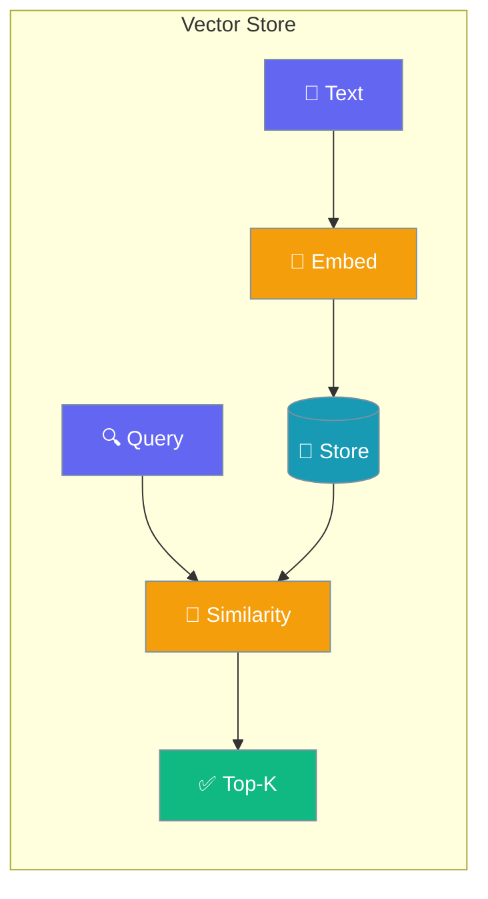
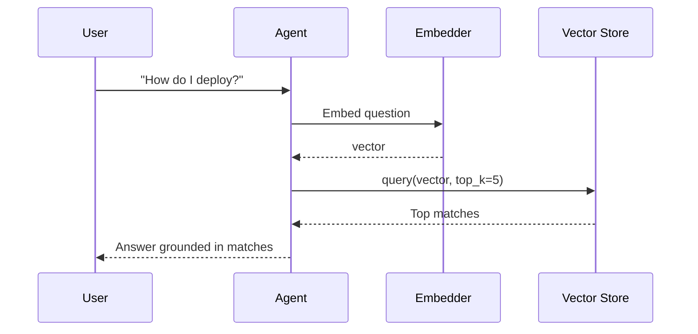
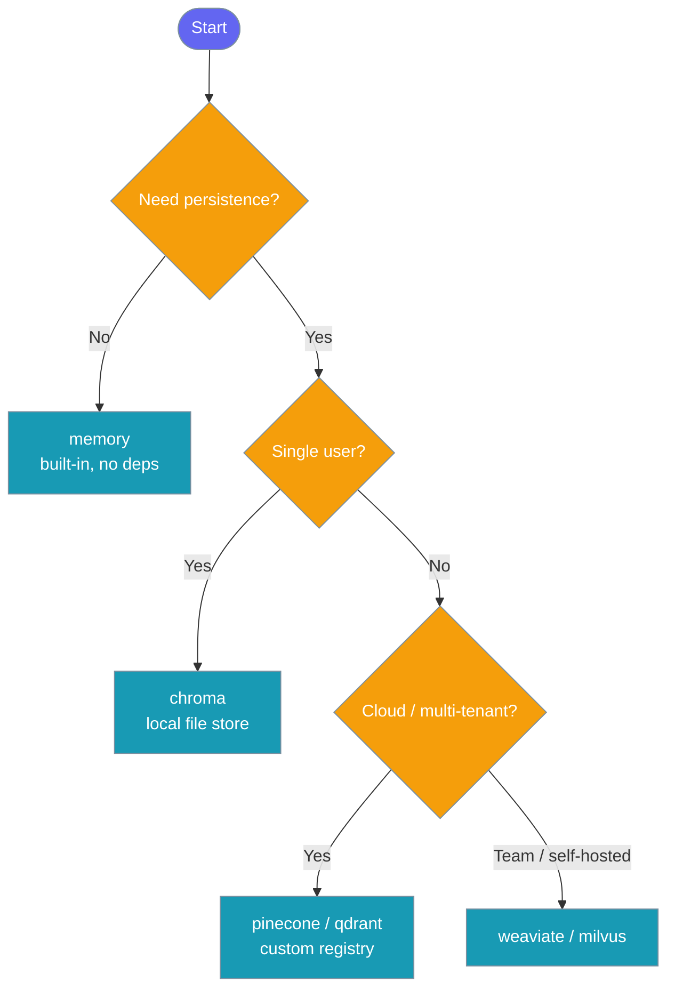

A vector store keeps your text and its embeddings together so an agent can find the closest match by meaning.



## Quick Start

<Steps>
<Step title="Agent with knowledge (recommended)">

The simplest way — pass files or text to `knowledge=` and PraisonAI handles embedding and storage automatically with the built-in in-memory store.

```python
from praisonaiagents import Agent

agent = Agent(
    name="Assistant",
    instructions="Answer questions using the knowledge provided.",
    knowledge=["docs/faq.pdf", "docs/guide.txt"],
)

response = agent.start("How do I reset my password?")
print(response)
```

</Step>

<Step title="Choose a backend">

Use the `vector_store` key inside `knowledge=` to pick a backend:

```python
from praisonaiagents import Agent

agent = Agent(
    name="Assistant",
    instructions="Answer questions using the knowledge provided.",
    knowledge={
        "sources": ["docs/faq.pdf"],
        "vector_store": {
            "provider": "memory",
        },
    },
)

response = agent.start("How do I reset my password?")
print(response)
```

Switch `"provider": "memory"` to `"chroma"`, `"pinecone"`, or any registered backend for production use.

</Step>
</Steps>

---

## How It Works



| Step | What happens |
|------|-------------|
| 1. Embed | Text is converted to a float vector by an embedding model |
| 2. Store | The vector + original text + metadata are saved in the store |
| 3. Query | At runtime, the question is embedded and compared to stored vectors |
| 4. Rank | Cosine similarity scores rank results; top-K are returned |

---

## Direct API (Advanced)

For full control, access the registry directly:

```python
from praisonaiagents.knowledge import (
    get_vector_store_registry,
    VectorRecord,
)

registry = get_vector_store_registry()
store = registry.get("memory")

ids = store.add(
    texts=["PraisonAI supports multi-agent workflows."],
    embeddings=[[0.1, 0.2, 0.3]],
    metadatas=[{"source": "docs"}],
)

results = store.query(embedding=[0.1, 0.2, 0.3], top_k=3)
for r in results:
    print(r.text, r.score)
```

<Tabs>
<Tab title="add()">

```python
ids = store.add(
    texts=["Hello world"],
    embeddings=[[0.1, 0.2, 0.3]],
    metadatas=[{"source": "readme"}],
    ids=["doc-001"],
    namespace="project-x",
)
```

</Tab>
<Tab title="query()">

```python
results = store.query(
    embedding=[0.1, 0.2, 0.3],
    top_k=5,
    namespace="project-x",
    filter={"source": "readme"},
)
```

</Tab>
<Tab title="delete()">

```python
deleted = store.delete(
    ids=["doc-001"],
    namespace="project-x",
)

all_deleted = store.delete(delete_all=True, namespace="project-x")
```

</Tab>
<Tab title="count() / get()">

```python
n = store.count(namespace="project-x")

records = store.get(ids=["doc-001"], namespace="project-x")
```

</Tab>
</Tabs>

---

## Configuration Options

### VectorRecord fields

| Field | Type | Default | Description |
|-------|------|---------|-------------|
| `id` | `str` | required | Unique identifier |
| `text` | `str` | required | The original text content |
| `embedding` | `List[float]` | required | The vector embedding |
| `metadata` | `Dict[str, Any]` | `{}` | Optional key-value metadata |
| `score` | `Optional[float]` | `None` | Similarity score (set on query results) |

<CardGroup cols={2}>
  <Card title="VectorStoreProtocol SDK Reference" icon="code" href="/docs/sdk/praisonaiagents/knowledge/vector-store-module">
    Full API: add, query, delete, count, get
  </Card>
  <Card title="Knowledge SDK Reference" icon="book" href="/docs/sdk/praisonaiagents/knowledge/knowledge">
    Knowledge class configuration options
  </Card>
</CardGroup>

---

## Common Patterns

### Namespaces for multi-tenant isolation

Separate data per user or project with the `namespace` parameter — no separate stores needed.

```python
from praisonaiagents.knowledge import get_vector_store_registry

registry = get_vector_store_registry()
store = registry.get("memory")

store.add(
    texts=["Alice's document"],
    embeddings=[[0.1, 0.2, 0.3]],
    namespace="user-alice",
)

store.add(
    texts=["Bob's document"],
    embeddings=[[0.4, 0.5, 0.6]],
    namespace="user-bob",
)

alice_results = store.query(embedding=[0.1, 0.2, 0.3], namespace="user-alice")
```

### Metadata filtering at query time

Filter results by exact metadata values to narrow results without re-embedding.

```python
results = store.query(
    embedding=[0.1, 0.2, 0.3],
    top_k=10,
    filter={"source": "docs", "version": "v2"},
)
```

<Note>
`filter` is **exact match** on metadata keys. Pre-normalise values (e.g. lowercase) before storing.
</Note>

### Registering a custom backend

Any class satisfying `VectorStoreProtocol` can be registered:

```python
from praisonaiagents.knowledge import (
    get_vector_store_registry,
    VectorStoreProtocol,
    VectorRecord,
)

class MyVectorStore:
    name = "my_store"

    def add(self, texts, embeddings, metadatas=None, ids=None, namespace=None):
        ...
        return ids

    def query(self, embedding, top_k=10, namespace=None, filter=None):
        ...
        return []

    def delete(self, ids=None, namespace=None, filter=None, delete_all=False):
        return 0

    def count(self, namespace=None):
        return 0

    def get(self, ids, namespace=None):
        return []

registry = get_vector_store_registry()
registry.register("my_store", lambda **kw: MyVectorStore())

store = registry.get("my_store")
```

---

## Which Backend Should I Use?



---

## Best Practices

<AccordionGroup>
<Accordion title="Use namespaces, not separate stores, for multi-tenant apps">
A single `InMemoryVectorStore` (or any backend) can hold data from many tenants by passing `namespace="user-123"` to every `add`, `query`, and `delete` call. This avoids the overhead of spinning up one store per user.
</Accordion>

<Accordion title="Match embedding dimensions between add and query">
Every vector passed to `add` and every query vector must come from the **same embedding model**. Mixing models (e.g. `text-embedding-3-small` at ingest, `text-embedding-ada-002` at query time) will produce incorrect similarity scores. The `InMemoryVectorStore` returns `0.0` for mismatched-length vectors without raising an error.
</Accordion>

<Accordion title="filter is exact-match — pre-normalise metadata values">
The `filter` argument to `query` and `delete` performs exact dict-key comparison on stored metadata. If you store `{"source": "Docs"}` but filter by `{"source": "docs"}`, nothing will match. Normalise values (lowercase, strip whitespace) before storing.
</Accordion>

<Accordion title="Pre-compute embeddings in batches when ingesting large corpora">
Call `store.add()` with a full batch of `texts` and `embeddings` at once rather than one record at a time. The in-memory store processes all items in a single pass, and production backends (Pinecone, Chroma) also benefit from batched upserts.
</Accordion>
</AccordionGroup>

---

## Related

<CardGroup cols={2}>
  <Card title="Knowledge Backends" icon="database" href="/features/knowledge-backends">
    Configure mem0, Chroma, and other knowledge backends
  </Card>
  <Card title="RAG Quick Start" icon="magnifying-glass" href="/features/rag">
    Build retrieval-augmented generation workflows
  </Card>
  <Card title="Chunking Strategies" icon="scissors" href="/features/chunking-strategies">
    Split documents before embedding for better recall
  </Card>
  <Card title="Knowledge" icon="book" href="/features/knowledge">
    Full knowledge base system with document processing
  </Card>
</CardGroup>
