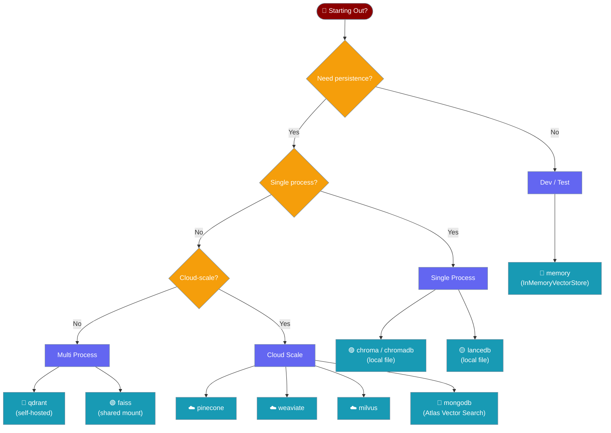
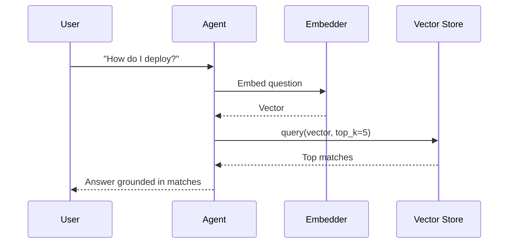
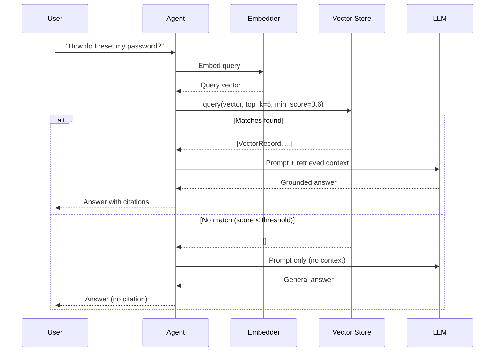

Store and retrieve text embeddings using a simple, pluggable backend — no external infrastructure needed to get started.


## Quick Start

<Steps>
<Step title="Agent with Knowledge (in-memory)">
The simplest way to use a vector store is through an agent's `knowledge` parameter — PraisonAI handles indexing and retrieval automatically using the in-memory backend.

```python
from praisonaiagents import Agent

agent = Agent(
    name="Researcher",
    instructions="Answer using the indexed documents",
    knowledge=["docs/manual.pdf"]
)

agent.start("How do I configure authentication?")
```
</Step>

<Step title="Agent with a Persistent Backend">
Point the agent at a Chroma collection so data survives process restarts. The `vector_store` block inside the knowledge config selects the provider and its connection details.

```python
from praisonaiagents import Agent, Knowledge

knowledge = Knowledge(config={
    "vector_store": {
        "provider": "chroma",
        "config": {
            "collection_name": "my_docs",
            "path": "./chroma_db"
        }
    }
})

agent = Agent(
    name="Researcher",
    instructions="Answer using the indexed documents",
    knowledge=["docs/manual.pdf"],
    knowledge_config=knowledge.config
)

agent.start("How do I configure authentication?")
```
</Step>

<Step title="Agent with Memory + Vector Store">
Use `Memory` with a `vector_store` block to persist conversation history across sessions. This is the right path when you need the agent to remember past interactions.

```python
from praisonaiagents import Agent
from praisonaiagents.memory.memory import Memory

memory = Memory(config={
    "provider": "mem0",
    "config": {
        "vector_store": {
            "provider": "qdrant",
            "config": {
                "host": "localhost",
                "port": 6333
            }
        },
        "embedder": {
            "provider": "openai",
            "config": {"model": "text-embedding-3-small"}
        }
    }
})

agent = Agent(
    name="Assistant",
    instructions="Help the user and remember our past conversations",
    memory=memory
)

agent.start("What did we discuss last time?")
```
</Step>

<Step title="Agent with RetrievalConfig">
`RetrievalConfig` is the unified surface for RAG pipelines — it replaces the older `knowledge_config` and `rag_config` parameters and adds reranking, hybrid search, and citation support.

```python
from praisonaiagents import Agent
from praisonaiagents.rag.retrieval_config import RetrievalConfig

retrieval = RetrievalConfig(
    vector_store_provider="chroma",
    vector_store_config={"path": "./chroma_db"},
    collection_name="product_docs",
    top_k=5,
    rerank=True,
    citations=True
)

agent = Agent(
    name="SupportBot",
    instructions="Answer product questions with cited sources",
    knowledge=["docs/product-guide.pdf"],
    retrieval_config=retrieval
)

agent.start("What are the system requirements?")
```
</Step>
</Steps>

---

## Choose a Backend

Pick the right backend for your deployment scenario.



---

## How It Works

A user question flows through the agent to the vector store, which finds the closest matching content using cosine similarity.



### User-Interaction Flow

A non-developer asking a question ends up routed through the agent, into the store, and back — with a "no match" fallback.



---

## Configuration Options

<Card title="Vector Store API Reference" icon="code" href="/docs/sdk/praisonaiagents/knowledge/vector-store-module">
  Full API reference for `VectorRecord`, `VectorStoreProtocol`, `VectorStoreRegistry`, and `InMemoryVectorStore`
</Card>

### VectorRecord Fields

| Field | Type | Default | Description |
|-------|------|---------|-------------|
| `id` | `str` | — | Unique identifier |
| `text` | `str` | — | Text content |
| `embedding` | `List[float]` | — | Vector embedding |
| `metadata` | `Dict[str, Any]` | `{}` | Optional metadata |
| `score` | `Optional[float]` | `None` | Similarity score (set on query results) |

### VectorStoreProtocol Methods

| Method | Description |
|--------|-------------|
| `add(texts, embeddings, metadatas, ids, namespace)` | Add vectors; returns list of IDs |
| `query(embedding, top_k, namespace, filter)` | Find similar vectors; returns `List[VectorRecord]` |
| `delete(ids, namespace, filter, delete_all)` | Remove vectors; returns count deleted |
| `count(namespace)` | Number of stored vectors |
| `get(ids, namespace)` | Retrieve vectors by ID |

### Where to Configure

Each agent entry point wires the vector store differently — pick the one that matches your use case.

| Entry point | SDK file | When to use |
|---|---|---|
| `Agent(knowledge=[...])` | `praisonaiagents/knowledge/knowledge.py` | Read-only docs, simple grounding |
| `Knowledge(config={"vector_store": ...})` | `praisonaiagents/knowledge/knowledge.py` | Pick a specific backend for knowledge indexing |
| `Memory(config={"config": {"vector_store": ...}})` | `praisonaiagents/memory/memory.py` | Long-term memory across sessions |
| `RetrievalConfig(vector_store_provider=...)` | `praisonaiagents/rag/retrieval_config.py` | Unified RAG with reranking / hybrid / citations |
| `get_vector_store_registry().get(name)` | `praisonaiagents/knowledge/vector_store.py` | Direct, low-level access |

### RetrievalConfig Fields

| Field | Type | Default | Description |
|-------|------|---------|-------------|
| `vector_store_provider` | `str` | `"chroma"` | Backend name |
| `vector_store_config` | `Dict[str, Any]` | `{}` | Provider-specific config |
| `collection_name` | `Optional[str]` | `None` | Collection / index name |
| `persist_path` | `str` | project data dir | Storage path |
| `top_k` | `int` | `5` | Number of chunks to retrieve |
| `min_score` | `float` | `0.0` | Minimum relevance threshold |
| `rerank` | `bool` | `False` | Rerank results for better relevance |
| `hybrid` | `bool` | `False` | Dense + keyword hybrid retrieval |
| `citations` | `bool` | `True` | Include source citations |
| `citations_mode` | `CitationsMode` | `APPEND` | `append`, `inline`, or `hidden` |

---

## Common Patterns

### Filter by Metadata

Narrow query results to records that match specific metadata fields.

```python
from praisonaiagents.knowledge.vector_store import get_vector_store_registry

store = get_vector_store_registry().get("memory")

store.add(
    texts=["Chapter 1: Introduction", "Chapter 2: Advanced"],
    embeddings=[[0.1, 0.2], [0.3, 0.4]],
    metadatas=[{"chapter": 1}, {"chapter": 2}],
)

results = store.query(
    embedding=[0.1, 0.2],
    top_k=5,
    filter={"chapter": 1},
)
```

### Multi-Tenant Namespaces

Isolate data for different users or projects within the same store.

```python
from praisonaiagents.knowledge.vector_store import get_vector_store_registry

store = get_vector_store_registry().get("memory")

store.add(
    texts=["Alice's note"],
    embeddings=[[0.1, 0.2]],
    namespace="user:alice",
)

store.add(
    texts=["Bob's note"],
    embeddings=[[0.3, 0.4]],
    namespace="user:bob",
)

alice_results = store.query(embedding=[0.1, 0.2], namespace="user:alice")
```

### Delete Vectors

Remove specific records, filter-matched records, or all records in a namespace.

```python
from praisonaiagents.knowledge.vector_store import get_vector_store_registry

store = get_vector_store_registry().get("memory")

# Delete by ID
store.delete(ids=["record-123"])

# Delete by metadata filter
store.delete(filter={"chapter": 1})

# Clear an entire namespace
store.delete(namespace="user:alice", delete_all=True)
```

### Plug in a Custom Backend End-to-End

Implement `VectorStoreProtocol`, register the factory, and use it from an agent — no other changes required.

```python
import uuid
from typing import Any, Dict, List, Optional
from praisonaiagents.knowledge.vector_store import (
    VectorRecord,
    get_vector_store_registry,
)
from praisonaiagents import Agent


class MyStore:
    """Minimal in-process store — replace the dict with your real backend."""

    name = "my_store"

    def __init__(self, config=None, namespace=None):
        self._data: Dict[str, VectorRecord] = {}

    def add(
        self,
        texts: List[str],
        embeddings: List[List[float]],
        metadatas: Optional[List[Dict[str, Any]]] = None,
        ids: Optional[List[str]] = None,
        namespace: Optional[str] = None,
    ) -> List[str]:
        ids = ids or [str(uuid.uuid4()) for _ in texts]
        for i, (text, emb) in enumerate(zip(texts, embeddings)):
            record = VectorRecord(
                id=ids[i],
                text=text,
                embedding=emb,
                metadata=(metadatas[i] if metadatas else {}),
            )
            self._data[ids[i]] = record
        return ids

    def query(
        self,
        embedding: List[float],
        top_k: int = 10,
        namespace: Optional[str] = None,
        filter: Optional[Dict[str, Any]] = None,
    ) -> List[VectorRecord]:
        import math

        def cosine(a, b):
            dot = sum(x * y for x, y in zip(a, b))
            na = math.sqrt(sum(x * x for x in a))
            nb = math.sqrt(sum(x * x for x in b))
            return dot / (na * nb) if na and nb else 0.0

        scored = []
        for record in self._data.values():
            if filter and not all(record.metadata.get(k) == v for k, v in filter.items()):
                continue
            score = cosine(embedding, record.embedding)
            scored.append(VectorRecord(**{**record.__dict__, "score": score}))

        scored.sort(key=lambda r: r.score or 0, reverse=True)
        return scored[:top_k]

    def delete(
        self,
        ids: Optional[List[str]] = None,
        namespace: Optional[str] = None,
        filter: Optional[Dict[str, Any]] = None,
        delete_all: bool = False,
    ) -> int:
        if delete_all:
            count = len(self._data)
            self._data.clear()
            return count
        removed = 0
        for rid in (ids or []):
            if rid in self._data:
                del self._data[rid]
                removed += 1
        return removed

    def count(self, namespace: Optional[str] = None) -> int:
        return len(self._data)

    def get(self, ids: List[str], namespace: Optional[str] = None) -> List[VectorRecord]:
        return [self._data[i] for i in ids if i in self._data]


# Register once at startup
get_vector_store_registry().register("my_store", MyStore)

# Use it from an agent via the low-level API
store = get_vector_store_registry().get("my_store")
store.add(
    texts=["Hello from my custom store"],
    embeddings=[[0.1, 0.2, 0.3]],
)
results = store.query(embedding=[0.1, 0.2, 0.3], top_k=1)
print(results[0].text)
```

---

## Best Practices

<AccordionGroup>
<Accordion title="When to use the in-memory store">
`InMemoryVectorStore` (registered as `"memory"`) is ideal for development, testing, and short-lived agents. It requires no external dependencies and resets on process restart. Switch to a persistent backend (Chroma, Pinecone, pgvector) when you need data to survive restarts or to scale beyond a single process.
</Accordion>

<Accordion title="Namespace strategy">
Use namespaces to isolate data by user, project, or run — `"user:alice"`, `"project:docs-v2"`, `"run:abc123"`. A well-chosen namespace strategy lets you share a single store instance while keeping data strictly separated, and makes bulk deletion straightforward.
</Accordion>

<Accordion title="Cosine similarity and vector normalisation">
`InMemoryVectorStore` ranks results by cosine similarity. Cosine similarity measures angle, not magnitude, so two vectors pointing in the same direction score `1.0` regardless of length. If your embedding model already normalises output vectors (most do), results will be reliable. If it does not, normalise manually before calling `add` and `query` to avoid misleading scores.
</Accordion>

<Accordion title="Registering custom backends">
Any object that satisfies `VectorStoreProtocol` can be registered. Implement the five methods (`add`, `query`, `delete`, `count`, `get`) and a `name` attribute, then call `registry.register("my_backend", factory)`. The registry caches instances per `name:namespace` key, so the factory is called only once per combination.
</Accordion>

<Accordion title="When to upgrade from in-memory">
Switch away from `InMemoryVectorStore` when you hit any of these triggers:
- **Persistence** — data must survive process restart (use Chroma local or LanceDB).
- **Multi-process** — more than one worker reads and writes the same index (use Qdrant or Faiss on a shared mount).
- **Scale-out** — index exceeds available RAM or you need SLA-backed uptime (use Pinecone, Weaviate, Milvus, or MongoDB Atlas Vector Search).
- **Citations and reranking** — switch to `RetrievalConfig` with `rerank=True` and `citations=True`; pair with a persistent backend for reproducible results.
</Accordion>
</AccordionGroup>

---

## Related

<CardGroup cols={2}>
<Card title="Knowledge" icon="book" href="/docs/concepts/knowledge">
  How agents load and search knowledge sources
</Card>
<Card title="Store Types" icon="database" href="/docs/concepts/store-types">
  Compare vector, graph, and relational storage backends
</Card>
<Card title="Knowledge Backends" icon="server" href="/docs/features/knowledge-backends">
  Configure Chroma, Pinecone, Qdrant and other providers
</Card>
<Card title="RAG" icon="magnifying-glass" href="/docs/features/rag">
  Retrieval-augmented generation pipeline and RetrievalConfig
</Card>
</CardGroup>
