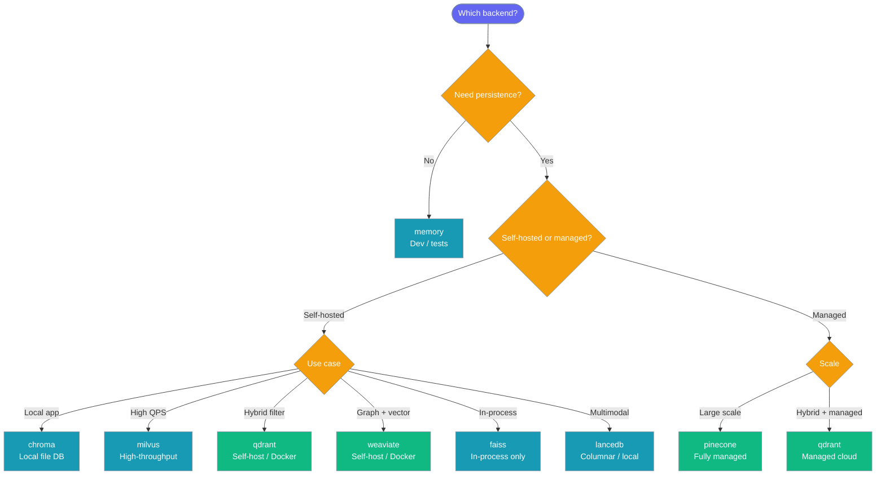
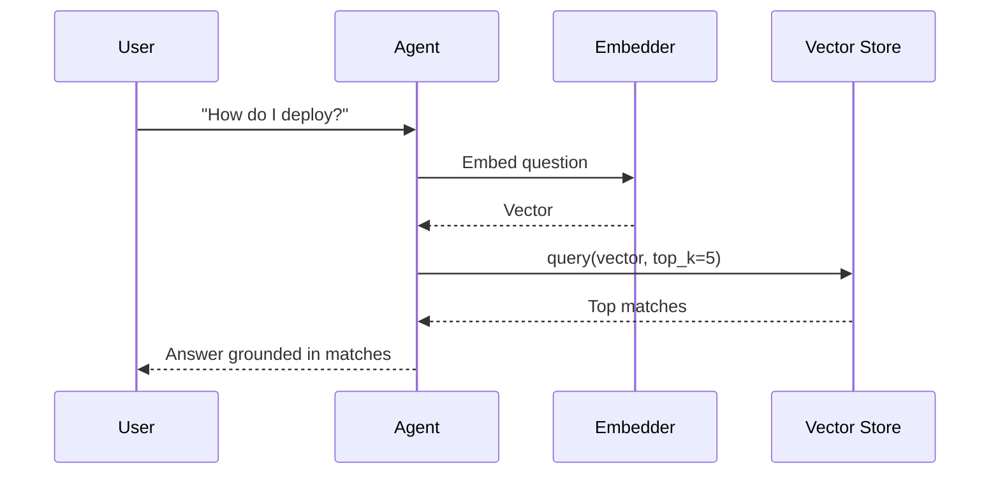

Store and retrieve text embeddings using a simple, pluggable backend — no external infrastructure needed to get started.


## Quick Start

<Steps>
<Step title="Agent with Default Store">
Pass documents to an agent — PraisonAI indexes them in memory automatically.

```python
from praisonaiagents import Agent

agent = Agent(
    name="Researcher",
    instructions="Answer using the indexed documents",
    knowledge=["docs/manual.pdf"],
)

agent.start("How do I configure authentication?")
```
</Step>

<Step title="Choose a Persistent Backend">
Select any vector database by adding a `vector_store` key to the `knowledge` dict.

```python
from praisonaiagents import Agent

agent = Agent(
    name="Researcher",
    instructions="Answer using the indexed documents",
    knowledge={
        "sources": ["docs/manual.pdf"],
        "vector_store": {
            "provider": "chroma",
            "config": {
                "collection_name": "manual",
                "path": ".praison",
            },
        },
    },
)

agent.start("How do I configure authentication?")
```
</Step>

<Step title="Typed Config (KnowledgeConfig)">
Use `KnowledgeConfig` for autocomplete and type checking — identical behaviour to the dict form.

```python
from praisonaiagents import Agent
from praisonaiagents.config.feature_configs import KnowledgeConfig

agent = Agent(
    name="Researcher",
    instructions="Answer using the indexed documents",
    knowledge=KnowledgeConfig(
        sources=["docs/manual.pdf"],
        vector_store={
            "provider": "chroma",
            "config": {
                "collection_name": "manual",
                "path": ".praison",
            },
        },
    ),
)

agent.start("How do I configure authentication?")
```

See [Knowledge](/docs/concepts/knowledge) for the full `KnowledgeConfig` reference.
</Step>
</Steps>

---

## Choose a Backend



### Backend Comparison

| Provider | Persistence | Setup | Best for |
|----------|-------------|-------|----------|
| `memory` | ❌ | None | Dev, tests, ephemeral agents |
| `chroma` | ✅ (local) | `pip install chromadb markitdown` | Local apps, single machine |
| `qdrant` | ✅ | Docker / managed | Hybrid filter + similarity |
| `pinecone` | ✅ (managed) | API key | Large-scale prod, no ops |
| `weaviate` | ✅ | Docker / managed | Knowledge graphs + vectors |
| `milvus` | ✅ | Docker / managed | High-QPS workloads |
| `faiss` | ⚠️ (file dump) | `pip install faiss-cpu` | In-process, no server |
| `lancedb` | ✅ (local) | `pip install lancedb` | Multimodal, columnar |

---

## Per-Provider Examples

<Tabs>
<Tab title="memory">
```python
from praisonaiagents import Agent

agent = Agent(
    name="Researcher",
    instructions="Answer using the indexed documents",
    knowledge={
        "sources": ["docs/manual.pdf"],
        "vector_store": {"provider": "memory"},
    },
)
agent.start("What is the setup process?")
```
</Tab>

<Tab title="chroma">
```python
from praisonaiagents import Agent

agent = Agent(
    name="Researcher",
    instructions="Answer using the indexed documents",
    knowledge={
        "sources": ["docs/manual.pdf"],
        "vector_store": {
            "provider": "chroma",
            "config": {"collection_name": "manual", "path": ".praison"},
        },
    },
)
agent.start("What is the setup process?")
```
</Tab>

<Tab title="qdrant">
```python
from praisonaiagents import Agent

agent = Agent(
    name="Researcher",
    instructions="Answer using the indexed documents",
    knowledge={
        "sources": ["docs/manual.pdf"],
        "vector_store": {
            "provider": "qdrant",
            "config": {
                "collection_name": "manual",
                "url": "http://localhost:6333",
            },
        },
    },
)
agent.start("What is the setup process?")
```
</Tab>

<Tab title="pinecone">
```python
from praisonaiagents import Agent

agent = Agent(
    name="Researcher",
    instructions="Answer using the indexed documents",
    knowledge={
        "sources": ["docs/manual.pdf"],
        "vector_store": {
            "provider": "pinecone",
            "config": {
                "index_name": "manual",
                "api_key": "YOUR_PINECONE_API_KEY",
            },
        },
    },
)
agent.start("What is the setup process?")
```
</Tab>
</Tabs>

---

## How It Works

A user question flows through the agent to the vector store, which finds the closest matching content using cosine similarity.



---

## Configuration Options

<Card title="Vector Store API Reference" icon="code" href="/docs/sdk/praisonaiagents/knowledge/vector-store-module">
  Full API reference for `VectorRecord`, `VectorStoreProtocol`, `VectorStoreRegistry`, and `InMemoryVectorStore`
</Card>

### VectorRecord Fields

| Field | Type | Default | Description |
|-------|------|---------|-------------|
| `id` | `str` | — | Unique identifier |
| `text` | `str` | — | Text content |
| `embedding` | `List[float]` | — | Vector embedding |
| `metadata` | `Dict[str, Any]` | `{}` | Optional metadata |
| `score` | `Optional[float]` | `None` | Similarity score (set on query results) |

### VectorStoreProtocol Methods

| Method | Description |
|--------|-------------|
| `add(texts, embeddings, metadatas, ids, namespace)` | Add vectors; returns list of IDs |
| `query(embedding, top_k, namespace, filter)` | Find similar vectors; returns `List[VectorRecord]` |
| `delete(ids, namespace, filter, delete_all)` | Remove vectors; returns count deleted |
| `count(namespace)` | Number of stored vectors |
| `get(ids, namespace)` | Retrieve vectors by ID |

---

## Common Patterns

### Filter by Metadata

Narrow query results to records that match specific metadata fields.

```python
from praisonaiagents.knowledge import get_vector_store_registry

store = get_vector_store_registry().get("memory")

store.add(
    texts=["Chapter 1: Introduction", "Chapter 2: Advanced"],
    embeddings=[[0.1, 0.2], [0.3, 0.4]],
    metadatas=[{"chapter": 1}, {"chapter": 2}],
)

results = store.query(
    embedding=[0.1, 0.2],
    top_k=5,
    filter={"chapter": 1},
)
```

### Multi-Tenant Namespaces

Isolate data for different users or projects within the same store.

```python
from praisonaiagents.knowledge import get_vector_store_registry

store = get_vector_store_registry().get("memory")

store.add(
    texts=["Alice's note"],
    embeddings=[[0.1, 0.2]],
    namespace="user:alice",
)

store.add(
    texts=["Bob's note"],
    embeddings=[[0.3, 0.4]],
    namespace="user:bob",
)

alice_results = store.query(embedding=[0.1, 0.2], namespace="user:alice")
```

### Delete Vectors

Remove specific records, filter-matched records, or all records in a namespace.

```python
from praisonaiagents.knowledge import get_vector_store_registry

store = get_vector_store_registry().get("memory")

# Delete by ID
store.delete(ids=["record-123"])

# Delete by metadata filter
store.delete(filter={"chapter": 1})

# Clear an entire namespace
store.delete(namespace="user:alice", delete_all=True)
```

### Register a Custom Store

Swap in any vector database by registering a factory function.

```python
from praisonaiagents.knowledge import get_vector_store_registry

def make_my_store(config=None, namespace=None):
    return MyStore(config=config, namespace=namespace)

get_vector_store_registry().register("my_store", make_my_store)

store = get_vector_store_registry().get("my_store")
```

---

## Best Practices

<AccordionGroup>
<Accordion title="When to use the in-memory store">
`InMemoryVectorStore` (registered as `"memory"`) is ideal for development, testing, and short-lived agents. It requires no external dependencies and resets on process restart. Switch to a persistent backend (Chroma, Pinecone, pgvector) when you need data to survive restarts or to scale beyond a single process.
</Accordion>

<Accordion title="Namespace strategy">
Use namespaces to isolate data by user, project, or run — `"user:alice"`, `"project:docs-v2"`, `"run:abc123"`. A well-chosen namespace strategy lets you share a single store instance while keeping data strictly separated, and makes bulk deletion straightforward.
</Accordion>

<Accordion title="Cosine similarity and vector normalisation">
`InMemoryVectorStore` ranks results by cosine similarity. Cosine similarity measures angle, not magnitude, so two vectors pointing in the same direction score `1.0` regardless of length. If your embedding model already normalises output vectors (most do), results will be reliable. If it does not, normalise manually before calling `add` and `query` to avoid misleading scores.
</Accordion>

<Accordion title="Registering custom backends">
Any object that satisfies `VectorStoreProtocol` can be registered. Implement the five methods (`add`, `query`, `delete`, `count`, `get`) and a `name` attribute, then call `registry.register("my_backend", factory)`. The registry caches instances per `name:namespace` key, so the factory is called only once per combination.
</Accordion>
</AccordionGroup>

---

## Related

<CardGroup cols={2}>
<Card title="Knowledge" icon="book" href="/docs/concepts/knowledge">
  How agents load and search knowledge sources
</Card>
<Card title="Store Types" icon="database" href="/docs/concepts/store-types">
  Compare vector, graph, and relational storage backends
</Card>
</CardGroup>
