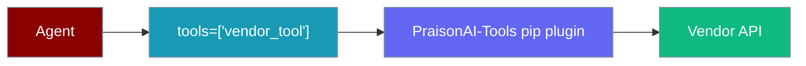
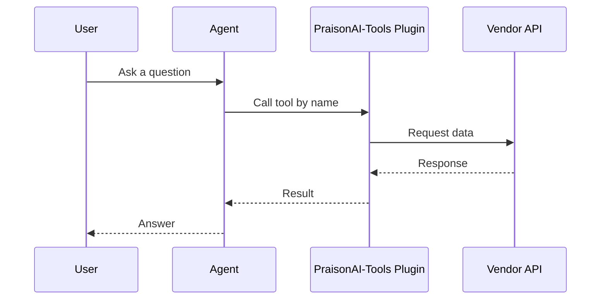
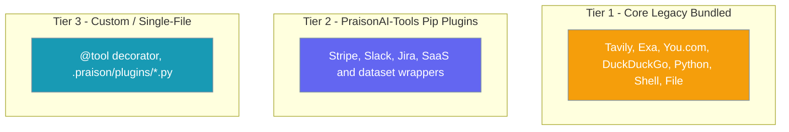
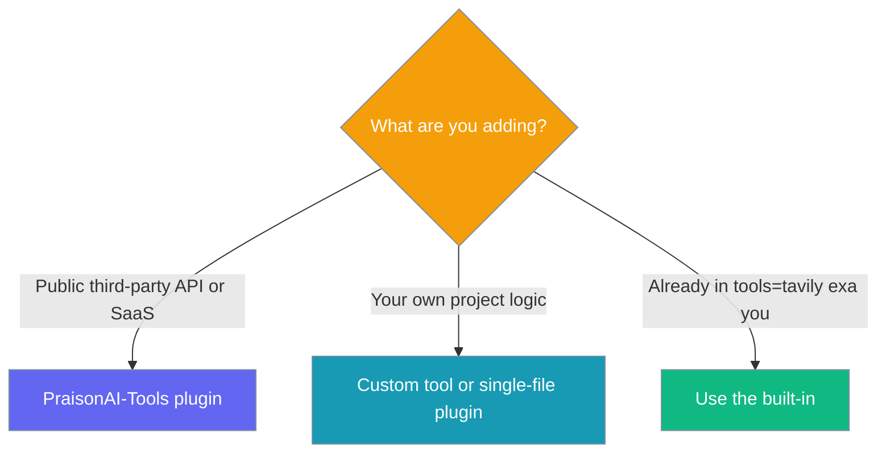

Vendor tools are third-party API integrations you add to an agent with one `pip install` and a name in `tools=[]`.



## Quick Start

<Steps>
<Step title="Install the plugin">
```bash
pip install praisonai-tools-stripe
```
</Step>
<Step title="Use it in your agent">
```python
from praisonaiagents import Agent

agent = Agent(
    name="Finance Analyst",
    instructions="Analyze market data",
    tools=["stripe_balance"],
)

agent.start("What is our current Stripe balance?")
```
The tool is auto-discovered by name after install — no imports needed.
</Step>
</Steps>

---

## How It Works

The agent resolves a tool name to a vendor plugin installed through pip, calls the vendor API, and replies with the result.



Installed plugins register under the `praisonai.tools` entry-point group and become available by name — the same mechanism documented in [Custom Tools](/tools/custom).

---

## Three-Tier Tool Ecosystem

PraisonAI tools live in three places. Pick the tier that matches where your tool belongs.



| Tier | Where it lives | Use for |
|------|----------------|---------|
| Core legacy bundled | `praisonaiagents.tools` | Existing built-ins (kept for backward compatibility — no new modules accepted) |
| PraisonAI-Tools pip plugins | [PraisonAI-Tools](https://github.com/MervinPraison/PraisonAI-Tools) | All new vendor / third-party API integrations |
| Custom / single-file | Your project | Your own project-local logic |

---

## Which Option Should I Pick?



---

## Install Flow

Install one or more vendor plugins, then reference each by name.

<Steps>
<Step title="Install plugins">
```bash
pip install praisonai-tools-stripe
```
</Step>
<Step title="Add tool names to your agent">
```python
from praisonaiagents import Agent

agent = Agent(
    name="Finance Analyst",
    instructions="Analyze market data",
    tools=["yfinance", "stripe_balance"],
)

agent.start("Summarise AAPL year-to-date and our Stripe balance")
```
</Step>
</Steps>

---

## How Auto-Discovery Works

Plugins declare a `praisonai.tools` entry point in their `pyproject.toml`; PraisonAI scans these on first use and registers each tool by name.

```toml
[project.entry-points."praisonai.tools"]
stripe_balance = "praisonai_tools_stripe:StripeBalanceTool"
```

See the [Creating a Pip-Installable Tool Package](/tools/custom#creating-a-pip-installable-tool-package) section for the full publish flow.

---

## Contributing a New Vendor Tool

<Note>
New vendor integrations belong in [PraisonAI-Tools](https://github.com/MervinPraison/PraisonAI-Tools), not in the core SDK. Pull requests that add a new `*_tools.py` module to `MervinPraison/PraisonAI` core are blocked by the merge gate unless a maintainer applies the `maintainer-accept-core-tools` label.
</Note>

Publish your plugin to PraisonAI-Tools and users install it with a single `pip install`.

---

## Best Practices

<AccordionGroup>
  <Accordion title="Prefer pip plugins for vendor APIs">
    Any public third-party API or SaaS integration goes in PraisonAI-Tools as an installable plugin, not in core.
  </Accordion>
  <Accordion title="Reference tools by name">
    After `pip install`, add the tool name to `tools=[]` — no import line is required.
  </Accordion>
  <Accordion title="Keep secrets in the environment">
    Read API keys from environment variables inside the plugin; never hard-code credentials.
  </Accordion>
  <Accordion title="Use custom tools for internal logic">
    Project-specific logic belongs in a custom tool or single-file plugin, not a published vendor package.
  </Accordion>
</AccordionGroup>

---

## Related

<CardGroup cols={2}>
  <Card title="Custom Tools" icon="wrench" href="/tools/custom">
    Build and publish your own tools
  </Card>
  <Card title="Single-File Plugins" icon="puzzle-piece" href="/tools/single-file-plugins">
    Drop-in local Python plugins
  </Card>
  <Card title="Tools Overview" icon="toolbox" href="/tools/tools">
    Browse PraisonAI tool documentation
  </Card>
  <Card title="MCP" icon="plug" href="/features/mcp">
    Connect external tool servers
  </Card>
</CardGroup>
