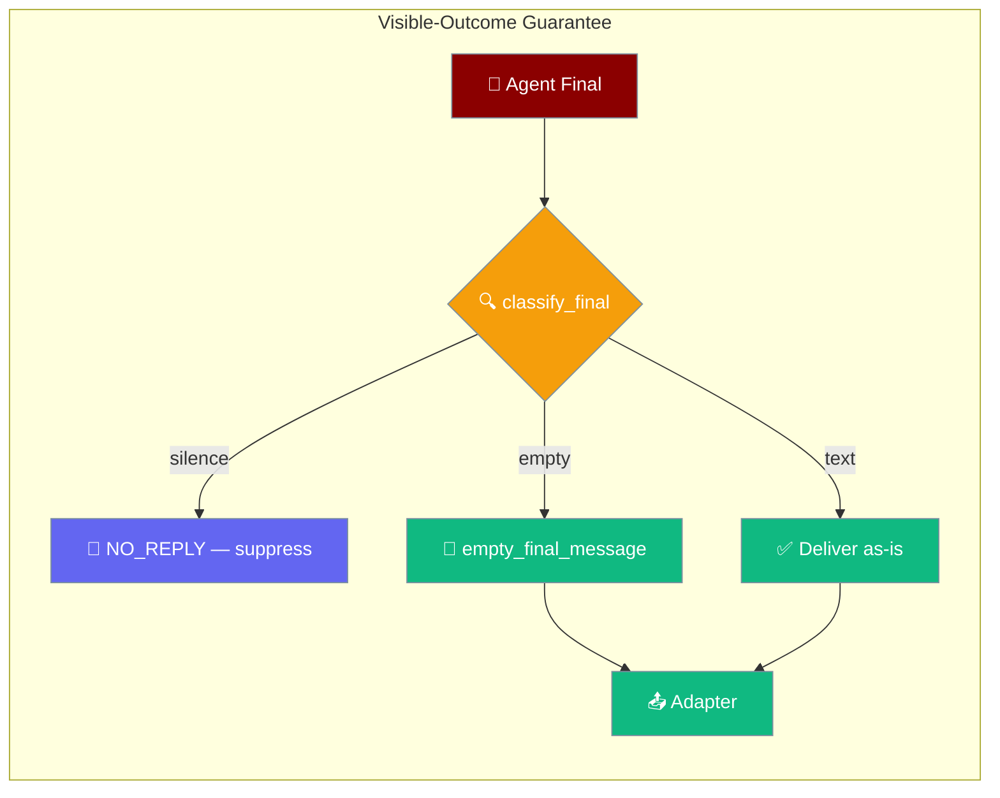
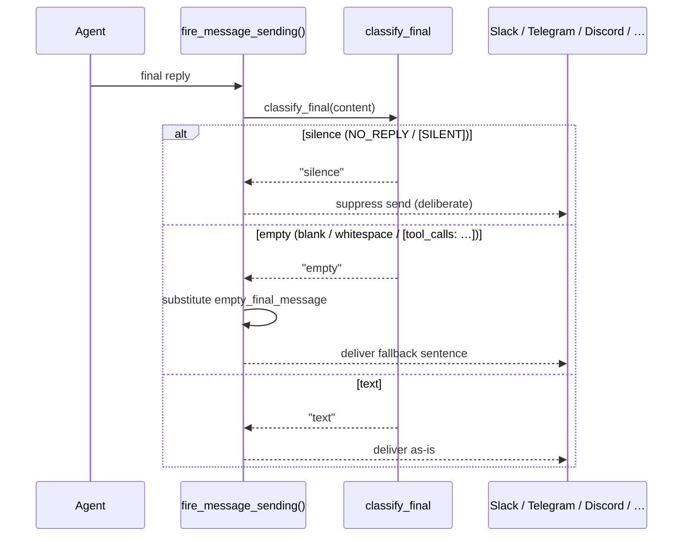

Every inbound message ends in one of two recorded states: a visible reply, or a deliberate silence — a blank or placeholder final is never dropped.

<Note>
For turns that **fail** (expired auth, missing key, rate limit, budget, doom-loop), [`render_failure_reply`](/features/failure-reply) is the failure-path counterpart of `classify_final` — it maps the failure to a visible, actionable reply.
</Note>



## Quick Start

<Steps>
<Step title="It's on by default">
The guarantee is always active — you don't enable it. A normal agent already benefits:

```python
from praisonaiagents import Agent

agent = Agent(
    name="Support Bot",
    instructions="Answer the user's question.",
)
```
</Step>

<Step title="Customise the fallback sentence">
Set `empty_final_message` in `BotConfig.metadata` to change the sentence shown when a turn produces no visible text:

```python
from praisonaiagents import Agent
from praisonaiagents.bots import BotConfig

agent = Agent(
    name="Support Bot",
    instructions="Answer the user's question.",
)

config = BotConfig(
    metadata={"empty_final_message": "I'm on it — no message this turn."}
)
```
</Step>
</Steps>

<Note>
Before this guarantee, three real bugs could each end an inbound turn with no reply: **Slack** silently dropped a blank send, **Telegram** parked an empty send in the DLQ, and **any adapter** could leak a raw `[tool_calls: search_web]` placeholder to the user.
</Note>

---

## How It Works

Classification and substitution happen once, at `fire_message_sending()` — the single delivery funnel every adapter shares — so no adapter re-decides "blank" differently.



A blank, whitespace-only, or `[tool_calls: …]` final is treated as **empty, not silence** and substituted with the fallback. A blank reply is never confused with a deliberate `NO_REPLY`.

| Outcome | What the user sees |
|---------|--------------------|
| Visible reply | The agent's real message, delivered as-is |
| Fallback | The `empty_final_message` sentence (empty/placeholder final) |
| Deliberate silence | Nothing — `NO_REPLY` / `[SILENT]` suppresses the send on purpose |

---

## classify_final

`classify_final` is the single decision the bot layer uses to tell a real reply, an empty final, and a deliberate silence apart.

```python
from praisonaiagents.bots import classify_final

classify_final("NO_REPLY")                  # "silence"
classify_final("")                          # "empty"
classify_final("   ")                       # "empty"
classify_final("[tool_calls: search_web]")  # "empty"
classify_final("Here is your answer.")      # "text"
```

| Return | Meaning | Trigger |
|--------|---------|---------|
| `"silence"` | Deliberate no-reply — send is suppressed on purpose | Exact `NO_REPLY` or `[SILENT]` marker |
| `"empty"` | Blank / whitespace / raw `[tool_calls: …]` placeholder — fallback substituted | Everything not covered by the other two |
| `"text"` | Real user-facing content — delivered as-is | Non-empty content that is not a silence token |

---

## Configuration Options

The fallback sentence is the only knob. Precedence: direct attribute > metadata > default.

| Option | Type | Default | Where to set | Description |
|--------|------|---------|--------------|-------------|
| `empty_final_message` | `str` | `"Task completed — no message to show."` | `BotConfig.empty_final_message` **or** `BotConfig.metadata["empty_final_message"]` **or** YAML `metadata.empty_final_message` | Sentence delivered when an inbound turn produces an empty/placeholder final that is *not* intentional silence. |

<CodeGroup>
```python Direct attribute
from praisonaiagents.bots import BotConfig

# Programmatic callers can set the attribute directly
config = BotConfig(empty_final_message="I'm on it — no message this turn.")
```

```python Metadata seam
from praisonaiagents.bots import BotConfig

# YAML-friendly seam — no new typed knob needed
config = BotConfig(metadata={"empty_final_message": "I'm on it — no message this turn."})
```

```yaml bot.yaml
metadata:
  empty_final_message: "I'm on it — no message this turn."
```
</CodeGroup>

<Info>
**Operator visibility.** Every substitution is logged at `INFO` on the wrapper logger with the platform name:

```
Empty-final resolution: substituted fallback for a blank/placeholder reply on <platform> (visible-outcome guarantee)
```

Repeated hits usually mean an agent prompt or tool graph is finishing without composing a reply.
</Info>

---

## Best Practices

<AccordionGroup>
<Accordion title="Keep the fallback short and platform-agnostic">
The same sentence may ship on Slack, Telegram, Discord, WhatsApp, email, or AgentMail. Avoid platform-specific formatting or references.
</Accordion>
<Accordion title="Use NO_REPLY when you want silence">
To make the bot say nothing on purpose, return the exact `NO_REPLY` / `[SILENT]` token — see [Intentional Silence](/features/bot-intentional-silence). Returning whitespace will **not** silence the bot; it still substitutes the fallback.
</Accordion>
<Accordion title="Watch the INFO log for repeated substitutions">
Frequent `"Empty-final resolution: substituted fallback…"` lines signal an agent finishing without a reply. Treat it as a prompt/tool-graph smell, not a delivery problem.
</Accordion>
<Accordion title="Prefer the metadata form in bot.yaml">
`metadata.empty_final_message` is the declared seam for platform-agnostic extras and needs no code change — set it in YAML rather than adding a typed knob.
</Accordion>
</AccordionGroup>

---

## Related

<CardGroup cols={2}>
<Card title="Intentional Silence" icon="volume-xmark" href="/features/bot-intentional-silence">
  Deliberate `NO_REPLY` / `[SILENT]` — suppress the send on purpose
</Card>
<Card title="Bot Gateway" icon="tower-broadcast" href="/features/bot-gateway">
  Where the visible-outcome guarantee is enforced
</Card>
<Card title="Inbound Journal" icon="book" href="/features/inbound-journal">
  Crash-replay — the other half of "no inbound ends without a recorded outcome"
</Card>
<Card title="Channel Descriptor" icon="plug" href="/features/channel-descriptor">
  Declare per-channel config, prompt hints, and setup in one place
</Card>
<Card icon="triangle-exclamation" href="/features/failure-reply">
  Every failed turn ends in a visible, actionable reply keyed by failure class
</Card>
</CardGroup>

<Note>
Introduced in [PraisonAI PR #3622](https://github.com/MervinPraison/PraisonAI/pull/3622) (fixes [#3621](https://github.com/MervinPraison/PraisonAI/issues/3621)).
</Note>
