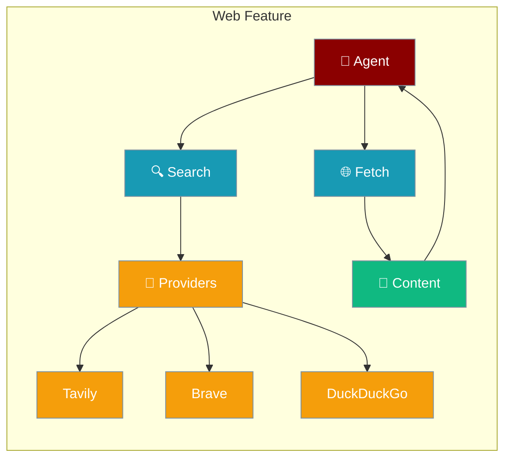
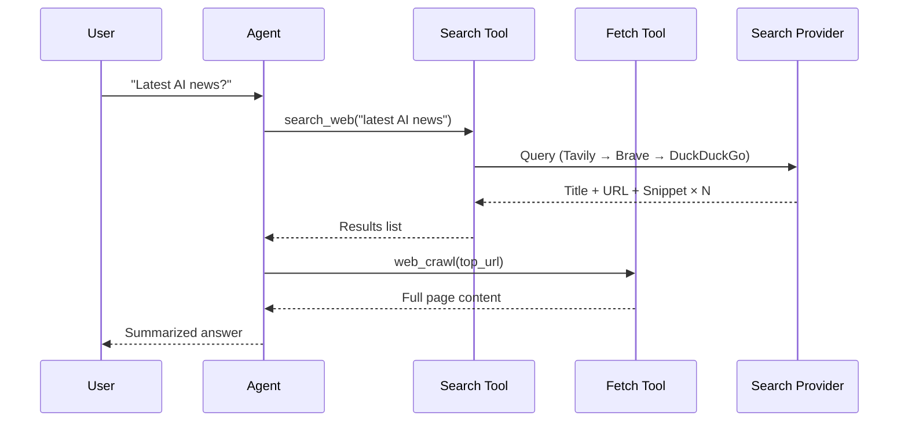
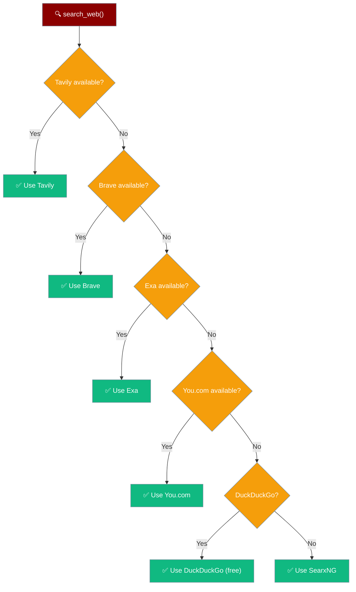

Web tools let any agent search the internet or read any webpage, with automatic provider fallback so it works even without an API key.



## Quick Start

<Steps>
<Step title="Enable Web Search">
Add `web=True` and the agent automatically searches the internet when it needs current information.

```python
from praisonaiagents import Agent

agent = Agent(
    name="Researcher",
    instructions="Answer questions using current information from the web.",
    web=True,
)

agent.start("What are the latest developments in AI this week?")
```
</Step>

<Step title="Configure Providers">
Choose a specific search provider or set multiple as fallbacks.

```python
from praisonaiagents import Agent, WebConfig

agent = Agent(
    name="Researcher",
    instructions="Research topics thoroughly.",
    web=WebConfig(
        search=True,
        fetch=True,
        search_provider="tavily",
        max_results=10,
    )
)

agent.start("Summarize the latest news on quantum computing.")
```
</Step>

<Step title="Web Search Tool Directly">
Use `search_web` as a standalone tool inside any agent.

```python
from praisonaiagents import Agent
from praisonaiagents.tools import search_web, web_crawl

agent = Agent(
    name="Web Agent",
    instructions="Search and read web pages to answer questions.",
    tools=[search_web, web_crawl],
)

agent.start("Find and summarize the homepage of OpenAI.")
```
</Step>
</Steps>

---

## How It Works

The agent decides when to search or fetch based on your query. Results flow back as context for the final answer.



---

## Configuration Options

<Card title="WebConfig API Reference" icon="code" href="/docs/sdk/praisonaiagents/config/feature-configs-module">
  Full API reference for `WebConfig` — search, fetch, providers, max_results
</Card>

### WebConfig Fields

| Field | Type | Default | Description |
|-------|------|---------|-------------|
| `search` | `bool` | `True` | Enable web search |
| `fetch` | `bool` | `True` | Enable web page fetching |
| `search_provider` | `str` | `"duckduckgo"` | Provider to use: `tavily`, `brave`, `exa`, `youdotcom`, `duckduckgo`, `searxng` |
| `max_results` | `int` | `5` | Maximum search results returned |
| `search_config` | `dict \| None` | `None` | Provider-specific search settings |
| `fetch_config` | `dict \| None` | `None` | Provider-specific fetch settings |

### Search Provider Priority (auto-fallback)



---

## Common Patterns

### Research Agent with Sources

Search the web and return cited sources alongside the answer.

```python
from praisonaiagents import Agent

agent = Agent(
    name="Research Assistant",
    instructions="Answer questions with sources. Always cite URLs.",
    web=True,
)

agent.start("What is the current state of nuclear fusion research?")
```

### Crawl and Summarize a URL

Fetch a specific webpage and summarize it.

```python
from praisonaiagents import Agent
from praisonaiagents.tools import web_crawl

agent = Agent(
    name="Summarizer",
    instructions="Fetch the given URL and write a 3-sentence summary.",
    tools=[web_crawl],
)

agent.start("Summarize https://openai.com/research/overview")
```

### Multi-Agent Research Pipeline

One agent searches, another writes the report.

```python
from praisonaiagents import Agent, Task, PraisonAIAgents

searcher = Agent(
    name="Searcher",
    instructions="Search the web for information on the given topic.",
    web=True,
)

writer = Agent(
    name="Writer",
    instructions="Write a structured report based on research findings.",
)

search_task = Task(
    description="Find the top 5 sources on AI regulation in 2025",
    agent=searcher,
    expected_output="List of sources with summaries",
)

write_task = Task(
    description="Write a 500-word report on AI regulation",
    agent=writer,
    context=[search_task],
    expected_output="Formatted report",
)

agents = PraisonAIAgents(agents=[searcher, writer], tasks=[search_task, write_task])
agents.start()
```

---

## Best Practices

<AccordionGroup>
<Accordion title="Use DuckDuckGo for zero-configuration setups">
DuckDuckGo requires no API key and no package beyond `ddgs`. It's the best choice for local development, prototypes, and open-source projects where you can't bundle API keys.
</Accordion>

<Accordion title="Switch to Tavily for production accuracy">
Tavily returns higher-quality snippets and supports full-page extraction. Set `TAVILY_API_KEY` in your environment and the agent will prefer it automatically over free providers.
</Accordion>

<Accordion title="Limit max_results to control token costs">
Each search result adds tokens to the agent's context. Keep `max_results=5` (the default) for most queries. Only increase it when the task genuinely requires broad coverage, such as academic literature surveys.
</Accordion>

<Accordion title="Combine search and fetch for deep research">
`search=True` finds the best URLs; `fetch=True` reads the full page content. Use both together when a snippet is not enough — for example, reading full API documentation or news articles.
</Accordion>
</AccordionGroup>

---

## Related

<CardGroup cols={2}>
<Card title="Tools" icon="wrench" href="/docs/concepts/tools">
  How tools work and how to add custom tools to agents
</Card>
<Card title="Deep Research" icon="magnifying-glass" href="/docs/agents/deep-research">
  Multi-step research agents that synthesize information from many sources
</Card>
</CardGroup>
