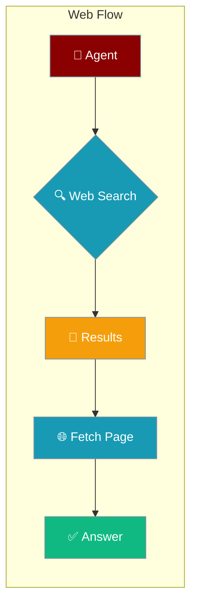
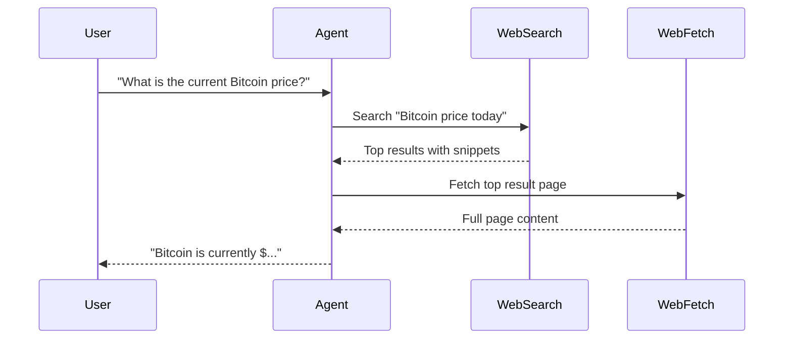
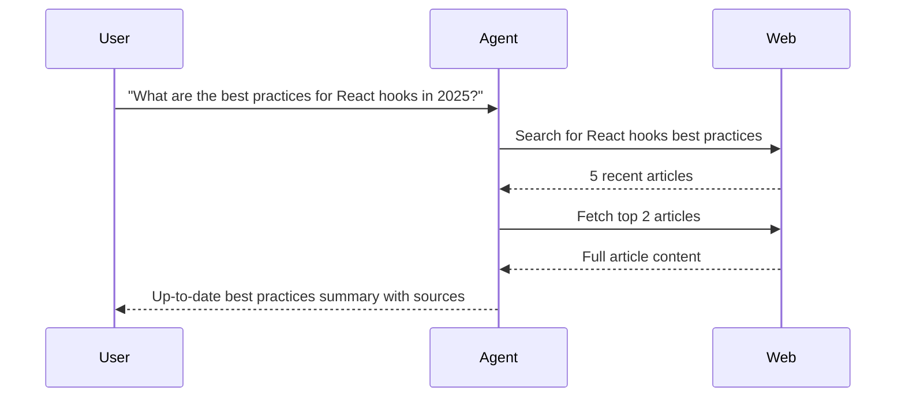
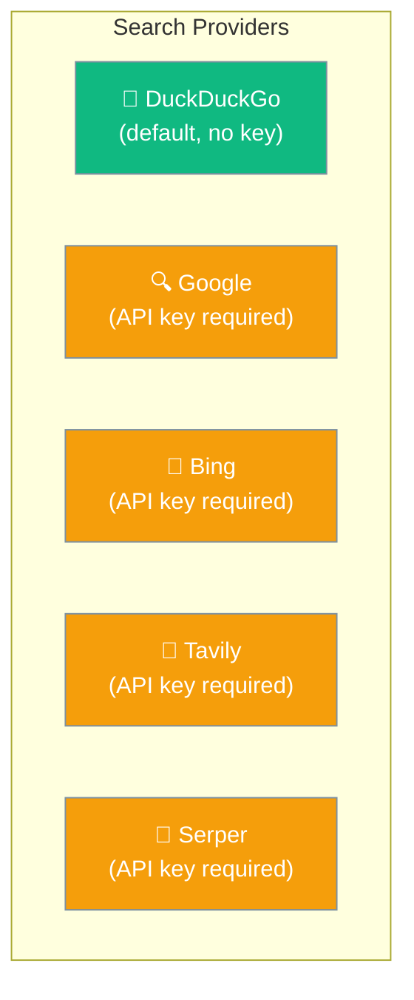

Web capabilities let agents search the internet and retrieve full page content without writing any tool code.



## Quick Start

<Steps>
<Step title="Enable Web Search">
Add `web=True` to give any agent live internet access:

```python
from praisonaiagents import Agent

agent = Agent(
    name="Research Agent",
    instructions="Research topics using current web information",
    web=True
)

agent.start("What are the latest AI news today?")
```
</Step>

<Step title="With Configuration">
Choose a search provider and tune result count:

```python
from praisonaiagents import Agent, WebConfig

agent = Agent(
    name="Research Agent",
    instructions="Research topics using current web information",
    web=WebConfig(
        search=True,
        fetch=True,
        search_provider="duckduckgo",
        max_results=10,
    )
)

agent.start("Find the top 10 Python frameworks in 2025")
```
</Step>

<Step title="Search Only or Fetch Only">
Enable only what you need:

```python
from praisonaiagents import Agent, WebConfig

# Search only (no full page fetch)
agent = Agent(
    name="Quick Search Agent",
    instructions="Answer questions using web search snippets",
    web=WebConfig(search=True, fetch=False)
)

# Fetch only (retrieve specific URLs)
agent = Agent(
    name="Content Agent",
    instructions="Retrieve and summarise content from provided URLs",
    web=WebConfig(search=False, fetch=True)
)
```
</Step>
</Steps>

---

## How It Works



| Stage | What happens |
|-------|-------------|
| **Search** | Agent queries the configured provider |
| **Results** | Top N results returned with titles, URLs, and snippets |
| **Fetch** | Agent optionally retrieves full content from result pages |
| **Synthesise** | Agent composes a response from gathered information |

---

## User Interaction Flow



---

## Configuration Options

| Option | Type | Default | Description |
|--------|------|---------|-------------|
| `search` | `bool` | `True` | Enable web search capability |
| `fetch` | `bool` | `True` | Enable full page content retrieval |
| `search_provider` | `str` | `"duckduckgo"` | Provider: `duckduckgo`, `google`, `bing`, `tavily`, `serper` |
| `max_results` | `int` | `5` | Maximum search results to return |
| `search_config` | `dict` | `None` | Provider-specific search settings |
| `fetch_config` | `dict` | `None` | Provider-specific fetch settings |

### Supported Providers



### Precedence Ladder

```python
# Level 1: Bool (simplest — DuckDuckGo, 5 results)
agent = Agent(web=True)

# Level 2: Config class
agent = Agent(web=WebConfig(search_provider="tavily", max_results=10))
```

---

## Common Patterns

### Research Agent with Tavily

```python
from praisonaiagents import Agent, WebConfig

agent = Agent(
    name="Deep Research Agent",
    instructions="Conduct thorough research on the given topic",
    web=WebConfig(
        search_provider="tavily",
        max_results=10,
        fetch=True,
    )
)

agent.start("Research the current state of quantum computing")
```

### News Summary Agent

```python
from praisonaiagents import Agent, WebConfig

agent = Agent(
    name="News Agent",
    instructions="Summarise the latest news on the given topic",
    web=WebConfig(
        search=True,
        fetch=False,
        max_results=5,
    )
)

agent.start("Latest developments in AI regulation in the EU")
```

### Multi-Agent Research Pipeline

```python
from praisonaiagents import Agent, Task, PraisonAIAgents, WebConfig

researcher = Agent(
    name="Web Researcher",
    instructions="Search the web and gather relevant information",
    web=WebConfig(max_results=10)
)

analyst = Agent(
    name="Analyst",
    instructions="Analyse the gathered research and produce insights"
)

task = Task(
    description="Research and analyse the market for electric vehicles",
    agent=researcher
)

agents = PraisonAIAgents(agents=[researcher, analyst], tasks=[task])
agents.start()
```

---

## Best Practices

<AccordionGroup>
<Accordion title="Use DuckDuckGo for development and testing">
DuckDuckGo requires no API key — ideal for local development and prototyping.

```python
agent = Agent(web=True)  # Uses DuckDuckGo by default
```
</Accordion>

<Accordion title="Switch to Tavily or Serper for production">
For reliable, high-volume production use, Tavily and Serper offer better results and rate limits.

```python
agent = Agent(
    web=WebConfig(search_provider="tavily")
)
```
</Accordion>

<Accordion title="Disable fetch for faster responses">
If you only need search snippets (no full page content), set `fetch=False` to reduce latency.

```python
agent = Agent(web=WebConfig(search=True, fetch=False))
```
</Accordion>

<Accordion title="Limit max_results to control costs">
More results mean more tokens consumed. Start with 5 and increase only if needed.

```python
# Fast and cheap
agent = Agent(web=WebConfig(max_results=3))

# Thorough research
agent = Agent(web=WebConfig(max_results=15))
```
</Accordion>
</AccordionGroup>

---

## Related

<CardGroup cols={2}>
<Card title="Tools" icon="wrench" href="/docs/tools/tools">
  Add custom tools alongside web capabilities
</Card>
<Card title="Knowledge" icon="book" href="/docs/features/knowledge">
  Use documents and files as static knowledge
</Card>
<Card title="Tool Search" icon="magnifying-glass" href="/docs/features/tool-search">
  Progressive disclosure for large tool sets
</Card>
<Card title="RAG" icon="database" href="/docs/features/rag">
  Retrieval-augmented generation patterns
</Card>
</CardGroup>
