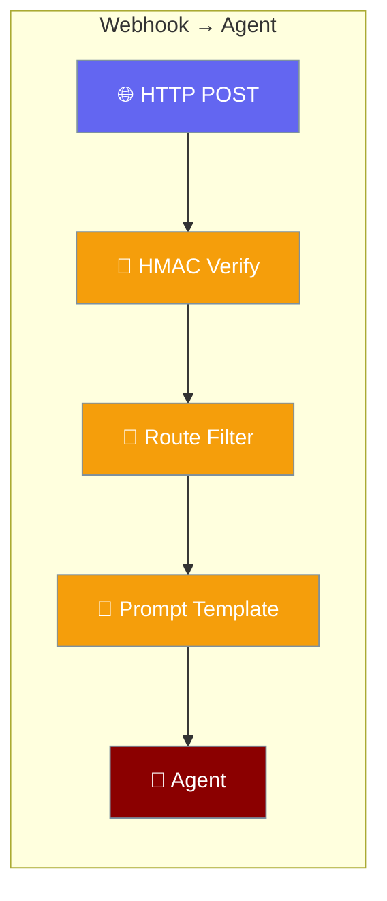
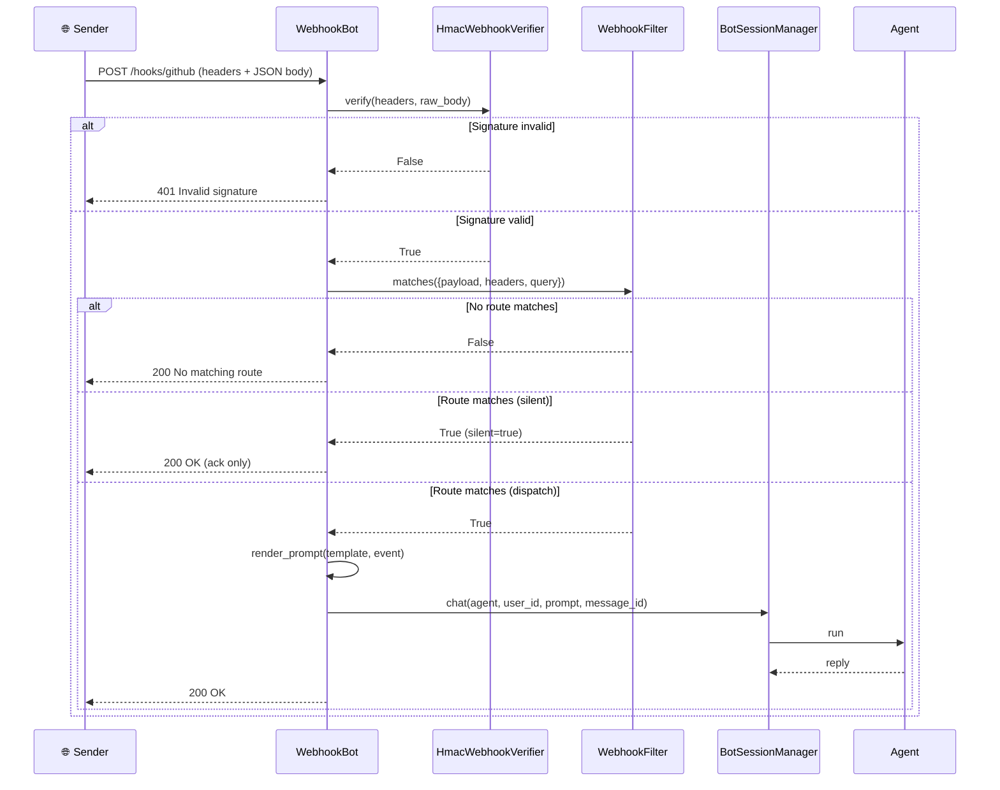
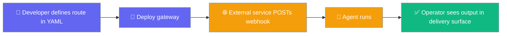
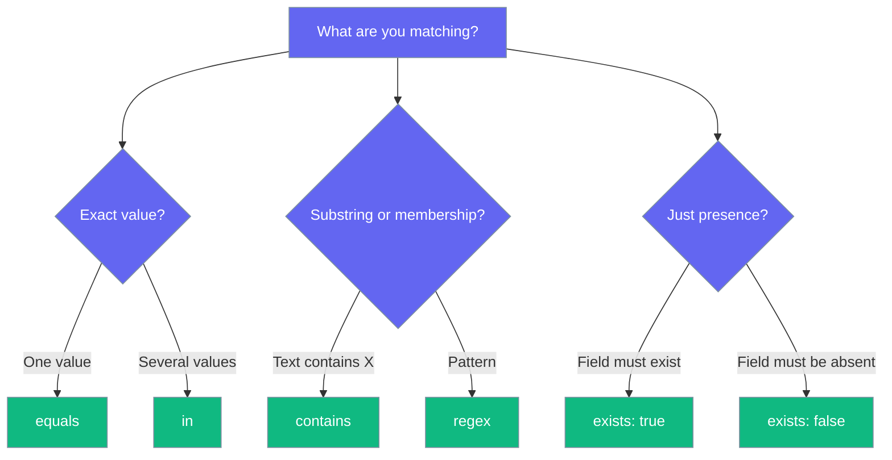

Route any third-party HTTP webhook (GitHub, Stripe, CI, alerting) to an agent through configuration alone.

```python
from praisonaiagents import Agent
from praisonai_bot.bots import WebhookBot, WebhookRoute

agent = Agent(
    name="issue-triage",
    instructions="Triage new GitHub issues into priority buckets.",
)

bot = WebhookBot(
    agent=agent,
    path="/hooks/github",
    routes=[
        WebhookRoute(
            when={"field": "headers.X-GitHub-Event", "equals": "issues"},
            prompt="New issue #{{ payload.issue.number }}: {{ payload.issue.title }}",
        ),
    ],
)

await bot.start()
```



## Quick Start

<Steps>
<Step title="YAML gateway channel (recommended, no code)">

Declare a `webhook` channel in `gateway.yaml`. The gateway recognises `webhook` as a built-in channel type.

```yaml
# gateway.yaml
channels:
  github:
    type: webhook
    path: /hooks/github
    verify:
      hmac:
        header: X-Hub-Signature-256
        secret: ${GITHUB_WEBHOOK_SECRET}
        prefix: "sha256="
    routes:
      - when:
          all:
            - { field: headers.X-GitHub-Event, equals: issues }
            - { field: payload.action, in: [opened, reopened] }
        agent: triage
        prompt: "New issue #{{ payload.issue.number }}: {{ payload.issue.title }}"
      - when: { field: payload.action, equals: closed }
        silent: true
```

```bash
praisonai gateway start --config gateway.yaml
```

</Step>

<Step title="Python (single bot)">

```python
from praisonaiagents import Agent
from praisonai_bot.bots import WebhookBot, WebhookRoute

agent = Agent(
    name="issue-triage",
    instructions="Triage new GitHub issues into priority buckets.",
)

bot = WebhookBot(
    agent=agent,
    path="/hooks/github",
    routes=[
        WebhookRoute(
            when={"field": "headers.X-GitHub-Event", "equals": "issues"},
            prompt="New issue #{{ payload.issue.number }}: {{ payload.issue.title }}",
        ),
    ],
)

await bot.start()
```

</Step>
</Steps>

---

## How It Works

Every POST is verified, filtered, templated, then dispatched to the agent through the durable session manager.



### User interaction flow

A developer wires the route once; the external service does the rest.



---

## Configuration Reference

`WebhookBot` serves one HTTP path and dispatches matching events to its bound agent.

| Parameter | Type | Default | Description |
|-----------|------|---------|-------------|
| `token` | `str` | `""` | Unused for webhook; kept for adapter uniformity |
| `agent` | `Agent \| None` | `None` | Agent to dispatch matching events to |
| `config` | `BotConfig \| None` | `None` | Optional bot config; defaults to `BotConfig(token=token, mode="webhook")` |
| `path` | `str` | `"/webhook"` | HTTP path served (leading `/` auto-added) |
| `webhook_port` | `int` | `8080` | Port for the aiohttp listener |
| `verify` | `Mapping \| verifier \| None` | `None` | A verifier object exposing `.verify(...)` (returned as-is) or a `{"hmac": {...}}` mapping (constructs an `HmacWebhookVerifier`). `None` disables signature verification |
| `routes` | `list[WebhookRoute \| dict]` | `[]` | Route list. Empty list → single catch-all route matching every event |

`WebhookRoute` decides which events fire and how the prompt is built.

| Field | Type | Default | Description |
|-------|------|---------|-------------|
| `when` | filter tree \| `None` | `None` | Declarative predicate; `None`/`{}` matches everything |
| `agent` | `str \| None` | `None` | Informational — the adapter uses its bound `agent` |
| `prompt` | `str \| None` | `None` | `{{ dotted.path }}` template. `None` → raw JSON payload |
| `silent` | `bool` | `False` | Ack (HTTP 200) without running the agent |

The YAML `verify.hmac` block is parsed by `_build_verifier_from_config`.

| Key | Type | Default | Description |
|-----|------|---------|-------------|
| `header` | `str` | — | Single signature header name. Alias: `signature_header` |
| `signature_headers` | `list[str]` | `[header]` | Multiple accepted headers; falls back to `[header]` or `["X-Signature"]` |
| `secret` | `str` | `""` | Shared secret |
| `digest` | `str` | `"sha256"` | Digest name passed to `HmacWebhookVerifier` |
| `prefix` | `str \| None` | `None` | e.g. `"sha256="` for GitHub |

---

## Filter DSL

A filter is a small predicate tree that round-trips through YAML. Every node is either a combinator or a leaf.

| Combinator | Meaning | Empty behaviour |
|------------|---------|-----------------|
| `{"all": [...]}` | AND — every child must match | `True` |
| `{"any": [...]}` | OR — at least one child matches | `False` |
| `{"not": <node>}` | Negation | — |

A leaf tests one field: `{"field": "<dotted.path>", "<op>": <value>}`.

| Operator | Meaning |
|----------|---------|
| `exists` | `True` = field present, `False` = field absent |
| `equals` | Deep equality with the resolved value |
| `contains` | Substring / membership (`value in resolved`) |
| `in` | Resolved value is one of a list |
| `regex` | `re.search(pattern, str(resolved))` |
| _(bare `field`)_ | A leaf with only `field` is treated as `exists: True` |

Field paths are dotted — `payload.issue.number`, `headers.X-GitHub-Event`, `query.debug`. Header lookup is **case-insensitive**.

<Note>
**Fail-safe by design.** Missing paths resolve to `None`; unknown nodes, invalid regex, and type mismatches evaluate to `False` and never raise. A `None` or `{}` filter matches every event, so a route with no `when` is unconditional.
</Note>

### Which operator?



---

## Routing and prompts

**First-match wins.** Routes are evaluated in list order; the first whose filter matches is used. A filter that raises is skipped (fail-safe) so a bad route can't kill ingress.

**Prompt templating.** `{{ dotted.path }}` placeholders resolve against `{payload, headers, query}`. Missing paths render as empty strings. When `prompt` is omitted, the raw JSON payload becomes the agent's prompt.

**Silent routes.** `silent: true` acknowledges with HTTP 200 without running the agent — useful for dropping noisy events at the edge.

**Delivery IDs.** The bot derives a stable `message_id` for the ingress journal, in priority order:

1. `X-GitHub-Delivery` header, or
2. `X-Request-Id` header, or
3. `X-Delivery-Id` header, or
4. `Stripe-Signature` header, otherwise
5. deterministic `webhook-<sha256(path + "\0" + raw_body)>` fallback, so redeliveries collapse to one journaled run even for generic senders.

---

## Response contract

| Status | When |
|--------|------|
| `200 OK` | Route matched and dispatched, or route matched and silent, or no route matched (ack) |
| `200 Webhook endpoint` | `GET` health check on the path |
| `400 Bad request` | Body read failed |
| `401 Invalid signature` | HMAC verification failed |
| `500 Dispatch failed` | Agent dispatch raised — sender should retry |

---

## Untrusted Payload Fencing

Payload-derived interpolations are fenced as untrusted data before the agent sees them.

- Values from `{{ dotted.path }}` land inside `<external_request_payload>...</external_request_payload>`; the operator's static template text stays outside the fence.
- When a payload value is fenced, a one-line inline notice is prepended once (also outside the fence).
- A route with **no** `prompt` still gets a fixed operator prefix — `"An external event was received on route {name}; the payload follows."` — so attacker-controlled text is never the sole instruction.
- Attempts to smuggle a fence closer inside a payload field are delimiter-escaped, so the fence's own single closer is the only real one.

See [Untrusted Request Fencing](/features/untrusted-request-fencing) for the full picture and rendered examples.

---

## Common Patterns

### GitHub issue triage

Verify the signature, match the event header and body, then template the prompt.

```python
from praisonaiagents import Agent
from praisonai_bot.bots import WebhookBot, WebhookRoute

agent = Agent(name="triage", instructions="Bucket issues by priority.")

bot = WebhookBot(
    agent=agent,
    path="/hooks/github",
    verify={"hmac": {"header": "X-Hub-Signature-256", "secret": "gh-secret", "prefix": "sha256="}},
    routes=[
        WebhookRoute(
            when={"all": [
                {"field": "headers.X-GitHub-Event", "equals": "issues"},
                {"field": "payload.action", "in": ["opened", "reopened"]},
            ]},
            prompt="New issue #{{ payload.issue.number }}: {{ payload.issue.title }}",
        ),
    ],
)

await bot.start()
```

### Stripe payment fan-in

Match several event types with one `in` leaf.

```python
from praisonaiagents import Agent
from praisonai_bot.bots import WebhookBot, WebhookRoute

agent = Agent(name="payments", instructions="Reconcile Stripe payment events.")

bot = WebhookBot(
    agent=agent,
    path="/hooks/stripe",
    routes=[
        WebhookRoute(
            when={"field": "payload.type", "in": [
                "payment_intent.succeeded",
                "payment_intent.payment_failed",
            ]},
            prompt="Stripe event {{ payload.type }} for {{ payload.data.object.id }}",
        ),
    ],
)

await bot.start()
```

### Silent-drop noisy events

Put a `silent: true` route before a broad catch-all to drop noise at the edge.

```python
from praisonaiagents import Agent
from praisonai_bot.bots import WebhookBot, WebhookRoute

agent = Agent(name="ci", instructions="Report CI failures.")

bot = WebhookBot(
    agent=agent,
    path="/hooks/ci",
    routes=[
        WebhookRoute(when={"field": "payload.status", "equals": "in_progress"}, silent=True),
        WebhookRoute(prompt="CI status: {{ payload.status }} on {{ payload.branch }}"),
    ],
)

await bot.start()
```

---

## Best Practices

<AccordionGroup>
<Accordion title="Always set an HMAC secret in production">
Signature verification is opt-in — a `webhook` channel with no `verify` block accepts unsigned traffic. Set `verify.hmac.secret` from an env var before exposing the endpoint.
</Accordion>

<Accordion title="Put narrow routes before broad ones">
First-match wins, so a specific route placed after a catch-all never runs. Order routes from most to least specific.
</Accordion>

<Accordion title="Use silent routes for high-volume noise">
`silent: true` acknowledges without running the agent, keeping the ingress journal clean for events you never want to act on.
</Accordion>

<Accordion title="Prefer YAML gateway config over Python">
For anything shared across an environment, declare the channel in `gateway.yaml` rather than constructing `WebhookBot(...)` in code — config is easier to review and redeploy.
</Accordion>
</AccordionGroup>

---

## Related

<CardGroup cols={2}>
<Card title="Webhook Verification" icon="shield-check" href="/features/webhook-verification">
  The HMAC signature primitive this channel reuses
</Card>
<Card title="Bot Platform Plugins" icon="puzzle-piece" href="/features/bot-platform-plugins">
  The registry seam that `webhook` slots into
</Card>
<Card title="Channels Gateway" icon="comments" href="/features/channels-gateway">
  The gateway that hosts channel adapters
</Card>
<Card title="Inbound Journal" icon="book" href="/features/inbound-journal">
  Dedup and retry behaviour that `message_id` feeds
</Card>
</CardGroup>
