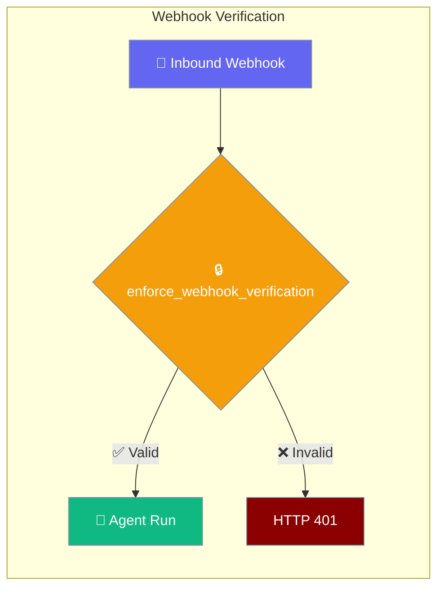
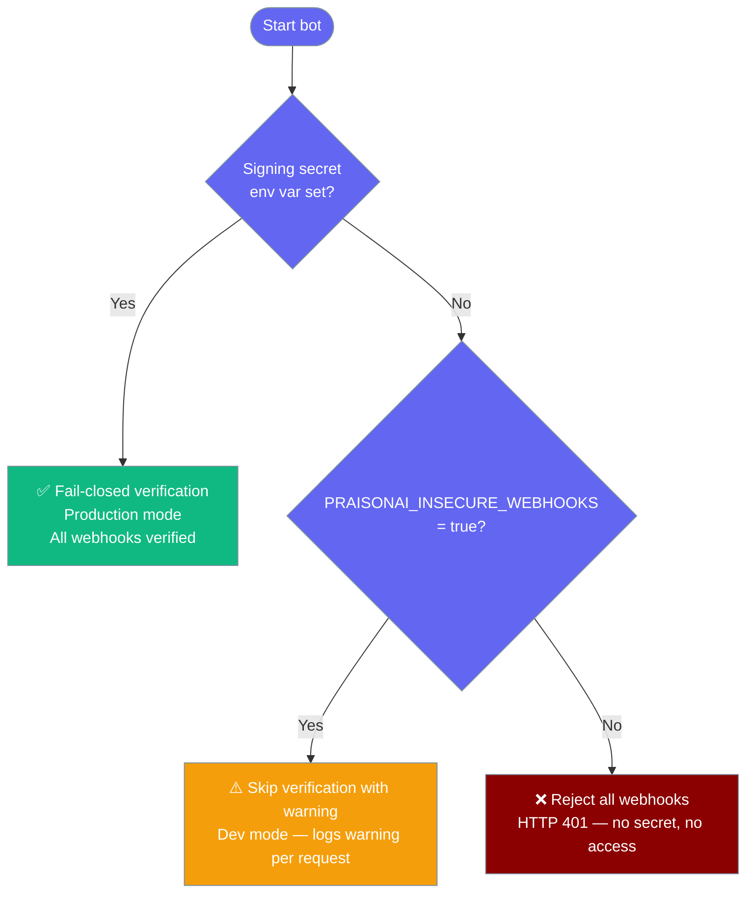
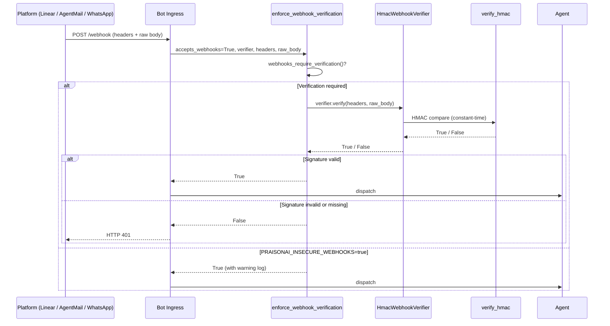

Bot webhooks are now fail-closed by default — every inbound request is verified against an HMAC signature before your agent runs.



## Quick Start

<Steps>
<Step title="Set your signing secret">

Set the environment variable for your platform before starting the bot:

```bash
# For Linear
export LINEAR_WEBHOOK_SECRET="whsec_..."

# For AgentMail
export AGENTMAIL_WEBHOOK_SECRET="whsec_..."

# For WhatsApp Cloud
export WHATSAPP_APP_SECRET="your-app-secret"
```
</Step>

<Step title="Run the bot — verification is on by default">

```bash
praisonai bot linear --token $LINEAR_OAUTH_TOKEN
```

Verification is enabled automatically. No extra flags needed.
</Step>

<Step title="For local dev without a real platform">

```bash
PRAISONAI_INSECURE_WEBHOOKS=true praisonai bot linear --token $LINEAR_OAUTH_TOKEN
```

<Warning>
`PRAISONAI_INSECURE_WEBHOOKS=true` disables all signature checks globally. Never set this in production — it accepts any request, including forged ones.
</Warning>
</Step>
</Steps>

---

## Which mode am I in?



---

## How It Works

Every inbound webhook passes through a central gate before reaching your agent.



### Outcome table

| `accepts_webhooks` | Verifier configured | `PRAISONAI_INSECURE_WEBHOOKS` | Outcome |
|--------------------|---------------------|-------------------------------|---------|
| `True` | Yes | unset | ✅ Verify — pass or 401 |
| `True` | No | unset | ❌ Reject all (fail-closed) |
| `True` | Yes or No | `true` / `1` / `yes` | ⚠️ Accept with warning |
| `False` | — | — | ✅ No check needed |

---

## User Interaction Flow

This is what happens when you forget to set the secret:

1. You run `praisonai bot linear --token $LINEAR_OAUTH_TOKEN` without `LINEAR_WEBHOOK_SECRET`.
2. Linear sends a webhook. The bot responds **HTTP 401** and logs:

   ```
   WARNING: No signing secret configured for linear webhook.
   Set LINEAR_WEBHOOK_SECRET, or set PRAISONAI_INSECURE_WEBHOOKS=true for local dev only.
   ```

3. You set the secret and restart:

   ```bash
   export LINEAR_WEBHOOK_SECRET="whsec_..."
   praisonai bot linear --token $LINEAR_OAUTH_TOKEN
   ```

4. Webhooks now pass verification and your agent runs.

For local testing without a real Linear app:

```bash
PRAISONAI_INSECURE_WEBHOOKS=true praisonai bot linear --token $LINEAR_OAUTH_TOKEN
# WARNING: PRAISONAI_INSECURE_WEBHOOKS is set — signature verification disabled
```

---

## Configuration Options

### Environment Variables

| Variable | Platform | Purpose |
|----------|----------|---------|
| `LINEAR_WEBHOOK_SECRET` | Linear | HMAC signing secret from Linear webhook settings |
| `AGENTMAIL_WEBHOOK_SECRET` | AgentMail | HMAC signing secret for AgentMail webhooks |
| `WHATSAPP_APP_SECRET` | WhatsApp Cloud | App secret from Meta developer console |
| `PRAISONAI_INSECURE_WEBHOOKS` | All | Set to `true` / `1` / `yes` to disable verification (dev only) |

### PlatformCapabilities fields

| Field | Type | Default | Description |
|-------|------|---------|-------------|
| `accepts_webhooks` | `bool` | `False` | Declares this adapter receives inbound webhooks |
| `verifies_webhook_signature` | `bool` | `False` | Declares the adapter provides a verifier |

---

## Common Patterns

### 1. Built-in adapter — just set the env var

The simplest case: use an existing adapter with the right secret.

```bash
# Linear
export LINEAR_WEBHOOK_SECRET="whsec_your_secret_here"
praisonai bot linear --token $LINEAR_OAUTH_TOKEN

# AgentMail webhook mode
export AGENTMAIL_WEBHOOK_SECRET="whsec_your_secret_here"
export AGENTMAIL_API_KEY="am_..."
praisonai bot agentmail --mode webhook
```

### 2. Custom adapter using `HmacWebhookVerifier`

Build a verifier for any HMAC-signed webhook in minutes:

```python
from praisonai.bots.webhook_security import HmacWebhookVerifier
import os

verifier = HmacWebhookVerifier(
    secret=os.environ["MY_WEBHOOK_SECRET"],
    signature_headers=["X-Hub-Signature-256"],
    digest="sha256",
    prefix="sha256=",
)

is_valid = verifier.verify(
    headers={"X-Hub-Signature-256": "sha256=abc123..."},
    raw_body=b'{"event": "push"}',
)
```

### 3. Custom adapter using `enforce_webhook_verification` directly

Use the central gate in your own aiohttp or FastAPI ingress:

```python
from praisonai.bots.webhook_security import HmacWebhookVerifier, enforce_webhook_verification
from aiohttp import web
import os

verifier = HmacWebhookVerifier(
    secret=os.environ["MY_WEBHOOK_SECRET"],
    signature_headers=["X-My-Signature"],
)

async def handle_webhook(request: web.Request) -> web.Response:
    raw_body = await request.read()
    headers = dict(request.headers)

    allowed = enforce_webhook_verification(
        accepts_webhooks=True,
        verifier=verifier,
        headers=headers,
        raw_body=raw_body,
        platform="myplatform",
    )

    if not allowed:
        return web.Response(status=401, text="Unauthorized")

    # safe to proceed
    return web.Response(text="ok")
```

---

## Best Practices

<AccordionGroup>

<Accordion title="Never set PRAISONAI_INSECURE_WEBHOOKS in production">
This flag disables all HMAC signature checks globally. It exists only for local development when you don't have a real platform sending signed webhooks. Any deployment — staging, preview, or production — must have `PRAISONAI_INSECURE_WEBHOOKS` unset (or not `true`/`1`/`yes`).
</Accordion>

<Accordion title="Use the shared helper instead of rolling your own HMAC">
`verify_hmac` and `HmacWebhookVerifier` use constant-time comparison and handle missing secrets, unknown digest algorithms, and prefix variants safely. Hand-rolled `hmac.compare_digest` calls can silently fail open if the secret is `None` or empty.

```python
from praisonai.bots.webhook_security import verify_hmac

ok = verify_hmac(
    secret=os.environ.get("MY_SECRET", ""),
    body=raw_body,
    signature=headers.get("X-Signature", ""),
    digest="sha256",
    prefix="sha256=",
)
```
</Accordion>

<Accordion title="Rotate signing secrets safely">
When rotating a webhook secret: first update the secret in your platform's webhook settings, then update the environment variable and restart the bot. Brief overlap is fine — platforms usually provide a grace window where both old and new secrets are valid.
</Accordion>

<Accordion title="Terminate TLS in front of the webhook server">
The bot's built-in HTTP server does not handle TLS. Always place a reverse proxy (nginx, Caddy, a load balancer) in front that terminates HTTPS before forwarding to the bot's port. Unencrypted webhook traffic can expose your payload to network observers even with HMAC signatures.
</Accordion>

</AccordionGroup>

---

## Related

<CardGroup cols={2}>
<Card title="Linear Bot" icon="zap" href="/docs/features/linear-bot">
Set up a Linear agent bot with webhook verification
</Card>
<Card title="Email Bot (AgentMail)" icon="mail" href="/docs/features/email-bot">
AgentMail webhook mode and AGENTMAIL_WEBHOOK_SECRET
</Card>
<Card title="WhatsApp Bot" icon="message-circle" href="/docs/features/whatsapp-bot">
WhatsApp Cloud API webhook verification
</Card>
<Card title="Bot Platform Capabilities" icon="sliders" href="/docs/features/bot-platform-capabilities">
accepts_webhooks and verifies_webhook_signature fields
</Card>
</CardGroup>
