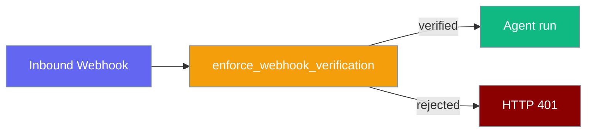
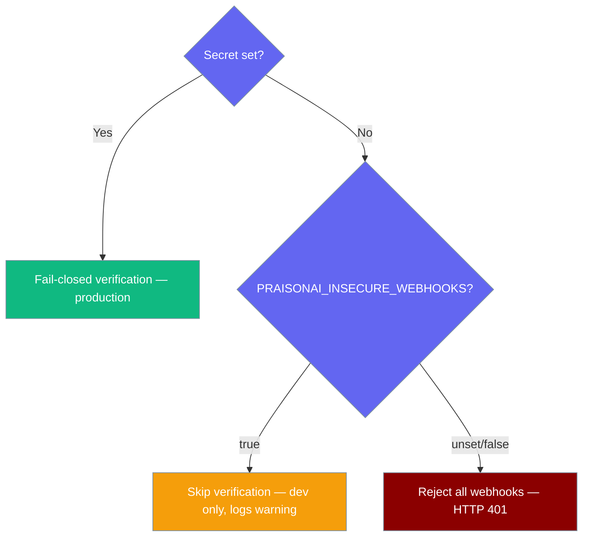
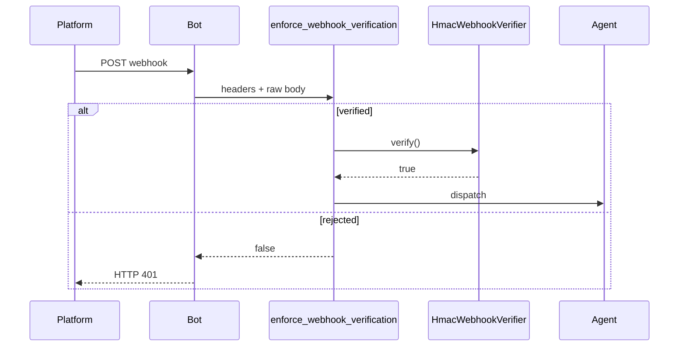

Inbound webhooks are verified by default — misconfigured secrets return HTTP 401 instead of silently accepting unsigned traffic.



## Quick Start

<Steps>
<Step title="Set your signing secret">
```bash
export LINEAR_WEBHOOK_SECRET=your-linear-secret
# or for AgentMail:
export AGENTMAIL_WEBHOOK_SECRET=your-agentmail-secret
```
</Step>

<Step title="Run the bot — verification is on by default">
```bash
praisonai bot linear --token $LINEAR_OAUTH_TOKEN
```
</Step>

<Step title="Local dev without a real platform">
<Warning>
Never set this in production.
</Warning>

```bash
PRAISONAI_INSECURE_WEBHOOKS=true praisonai bot linear --token $LINEAR_OAUTH_TOKEN
```
</Step>
</Steps>

## Which mode am I in?



## How It Works



| accepts_webhooks | Verifier configured | PRAISONAI_INSECURE_WEBHOOKS | Outcome |
|------------------|---------------------|-------------------------------|---------|
| false | — | — | No verification gate |
| true | yes | unset | Verify; 401 on failure |
| true | no | unset | **401** (fail-closed) |
| true | — | true | Skip with warning |

## Configuration Options

| Variable | Purpose |
|----------|---------|
| `PRAISONAI_INSECURE_WEBHOOKS` | Set to `true` / `1` / `yes` to disable verification globally (local dev only) |
| `LINEAR_WEBHOOK_SECRET` | HMAC secret for Linear webhooks |
| `AGENTMAIL_WEBHOOK_SECRET` | HMAC secret for AgentMail webhooks (required in production; API token is **not** a fallback) |
| `WHATSAPP_APP_SECRET` | Meta app secret for Cloud-mode WhatsApp webhooks |

| PlatformCapabilities field | Default | Meaning |
|----------------------------|---------|---------|
| `accepts_webhooks` | `False` | Channel receives inbound HTTP webhooks |
| `verifies_webhook_signature` | `False` | Adapter exposes a verifier implementation |

## Common Patterns

**Built-in adapter, secret only** — set the platform env var and run the bot; no code required.

**Custom adapter with `HmacWebhookVerifier`:**

```python
from praisonai.bots.webhook_security import HmacWebhookVerifier

verifier = HmacWebhookVerifier(
    secret="your-secret",
    signature_headers=["X-Hub-Signature-256"],
    prefix="sha256=",
)
```

**Custom ingress with the shared gate:**

```python
from praisonai.bots.webhook_security import enforce_webhook_verification

ok = enforce_webhook_verification(
    accepts_webhooks=True,
    verifier=verifier,
    headers=dict(request.headers),
    raw_body=await request.body(),
    platform="mychat",
)
if not ok:
    return Response(status_code=401)
```

## Best Practices

<AccordionGroup>
<Accordion title="Never set PRAISONAI_INSECURE_WEBHOOKS in production">
The override logs a warning on every request and disables all signature checks.
</Accordion>

<Accordion title="Use the shared helper instead of rolling your own HMAC">
`verify_hmac` and `HmacWebhookVerifier` fail closed on missing secrets, unknown digest algorithms, and verifier exceptions.
</Accordion>

<Accordion title="Rotate signing secrets with the platform">
Update both the platform webhook config and your env var at the same time.
</Accordion>
</AccordionGroup>

## Related

<CardGroup cols={2}>
<Card title="Linear Bot" icon="list" href="/docs/features/linear-bot">
  Linear webhook setup and secrets
</Card>
<Card title="Email Bot" icon="envelope" href="/docs/features/email-bot">
  AgentMail webhook mode
</Card>
<Card title="WhatsApp Bot" icon="message-circle" href="/docs/features/whatsapp-bot">
  Cloud-mode webhooks
</Card>
<Card title="Platform Capabilities" icon="sliders" href="/docs/features/bot-platform-capabilities">
  accepts_webhooks and verifies_webhook_signature
</Card>
</CardGroup>
