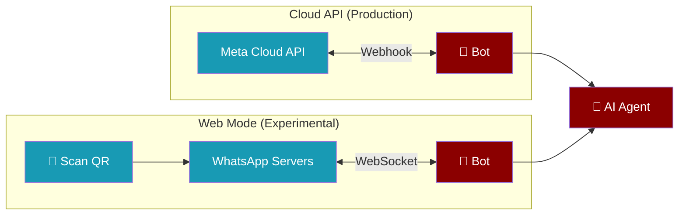
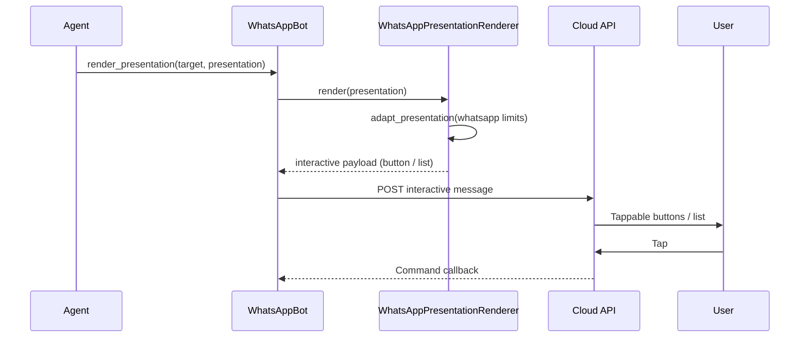
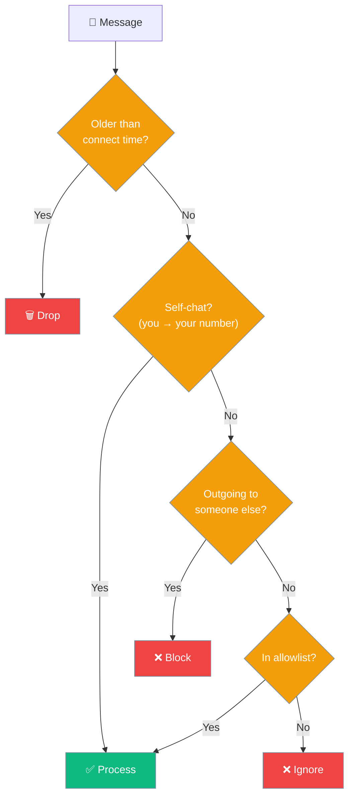
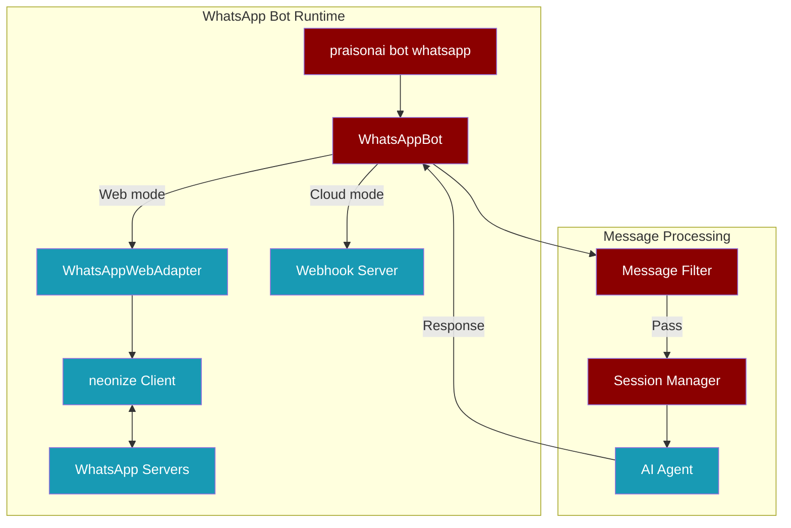

Connect your AI agent to WhatsApp with a single command. Choose between the official **Cloud API** (production) or **Web mode** (scan a QR code, no tokens needed).

```python
from praisonaiagents import Agent
from praisonai.bots import WhatsAppBot

agent = Agent(name="assistant", instructions="Be helpful on WhatsApp.", llm="gpt-4o-mini")
bot = WhatsAppBot(mode="web", agent=agent)

import asyncio
asyncio.run(bot.start())
```

The user messages on WhatsApp; the bot forwards the chat to the agent and replies in the thread.


```mermaid
graph LR
    subgraph "Cloud API (Production)"
        CA[Meta Cloud API] <-->|Webhook| Bot1[🤖 Bot]
    end
    
    subgraph "Web Mode (Experimental)"
        QR[📱 Scan QR] --> WA[WhatsApp Servers]
        WA <-->|WebSocket| Bot2[🤖 Bot]
    end
    
    Bot1 --> Agent[🧠 AI Agent]
    Bot2 --> Agent
    
    classDef api fill:#189AB4,color:#fff
    classDef bot fill:#8B0000,color:#fff
    classDef agent fill:#8B0000,color:#fff
    
    class CA,WA,QR api
    class Bot1,Bot2 bot
    class Agent agent
```

## Quick Start

<Tabs>
<Tab title="Web Mode (Easiest)">

No tokens, no developer account — just scan a QR code.

<Steps>
<Step title="Install">
```bash
pip install 'praisonai[bot-whatsapp-web]'
```
</Step>
<Step title="Start">
```bash
praisonai bot whatsapp --mode web
```
A QR code appears in your terminal. Open WhatsApp → **Linked Devices** → scan it.
</Step>
<Step title="Chat">
Open your own contact (message yourself) and send a message. The bot replies.
</Step>
</Steps>

<Warning>
**Experimental** — Web mode uses a reverse-engineered protocol. Your number may be banned by WhatsApp. Use Cloud API for production.
</Warning>
</Tab>

<Tab title="Cloud API (Production)">

Uses the official Meta WhatsApp Business API.

<Steps>
<Step title="Get Credentials">
1. Go to [Meta for Developers](https://developers.facebook.com/)
2. Create an app → add the **WhatsApp** product
3. Copy your **Phone Number ID** and **Access Token**
</Step>
<Step title="Set Environment Variables">
```bash
export WHATSAPP_ACCESS_TOKEN="EAAx..."
export WHATSAPP_PHONE_NUMBER_ID="123456789"
export WHATSAPP_VERIFY_TOKEN="my-secret"
```
</Step>
<Step title="Start">
```bash
praisonai bot whatsapp
```
This starts a webhook server on port 8080. Point your Meta webhook URL to `https://your-domain.com/webhook`.
</Step>
</Steps>
</Tab>

<Tab title="Python SDK">
```python
from praisonaiagents import Agent
from praisonai.bots import WhatsAppBot

agent = Agent(
    name="assistant",
    instructions="You are a helpful AI assistant",
    llm="gpt-4o-mini"
)

# Web mode — no tokens needed
bot = WhatsAppBot(mode="web", agent=agent)

import asyncio
asyncio.run(bot.start())
```
</Tab>
</Tabs>

---

## How It Works

### Cloud API vs Web Mode

| Feature | Cloud API | Web Mode |
|---------|:---------:|:--------:|
| **Setup** | Meta developer account + tokens | QR code scan |
| **Stability** | Official, stable | Reverse-engineered, may break |
| **Webhooks** | Required (public HTTPS) | Not needed |
| **Groups** | DMs only | DMs + groups |
| **Risk** | None | Account may be banned |
| **Best for** | Production | Development, personal use |

---

## Inbound Media → Vision

Photos and documents sent by users are downloaded via the WhatsApp Graph API, validated, and forwarded to your agent's vision capability — no placeholder text, no extra code.

```mermaid
sequenceDiagram
    participant U as 👤 User
    participant WA as 📲 WhatsApp
    participant Bot as 🤖 WhatsApp Bot
    participant M as 🛡️ Media Validator
    participant A as 🧠 Agent Vision

    U->>WA: Send photo + caption
    WA->>Bot: Webhook (image id + caption)
    Bot->>WA: Download media via Graph API
    WA-->>Bot: Raw bytes
    Bot->>M: cache_inbound_media()
    Note over M: Size cap check (≤ 20 MiB)<br/>Magic-byte content-type check<br/>SSRF-safe URL fetch
    M-->>Bot: Validated local path
    Bot->>A: chat(prompt=caption, attachments=[path])
    A-->>Bot: Vision response
    Bot-->>U: 📨 Reply with image description

    classDef user fill:#8B0000,stroke:#7C90A0,color:#fff
    classDef platform fill:#189AB4,stroke:#7C90A0,color:#fff
    classDef security fill:#F59E0B,stroke:#7C90A0,color:#fff
    classDef agent fill:#10B981,stroke:#7C90A0,color:#fff
```

<Steps>
<Step title="Vision agent — works out of the box">
Any vision-capable model receives photos automatically. No configuration needed.

```python
from praisonaiagents import Agent
from praisonai.bots import WhatsAppBot

agent = Agent(
    name="vision-assistant",
    instructions="Describe and answer questions about images.",
    llm="gpt-4o",
)

bot = WhatsAppBot(agent=agent)

import asyncio
asyncio.run(bot.start())
```

Send a photo to your WhatsApp business number. The agent sees the image and replies.
</Step>

<Step title="Limit or disable inbound media">
Control media size or disable it entirely with `max_inbound_media_bytes`.

```python
from praisonaiagents import Agent
from praisonai.bots import WhatsAppBot
from praisonaiagents.bots import BotConfig

agent = Agent(name="assistant", instructions="Be helpful.", llm="gpt-4o")

bot = WhatsAppBot(
    agent=agent,
    config=BotConfig(
        max_inbound_media_bytes=5 * 1024 * 1024,  # 5 MiB cap
        # max_inbound_media_bytes=0  # set 0 to disable entirely
    ),
)

import asyncio
asyncio.run(bot.start())
```
</Step>
</Steps>

### How the security pipeline works

| Step | What happens |
|------|-------------|
| **Download** | Bot fetches media from WhatsApp Graph API using the media id |
| **Size cap** | File rejected if it exceeds `max_inbound_media_bytes` (default 20 MiB) |
| **Magic-byte check** | Content type verified against actual file bytes — not just the declared MIME |
| **SSRF guard** | URL fetch rejects non-`http(s)` schemes and private/loopback/link-local hosts |
| **Forward** | Validated path passed to `agent.chat(attachments=[path])` |

<Note>
**What if my agent has no vision capability?** The adapter checks whether `agent.chat()` accepts `attachments`. If it doesn't, the attachment is silently skipped and only the caption text is forwarded. Your existing text-only agents keep working with zero changes.
</Note>

### Configuration

| Option | Type | Default | Description |
|--------|------|---------|-------------|
| `max_inbound_media_bytes` | `int` | `20971520` (20 MiB) | Maximum size for inbound media. Set `0` to disable inbound media entirely. |

---

## Interactive Messages

WhatsApp bots render `MessagePresentation` natively — approval buttons, quick replies, and select menus become tappable Cloud API `interactive` messages, with no code change to existing agents.


```mermaid
sequenceDiagram
    participant Agent
    participant Bot as WhatsAppBot
    participant Renderer as WhatsAppPresentationRenderer
    participant WA as Cloud API
    participant User

    Agent->>Bot: render_presentation(target, presentation)
    Bot->>Renderer: render(presentation)
    Renderer->>Renderer: adapt_presentation(whatsapp limits)
    Renderer-->>Bot: interactive payload (button / list)
    Bot->>WA: POST interactive message
    WA->>User: Tappable buttons / list
    User->>WA: Tap
    WA-->>Bot: Command callback
```

<Tabs>
<Tab title="Approval prompt (reply buttons)">

```python
import asyncio
from praisonaiagents.bots import MessagePresentation
from praisonai_bot.bots import WhatsAppBot

bot = WhatsAppBot(
    token="YOUR_TOKEN",
    phone_number_id="YOUR_PHONE_ID",
)

presentation = MessagePresentation.approval(
    prompt="Allow file delete?",
    approval_id="appr-1",
)

async def main():
    # ≤3 non-URL buttons → native reply-button message
    await bot.render_presentation("15551234567", presentation)

asyncio.run(main())
```

</Tab>
<Tab title="Menu / select (list message)">

```python
import asyncio
from praisonaiagents.bots import MessagePresentation, PresentationBlock, SelectOption
from praisonai_bot.bots import WhatsAppBot

bot = WhatsAppBot(
    token="YOUR_TOKEN",
    phone_number_id="YOUR_PHONE_ID",
)

presentation = MessagePresentation(blocks=[
    PresentationBlock.make_text("Pick an environment:"),
    PresentationBlock.make_select(
        options=[
            SelectOption(label="Staging", value="staging"),
            SelectOption(label="Production", value="prod"),
        ],
        placeholder="Choose",
        action_id="env",
    ),
])

async def main():
    # select block → native list message (up to 10 rows)
    await bot.render_presentation("15551234567", presentation)

asyncio.run(main())
```

</Tab>
</Tabs>

### How WhatsApp adapts

| Presentation content | Native shape |
|----------------------|--------------|
| ≤3 non-URL buttons | Reply buttons (`interactive.type == "button"`) |
| >3 buttons **or** a `select` block | List message (`interactive.type == "list"`, up to 10 rows) |
| URL buttons | Inlined into the body as `Label: URL` text links |
| Text only | Plain text send |

See [Bot Presentations](/docs/features/bot-presentations) for the portable model shared across Telegram, Slack, Discord, and WhatsApp.

---

## Message Filtering

By default, the bot responds **only to self-chat** — when you message your own number. This prevents it from replying to every conversation.


```mermaid
graph TD
    MSG["📩 Message"] --> STALE{"Older than\nconnect time?"}
    STALE -->|"Yes"| DROP["🗑️ Drop"]
    STALE -->|"No"| SELF{"Self-chat?\n(you → your number)"}
    SELF -->|"Yes"| PROCESS["✅ Process"]
    SELF -->|"No"| OUT{"Outgoing to\nsomeone else?"}
    OUT -->|"Yes"| BLOCK["❌ Block"]
    OUT -->|"No"| LIST{"In allowlist?"}
    LIST -->|"Yes"| PROCESS
    LIST -->|"No"| IGNORE["❌ Ignore"]

    classDef check fill:#F59E0B,stroke:#7C90A0,color:#fff
    classDef ok fill:#10B981,stroke:#7C90A0,color:#fff
    classDef no fill:#EF4444,stroke:#7C90A0,color:#fff

    class STALE,SELF,OUT,LIST check
    class PROCESS ok
    class DROP,BLOCK,IGNORE no
```

### Four Layers of Protection

<CardGroup cols={2}>
<Card title="Stale Message Guard" icon="clock">
Messages older than when the bot connected are dropped. Prevents replaying old conversations on reconnect.
</Card>
<Card title="Self-Chat Check" icon="user">
Only messages where sender = chat JID pass.
</Card>
<Card title="Outgoing Guard" icon="shield">
Your messages sent to other people's chats are always blocked — even if they're in the allowlist.
</Card>
<Card title="Allowlists" icon="list-check">
Optionally allow specific phone numbers or groups.
</Card>
</CardGroup>

### Expand Who Can Message the Bot

<Tabs>
<Tab title="Self-Only (Default)">
```bash
praisonai bot whatsapp --mode web
```
Only responds when you message your own number.
</Tab>
<Tab title="Specific Numbers">
```bash
# Comma-separated
praisonai bot whatsapp --mode web --respond-to 1234567890,9876543210

# Or repeated flags
praisonai bot whatsapp --mode web --respond-to 1234567890 --respond-to 9876543210
```
</Tab>
<Tab title="Specific Groups">
```bash
# Comma-separated
praisonai bot whatsapp --mode web --respond-to-groups 120363123456@g.us,999888777@g.us

# Or repeated flags
praisonai bot whatsapp --mode web --respond-to-groups 120363123456@g.us --respond-to-groups 999888777@g.us
```
</Tab>
<Tab title="Everyone">
```bash
praisonai bot whatsapp --mode web --respond-to-all
```
</Tab>
</Tabs>

### Filtering Matrix

| Scenario | Default | `--respond-to 123` | `--respond-to-groups g@g.us` | `--respond-to-all` |
|----------|:-------:|:-------------------:|:----------------------------:|:------------------:|
| Self-chat (your own number) | ✅ | ✅ | ✅ | ✅ |
| Your msg in someone else's chat | ❌ | ❌ | ❌ | ✅ |
| DM from 123 | ❌ | ✅ | ❌ | ✅ |
| DM from 999 | ❌ | ❌ | ❌ | ✅ |
| Group g@g.us | ❌ | ❌ | ✅ | ✅ |
| Other group | ❌ | ❌ | ❌ | ✅ |
| Old/offline messages | ❌ | ❌ | ❌ | ❌ |

<Note>
Phone numbers are normalized automatically — `+1-234-567-890` and `1234567890` match the same number.
</Note>

### Python SDK Filtering

```python
from praisonai.bots import WhatsAppBot

bot = WhatsAppBot(
    mode="web",
    agent=agent,
    allowed_numbers=["1234567890", "9876543210"],
    allowed_groups=["120363123456@g.us"],
    respond_to_all=False,  # default
)
```

### YAML Config

```yaml
platform: whatsapp
mode: web

respond_to:
  - "1234567890"
respond_to_groups:
  - "120363123456@g.us"
respond_to_all: false

agent:
  name: "My Assistant"
  instructions: "You are a helpful AI assistant."
  llm: "gpt-4o-mini"
```

```bash
praisonai bot start --config bot.yaml
```

---

## Built-in Commands

| Command | Description |
|---------|-------------|
| `/help` | Show available commands |
| `/status` | Bot info, model, uptime |
| `/new` | Reset conversation session |

Register custom commands:

```python
@bot.on_command("ping")
async def ping(msg):
    return "Pong!"
```

---

## CLI Options

```bash
praisonai bot whatsapp --mode web [OPTIONS]
```

| Flag | Description | Example |
|------|-------------|---------|
| `--mode` | `cloud` (default) or `web` | `--mode web` |
| `--respond-to` | Allowed phone numbers (comma-separated or repeated) | `--respond-to 123,456` or `--respond-to 123 --respond-to 456` |
| `--respond-to-groups` | Allowed group JIDs (comma-separated or repeated) | `--respond-to-groups grp@g.us` |
| `--respond-to-all` | Respond to everyone | `--respond-to-all` |
| `--creds-dir` | Credentials directory | `--creds-dir ~/.myapp/wa` |
| `--agent` | Agent YAML config | `--agent agents.yaml` |
| `--memory` | Enable conversation memory | `--memory` |
| `--web` | Enable web search tool | `--web` |
| `--thinking` | Extended thinking mode | `--thinking high` |
| `--auto-approve` | Auto-approve tool calls | `--auto-approve` |

---

## Architecture


```mermaid
graph TB
    subgraph "WhatsApp Bot Runtime"
        CLI["praisonai bot whatsapp"] --> WB[WhatsAppBot]
        WB --> |"Web mode"| WA[WhatsAppWebAdapter]
        WB --> |"Cloud mode"| WH[Webhook Server]
        WA --> NC[neonize Client]
        NC <--> WS[WhatsApp Servers]
    end
    
    subgraph "Message Processing"
        WB --> FIL[Message Filter]
        FIL --> |"Pass"| SM[Session Manager]
        SM --> AG[AI Agent]
        AG --> |"Response"| WB
    end

    classDef bot fill:#8B0000,color:#fff
    classDef infra fill:#189AB4,color:#fff
    
    class CLI,WB,FIL,SM bot
    class WA,WH,NC,WS,AG infra
```

<Note>
**Cloud-mode webhook verification:** inbound Meta webhooks are HMAC-verified via the shared helper. Set `WHATSAPP_APP_SECRET` (see [Messaging Bots](/docs/features/messaging-bots)). Details: [Webhook Verification](/docs/features/webhook-verification).
</Note>

### Key Components

| Component | Role |
|-----------|------|
| **WhatsAppBot** | Main bot class — handles lifecycle, filtering, routing |
| **WhatsAppWebAdapter** | Bridges neonize (Go) events to Python asyncio |
| **Session Manager** | Per-user conversation sessions with expiry |
| **Message Filter** | Stale guard → self-chat check → allowlist check |
| **AI Agent** | Your configured agent processes the message and responds |


---

## Long Agent Turns

A long agent turn on WhatsApp — deep research, big refactor, a slow model — stays `BUSY` for as long as it is making any progress, and is never restarted mid-stream.

The gateway watches each channel's health and only restarts a channel when it is genuinely wedged. Progress comes from inbound transport activity (someone messaged the bot) **and** in-run progress (the agent emitted a streamed token, called a tool, or fired an emitter event). As long as either signal advanced within `stuck_after` (default 900s), the channel stays `BUSY` and will not be killed. Only when **no** signal arrives for `stuck_after` seconds does the channel escalate to `STUCK` (recoverable, will be restarted).

```mermaid
sequenceDiagram
    participant User as WhatsApp User
    participant WA as WhatsApp Adapter
    participant Agent
    participant Health as Channel Health

    User->>WA: Run a deep research task
    WA->>Agent: start run (active_runs=1)
    Agent-->>WA: streamed token
    WA->>Health: note_run_progress()
    Agent-->>WA: tool call
    WA->>Health: note_run_progress()
    Health-->>WA: BUSY (within stuck_after)
    Agent-->>WA: final answer
    WA-->>User: reply

    classDef agent fill:#8B0000,stroke:#7C90A0,color:#fff
    classDef tool fill:#189AB4,stroke:#7C90A0,color:#fff
    classDef decision fill:#F59E0B,stroke:#7C90A0,color:#fff

    class Agent agent
    class User,WA tool
    class Health decision
```

| Scenario on WhatsApp | Health state | Outcome |
|---|---|---|
| Active inbound traffic + active run | `BUSY` | Channel kept alive |
| Active run, no inbound, streaming tokens or tool calls within `stuck_after` | `BUSY` | Channel kept alive |
| Active run, no signal of any kind for `> stuck_after` | `STUCK` | Channel restarted (genuine hang) |
| No active runs, idle | `IDLE` | Channel kept alive |

<Note>
The same mechanism applies to every channel adapter, not just WhatsApp. For the full evaluator behaviour, configuration knobs (`stuck_after`, `busy_after`), and the `HealthResult.last_run_progress` field, see [Channel Supervision](/docs/features/gateway-channel-supervision).
</Note>


---

## Troubleshooting

<AccordionGroup>

<Accordion title="Bot responds to old messages on startup">
**Fixed in latest version.** The stale-message guard drops any message older than when the bot connected. If you still see this, update to the latest version:
```bash
pip install --upgrade praisonai
```
</Accordion>

<Accordion title="Bot responds to all messages, not just self-chat">
**Fixed in latest version.** The default filter now checks that both the sender AND chat JID match (true self-chat), not just `IsFromMe`. Update your installation.
</Accordion>

<Accordion title="Decryption warnings in the logs">
```
WARNING Ignoring message ... failed to decrypt prekey message
WARNING Ignoring message ... failed to decrypt group message
```
These are **normal and harmless**. They come from the WhatsApp protocol layer (whatsmeow) when old session keys can't decrypt certain messages. The bot automatically suppresses most of these. They don't affect functionality.
</Accordion>

<Accordion title="SessionCipher error: old counter">
```
[ERROR] SessionCipher.go:310 ▶ Unable to get or create message keys
```
This is an **upstream protocol error** from the Signal encryption layer. It means a message had expired keys. This is not a bug in PraisonAI — it's a normal part of the WhatsApp protocol. The message is simply skipped.
</Accordion>

<Accordion title="WebSocket close error on shutdown">
```
WARNING Error sending close to websocket
```
This appears when Ctrl+C is pressed. It's harmless — the bot is disconnecting from WhatsApp servers. The latest version suppresses this warning.
</Accordion>

<Accordion title="shell_tools error: /home/user not found">
```
ERROR Error executing command: No such file or directory: '/home/user'
```
This happens when the AI agent tries to run a command in `/home/user` (a Linux path) on macOS. **Fixed in latest version** — the tool now automatically falls back to your home directory.
</Accordion>

<Accordion title="Threading error on Ctrl+C">
```
Exception ignored in: <module 'threading' ...>
KeyboardInterrupt
```
**Fixed in latest version.** The bot now properly shuts down background threads on exit. Update your installation.
</Accordion>

<Accordion title="QR code not showing">
1. Use a modern terminal (iTerm2, Windows Terminal)
2. Ensure `segno` is installed: `pip install 'praisonai[bot-whatsapp-web]'`
3. If a saved session exists, no QR is needed. Delete to re-link:
```bash
rm -rf ~/.praisonai/whatsapp/
```
</Accordion>

<Accordion title="Session expired">
WhatsApp Web sessions expire if your phone is offline for 14+ days. Delete and re-scan:
```bash
rm -rf ~/.praisonai/whatsapp/
praisonai bot whatsapp --mode web
```
</Accordion>

</AccordionGroup>

---

## Related

<CardGroup cols={2}>
<Card title="Inbound Media" icon="image" href="/docs/features/bot-inbound-media">
Full reference for inbound media: security pipeline, SSRF guard, and patterns
</Card>
<Card title="Messaging Bots" icon="robot" href="/docs/features/messaging-bots">
All supported platforms: Telegram, Discord, Slack, WhatsApp
</Card>
<Card title="WhatsApp MCP" icon="plug" href="/docs/mcp/whatsapp">
Send WhatsApp messages from agents using MCP tools
</Card>
<Card title="Bot Commands" icon="terminal" href="/docs/features/bot-commands">
Custom command registration and handling
</Card>
<Card title="Approval Protocol" icon="shield-check" href="/docs/features/approval-protocol">
Human-in-the-loop tool approval for bots
</Card>
</CardGroup>
