Connect your AI agent to WhatsApp with a single command. Choose between the official **Cloud API** (production) or **Web mode** (scan a QR code, no tokens needed).

```mermaid
graph LR
    subgraph "Cloud API (Production)"
        CA[Meta Cloud API] <-->|Webhook| Bot1[🤖 Bot]
    end
    
    subgraph "Web Mode (Experimental)"
        QR[📱 Scan QR] --> WA[WhatsApp Servers]
        WA <-->|WebSocket| Bot2[🤖 Bot]
    end
    
    Bot1 --> Agent[🧠 AI Agent]
    Bot2 --> Agent
    
    classDef api fill:#189AB4,color:#fff
    classDef bot fill:#8B0000,color:#fff
    classDef agent fill:#8B0000,color:#fff
    
    class CA,WA,QR api
    class Bot1,Bot2 bot
    class Agent agent
```



## Quick Start

<Tabs>
<Tab title="Web Mode (Easiest)">

No tokens, no developer account — just scan a QR code.

<Steps>
<Step title="Install">
```bash
pip install 'praisonai[bot-whatsapp-web]'
```
</Step>
<Step title="Start">
```bash
praisonai bot whatsapp --mode web
```
A QR code appears in your terminal. Open WhatsApp → **Linked Devices** → scan it.
</Step>
<Step title="Chat">
Open your own contact (message yourself) and send a message. The bot replies.
</Step>
</Steps>

<Warning>
**Experimental** — Web mode uses a reverse-engineered protocol. Your number may be banned by WhatsApp. Use Cloud API for production.
</Warning>
</Tab>

<Tab title="Cloud API (Production)">

Uses the official Meta WhatsApp Business API.

<Steps>
<Step title="Get Credentials">
1. Go to [Meta for Developers](https://developers.facebook.com/)
2. Create an app → add the **WhatsApp** product
3. Copy your **Phone Number ID** and **Access Token**
</Step>
<Step title="Set Environment Variables">
```bash
export WHATSAPP_ACCESS_TOKEN="EAAx..."
export WHATSAPP_PHONE_NUMBER_ID="123456789"
export WHATSAPP_VERIFY_TOKEN="my-secret"
```
</Step>
<Step title="Start">
```bash
praisonai bot whatsapp
```
This starts a webhook server on port 8080. Point your Meta webhook URL to `https://your-domain.com/webhook`.
</Step>
</Steps>
</Tab>

<Tab title="Python SDK">
```python
from praisonaiagents import Agent
from praisonai.bots import WhatsAppBot

agent = Agent(
    name="assistant",
    instructions="You are a helpful AI assistant",
    llm="gpt-4o-mini"
)

# Web mode — no tokens needed
bot = WhatsAppBot(mode="web", agent=agent)

import asyncio
asyncio.run(bot.start())
```
</Tab>
</Tabs>

---

## How It Works

### Cloud API vs Web Mode

| Feature | Cloud API | Web Mode |
|---------|:---------:|:--------:|
| **Setup** | Meta developer account + tokens | QR code scan |
| **Stability** | Official, stable | Reverse-engineered, may break |
| **Webhooks** | Required (public HTTPS) | Not needed |
| **Groups** | DMs only | DMs + groups |
| **Risk** | None | Account may be banned |
| **Best for** | Production | Development, personal use |

---

## Message Filtering

By default, the bot responds **only to self-chat** — when you message your own number. This prevents it from replying to every conversation.

```mermaid
graph TD
    MSG["📩 Incoming Message"] --> STALE{"Older than\nconnect time?"}
    STALE -->|"Yes"| DROP["🗑️ Drop"]
    STALE -->|"No"| SELF{"Self-chat?\n(you → your number)"}
    SELF -->|"Yes"| PROCESS["✅ Process"]
    SELF -->|"No"| LIST{"In allowlist?"}
    LIST -->|"Yes"| PROCESS
    LIST -->|"No"| IGNORE["❌ Ignore"]

    classDef check fill:#F59E0B,stroke:#7C90A0,color:#fff
    classDef ok fill:#10B981,stroke:#7C90A0,color:#fff
    classDef no fill:#EF4444,stroke:#7C90A0,color:#fff

    class STALE,SELF,LIST check
    class PROCESS ok
    class DROP,IGNORE no
```



### Three Layers of Protection

<CardGroup cols={3}>
<Card title="Stale Message Guard" icon="clock">
Messages older than when the bot connected are dropped. Prevents replaying old conversations on reconnect.
</Card>
<Card title="Self-Chat Check" icon="user">
Only messages where sender = chat JID pass. Your messages in other people's chats are ignored.
</Card>
<Card title="Allowlists" icon="list-check">
Optionally allow specific phone numbers or groups.
</Card>
</CardGroup>

### Expand Who Can Message the Bot

<Tabs>
<Tab title="Self-Only (Default)">
```bash
praisonai bot whatsapp --mode web
```
Only responds when you message your own number.
</Tab>
<Tab title="Specific Numbers">
```bash
praisonai bot whatsapp --mode web --respond-to 1234567890,9876543210
```
</Tab>
<Tab title="Specific Groups">
```bash
praisonai bot whatsapp --mode web --respond-to-groups 120363123456@g.us
```
</Tab>
<Tab title="Everyone">
```bash
praisonai bot whatsapp --mode web --respond-to-all
```
</Tab>
</Tabs>

### Filtering Matrix

| Scenario | Default | `--respond-to 123` | `--respond-to-groups g@g.us` | `--respond-to-all` |
|----------|:-------:|:-------------------:|:----------------------------:|:------------------:|
| Self-chat (your own number) | ✅ | ✅ | ✅ | ✅ |
| Your msg in someone else's chat | ❌ | ❌ | ❌ | ✅ |
| DM from 123 | ❌ | ✅ | ❌ | ✅ |
| DM from 999 | ❌ | ❌ | ❌ | ✅ |
| Group g@g.us | ❌ | ❌ | ✅ | ✅ |
| Other group | ❌ | ❌ | ❌ | ✅ |
| Old/offline messages | ❌ | ❌ | ❌ | ❌ |

<Note>
Phone numbers are normalized automatically — `+1-234-567-890` and `1234567890` match the same number.
</Note>

### Python SDK Filtering

```python
from praisonai.bots import WhatsAppBot

bot = WhatsAppBot(
    mode="web",
    agent=agent,
    allowed_numbers=["1234567890", "9876543210"],
    allowed_groups=["120363123456@g.us"],
    respond_to_all=False,  # default
)
```

### YAML Config

```yaml
platform: whatsapp
mode: web

respond_to:
  - "1234567890"
respond_to_groups:
  - "120363123456@g.us"
respond_to_all: false

agent:
  name: "My Assistant"
  instructions: "You are a helpful AI assistant."
  llm: "gpt-4o-mini"
```

```bash
praisonai bot start --config bot.yaml
```

---

## Built-in Commands

| Command | Description |
|---------|-------------|
| `/help` | Show available commands |
| `/status` | Bot info, model, uptime |
| `/new` | Reset conversation session |

Register custom commands:

```python
@bot.on_command("ping")
async def ping(msg):
    return "Pong!"
```

---

## CLI Options

```bash
praisonai bot whatsapp --mode web [OPTIONS]
```

| Flag | Description | Example |
|------|-------------|---------|
| `--mode` | `cloud` (default) or `web` | `--mode web` |
| `--respond-to` | Allowed phone numbers | `--respond-to 123,456` |
| `--respond-to-groups` | Allowed group JIDs | `--respond-to-groups grp@g.us` |
| `--respond-to-all` | Respond to everyone | `--respond-to-all` |
| `--creds-dir` | Credentials directory | `--creds-dir ~/.myapp/wa` |
| `--agent` | Agent YAML config | `--agent agents.yaml` |
| `--memory` | Enable conversation memory | `--memory` |
| `--web` | Enable web search tool | `--web` |
| `--thinking` | Extended thinking mode | `--thinking high` |
| `--auto-approve` | Auto-approve tool calls | `--auto-approve` |

---

## Architecture


### Key Components

| Component | Role |
|-----------|------|
| **WhatsAppBot** | Main bot class — handles lifecycle, filtering, routing |
| **WhatsAppWebAdapter** | Bridges neonize (Go) events to Python asyncio |
| **Session Manager** | Per-user conversation sessions with expiry |
| **Message Filter** | Stale guard → self-chat check → allowlist check |
| **AI Agent** | Your configured agent processes the message and responds |

---

## Troubleshooting

<AccordionGroup>

<Accordion title="Bot responds to old messages on startup">
**Fixed in latest version.** The stale-message guard drops any message older than when the bot connected. If you still see this, update to the latest version:
```bash
pip install --upgrade praisonai
```
</Accordion>

<Accordion title="Bot responds to all messages, not just self-chat">
**Fixed in latest version.** The default filter now checks that both the sender AND chat JID match (true self-chat), not just `IsFromMe`. Update your installation.
</Accordion>

<Accordion title="Decryption warnings in the logs">
```
WARNING Ignoring message ... failed to decrypt prekey message
WARNING Ignoring message ... failed to decrypt group message
```
These are **normal and harmless**. They come from the WhatsApp protocol layer (whatsmeow) when old session keys can't decrypt certain messages. The bot automatically suppresses most of these. They don't affect functionality.
</Accordion>

<Accordion title="SessionCipher error: old counter">
```
[ERROR] SessionCipher.go:310 ▶ Unable to get or create message keys
```
This is an **upstream protocol error** from the Signal encryption layer. It means a message had expired keys. This is not a bug in PraisonAI — it's a normal part of the WhatsApp protocol. The message is simply skipped.
</Accordion>

<Accordion title="WebSocket close error on shutdown">
```
WARNING Error sending close to websocket
```
This appears when Ctrl+C is pressed. It's harmless — the bot is disconnecting from WhatsApp servers. The latest version suppresses this warning.
</Accordion>

<Accordion title="shell_tools error: /home/user not found">
```
ERROR Error executing command: No such file or directory: '/home/user'
```
This happens when the AI agent tries to run a command in `/home/user` (a Linux path) on macOS. **Fixed in latest version** — the tool now automatically falls back to your home directory.
</Accordion>

<Accordion title="Threading error on Ctrl+C">
```
Exception ignored in: <module 'threading' ...>
KeyboardInterrupt
```
**Fixed in latest version.** The bot now properly shuts down background threads on exit. Update your installation.
</Accordion>

<Accordion title="QR code not showing">
1. Use a modern terminal (iTerm2, Windows Terminal)
2. Ensure `segno` is installed: `pip install 'praisonai[bot-whatsapp-web]'`
3. If a saved session exists, no QR is needed. Delete to re-link:
```bash
rm -rf ~/.praisonai/whatsapp/
```
</Accordion>

<Accordion title="Session expired">
WhatsApp Web sessions expire if your phone is offline for 14+ days. Delete and re-scan:
```bash
rm -rf ~/.praisonai/whatsapp/
praisonai bot whatsapp --mode web
```
</Accordion>

</AccordionGroup>

---

## Related

<CardGroup cols={2}>
<Card title="Messaging Bots" icon="robot" href="/features/messaging-bots">
All supported platforms: Telegram, Discord, Slack, WhatsApp
</Card>
<Card title="WhatsApp MCP" icon="plug" href="/mcp/whatsapp">
Send WhatsApp messages from agents using MCP tools
</Card>
<Card title="Bot Commands" icon="terminal" href="/features/bot-commands">
Custom command registration and handling
</Card>
<Card title="Approval Protocol" icon="shield-check" href="/features/approval-protocol">
Human-in-the-loop tool approval for bots
</Card>
</CardGroup>
