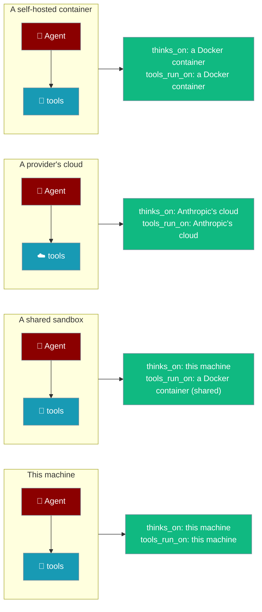
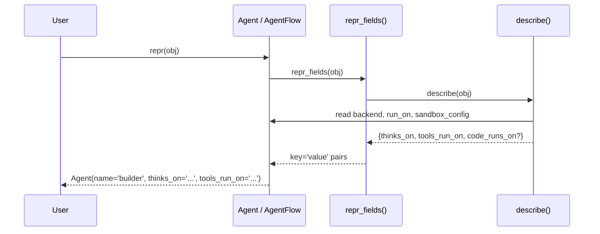

Every `Agent`, `AgentTeam`, and `AgentFlow` now tells you — from `repr()` alone or via `where_does_it_run()` — where the model runs and where the tools run.



## Quick Start

<Steps>
<Step title="Ask an agent where it runs">
```python
from praisonaiagents import Agent

agent = Agent(name="builder")
print(repr(agent))
# Agent(name='builder', thinks_on='this machine', tools_run_on='this machine')

print(agent.where_does_it_run())
# Thinking (the AI model calls) happens on this machine.
# Tools run on this machine.
# Nothing is isolated: tools you pass run in this program, with your permissions.
```
</Step>

<Step title="A workflow with a shared sandbox">
```python
from praisonaiagents import Agent, AgentFlow

writer = Agent(name="writer")
reader = Agent(name="reader")

flow = AgentFlow(run_on="docker", steps=[writer, reader])
print(repr(flow))
# AgentFlow(name='AgentFlow', steps=2,
#           thinks_on='this machine',
#           tools_run_on='a Docker container (shared)')

print(flow.where_does_it_run())
# Thinking (the AI model calls) happens on this machine.
# Tools run on a Docker container (shared).
# Every step shares that same sandbox, so a file written by one step is visible to the next.
```
</Step>

<Step title="Read the answer as a dictionary">
```python
from praisonaiagents import Agent, AgentFlow
from praisonaiagents.agent.execution_location import describe

describe(Agent(name="builder"))
# {'thinks_on': 'this machine', 'tools_run_on': 'this machine'}

describe(AgentFlow(run_on="docker", steps=[Agent(name="w")]), shared=True)
# {'thinks_on': 'this machine', 'tools_run_on': 'a Docker container (shared)'}
```
</Step>
</Steps>

---

## Three topologies at a glance

`tools_run_on=` moves the **tools** out but keeps the model call local. A whole-loop backend moves **both** off this machine — hosted on a vendor's cloud, or self-hosted in a container you own. The repr names both places, so you can tell them apart at a glance.

| Topology | Example | `thinks_on` | `tools_run_on` |
|---|---|---|---|
| **Tools remote, loop local** | `Agent(tools_run_on="docker")` | `this machine` | `a Docker container` |
| **Whole loop hosted** | `Agent(run_on="anthropic")` | `Anthropic's cloud` | `Anthropic's cloud` |
| **Whole loop self-hosted** | `Agent(run_on="docker")` | `a Docker container` | `a Docker container` |

<Note>
There is no `HostedAgent` class to import today. When a `backend=` object reports its provider as `anthropic` (its class name contains `Hosted` or `Anthropic` and it exposes a `.provider`), both places become `Anthropic's cloud`. You can see the exact phrasing without any backend using `say_place`:

```python
from praisonaiagents.agent.execution_location import say_place

say_place("anthropic")   # "Anthropic's cloud"
say_place("docker")      # "a Docker container"
```
</Note>

---

## How the object knows

`repr()` asks a single shared helper — `describe()` — which reads three attributes off the object and turns provider names into plain phrases.



`describe()` never raises — if a property throws, `thinks_on` falls back to `this machine` so that describing where something runs can never break the thing it describes.

`_backend_places()` now asks the backend via `provider_name` rather than name-matching the class. A self-hosted backend (like `run_on="docker"`) used to be misreported as thinking on this machine because its class name did not contain `Hosted` or `Anthropic`; asking it what it is fixes that — the whole-loop container is now reported as `a Docker container` for both places.

`_backend_places()` reads a backend's `_compute` / `compute` with `via="compute"`, because that attribute is a compute-registry provider — otherwise a `LocalCompute` here would borrow the subprocess backend's stronger words. See [The two flavors of `local`](#the-two-flavors-of-local).

<Note>
As of [PR #4070](https://github.com/MervinPraison/PraisonAI/pull/4070), `Agent(tools_run_on="native")` (and any alias in `_compute_bridge._ALIASES`) is accepted at construction. Validation used to run before alias resolution, so a spelling the resolver would happily route raised `TypeError: 'native' is not a known place`. `tool_places()` now includes the alias table it validates against.
</Note>

---

## What each place name means

Provider names map to phrases a non-developer can read. These are the exact strings the object returns.

| Provider | Phrase |
|---|---|
| `local` | this machine |
| `subprocess` | a separate process on this machine |
| `sandlock` | a locked-down process on this machine |
| `docker` | a Docker container |
| `e2b` | an E2B cloud sandbox |
| `modal` | a Modal cloud sandbox |
| `daytona` | a Daytona cloud sandbox |
| `flyio` | a Fly.io machine |
| `tenki` | a Tenki cloud sandbox |
| `novita` | a Novita cloud sandbox |
| `ssh` | a remote machine over SSH |
| `anthropic` | Anthropic's cloud |

Public aliases resolve to the backend that actually runs — the alias name never appears in the output:

| You type | It reports |
|---|---|
| `native` | a locked-down process on this machine |
| `local` (in `run_in=`) | a separate process on this machine |
| `local` (in `tools_run_on=`) | a plain shell on this machine (no policy applied) |

An unknown provider falls back to its own name: `say_place("some-new-cloud")` returns `"some-new-cloud"`.

<Note>
As of [PR #4070](https://github.com/MervinPraison/PraisonAI/pull/4070), `Agent(tools_run_on="native")` — and any alias in `_compute_bridge._ALIASES` — is accepted at construction. Validation used to run before alias resolution, so a spelling the resolver would happily route (`native` → `sandlock`) raised `TypeError: 'native' is not a known place`. `tool_places()` now includes the alias table it validates against, so `native` resolves to `sandlock` and reports `tools_run_on='a locked-down process on this machine'`.
</Note>

### The two flavors of `local`

`local` means two different backends depending on which parameter carried it, so the phrase depends on where the word came from.

- `run_in="local"` → SandboxManager collapses it to the **subprocess** backend (scrubbed environment, blocked commands and paths) → `"a separate process on this machine"`
- `tools_run_on="local"` → the wrapper's **LocalCompute**: a plain shell in the current directory, full environment inherited, **no security policy** → `"a plain shell on this machine (no policy applied)"`

`say_place(name, *, via="sandbox")` normalises the provider object first, then reads the compute-only word table. Pass `via="compute"` for the `tools_run_on=` reading:

```python
from praisonaiagents.agent.execution_location import say_place

say_place("local")                 # "a separate process on this machine"
say_place("local", via="compute")  # "a plain shell on this machine (no policy applied)"
```

The same rule applies when a **managed backend holds a `LocalCompute` provider object** (`provider_name="local"`). A backend's `_compute` / `compute` is a compute-registry provider, so `_backend_places()` reads it with `via="compute"` — otherwise a `LocalCompute` here would borrow the subprocess backend's stronger words.

```python
# A managed backend that carries a LocalCompute provider object
# (provider_name="local") is a COMPUTE-registry provider, so it is
# read with the compute vocabulary — never described in the subprocess
# backend's stronger words.
#
# Before PR #4070: tools_run_on='a separate process on this machine'  (WRONG — overstated)
# After  PR #4070: tools_run_on='a plain shell on this machine (no policy applied)'  (CORRECT)
```

<Note>
**Behaviour-change note ([PR #4070](https://github.com/MervinPraison/PraisonAI/pull/4070)).** Upgrading changes the *printed string* for a managed backend holding a `LocalCompute`, not the runtime behaviour. The previous string understated the shell's freedom and overstated the sandbox's protection.
</Note>

---

## The subprocess warning

A `sandbox=True` agent runs tools in a separate process — but a separate process is not a security boundary.

<Warning>
Note: a separate process is not a security boundary — it can still reach the network and read your files. Use docker or a cloud provider for untrusted code.
</Warning>

```python
from praisonaiagents import Agent

agent = Agent(name="A", sandbox=True)
print(agent.where_does_it_run())
# Thinking (the AI model calls) happens on this machine.
# Tools run on a separate process on this machine.
# Nothing is isolated: tools you pass run in this program, with your permissions.
# Note: a separate process is not a security boundary -- it can still reach the
# network and read your files. Use docker or a cloud provider for untrusted code.
```

The network stays reachable and `~/.ssh` stays readable under a subprocess. A real container (`run_on="docker"`) is a real boundary, so it does **not** trigger this note. See [Sandbox](/features/sandbox) for the same warning in depth.

---

## Configuration Options

This page adds no new knobs — where things run comes from `sandbox=`, `run_on=`, and `backend=`, documented on the sandbox pages below. The only new vocabulary is the field names the object returns:

| Field | When it appears | Meaning |
|---|---|---|
| `thinks_on` | always | Where the AI model calls happen |
| `tools_run_on` | always | Where the tools execute |
| `code_runs_on` | when a `sandbox_config` exists | Where `execute_code()` runs |

The field is `thinks_on` / `tools_run_on`, never `loop` — that word already means the workflow `loop()` primitive, asyncio's event loop, and agent-loop jargon, so it was deliberately rejected.

<CardGroup cols={2}>
  <Card title="Sandbox" icon="shield-halved" href="/features/sandbox">
    Per-agent `sandbox=` and the explicit `execute_code()` API
  </Card>
  <Card title="Shared Sandbox" icon="share-nodes" href="/features/shared-sandbox">
    `run_on=` gives a whole flow one shared sandbox
  </Card>
</CardGroup>

---

## Common Patterns

Check where things run before a paid run, log it at startup, or assert it in a test.

```python
from praisonaiagents import Agent, AgentFlow
import logging

logger = logging.getLogger(__name__)

# 1. Verify what a config will do before you run it.
flow = AgentFlow(run_on="docker", steps=[Agent(name="w")])
print(repr(flow))  # confirm 'a Docker container (shared)' before starting

# 2. Log where things run at startup — support tickets get 10x easier to triage.
agent = Agent(name="builder")
logger.info(agent.where_does_it_run())

# 3. Assert where things run in a test.
from praisonaiagents.agent.execution_location import say_place
assert say_place("docker") == "a Docker container"
```

---

## Best Practices

<AccordionGroup>
<Accordion title="Print the object, don't guess where it runs">
The repr is now the primary source of truth. `repr(agent)` names both places, so you never have to consult docs to learn whether tools run locally or in a container.
</Accordion>

<Accordion title="Believe the 'not a security boundary' note">
Under a subprocess the network is reachable and `~/.ssh` is readable. Use `docker` or a cloud provider for untrusted code — the note appears precisely because that isolation is bypassable.
</Accordion>

<Accordion title="Prefer run_on= for shared state, backend= for whole-loop-remote">
`run_on=` moves the tools out and shares one sandbox across steps. A hosted `backend=` moves the whole loop off this machine. The two shapes solve different problems — the repr tells them apart.
</Accordion>

<Accordion title="Call describe() for programmatic access">
The string format is for humans. For the raw dict, call `describe(obj)` from `praisonaiagents.agent.execution_location` — it returns `{thinks_on, tools_run_on, code_runs_on?}` and never raises.
</Accordion>
</AccordionGroup>

---

## Related

<CardGroup cols={2}>
  <Card title="Sandbox" icon="shield-halved" href="/features/sandbox">
    Per-agent `sandbox=`
  </Card>
  <Card title="Shared Sandbox" icon="share-nodes" href="/features/shared-sandbox">
    One shared sandbox with `run_on=`
  </Card>
  <Card title="Sandboxed Agent" icon="sandbox" href="/features/sandboxed-agent">
    Local loop, sandboxed tools
  </Card>
  <Card title="Self-Hosted Agent (Docker)" icon="docker" href="/features/run-on-docker">
    `run_on="docker"` — the whole loop self-hosted
  </Card>
</CardGroup>
