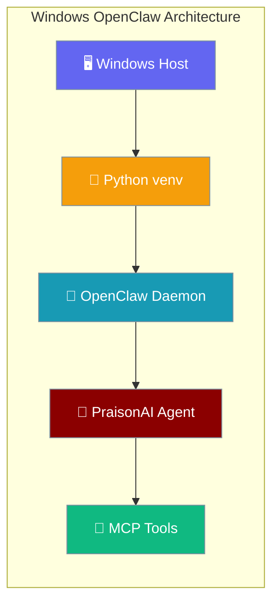

OpenClaw bridges Windows user hosts to MCP/HTTP tool surfaces with proper venv isolation and PowerShell execution patterns.

```python
from praisonaiagents import Agent

agent = Agent(
    name="assistant",
    instructions="You are a helpful assistant with OpenClaw tools.",
    llm="gpt-4o-mini",
)
agent.start("List available OpenClaw tools")
```

The user runs OpenClaw on Windows; the agent calls MCP tools exposed by the local daemon.



## Quick Start

<Steps>
<Step title="Create Virtual Environment">
```powershell
# Create project directory and venv
mkdir praisonai-claw
cd praisonai-claw
python -m venv .venv
.venv\Scripts\Activate.ps1
```
</Step>

<Step title="Install PraisonAI with OpenClaw">
```powershell
# Install with agents and tools extras
pip install "praisonai[agents,tools,claw]"

# Verify installation
praisonai --version
Get-Command praisonai | Format-List *
```
</Step>

<Step title="Configure Environment">

Claw onboarding expects search tools to be available. Set `TAVILY_API_KEY` (recommended) or rely on the free DuckDuckGo fallback — without Tavily, web search quality is lower.

```powershell
# Create .env file
@'
# Set keys from your provider dashboards
OPENAI_API_KEY=
TAVILY_API_KEY=
PYTHONPATH=.
'@ | Out-File -FilePath .env -Encoding utf8
```
</Step>

<Step title="Launch OpenClaw Dashboard">
```powershell
praisonai claw
# Dashboard opens at http://localhost:8082
```
</Step>
</Steps>

---

## PowerShell Setup Script

Create a standardized setup script for repeatable deployments:

<Tabs>
<Tab title="Invoke-PraisonClaw.ps1">
```powershell
<#
.SYNOPSIS
    Setup and run PraisonAI OpenClaw on Windows
.DESCRIPTION
    Creates venv, installs dependencies, and launches OpenClaw daemon
.PARAMETER ProjectPath
    Directory to create/use for the project (default: current directory)
.PARAMETER VenvPath
    Virtual environment path (default: .venv)
.PARAMETER LaunchDashboard
    Whether to launch the dashboard after setup
#>
param(
    [string]$ProjectPath = ".",
    [string]$VenvPath = ".venv", 
    [switch]$LaunchDashboard = $true
)

$ErrorActionPreference = "Stop"

# Resolve absolute paths
$ProjectDir = Resolve-Path $ProjectPath
$VenvDir = Join-Path $ProjectDir $VenvPath

Write-Host "🦞 PraisonAI OpenClaw Windows Setup" -ForegroundColor Cyan
Write-Host "Project: $ProjectDir" -ForegroundColor Green

# Check Python availability
try {
    $PythonCmd = Get-Command python -ErrorAction Stop
    Write-Host "Python found: $($PythonCmd.Source)" -ForegroundColor Green
} catch {
    Write-Error "Python not found. Install Python 3.8+ and add to PATH"
}

# Create venv if it doesn't exist
if (!(Test-Path $VenvDir)) {
    Write-Host "Creating virtual environment..." -ForegroundColor Yellow
    python -m venv $VenvDir
}

# Activate venv
$ActivateScript = Join-Path $VenvDir "Scripts\Activate.ps1"
if (Test-Path $ActivateScript) {
    Write-Host "Activating virtual environment..." -ForegroundColor Yellow
    & $ActivateScript
} else {
    Write-Error "Virtual environment activation script not found: $ActivateScript"
}

# Verify we're in venv
$VenvPython = Join-Path $VenvDir "Scripts\python.exe"
if (Test-Path $VenvPython) {
    Write-Host "Using venv Python: $VenvPython" -ForegroundColor Green
} else {
    Write-Error "Virtual environment Python not found"
}

# Install PraisonAI with extras
Write-Host "Installing PraisonAI with OpenClaw..." -ForegroundColor Yellow
& $VenvPython -m pip install --upgrade pip
& $VenvPython -m pip install "praisonai[agents,tools,claw]"

# Verify installation
Write-Host "Verifying installation..." -ForegroundColor Yellow
$PraisonCmd = Join-Path $VenvDir "Scripts\praisonai.exe"
if (Test-Path $PraisonCmd) {
    & $PraisonCmd --version
    Write-Host "Installation verified: $PraisonCmd" -ForegroundColor Green
} else {
    Write-Error "PraisonAI command not found in venv"
}

# Create .env if it doesn't exist
$EnvFile = Join-Path $ProjectDir ".env"
if (!(Test-Path $EnvFile)) {
    Write-Host "Creating .env template..." -ForegroundColor Yellow
    @'
# OpenAI API Key (required) — paste your key after the equals sign
OPENAI_API_KEY=

# Optional: Other LLM providers
# ANTHROPIC_API_KEY=${ANTHROPIC_API_KEY}
# GOOGLE_API_KEY=${GOOGLE_API_KEY}

# Python path
PYTHONPATH=.
'@ | Out-File -FilePath $EnvFile -Encoding utf8
    Write-Host "Created $EnvFile - Please add your API keys" -ForegroundColor Yellow
}

# Print diagnostics
Write-Host "`n📊 Environment Diagnostics:" -ForegroundColor Cyan
Write-Host "Working Directory: $(Get-Location)"
Write-Host "Python Path: $VenvPython"
Write-Host "PraisonAI Path: $PraisonCmd"
Write-Host "Environment File: $EnvFile"

# Launch dashboard if requested
if ($LaunchDashboard -and (Test-Path $EnvFile)) {
    Write-Host "`n🚀 Launching OpenClaw Dashboard..." -ForegroundColor Cyan
    Write-Host "Dashboard will open at http://localhost:8082" -ForegroundColor Green
    & $PraisonCmd claw
}
```
</Tab>

<Tab title="Quick Setup">
```powershell
# One-liner setup and launch
irm https://raw.githubusercontent.com/MervinPraison/PraisonAIDocs/main/scripts/windows/Setup-PraisonClaw.ps1 | iex
```
</Tab>

<Tab title="Manual Commands">
```powershell
# Manual step-by-step setup
mkdir praisonai-openclaw
cd praisonai-openclaw

# Create and activate venv
python -m venv .venv
.\.venv\Scripts\Activate.ps1

# Install with all extras
pip install "praisonai[agents,tools,claw]"

# Create environment
echo "OPENAI_API_KEY=sk-..." > .env

# Verify and launch
praisonai --version
praisonai claw
```
</Tab>
</Tabs>

---

## OpenClaw Configuration

Configure OpenClaw with absolute Windows paths and proper subprocess handling:

<Tabs>
<Tab title="claw-config.yaml">
```yaml
# OpenClaw Configuration for Windows
name: "PraisonAI OpenClaw"
description: "Windows MCP bridge for PraisonAI agents"

# Python executable path (use absolute path)
python_executable: "C:\\path\\to\\your\\project\\.venv\\Scripts\\python.exe"

# Working directory (use absolute path)
working_directory: "C:\\path\\to\\your\\project"

# Environment variables
environment:
  PYTHONPATH: "."
  OPENAI_API_KEY: "${OPENAI_API_KEY}"
  
# Subprocess configuration
subprocess:
  # Use forward slashes or escaped backslashes
  executable: ".venv/Scripts/praisonai.exe"
  args: ["claw", "--port", "8082"]
  
  # Windows-specific options
  shell: false
  capture_output: true
  timeout: 60
  
# MCP server configuration  
mcp:
  servers:
    filesystem:
      command: "python"
      args: ["-m", "mcp_server_filesystem", "C:\\path\\to\\project"]
    
    praisonai_tools:
      command: ".venv/Scripts/python.exe"
      args: ["-m", "praisonai.mcp.server"]
      
# Health check configuration
health:
  endpoint: "http://localhost:8082/health"
  interval: 30
  timeout: 5
```
</Tab>

<Tab title="launch.ps1">
```powershell
# Windows launcher script for OpenClaw
param(
    [string]$ConfigPath = "claw-config.yaml",
    [int]$Port = 8082,
    [switch]$Debug = $false
)

$ErrorActionPreference = "Stop"

# Resolve paths
$ProjectRoot = Split-Path -Parent $MyInvocation.MyCommand.Path
$VenvPython = Join-Path $ProjectRoot ".venv\Scripts\python.exe"
$ConfigFile = Join-Path $ProjectRoot $ConfigPath

# Validate environment
if (!(Test-Path $VenvPython)) {
    Write-Error "Virtual environment not found. Run setup script first."
}

if (!(Test-Path $ConfigFile)) {
    Write-Warning "Config file not found: $ConfigFile"
}

# Set environment
$env:PYTHONPATH = $ProjectRoot
Push-Location $ProjectRoot

try {
    # Launch OpenClaw
    Write-Host "🦞 Starting OpenClaw..." -ForegroundColor Cyan
    Write-Host "Python: $VenvPython" -ForegroundColor Green
    Write-Host "Config: $ConfigFile" -ForegroundColor Green
    Write-Host "Port: $Port" -ForegroundColor Green
    
    if ($Debug) {
        & $VenvPython -c "
import sys
print(f'Python: {sys.executable}')
print(f'Working dir: {sys.path[0]}')
"
    }
    
    # Start the daemon
    & $VenvPython -m praisonai claw --port $Port
    
} finally {
    Pop-Location
}
```
</Tab>
</Tabs>

---

## Verification Checklist

<AccordionGroup>
<Accordion title="Environment Setup">
- [ ] Python 3.8+ installed and in PATH
- [ ] Virtual environment created and activated  
- [ ] PraisonAI installed with `[agents,tools,claw]` extras
- [ ] `.env` file created with API keys
- [ ] Paths use absolute Windows format
</Accordion>

<Accordion title="OpenClaw Health Check">
```powershell
# Verify PraisonAI installation
praisonai --version

# Test OpenClaw launch
praisonai claw --help

# Check available tools
praisonai tools list

# Verify MCP connectivity
Invoke-RestMethod -Uri "http://localhost:8082/health" -Method Get
```
</Accordion>

<Accordion title="MCP Tool Validation">
```powershell
# List available MCP servers
praisonai mcp list

# Test tool functionality
praisonai test-agent "List files in current directory"

# Verify subprocess paths
Get-Process | Where-Object {$_.ProcessName -like "*python*"}
```
</Accordion>

<Accordion title="Security Validation">
- [ ] `.env` file not committed to version control
- [ ] API keys stored securely (Windows Credential Manager for production)
- [ ] Virtual environment isolated from global Python
- [ ] PowerShell execution policy allows script execution
- [ ] Firewall allows localhost:8082 (if needed)
</Accordion>
</AccordionGroup>

---

## Common Windows Issues

<Tabs>
<Tab title="PowerShell Execution Policy">
```powershell
# Check current policy
Get-ExecutionPolicy

# Allow script execution (if needed)
Set-ExecutionPolicy -ExecutionPolicy RemoteSigned -Scope CurrentUser

# Or run with bypass (temporary)
PowerShell -ExecutionPolicy Bypass -File .\Setup-PraisonClaw.ps1
```
</Tab>

<Tab title="Path Resolution">
```powershell
# Use absolute paths to avoid working directory issues
$ProjectRoot = (Get-Location).Path
$VenvPath = Join-Path $ProjectRoot ".venv"
$PythonExe = Join-Path $VenvPath "Scripts\python.exe"

# Verify paths exist
Test-Path $PythonExe
```
</Tab>

<Tab title="Module Import Errors">
```powershell
# Ensure venv is activated
.\.venv\Scripts\Activate.ps1

# Verify installation
python -c "import praisonai; print(praisonai.__version__)"

# Check PYTHONPATH
$env:PYTHONPATH = "."
python -c "import sys; print('\n'.join(sys.path))"
```
</Tab>

<Tab title="Subprocess Issues">
```powershell
# Use console script instead of python -m
praisonai claw  # Not: python -m praisonai claw

# Check if command exists
Get-Command praisonai

# Use full path if needed
& ".\.venv\Scripts\praisonai.exe" claw
```
</Tab>
</Tabs>

---

## Production Deployment

<Steps>
<Step title="Service Installation">
```powershell
# Install as Windows Service (requires admin)
# Create service wrapper script
$ServiceScript = @'
& "C:\path\to\project\.venv\Scripts\praisonai.exe" claw --port 8082
'@

# Register service (using NSSM or sc.exe)
nssm install PraisonAIClaw PowerShell -ExecutionPolicy Bypass -File service.ps1
nssm set PraisonAIClaw Start SERVICE_AUTO_START
```
</Step>

<Step title="Security Configuration">
```powershell
# Use Windows Credential Manager for API keys
cmdkey /generic:praisonai_openai /user:api /pass:your-actual-key

# Update .env to read from credential store
# OPENAI_API_KEY will be read from secure storage
```
</Step>

<Step title="Monitoring Setup">
```powershell
# Health check script
$HealthCheck = @'
$Response = Invoke-RestMethod -Uri "http://localhost:8082/health" -TimeoutSec 5
if ($Response.status -ne "ok") {
    Restart-Service PraisonAIClaw
}
'@

# Schedule health checks
Register-ScheduledTask -TaskName "PraisonClawHealth" -Trigger (New-ScheduledTaskTrigger -RepetitionInterval (New-TimeSpan -Minutes 5) -Once -At (Get-Date))
```
</Step>
</Steps>

---

## Related

<CardGroup cols={2}>
<Card title="Onboard CLI" icon="terminal" href="/docs/features/onboard">
Interactive setup wizard including OpenClaw
</Card>
<Card title="MCP Lifecycle" icon="plug" href="/docs/features/mcp-lifecycle">
Model Context Protocol setup on Windows
</Card>
</CardGroup>