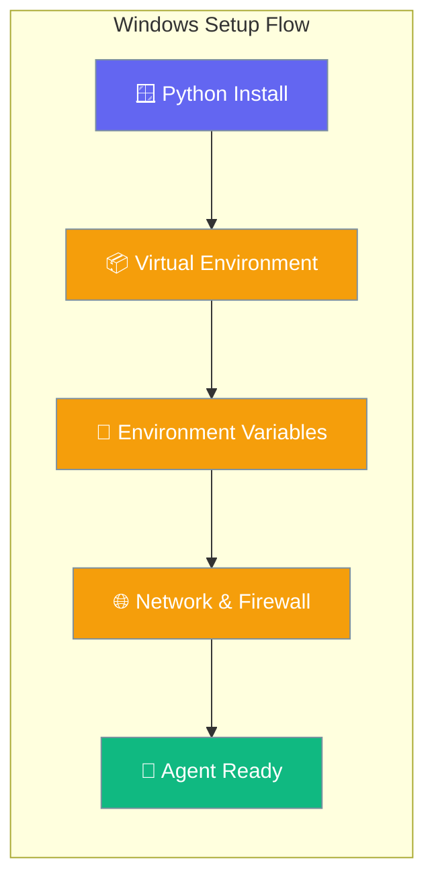
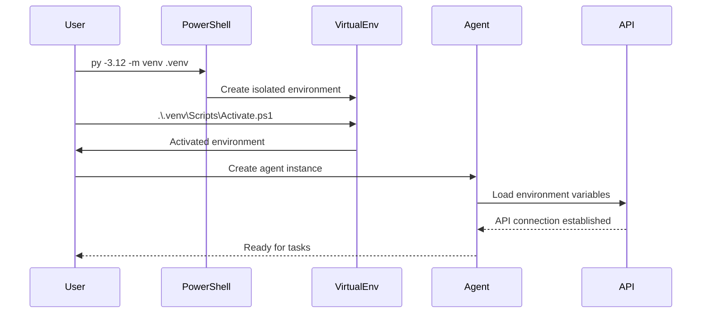

Windows SDK setup for PraisonAI with virtual environments, environment variables, and UTF-8 configurations tailored for non-developers.

```python
from praisonaiagents import Agent

agent = Agent(
    name="Windows Helper",
    instructions="You are a helpful assistant running on Windows.",
)
agent.start("Hello from Windows!")
```



## Quick Start

<Steps>
<Step title="Python Installation & Virtual Environment">
Install Python 3.10+ from python.org (recommended over Windows Store version for fewer PATH issues):

```powershell
# Check Python version
py --version

# Create virtual environment with specific Python version
py -3.12 -m venv .venv

# Activate virtual environment (PowerShell)
.\.venv\Scripts\Activate.ps1

# Upgrade pip
python -m pip install -U pip

# Install PraisonAI
pip install praisonaiagents
```

If you get execution policy errors, run:
```powershell
Set-ExecutionPolicy -Scope CurrentUser RemoteSigned
```
</Step>

<Step title="Basic Agent Setup">
Create a simple agent to verify installation:

```python
from praisonaiagents import Agent

agent = Agent(
    name="Windows Helper",
    instructions="You are a helpful assistant running on Windows"
)

result = agent.start("Hello, test my setup")
print(result)
```
</Step>

<Step title="Environment Variables Configuration">
Create a `.env` file in your working directory:

```bash
# .env file — paste keys after each equals sign
OPENAI_API_KEY=
ANTHROPIC_API_KEY=
PRAISONAI_LOG_LEVEL=INFO
```

Load and use environment variables:

```python
from praisonaiagents import Agent
from dotenv import load_dotenv
import os

# Load environment variables
load_dotenv()

agent = Agent(
    name="API Agent",
    instructions="You have access to API keys from environment",
    llm="gpt-4o-mini"
)

result = agent.start("What's my current configuration?")
```
</Step>

<Step title="CLI Sessions on Windows">
The `praisonai session` commands now work on Windows out of the box — sessions are persisted to `%USERPROFILE%\.praison\sessions\` using `msvcrt`-based file locking.

```powershell
praisonai session start my-project
praisonai "What's in my project?" --session my-project
praisonai session list
```

This functionality was fixed in [PR #1837](https://github.com/MervinPraison/PraisonAI/pull/1837). Prior releases failed with `ModuleNotFoundError: No module named 'fcntl'` on Windows when these subcommands were invoked.
</Step>
</Steps>

---

## How It Works



| Component | Purpose | Windows-Specific |
|-----------|---------|------------------|
| **Virtual Environment** | Isolate Python dependencies | Use `.\.venv\Scripts\Activate.ps1` |
| **Environment Variables** | Store API keys securely | `.env` files in working directory |
| **PowerShell** | Command execution | Handle execution policy settings |
| **UTF-8 Encoding** | Prevent character issues | Save files as UTF-8 in editors |

---

## Prerequisites

### Python Installation
- **Python 3.10+** from [python.org](https://www.python.org/downloads/) (recommended)
- **Avoid Windows Store Python** for fewer PATH conflicts
- **Git for Windows** with proper line endings: `git config --global core.autocrlf true`

### IDE Configuration
Point your IDE to the virtual environment Python interpreter:
- **VS Code**: Select `.venv\Scripts\python.exe` as interpreter
- **Cursor**: Use Command Palette > Python: Select Interpreter

---

## Virtual Environment Management

### PowerShell Commands
```powershell
# Create environment
py -3.12 -m venv .venv

# Activate environment
.\.venv\Scripts\Activate.ps1

# Deactivate environment
deactivate

# Check active environment
where python
```

### Execution Policy Issues
If activation fails with execution policy errors:

```powershell
# Check current policy
Get-ExecutionPolicy -Scope CurrentUser

# Set policy for current user only
Set-ExecutionPolicy -Scope CurrentUser RemoteSigned

# Verify change
Get-ExecutionPolicy -Scope CurrentUser
```

---

## Environment Variables

### `.env` File Location
- **Working Directory**: Place `.env` in your project root
- **Current Directory**: `load_dotenv()` reads from `os.getcwd()`
- **Multiple Files**: Use single `.env` file to avoid conflicts

### Precedence and Loading
```python
from dotenv import load_dotenv
import os

# Basic loading (from current working directory)
load_dotenv()

# Explicit path loading
load_dotenv(dotenv_path=".env.local")

# Override existing environment variables
load_dotenv(override=True)

# Check if variable loaded
api_key = os.getenv("OPENAI_API_KEY")
if not api_key:
    print("API key not found!")
```

### PYTHONPATH Configuration
For monorepo or `src` layouts, use session-scoped variables:

```powershell
# Temporary PYTHONPATH (session only)
$env:PYTHONPATH = (Resolve-Path .).Path + "\src"

# Verify setting
echo $env:PYTHONPATH
```

**Warning**: Avoid persistent `PYTHONPATH` via `setx` as it affects other projects.

### Environment Variable Security
```powershell
# Session-scoped (recommended for development)
$env:OPENAI_API_KEY = "..."  # paste your OpenAI key

# Avoid setx for API keys (hard to rotate, visible system-wide)
# setx OPENAI_API_KEY "your-key" # DON'T DO THIS
```

---

## Unicode and Encoding

### File Encoding Issues
**Save all Python files as UTF-8** to prevent character encoding errors:

- **VS Code**: Check status bar, ensure "UTF-8"
- **Notepad++**: Encoding menu > "UTF-8"
- **Windows Notepad**: Save As > Encoding: UTF-8

### Common Encoding Error
```python
# This will fail with cp1252 encoding
UnicodeDecodeError: 'charmap' codec can't decode byte 0x9d in position 1854

# Solution: Ensure UTF-8 file encoding
```

### Python Script Encoding
Add encoding declaration to Python files:
```python
# -*- coding: utf-8 -*-
```

---

## Networking and Firewall

### Windows Defender Prompts
When running agents with network access:
- **Allow access** when Windows Defender prompts
- **Add exception** for Python.exe in Windows Security

### Port Conflicts
Check for port conflicts when running multiple agents:
```powershell
# Check what's using port 8000
netstat -ano | findstr :8000

# Kill process by PID
taskkill /PID 1234 /F
```

### Localhost vs External Access
```python
from praisonaiagents import Agent

# Localhost only (default)
agent = Agent(
    name="Local Agent",
    host="127.0.0.1",
    port=8000
)

# External access (for team development)
agent = Agent(
    name="Network Agent", 
    host="0.0.0.0",
    port=8000
)
```

---

## OpenClaw Integration

### Subprocess Configuration
Use absolute paths for reliable subprocess execution:

```python
import subprocess
import sys
from pathlib import Path

# Get absolute path to praisonai executable
praisonai_path = Path(sys.executable).parent / "praisonai.exe"

# Or use python -m for cross-platform compatibility
subprocess.run([sys.executable, "-m", "praisonai", "--help"])
```

### Virtual Environment in Subprocesses
Ensure subprocesses use the same virtual environment:

```python
import os
import subprocess

# Get current virtual environment path
venv_python = sys.executable

# Run subprocess with same Python
result = subprocess.run([
    venv_python, "-c", 
    "import praisonaiagents; print('Success')"
], capture_output=True, text=True)
```

---

## Common Patterns

### Development Workflow
```python
# development_setup.py
from pathlib import Path
from dotenv import load_dotenv
from praisonaiagents import Agent
import os

# Ensure we're in project directory
os.chdir(Path(__file__).parent)

# Load environment variables
load_dotenv()

# Create development agent
dev_agent = Agent(
    name="Dev Assistant",
    instructions="Help with Windows development tasks",
    llm=os.getenv("DEFAULT_MODEL", "gpt-4o-mini")
)

if __name__ == "__main__":
    result = dev_agent.start("Check my development environment")
    print(result)
```

### Multi-Agent Windows Setup
```python
from praisonaiagents import Agent, Task, PraisonAIAgents

# Create multiple agents for Windows tasks
system_agent = Agent(
    name="System Monitor",
    instructions="Monitor Windows system resources"
)

file_agent = Agent(
    name="File Manager", 
    instructions="Handle file operations with proper Windows paths"
)

# Define tasks
tasks = [
    Task(description="Check system status", expected_output="System report", agent=system_agent),
    Task(description="Organize project files", expected_output="File structure", agent=file_agent)
]

# Run multi-agent system
agents_system = PraisonAIAgents(agents=[system_agent, file_agent], tasks=tasks)
result = agents_system.start()
```

---

## Best Practices

<AccordionGroup>
<Accordion title="Virtual Environment Management">
- Always activate virtual environment before installing packages
- Use `py -3.12 -m venv` instead of `python -m venv` for version specificity
- Keep virtual environments in project directories (`.venv`)
- Add `.venv/` to your `.gitignore` file
- Document Python version requirements in `README.md`
</Accordion>

<Accordion title="Environment Variable Security">
- Use `.env` files for development, proper secret management for production
- Never commit `.env` files to version control (add to `.gitignore`)
- Use session-scoped variables for temporary testing
- Rotate API keys regularly and update `.env` files
- Consider using Azure Key Vault or similar for production deployments
</Accordion>

<Accordion title="File Encoding and Paths">
- Always save Python files as UTF-8 encoding
- Use `pathlib.Path` for cross-platform path handling
- Use forward slashes in Python strings: `"data/file.txt"`
- Test with non-ASCII characters in file names and content
- Set Git to handle line endings: `git config core.autocrlf true`
</Accordion>

<Accordion title="Networking and Firewall">
- Allow Python.exe through Windows Firewall for network features
- Use localhost (`127.0.0.1`) for development, specific IPs for production
- Check for port conflicts with `netstat` before starting services
- Consider Windows network profiles (Public/Private/Domain)
- Test connectivity with different antivirus software
</Accordion>
</AccordionGroup>

---

## Troubleshooting

| Symptom | Likely Cause | Fix |
|---------|--------------|-----|
| `'py' is not recognized` | Python not in PATH | Reinstall Python, check "Add to PATH" |
| `Activate.ps1 cannot be loaded` | Execution policy | `Set-ExecutionPolicy -Scope CurrentUser RemoteSigned` |
| `UnicodeDecodeError: 'charmap'` | File not UTF-8 | Save files as UTF-8 encoding |
| `WinError 10048` (port in use) | Port conflict | Use `netstat` to find and kill process |
| `.env` file not loading | Wrong working directory | Check `os.getcwd()`, move `.env` to correct location |
| Import errors after install | Wrong virtual environment | Verify `where python` points to `.venv` |
| `ModuleNotFoundError: No module named 'fcntl'` when running `praisonai session …` | Pre-PR #1837 release on Windows | Upgrade to the release that includes [PR #1837](https://github.com/MervinPraison/PraisonAI/pull/1837); CLI session store is now cross-platform |

---

## Related

<CardGroup cols={2}>
<Card title="Skills Documentation" icon="puzzle-piece" href="/docs/features/skills">
  Learn about Windows-compatible skills and UTF-8 handling
</Card>
<Card title="MCP Integration" icon="plug" href="/docs/features/mcp-lifecycle">
  Model Context Protocol setup for Windows environments
</Card>
</CardGroup>