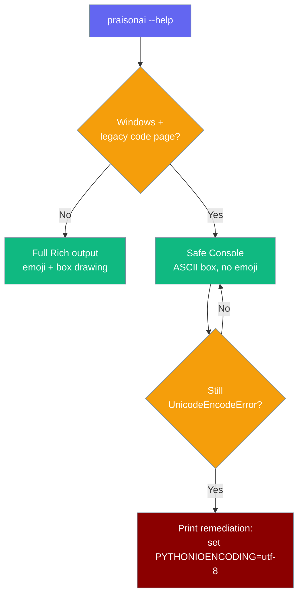
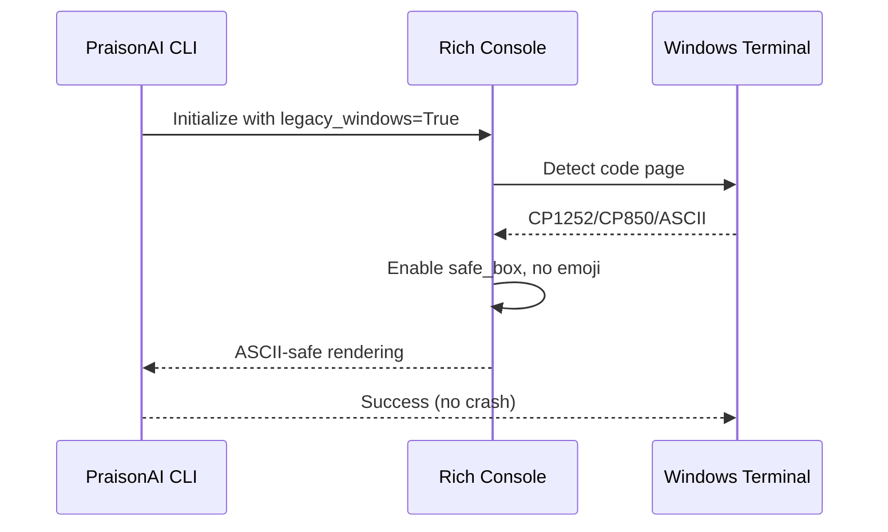

PraisonAI automatically handles Windows legacy code pages to prevent CLI crashes and ensure ASCII-safe output.



## Quick Start

<Steps>
<Step title="Automatic Handling">
PraisonAI ≥ v0.0.x automatically detects legacy Windows code pages and renders ASCII-safe output:

```bash
praisonai --help
```

No configuration needed - the CLI will work without crashes.
</Step>

<Step title="Enable Full UTF-8 (Optional)">
For full emoji and box-drawing characters, manually enable UTF-8:

<CodeGroup>
```powershell PowerShell
$env:PYTHONIOENCODING='utf-8'
chcp 65001
praisonai --help
```

```cmd CMD
set PYTHONIOENCODING=utf-8
chcp 65001
praisonai --help
```
</CodeGroup>
</Step>
</Steps>

---

## How It Works



| Component | Behavior | Fallback |
|-----------|----------|----------|
| **Rich Console** | Detects legacy code page | Uses ASCII boxes, no emoji |
| **PYTHONIOENCODING** | Set to utf-8 for subprocess safety | Prevents child process crashes |
| **Error Handling** | Catches UnicodeEncodeError | Shows remediation hint |

---

## Configuration Options

The automatic encoding detection requires no configuration. However, you can override behavior:

| Method | Scope | When to Use |
|--------|-------|-------------|
| `PYTHONIOENCODING=utf-8` | Current session | Temporary fix for full Unicode |
| `chcp 65001` | Current session | Enable UTF-8 code page |
| System Environment Variables | Permanent | Set `PYTHONIOENCODING` globally |
| Windows Terminal | Best experience | Use modern terminal instead of CMD |

---

## Common Patterns

### Problem: UnicodeEncodeError in Older Versions

**Symptom:**
```
UnicodeEncodeError: 'charmap' codec can't encode character '\u2500' in position 0
```

**Solution:**
```bash
# Temporary fix
set PYTHONIOENCODING=utf-8
praisonai --help

# Or upgrade to latest version
pip install --upgrade praisonai
```

### Pattern: Permanent UTF-8 Setup

**For PowerShell users:**
```powershell
# Add to PowerShell profile
Add-Content $PROFILE '$env:PYTHONIOENCODING="utf-8"'
```

**For CMD users:**
```cmd
# Set system environment variable
setx PYTHONIOENCODING utf-8
```

### Pattern: Windows Terminal Integration

**Use Windows Terminal instead of legacy CMD:**
```json
// Windows Terminal settings.json
{
  "profiles": {
    "defaults": {
      "font": {
        "face": "Cascadia Code"
      }
    }
  }
}
```

---

## Best Practices

<AccordionGroup>
<Accordion title="Use Windows Terminal for Best Experience">
Windows Terminal provides full UTF-8 support and modern terminal features. Download from the Microsoft Store or install via `winget install Microsoft.WindowsTerminal`.
</Accordion>

<Accordion title="Set Environment Variables Permanently">
Instead of setting `PYTHONIOENCODING` in each session, add it to your system environment variables through System Properties → Environment Variables.
</Accordion>

<Accordion title="Consider WSL for Unix-like Experience">
Windows Subsystem for Linux (WSL) provides a full Unix terminal experience without encoding issues. Install with `wsl --install`.
</Accordion>

<Accordion title="Upgrade to Latest PraisonAI Version">
The automatic encoding detection was added in recent versions. Ensure you're running the latest version with `pip install --upgrade praisonai`.
</Accordion>
</AccordionGroup>

---

## Related

<CardGroup cols={2}>
<Card title="CLI Reference" icon="terminal" href="/cli/cli-reference">
  Complete CLI command reference
</Card>
<Card title="Installation Guide" icon="download" href="/installation">
  Getting started with PraisonAI
</Card>
</CardGroup>