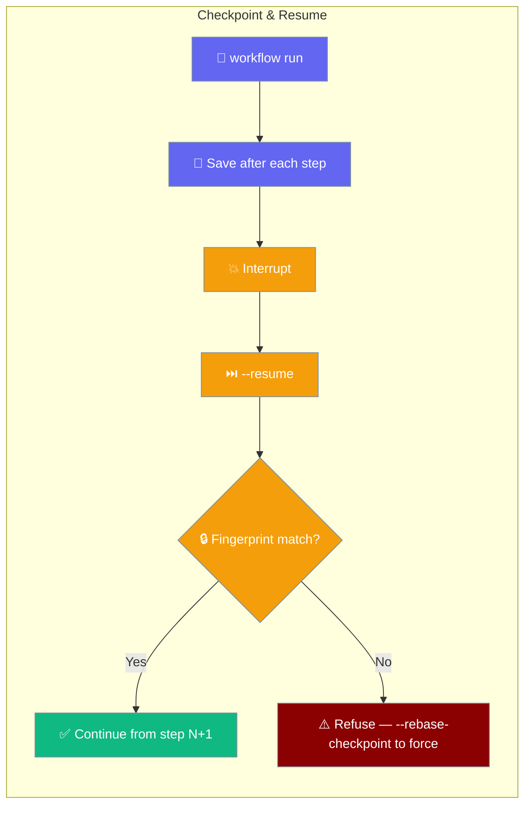
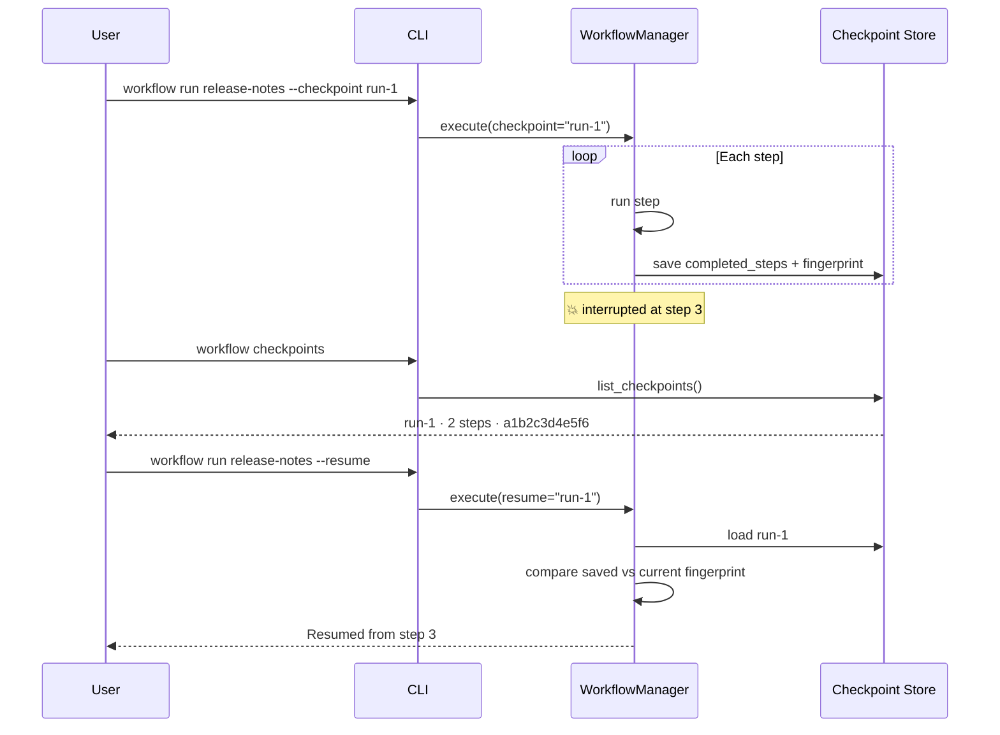
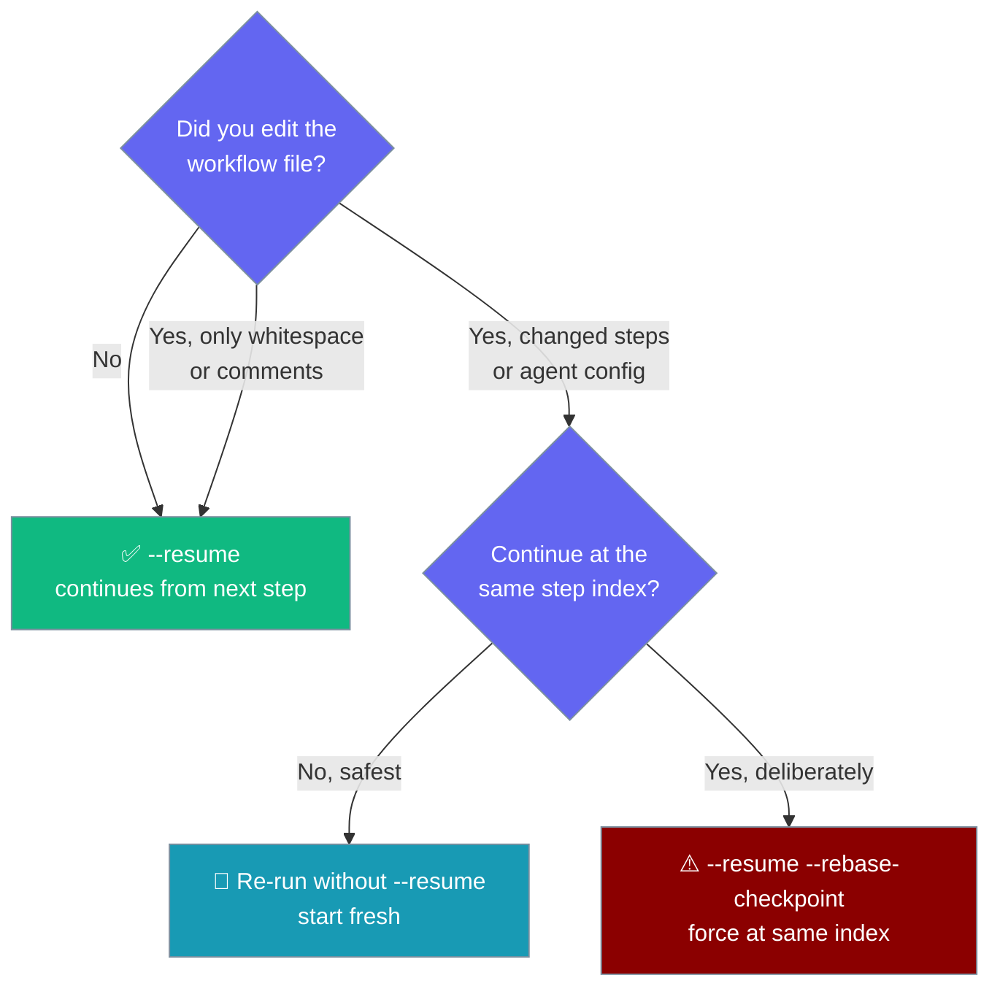

Resume a workflow from where it stopped after a crash or an interruption — without re-running steps that already finished.

```python
from praisonaiagents import Agent, WorkflowManager

agent = Agent(name="Runner", instructions="Execute workflow steps.")
manager = WorkflowManager()
manager.execute("release-notes", default_agent=agent, checkpoint="run-1")   # saves after each step
# ...later, after a crash...
manager.execute("release-notes", default_agent=agent, checkpoint="run-1", resume="run-1")
# -> continues from where it stopped
```

<Note>
This page is about **workflow-step checkpoint & resume** — saving how far a
`WorkflowManager` workflow got so you can continue it. This is a different
feature from **workspace file checkpoints** at
[/features/checkpoints](/features/checkpoints), which snapshot files with a
shadow git repo so you can undo an agent's edits. The two systems are
independent and use separate storage.
</Note>



<Warning>
Checkpoint & resume applies to **markdown workflows** run through
`WorkflowManager.execute()` / `aexecute()`. YAML workflows route through a
different engine (`AgentFlow.start()`) and do **not** support `--resume`,
`--checkpoint`, or `--rebase-checkpoint` yet.
</Warning>

## Quick Start

<Steps>
  <Step title="Run with a checkpoint">
    A checkpoint is saved after each completed step.

    ```bash
    praisonai workflow run release-notes --checkpoint run-1
    ```
  </Step>
  <Step title="Resume after an interruption">
    Continue from the last saved step. If you omit `--checkpoint`, the
    checkpoint name defaults to the workflow name.

    ```bash
    praisonai workflow run release-notes --resume
    ```

    The CLI prints `Resumed from step N` when a run continues.
  </Step>
  <Step title="List saved checkpoints">
    ```bash
    praisonai workflow checkpoints
    ```
  </Step>
  <Step title="Delete when done">
    ```bash
    praisonai workflow checkpoints --delete release-notes
    ```
  </Step>
</Steps>

## How It Works

Each completed step writes a checkpoint file that records how many steps are
done, the results so far, the current variables, and a **definition
fingerprint** of the workflow. On resume, the fingerprint is compared before
anything runs.



## Choosing Between Restart, Resume, and Rebase

After an interruption you have three options. Use this to pick one:



## Definition Fingerprint

The fingerprint is a stable content hash of the workflow's steps — the first
12 characters of a SHA-256 over each step's **name, action, agent name, and
full agent config**. It hashes step content, not the raw file bytes.

- **Same fingerprint** for whitespace-only or comment-only edits — a resume
  still works.
- **New fingerprint** when you add, remove, or reorder steps, or change a
  step's action or agent config value (instructions, model, tools, condition,
  routing).

```python
# Cosmetic edit — same fingerprint, resume works:
#   add a blank line or a comment to the workflow file

# Semantic edit — new fingerprint, resume refuses:
#   change an agent's instructions from "Summarize." to "Summarize briefly."
```

When you resume against a workflow whose fingerprint changed, the run refuses
and the error names both fingerprints so you can see the mismatch:

```text
Error: workflow definition changed since the checkpoint (fingerprint mismatch:
checkpoint=a1b2c3d4e5f6, current=9f8e7d6c5b4a). Re-run without --resume to start
fresh, or pass --rebase-checkpoint to deliberately continue at the same step
index against the edited definition.
```

## Fail-Closed Safety

Resuming onto a checkpoint that does not exist **refuses to run** rather than
silently starting over from step 1 and repeating side effects.

```python
result = manager.execute("release-notes", default_agent=agent, resume="does-not-exist")
print(result["success"])   # False
print(result["error"])     # checkpoint 'does-not-exist' not found; refusing to resume. ...
```

| Situation | Behaviour |
|---|---|
| Resume, no checkpoint by that name | Refuses to run; error names the missing checkpoint |
| Resume, file edited (whitespace / comments only) | Runs; same fingerprint |
| Resume, file edited (steps added/reordered, agent config changed) | Refuses; error names both fingerprints and the `--rebase-checkpoint` remediation |
| Resume with `rebase_checkpoint=True` after a real edit | Runs at the same numeric step index; warning logged |
| Loop step (`loop_over`) | Checkpoint written once **after** the whole loop completes; resume skips the loop entirely |

## Configuration Options

Three parameters on `execute()` and `aexecute()` control this feature:

| Parameter | Type | Default | Description |
|---|---|---|---|
| `checkpoint` | `Optional[str]` | `None` | Save a checkpoint under this name after each step |
| `resume` | `Optional[str]` | `None` | Resume from the checkpoint with this name |
| `rebase_checkpoint` | `bool` | `False` | Force resume at the same step index even when the definition changed (skips the fingerprint check with a warning) |

A successful resume adds `resumed_from_step` (a 0-indexed `int`) to the result
dict. It is absent when the run did not resume.

```python
result = manager.execute(
    "release-notes",
    default_agent=agent,
    checkpoint="run-1",
    resume="run-1",
    rebase_checkpoint=False,
)
print(result.get("resumed_from_step"))   # e.g. 2 (resumed at step 3)
```

### Checkpoint File Schema

Checkpoint files live in `{workspace}/.praisonai/checkpoints/{name}.json`.

| Field in `{name}.json` | Type | Notes |
|---|---|---|
| `name` | str | Checkpoint name (defaults to the workflow name from the CLI) |
| `workflow_name` | str | Which workflow the checkpoint belongs to |
| `completed_steps` | int | Zero-based count of finished steps |
| `results` | list | Per-step results |
| `variables` | dict | Workflow variable state at save time |
| `definition_fingerprint` | str \| null | 12-char SHA-256 prefix; `null` on checkpoints written before this feature existed |
| `saved_at` | float | Unix epoch seconds |
| `saved_at_iso` | str | ISO-8601 timestamp |

## Best Practices

<AccordionGroup>
  <Accordion title="Name the checkpoint per run when running in parallel">
    If you run the same workflow more than once at a time, give each run a
    distinct `--checkpoint` name so they don't overwrite each other.

    ```bash
    praisonai workflow run release-notes --checkpoint run-nightly
    praisonai workflow run release-notes --checkpoint run-hotfix
    ```
  </Accordion>
  <Accordion title="Delete stale checkpoints when a run finishes">
    Old checkpoints accumulate under `.praisonai/checkpoints/`. Remove one you
    no longer need:

    ```bash
    praisonai workflow checkpoints --delete run-1
    ```
  </Accordion>
  <Accordion title="Prefer starting fresh over --rebase-checkpoint">
    After a real edit, re-running without `--resume` is the safe default. Only
    use `--rebase-checkpoint` when the edit was truly cosmetic and you
    deliberately want to continue at the same numeric step index.
  </Accordion>
  <Accordion title="loop_over steps checkpoint once after the loop">
    A `loop_over` step saves a single checkpoint **after** the whole loop
    completes. On resume the loop is never re-run — execution continues from
    the next step.
  </Accordion>
</AccordionGroup>

## Related

<CardGroup cols={2}>
  <Card title="Workflows" icon="diagram-project" href="/features/workflows">
    Build multi-step markdown workflows
  </Card>
  <Card title="File Checkpoints" icon="clock-rotate-left" href="/features/checkpoints">
    Shadow-git file undo (a different feature)
  </Card>
  <Card title="Workflow CLI" icon="terminal" href="/cli/workflow">
    The `workflow run` and `workflow checkpoints` commands
  </Card>
  <Card title="Error Recovery" icon="shield" href="/features/workflow-error-recovery">
    Handle step failures and retries
  </Card>
</CardGroup>
